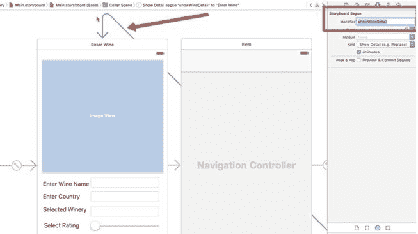
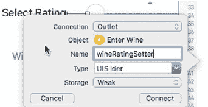
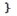
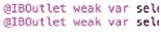

# 添加更新函数

我将为葡萄酒添加`wineUpdate`函数，为酒庄添加`wineryUpdate`函数。两者设计相同，都会更新表中的所有列，无论该值是否基于`WHERE`子句发生变化。

#### 添加`wineUpdate`函数

`wineUpdate`函数用于更新 SQLite 数据库中的葡萄酒记录。该函数将`wine`对象作为输入参数。定义好`SQL UPDATE`字符串后，我照常使用`sqlite3_open`函数打开 SQLite 数据库。接着，使用`sqlite3_prepare_v2`函数设置查询，该函数接收 SQLite 数据库指针、`sqlite_statement`指针和 SQL 查询字符串作为输入参数。如果查询字符串正确，函数将返回`SQLITE_OK`状态。

接下来，你需要使用`sqlite3_bind_text`（针对字符串）、`sqlite3_bind_int`（针对整数）和`sqlite3_bind_blob`（针对图像）将葡萄酒属性绑定到输入列和`WHERE`子句。

最后，使用`sqlite3_step`函数执行查询，然后用`sqlite3_finalize`进行清理，并使用`sqlite3_close`关闭数据库。请参考以下代码。

> **注意：** 如果你不想替换所有值，可以使用三元运算符根据可用值构建查询字符串和绑定值。此外，这段代码没有任何错误处理。

```
func WineUpdate(_ wine:Wine){

    let sql:String = "UPDATE main.Wine " +
        "SET name = ?," +
        "rating = ?, " +
        "image = ?, " +
        "producer = ? " +
        "WHERE id = ?"

    if(sqlite3_open(dbPath.path!, &db)==SQLITE_OK){
        if(sqlite3_prepare_v2(db, sql, -1, &sqlStatement, nil)==SQLITE_OK){
            sqlite3_bind_text(sqlStatement, 0, wine.name.cString(using: String.Encoding.utf8), -1, SQLITE_TRANSIENT)
            sqlite3_bind_int(sqlStatement, 1, wine.rating)
            sqlite3_bind_blob(sqlStatement, 2, wine.image.bytes, Int32(wine.image.count), SQLITE_TRANSIENT)
            sqlite3_bind_text(sqlStatement, 4, wine.producer.cString(using: String.Encoding.utf8), -1, SQLITE_TRANSIENT)
            sqlite3_bind_int(sqlStatement, 5, wine.id)
            sqlite3_step(sqlStatement)
        }
    }
    sqlite3_close(db)
}
```

#### 添加`wineryUpdate`函数

`wineryUpdate`函数完全遵循与上一个函数相同的模式。除了 SQL 查询字符串中针对的列和表不同，以及绑定值的数量不同外，其功能与上一个函数完全相同：

```
func WineryUpdate(_ winery:Wineries)->Int32{

    let sql:String = "UPDATE winery SET country = '\(winery.country)', region = '\(winery.region)', volume = \(winery.volume), uom = '\(winery.uom)' WHERE name = '\(winery.name)' ;"

    var status_code:Int32 = 0

    if(sqlite3_open(dbPath.path!, &db)==SQLITE_OK){
        status_code = sqlite3_prepare_v2(db, sql, -1, &sqlStatement, nil)
        if(status_code==0){
            status_code = sqlite3_step(sqlStatement)
            status_code = sqlite3_finalize(sqlStatement)
        }
    }
    sqlite3_close(db)
    return status_code
}
```

## 修改 UI 以支持更新功能

为了启用添加到`wineryDAO`类的更新功能，需要对 UI 以及相应的`FirstViewController`和`SecondViewController`进行一些修改。

当用户从葡萄酒列表或酒庄列表中选择一个项目时，数据将显示在相应的场景中，以便可以更改信息。当点击“保存”按钮时，将调用更新函数而不是插入函数。

#### 设置`showWineDetail`转场

图 7-1 展示了新转场的布局，该转场连接“酒窖”场景（即存储数据库中葡萄酒列表的`TableViewController`）和“录入葡萄酒”场景（即应用启动时的初始视图控制器）。



**图 7-1.** 添加`showWineDetail`转场

要设置该转场，请按照以下步骤操作：

1. 使用鼠标按住 Control 键并从“酒窖”场景中的`WineCellTableViewCell`拖拽连接到“录入葡萄酒”场景。松开鼠标按钮时，会弹出一个菜单。选择`showDetail`选项。


2.  选中新建的转场，然后打开属性检查器。在这里，你可以输入 `showWineDetail`。该标识将在 `prepareForSegue` 函数中使用，该函数会在转场执行前被触发。

第 7 章 ■ 更新记录

#### WineListTableViewController

接下来，切换到 `WineListTableViewController`。我们将添加把数据传输到“录入葡萄酒”场景的功能。为了将数据发送到 `FirstViewController` 的字段输出口，我们需要取消注释 `prepareForSegue` 函数，它是标准 `TableViewController` 类中的可选函数之一。

考虑到当用户在表格视图中选中某行时，我们需要向 `FirstViewController` 发送信息，因此我们首先需要定义该类型的一个常量。在接下来的代码中，我创建了 `wineViewController` 常量，并为其赋值 `segue.destinationViewController` 属性，然后将其转换为 `FirstViewController` 对象。接着，我通过将发送者（作为可选的 `WineCellTableCell`）赋值给 `wineCell` 常量，来尝试为表格中的单元格创建一个常量。如果操作成功，我只需将选中的值赋值给 `FirstViewController` 对象中的字段即可。

`UISlider` 的值不能直接设置，因此我在 `FirstViewController` 中创建了一个新函数（见下面的代码片段）来设置其值。这里，我只需调用 `setWineRating` 函数，并将 `rating` 输出口的值以浮点数形式传入即可。

此外，我为 `FirstViewController` 添加了一个名为 `isEdit` 的新属性，并将其赋值为 1。现在，我们可以点击“保存”按钮来调用 `WineUpdate` 函数，而不是 `insertWineRecord` 函数。代码如下所示，位于本节末尾之后。

```
override func prepare (_for segue: UIStoryboardSegue, sender: AnyObject?) {
    // 使用 segue.destinationViewController 获取新的视图控制器。
    // 将选中的对象传递给新的视图控制器。

    if(segue.identifier == "showWineDetail"){
        let wineViewController = segue.destinationViewController as! FirstViewController

        if let wineCell = sender as? WineCellTableViewCell{
            let indexPath = tableView.indexPath(for: wineCell)!
            let selectedWine = wineListArray[(indexPath as NSIndexPath).row]
            wineViewController.wine = selectedWine
            wineViewController.isEdit = 1
        }
    }
}
```

然而，在设置 `wineRatingSelected`（即故事板中 `UISlider` 的 `IBOutlet`）之前，你需要先创建这个 `IBOutlet`。

请按照以下步骤操作：

1.  打开故事板，选中“录入葡萄酒”视图控制器；点击标识检查器，在 IB 画布旁打开 `FirstViewController` 文件。
2.  在 IB 画布中选中 `UISlider`，按住 Control 键并拖动连接到 `FirstViewController` 文件中的空白区域。
3.  如图 7-2 所示，松开鼠标按钮，输入输出口的名称。在本应用中，我将其命名为 `wineRatingSelector`。

第 7 章 ■ 更新记录



   

**图 7-2.** 设置 `wineRatingSetter` IBOutlet 连接

4.  接受其他默认值，包括 IBOutlet 连接类型。
5.  点击“连接”按钮，在 `FirstViewController` 文件中创建输出口连接，如下所示：

```
@IBOutlet weak var wineRatingSetter : UISlider!
```

6.  现在你可以通过 `WineListTableViewController` 来访问它了。

```
var isEdit:Int = -1

// 为简洁起见，跳过部分代码
@IBAction func insertRecordAction(sender: AnyObject) {
    if(isEdit==1){
        // 我们应该更新
        let editWine = Wine()
        editWine.name = self.wineNameField.text!
        editWine.producer = self.selectWineryField.text!
        editWine.rating = Int32(self.wineRatingSetter.value)
        dbDAO.wineUpdate(editWine)
    }else{
        wine.name = self.wineNameField.text
        wine.producer = self.selectWineryField.text!
        dbDAO.insertWineRecord(wine)
    }
}
```

#### WineryListTableViewController

你需要对 `WineryListTableViewController` 采用相同的方法。图 7-3 展示了故事板中带有新转场的布局。


