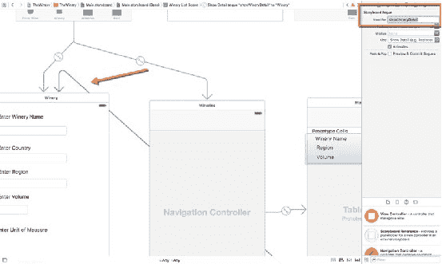
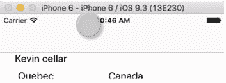
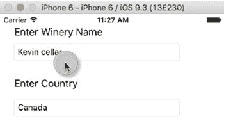
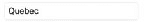
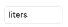

# 第 7 章 ■ 更新记录

## 图 7-3. showWineryDetail 转场

请按照以下步骤为第二个视图控制器创建转场：

1.  从文档大纲视图中选择 `WineryCellTableViewCell`。
2.  然后按住 Control 键从 UI 中选中的单元格拖拽至 Winery 场景。
3.  松开鼠标按钮，在弹出菜单中选择“显示详细信息”。
4.  接着，选择新创建的转场并打开属性检查器；在标识符字段中将该转场命名为 `showWineryDetail`。

转场创建完成后，我们打开 `SecondViewController`，并取消代码末尾附近 `prepareForSegue` 函数的注释。

和之前一样，我们需要创建一个常量，为其赋值 `segue.destinationViewController`，然后将其转型为 `SecondViewController`。这将使我们能够访问 `SecondViewController` 中的 `IBOutlets`。接下来，我们需要为 Winery 列表 `TableViewController` 中的单元格定义一个常量，以便访问其中定义的 `IBOutlets`。然后，在转场将 `SecondViewController`（已填充相应字段）推入堆栈之前，只需将表格中选中行的值赋给 `wineryController` 对象中的输出口即可。

请注意稍后描述的 `isEdit` 属性，我们将其添加到 `SecondViewController` 中，用以指示需要运行 `WineryUpdate` 函数，而不是 `insertWineryRecord` 函数。

```
override func prepare(_ for segue: UIStoryboardSegue, sender: AnyObject?) {
    // 使用 segue.destinationViewController 获取新的视图控制器。
    // 将选中的对象传递给新的视图控制器。
    if(segue.identifier == "showWineryDetail"){
        let wineryController = segue.destinationViewController as! SecondViewController
        if let wineryCell = sender as? WineryCellTableViewCell {
            let indexPath = tableView.indexPath(for: wineryCell)!
            let selectedWinery = wineryListArray[(indexPath as NSIndexPath).row]
            wineryController.winery = selectedWinery
            wineryController.isEdit = 1
        }
    }
}
```

与之前关于保存更改的讨论一样，我们修改了 `SecondViewController`，添加了 `isEdit` 属性并将其初始值设置为 `-1`。当然，实际上我们可以将此值设置为任何值。另外，我们本可以使用 unwind Segue 功能，但这小段代码更适合我们的目的。此外，我们保留了之前的连接名 `insertWineryBtn`，而没有将其重命名为诸如 `saveWinery` 之类的名称，只是为了说明将记录保存到 SQLite 数据库的一种可能功能。

```
var isEdit:Int = -1

@IBAction func insertWineryBtn(_ sender: AnyObject) {
    winery.name = wineryNameField.text!
    winery.country = countryNameField.text!
    winery.region = regionNameField.text!
    winery.volume = Double(enterVolume.text!)!
    winery.uom = enterUoM.text!
    if(winery.isEdit==1){
        dbDAO.wineryUpdate(winery)
    }else{
        dbDAO.insertWineryRecord(winery)
    }
    isEdit = -1
}
```

控制器就绪后，接下来只需运行应用以检查一切是否正常，必要时进行调试。

## 运行应用

在本示例中，我们将从数据库中获取一条葡萄酒记录和一条酒庄记录，更新这些记录，然后将其保存回数据库。

### 更新记录

在 iPhone 上启动应用，并切换到酒庄列表。在本示例中，列表中只有一个酒庄。如果我们点击它，它应该在酒庄场景的相应字段中显示内容。图 7-4 显示了数据库中酒庄表中的一条记录。

## 图 7-4. 酒庄列表

当我们选择列表中的项目时，其内容会显示在 `FirstViewController` 中以便编辑（图 7-5）。完成编辑后，点击“保存”按钮将数据发送回数据库。












