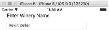
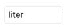
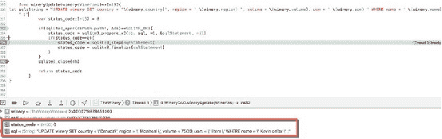
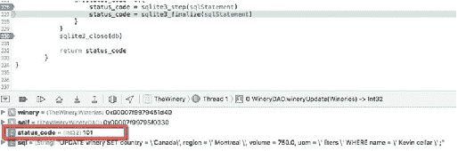
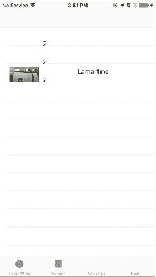
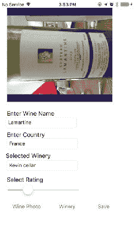
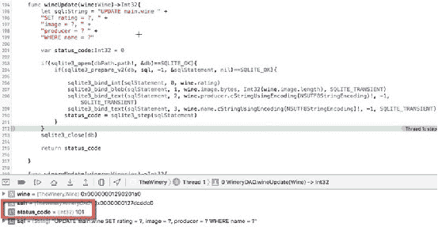
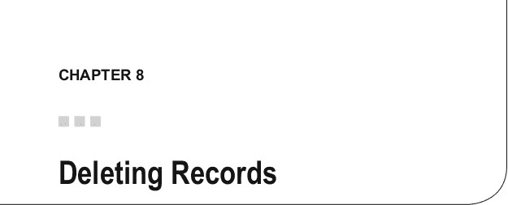

# 图 7-5：从 Segue 显示酒庄数据

`图 7-6` 显示了对拉马丁葡萄酒所做的更改。

**第 7 章 ■ 更新记录**







**图 7-6.** 展示对酒庄的更改

`图 7-7` 演示了传递给 `UPDATE` 查询的新数据，一旦 `sqlite3_step` 完成，状态码将包含 `0` 或 `SQLITE_OK` 的值。`图 7-8` 显示了状态码 `101`，即 `SQLITE_DONE`，表示查询已成功执行完毕。



**图 7-7.** 使用状态码 = 0 更新记录

**第 7 章 ■ 更新记录**



**图 7-8.** `sqlite3_finalize` 的成功完成状态码

`图 7-9` 列出了几条葡萄酒记录。其中存在一些遗漏（我们将在下一章清理），并且图片需要旋转 90 度，但我们已经成功从数据库中获取了数据。



**图 7-9.** 葡萄酒列表

**第 7 章 ■ 更新记录**

`图 7-10` 显示了从上述表列表中选中的拉马丁葡萄酒记录内容。



**图 7-10.** 葡萄酒详情

`图 7-11` 显示状态码为 `101`，即 `SQLITE_DONE`，表明查询已成功完成。

**第 7 章 ■ 更新记录**



**图 7-11.** 成功的 `UPDATE` 操作

## 总结

至此，我们完成了对 `UPDATE` 的讨论，以及在 Winery 应用中如何执行新增操作。我们详细探讨了 SQLite 的 `UPDATE` 语句，包括 `OR` 子句。我们还学习了如何添加 `UITableViewControllers`，以及如何使用同一个 `IBAction` 管理更新和插入操作。

最后一项操作是 `DELETE`，它构成了 Winery 应用中 CRUD 操作组的收尾部分。`DELETE` 章节将提供关于 SQLite `DELETE` 语句的详细信息，以及如何在 `UITableViews` 中集成删除功能。



在本章中，我们将讨论 SQLite 中的 `DELETE` 函数。与 SQLite 中的其他 CRUD 函数相比，`DELETE` 函数的 API 与其他平台相同，并实现了基本的 SQL API，但 `LIMIT` 子句除外，它允许开发者设置要删除的行数上限。我们将涵盖以下内容：

- `DELETE` 语句
- 使用 `WHERE` 子句进行 `DELETE`
- `DELETE` 的限制与 `TRIGGERS`
- `LIMITS`
- 一个 Swift `DELETE` 示例

## SQLite 中的 `DELETE` 语句

`DELETE` 语句是一种标准 SQL 语句，用于从 SQLite 数据库的表中永久删除一条或多条记录。其基本语法如下：

```
DELETE FROM main.tablename
```

或，

```
DELETE FROM main.tablename
WHERE 布尔表达式
```

如果未使用 `WHERE` 子句，则会删除给定表中的全部内容。

## 使用 `WHERE` 子句

为了更好地控制要删除的记录，你可以使用 `WHERE` 子句指定一个布尔变量。与其他 SQL `WHERE` 子句类似，你可以使用 `AND` 关键字指定多个列，或使用 `OR` 关键字指定某一列或其他列。添加到 `WHERE` 参数中的列数没有限制。此外，你还可以使用 `NOT`，例如 `NOT IN` 或 `NOT EQUAL`。你还可以使用 `BETWEEN` 关键字；例如，指定一个日期或数字范围。通过将 `WHERE` 子句与 `DELETE` 结合使用，可以限制受查询影响的记录数量。

© Kevin Languedoc 2016 [131]
K. Languedoc，《使用 Swift 和 SQLite 构建 iOS 数据库应用》，DOI 10.1007/978-1-4842-2232-4_8

**第 8 章 ■ 删除记录**

语法如下：

```
DELETE FROM table
WHERE columnA = 'value'
  AND columnB = 'value'
```

你还可以编写如下查询：

```
DELETE FROM table
WHERE (columnA = 'value'
  AND columnB = 'value') OR
  (columnC = 'value'
  AND columnD = 'value')
```

## 限制与触发器


当在 `TRIGGER` 中使用 `DELETE` 语句时，不允许使用模式名称，只能使用表名。换句话说，必须按如下方式使用 `DELETE`：

``` 
DELETE FROM table
```

而不是：

``` 
DELETE FROM main.tablename
```

另外，如果触发器中的 `DELETE` 语句未与 `TEMP` 表关联，则触发器必须与目标数据库在同一个数据库中。触发器将按照数据库附加的顺序，在每个附加的数据库中搜索表。

### DELETE 限制

你可以将 `LIMITS` 子句与 `ORDER BY` 子句一起使用，以限制要删除的行数。通过使用 `ORDER BY`，你可以按升序（`ASC`）或降序（`DESC`）对记录进行排序，从而确保定位到正确的行进行删除。

要使用 `LIMIT` 和 `ORDER BY` 子句，你必须在编译数据库时启用 `SQLITE_ENABLE_UPDATE_DELETE_LIMIT` 选项。此外，务必记住，SQLite 中的 `DELETE` 语句不支持限制和触发器。

### 一个 Swift SQLite 删除示例

在 Swift 中使用 SQLite `DELETE` 语句非常简单，如下例所示。设置好常用变量和常量后，我们在 `viewDidLoad` 函数中初始化数据库，并依次调用 `setupSampleTable`、`addRecords` 和 `sampleDelete` 函数。

前两个函数创建一个表，并向表中添加一条记录。这段代码的主要目的是演示 Swift 中的 `DELETE` 查询，这一操作在 `sampleDelete` 函数中完成。

```swift
let dbName: String = "chapter8.sqlite"
var db: COpaquePointer? = nil
var sqlStatement: COpaquePointer? = nil
var errMsg: UnsafeMutablePointer<UnsafeMutablePointer<Int8>>! = nil
internal let SQLITE_STATIC = unsafeBitCast(0, for: sqlite3_destructor_type.self)
internal let SQLITE_TRANSIENT = unsafeBitCast(-1, for: sqlite3_destructor_type.self)
var dbPath: URL = URL(fileWithPath: "")
var errStr: String = ""

override func viewDidLoad() {
    super.viewDidLoad()
    let dirManager = FileManager.default()
    do {
        let directoryURL = try dirManager.urlForDirectory(FileManager.SearchPathDirectory.documentDirectory, in: FileManager.SearchPathDomainMask.userDomainMask, appropriateForL: nil, create: true)
        dbPath = try! directoryURL.appendingPathComponent(dbName)
    } catch let err as NSError {
        print("Error: \(err.domain)")
    }
    self.setupSampleTable()
    self.addRecords()
    self.sampleDelete()
}

func setupSampleTable() {
    let creatSQL: String = "CREATE TABLE IF NOT EXISTS sample(id int, name varchar)"
    if(sqlite3_open(dbPath.path!, &db) == SQLITE_OK) {
        if(sqlite3_prepare_v2(db, creatSQL, -1, &sqlStatement, nil) == SQLITE_OK) {
            if(sqlite3_step(sqlStatement) == SQLITE_DONE) {
                print("table created")
                sqlite3_finalize(sqlStatement)
                sqlite3_close(db)
            } else {
                print("unable to create table")
            }
        }
    }
}

func addRecords() {
    let insertSQL: String = "INSERT INTO TABLE main.sample (id, name) VALUES(?,?)"
    if(sqlite3_open(dbPath.path!, &db) == SQLITE_OK) {
        if(sqlite3_prepare_v2(db, insertSQL, -1, &sqlStatement, nil) == SQLITE_OK) {
            sqlite3_bind_int(sqlStatement, 1, 1)
            sqlite3_bind_text(sqlStatement, 2, "kevin", -1, SQLITE_TRANSIENT)
            if(sqlite3_step(sqlStatement) == SQLITE_DONE) {
                print("table created")
                sqlite3_finalize(sqlStatement)
                sqlite3_close(db)
            } else {
                print("unable to create table")
            }
        }
    }
}
```

正如你在下面的代码中所看到的，`DELETE` 查询遵循与其他 CRUD 操作类似的模式。我们首先为 `DELETE` 语句设置一个 SQL 查询字符串，然后尝试打开数据库，并使用 `sqlite3_prepare_v2` 函数将 `DELETE` SQL 查询字符串加载到内存中。

然后，我们使用 `sqlite3_bind_int` 函数绑定 `WHERE` 值，并使用 `sqlite3_step` 函数执行查询。如果获得成功的状态结果，我们使用 `sqlite3_finalize` 清理查询并关闭数据库。

```swift
func sampleDelete() {
    let deleteStmt: String = "DELETE FROM sample WHERE id = ?"
    if(sqlite3_open(dbPath.path!, &db) == SQLITE_OK) {
        if(sqlite3_prepare_v2(db, deleteStmt, -1, &sqlStatement, nil) == SQLITE_OK) {
            // ... 其余删除逻辑
        }
    }
}
```


