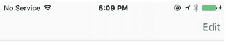
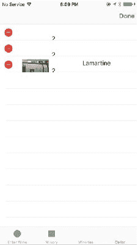
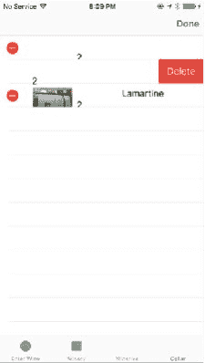
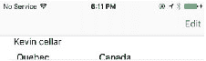
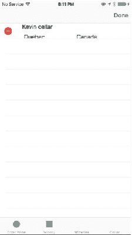
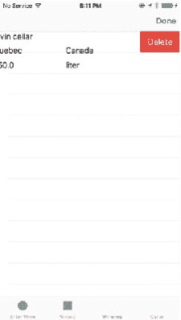
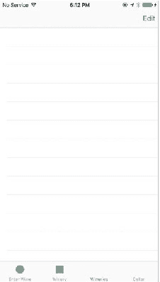

# 当我们启用“编辑”按钮时

在`viewDidLoad`方法中启用两个表视图控制器的`Edit`按钮后，我们激活了`Edit`按钮。当你点击`Edit`菜单项时，界面会发生变化，显示`Delete`图标。除此之外，UI 无需其他更改。为了看到`Edit`和`Delete`按钮，你需要运行应用程序，我接下来将执行此操作。

### 运行应用程序

图 8-1 展示了`Cellar TableViewController`中的葡萄酒列表。不要选择任何项目，而是点击“Edit”链接。这将把视图切换到编辑模式。

           

*图 8-1. Cellar TableView*

图 8-2 展示了编辑模式下的`Cellar TableView`。注意`Edit`按钮是如何变为`Done`的。这一切只需在`viewDidLoad`函数中编写一行代码即可实现。选择一个空行，该行将显示一个`Delete`按钮。

*图 8-2. 编辑模式下的 Cellar TableView*

图 8-3 显示了选中行的“删除”按钮。如果点击该按钮，将调用重写的`tableView(tableView: UITableView, commitEditingStyle editingStyle: UITableViewCellEditingStyle, forRowAtIndexPath indexPath: NSIndexPath)`方法，并通过`deleteRowsAtIndexPaths`函数将选中项从数组中移除。你或许还记得，我们还调用了`deleteWineRecord`来从数据库中删除记录。

*图 8-3. 选中待删除项*

图 8-4 显示了 Wineries 表视图的 TableView。目前它只有一条条目。我们将重复之前的流程，点击`Edit`按钮切换到编辑模式。

           

*图 8-4. Wineries TableView*

如图 8-5 所示，在编辑模式下，你可以选择条目，这将触发该行显示一个`Delete`按钮。同时注意“Done”链接，你可以用它来将 TableView 切换回只读模式。

*图 8-5. 编辑模式下的 Wineries*

图 8-6 显示了“删除”按钮，如果点击该按钮，选中的条目将从酒庄数组和数据库中的酒庄表中删除。

*图 8-6. 选中待删除项的 Wineries TableView*

图 8-7 显示了条目缺失的 Wineries TableView。

*图 8-7. 选中项已被删除*

