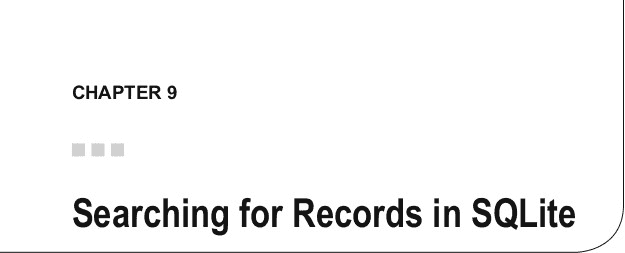

# 总结

在本章中，我们讨论了如何使用 SQLite 的`DELETE`语句从 SQLite 数据库中删除记录。以及如何使用`WHERE`子句来限制要删除的记录数量或定位特定记录。

我们还探讨了如何在 Swift 3 中实现`DELETE`语句，最后我们使用 Swift 向 Wine 应用程序添加了删除功能。在下一章中，我们将实现在 SQLite 数据库中搜索记录并显示这些记录。

本章不介绍任何新的 SQLite API。相反，它重点介绍如何利用 SQLite API 创建一个用于在 SQLite 数据库中搜索记录的 iOS iPhone 应用程序。在本章中，我们将探讨以下内容：

- 创建一个 iOS 应用程序
- 创建一个 SQLite 数据库
- 添加搜索功能
- 开发搜索用 UI
- 搜索记录
- 显示搜索结果
- 开发一个`UISearchBar` iPhone 应用程序

