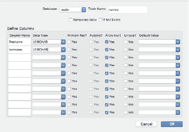
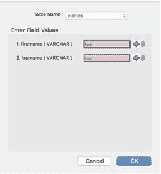
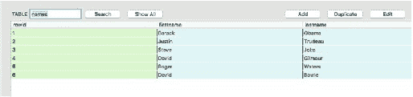
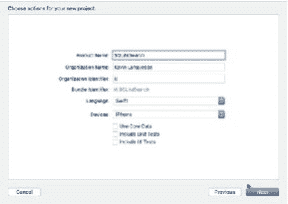
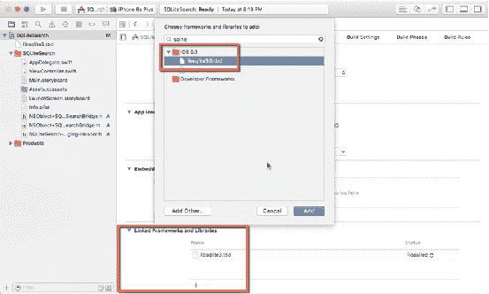
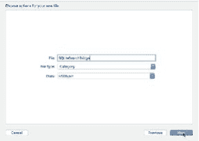
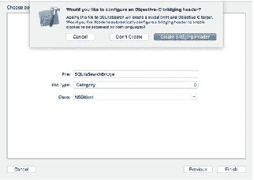

# 搜索应用程序

本教程演示了如何使用`SELECT`语句通过`UISearchBar`搜索数据库内容，并将结果显示在嵌入`ViewController`的`TableView`中。图 9-1 展示了运行中的应用程序界面。

© Kevin Languedoc 2016 [145]  
K. Languedoc, *使用 Swift 和 SQLite 构建 iOS 数据库应用程序*, DOI 10.1007/978-1-4842-2232-4_9


*图 9-1. 搜索 iPhone 应用程序*

`UISearchBar`和`UITableViewController`嵌入在`ViewController`中。搜索词被传递给`ViewController`中的一个函数。

`UISearchBar`是`UIKit`中的一个 iOS 组件，它在 Cocoa Touch 框架和 iOS SDK 2.0 版本中引入。`UIControl`和协议具有几个重要特性，可帮助开发者快速在其应用中实现搜索字段。您可以启用搜索按钮、取消按钮和书签按钮。委托（delegate）具有与这些被按下的按钮进行交互的方法。

本教程将演示如何快速开发一个使用`UISearchBar`文本字段搜索 SQLite 数据库的 iPhone 应用程序。该数据库包含一个按不同列存储的名称列表。应用程序将实现一个 SQL 查询来搜索任一字段，然后在`UITableView`中显示结果。

整个应用程序使用单视图应用程序模板构建。SQLite 数据库通过 Firefox 中的 SQLite Manager 构建并添加样本数据。

### 创建 SQLite 数据库

对于这个示例应用程序，我们将使用 Firefox 中的 SQLite Manager（一个免费的附加组件）创建一个 SQLite 数据库。如图 9-2 所示，我们创建一个名为`dbsearch.sqlite`的数据库和一个`names`表，用于存储名和姓的样本数据。文件应保存到方便的位置，因为稍后需要将其添加到 iOS 项目中。



*图 9-2. 创建 dbSearch.sqlite 和 names 表*

然后，我们添加两列：

- `firstname:varchar`
- `lastname:varchar`

图 9-3 展示了 Firefox 中的 SQLite Manager 如何根据您定义的列创建输入界面。使用 SQLite Manager，我们添加了一些样本数据，以便稍后执行搜索。图 9-4 显示了通过 Firefox 中的 SQLite Manager 输入到数据库中的样本数据。



*图 9-3. SQLite 数据输入*



*图 9-4. dbSearch.sqlite 中的样本数据*

### 创建 iOS/SQLite 项目

图 9-5 显示了在何处选择项目的模板。从 iOS 项目类别中选择单视图应用程序模板，以创建一个简单的 iOS iPhone 应用程序。将应用程序命名为`SQLiteSearch`，并确保在语言选项中选择了 Swift 语言。



*图 9-5. 创建 SQLiteSearch 应用程序*

项目创建完成后，你需要将`sqlite3`库添加到项目中并创建桥接头文件。图 9-6 展示了如何将`sqlite3`库添加到项目中。在导航器中选择项目根目录，并在“通用”选项卡上滚动到“链接的框架和库”部分。点击“+”按钮以调出库选择器弹出窗口。在搜索字段中输入“sqlite”，然后选择`libsqlite3.tbd`库。点击“添加”关闭弹出窗口并将库添加到项目中。



*图 9-6. 添加 sqlite3 库*


接下来，右键点击 `DbSearch` 组，然后选择“添加文件到…”上下文菜单项。浏览到 `dbsearch.sqlite` 文件保存的位置，选中该数据库文件，点击 **添加** 开始将数据库复制到项目中。会出现第二个弹窗，你需要从中选择第一个选项：“将项目复制到目标组的文件夹中（如果需要）”，以实际复制到项目。这一点很重要，否则只会添加一个引用。

现在项目已经设置完成，我们可以构建故事板和控制器逻辑了。

### 设置桥接

库文件就位后，我们必须设置 Objective-C 桥接。通过从可用模板中选择 **iOS 源** 类别中的 **Cocoa Touch 类** 模板（图 9-7），向项目中添加一个新文件，然后执行以下操作：

- 将桥接命名为 `SQLiteSearchBridge`
- 选择文件类型的类别，这将触发 **添加桥接接口**
- 选择 `NSObject` 类



**图 9-7.** 创建 `SQLiteSearchBridge`

图 9-8 显示了将文件添加到项目后出现的 **创建桥接接口**。当我们使用此方法创建桥接时，Xcode 将创建桥接文件，并将该文件添加到 Swift 编译器的构建设置中。你可以丢弃同时创建的 Objective-C 头文件和实现文件。在这个项目中，这些文件是 `NSObject+SQLiteSearchBridge.h` 和 `NSObject+SQLiteSearchBridge.m`。我们只需要 `SQLiteSearch-Bridging-Header.h` 文件。你需要打开这个文件，并添加 `#import <sqlite3.h>` 指令，以便与 SQLite3 API 交互。



**图 9-8.** 在 Xcode 中设置桥接

## 控制器代码

在开始处理界面并添加控件和 `IBOutlet` 之前，我们需要向 `ViewController` 添加代码，以处理搜索操作并与 `UISearchBar`、`UITableView` 和 `UITableViewCell` 交互。

打开 `ViewController`，并在类定义的旁边添加 `UISearchBarDelegate`、`UITableViewDelegate` 和 `UITableViewDataSource`（参见下面的代码）。我们还需要在应用加载时设置代理，因此需要在 `viewDidLoad` 函数中将代理分配给 `self`。

```swift
import UIKit

class ViewController: UIViewController, UISearchBarDelegate, UITableViewDelegate, UITableViewDataSource {

    // 为清晰起见，省略了部分代码

    override func viewDidLoad() {
        super.viewDidLoad()
        searchResults.dataSource = self
        searchResults.delegate = self
        searchField.delegate = self
    }
}
```

将使用一个数组变量来存储 `UITableView` 的数据，因此还需要其数据源。在这个项目中，数组 `nameList` 是 `String` 数据类型。如果你想操作 `UITableView` 中的数据，你需要与数据源交互。换句话说，就是与数组交互。此外，我们需要创建一个名为 `SQLITE_TRANSIENT` 的 `UnsafeMutablePointer`。这是一个析构器指针，稍后会用于 `searchDatabase` 函数中的 `sqlite3_bind_text`。

```swift
var nameList = [String]()
internal let SQLITE_TRANSIENT = unsafeBitCast(-1, sqlite3_destructor_type.self)
```

对于 `UITableViewDelegate` 和 `UITableViewDataSource` 协议，以及 `UITableView` 本身，我们需要添加一些必需的函数。下面将介绍这些函数。

### `numberOfSectionsInTableView` 函数

为了显示返回的结果，我们需要设置 `UITableView` 的代理和数据源。`numberOfSectionsInTableView` 告诉表格将包含多少个分区。分区是行的分组。我们将其设置为 `1`：

```swift
func numberOfSectionsInTableView(tableView: UITableView) -> Int {
    return 1
}
```

### `tableView:numberOfRowsInSection` 函数

`numberOfRowsInSection` 告诉表格要显示多少行。通常，它表示数组或数据源中的元素数量：

```swift
func tableView(tableView: UITableView,
    numberOfRowsInSection section: Int) -> Int {
    return nameList.count
}
```


