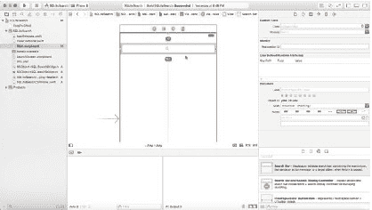
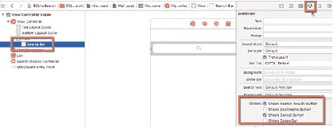
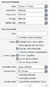
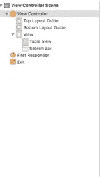
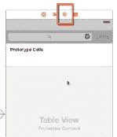
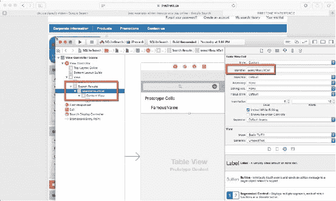

# 在 SQLite 中搜索记录

### `tableView:cellForRowAtIndexPath:indexPath` 函数

此方法通过获取 `UITableView` 中单元格原型的句柄，并将数组中 `indexPath` 位置的值赋给单元格的标签属性，来配置 `UITableCell`。对于在 `numberOfRowsInSection` 函数中定义的每一行，或数组中对象的每一个，此方法都会被重复调用。

单元格标识符 `searchResultCell` 将在稍后的用户界面中进行配置。此外，`famousName` 是我们稍后将在 `UITableViewCell` 中添加的 `UILabel` 插座变量（IBOutlet）。在 `cell` 变量被设置并转换为 `searchResultCellTableViewCell` 类型的 `UITableViewCell` 后，另一个变量 `nameObject` 会从当前数组索引中获取值。然后，这个值被赋给 `cell.famousName.text`：

```swift
func tableView(tableView: UITableView,
    cellForRowAtIndexPath indexPath: NSIndexPath) -> UITableViewCell{

    let cell = tableView.dequeueReusableCellWithIdentifier("searchResultCell", forIndexPath: indexPath) as! searchResultCellTableViewCell

    // 配置单元格...
    let nameObj = nameList[indexPath.row]
    cell.famousName.text = nameObj

    return cell
}
```

因此，对于 `UISearchBar` 的委托 `UISearchBarDelegate`（它要求实现 `searchBarCancelButtonClicked` 和 `searchBarSearchButtonClicked` 方法），交互性将响应 `UISearchBar` 中的按钮。对于 `UITableView`，则涉及 `UITableViewDelegate` 和 `UITableViewDataSource` 协议。接下来将提供这些函数的定义。

### `searchBarCancelButtonClicked` 函数

`searchBarCancelButtonClicked` 方法不仅会重置 `UISearchBar` 的文本字段，还会重置其数据源和 `UITableView`，同时会关闭键盘。完整代码如下：

```swift
func searchBarCancelButtonClicked(searchBar: UISearchBar){
    self.searchField.text=""
    searchResults.reloadData()
    searchField.resignFirstResponder()
    self.view.endEditing(true)
}
```

### `searchBarSearchButtonClicked` 函数

`searchBarSearchButtonClicked` 方法与 `searchBarCancelButtonClicked` 在设计上类似，区别在于它会调用 `searchDatabase` 方法。然后，代码会重置搜索字段、重新加载 `UITableView` 中的数据，并关闭键盘：

```swift
func searchBarSearchButtonClicked(searchBar: UISearchBar){
    self.searchDatabase(searchField.text!)
    self.searchField.text=""
    searchResults.reloadData()
    searchField.resignFirstResponder()
    self.view.endEditing(true)
}
```

### `searchDatabase` 函数

另一个新增功能是与数据库交互的方法：`searchDatabase`。此方法接受一个参数作为搜索词。从技术上讲，你应该能够传入多个搜索词，这些词会被分割成一个数组，但为了简单起见，我假设是单个词的搜索词。

第一个变量 `fileExist` 是一个布尔值（`Boolean`）。它将允许我们确保 `dbSearch.sqlite` 文件在应用程序主包中可用。`db` 变量是用于 SQLite 数据库的 `COpaquePointer`。同样，`sqlStatement` 变量是用于 `sqlite3_stmt` 语句的 `COpaquePointer`。

为了打开数据库，我们需要获取主包中文件的路径。我们将数据库文件保留在那里，因为我们不需要写入它，而且主包在运行时时只读的。通过 `NSBundle` 类，`projectBundle` 获取到 `mainBundle` 的句柄。然后创建常量 `fileMgr` 作为 `NSFileManager`。这个类处理与文件系统的交互。`resourcePath` 字符串常量将使用 `pathForResource` 获取数据库的完整路径。

一旦这些常量和变量被定义并赋初值，我们使用 `fileExistsAtPath`（返回一个布尔值）来检查数据库文件是否可用。如果数据库文件存在，则使用 `sqlite3_open` 函数打开数据库。如果数据库成功打开，则返回 `SQLITE_OK`，否则会在控制台打印一条错误信息。


一旦打开，我们定义了一个 SQL SELECT 查询字符串 `sqlQry`，它在 `WHERE` 子句中接收两个参数。这两个参数都会接收到从 `UISearchBar` 的 `IBOutlet` 传递给函数的 `searchTerm` 参数的一份副本。然后，我们使用 `sqlite3_bind_text` 函数为 SQL 查询分配并绑定输入值——`WHERE` 子句中的每个参数各对应一个。接着，代码将执行，如果成功则返回值。这些值会被赋值给 `concatName` 常量，并依次附加到 `nameList` 数组中。最后，清理内存并关闭数据库。

```
func searchDatabase(searchTerm:String){

    var fileExist:Bool = false

    var db:COpaquePointer = nil

    var sqlStatement:COpaquePointer=nil

    let projectBundle = NSBundle.mainBundle()

    let fileMgr = NSFileManager.defaultManager()

    let resourcePath = projectBundle.pathForResource("dbsearch", ofType: "sqlite")
    fileExist = fileMgr.fileExistsAtPath(resourcePath!)

    if(fileExist){

        if(!(sqlite3_open(resourcePath!, &db) == SQLITE_OK))

        {

            print("An error has occured.")

        }else{

            let sqlQry = "SELECT firstname,lastname FROM names where firstname=? or lastname=?"

            if(sqlite3_prepare_v2(db, sqlQry, -1, &sqlStatement, nil) != SQLITE_OK)

            {

                print("Problem with prepared statement " + String(sqlite3_errcode(db)));

            }

            sqlite3_bind_text(sqlStatement, 0, searchTerm, -1, SQLITE_TRANSIENT)

            sqlite3_bind_text(sqlStatement, 1, searchTerm, -1, SQLITE_TRANSIENT)

            while (sqlite3_step(sqlStatement)==SQLITE_ROW) {

                let concatName:String = String.fromCString(UnsafePointer<Int8>(sqlite3_column_text(sqlStatement,0)))! + " " + String.fromCString(UnsafePointer<Int8 >(sqlite3_column_text(sqlStatement,1)))!

                print("This is the name : " + concatName)

                nameList.append(concatName)

            }

            sqlite3_finalize(sqlStatement);

            sqlite3_close(db);

        }

    }

}
```

数组填充完毕后，`ViewController` 中的 `UITableView` 将显示结果。

### `searchResultCellTableViewCell` 函数

在开始处理故事板之前，我们需要添加一个名为 `searchResultCellTableViewCell` 的 `UITableViewCell` 对象。接下来，我们将为 `UILabel` 添加 `IBOutlet`，这个标签将被添加到单元格原型中。

## 开发故事板

故事板将会非常简单，只包含一个 `UISearchBar` 控件、一个 `UITableView` 以及对应的 `UITableCell`。图 9-9 展示了需要添加到 `ViewController` 的 `UISearchBar` 控件。在添加任何控件之前，先选中 `ViewController` 并将模拟器大小设置为 iPhone 4.7 英寸。你可以在属性检查器中调整此设置。

### `UISearchBar` 与 `UITableView`

将一个 `UISearchBar` 拖到画布上，并将其添加到场景顶部（图 9-9）。图 9-10 展示了如何设置“取消”和“搜索”按钮的属性。按住 Control 键打开属性检查器，并选择以下选项：

-   显示搜索结果按钮
-   显示取消按钮



图 9-9\. 将 `UISearchBar` 添加到 `ViewController`



图 9-10\. 设置 `UISearchBar` 属性

对于这个示例应用，我们不需要其他选项。接着，添加一个 `UITableView` `UIControl` 和一个 `UITableCell`（图 9-11）。将单元格控件叠加在表格上。选中 `UITableCell` 后，通过属性检查器页面添加一个标识符。从 `UITableView` 拖一条连线到 `UIViewController` 代理（主场景顶部栏上的黄色地球或圆形图标），如图 9-12 所示。释放鼠标按钮时，会弹出一个弹出窗口，允许你设置委托和数据源。请将两者都设置好。

   

图 9-11\. 添加 `UITableView` 和 `UITableViewCell`



图 9-12\. 为表格委托和数据源添加代理

### `IBOutlet`

如图 9-13 所示，接下来我们将创建 `IBOutlet`。点击工具栏中的双圆圈图标打开助理编辑器。要创建 `IBOutlet`，请使用鼠标按钮拖出一条连线（Ctrl + 拖动）到助理编辑器中打开的头部文件。释放鼠标按钮会激活一个弹出窗口，从而允许你在相应字段中输入连线名称并点击“连接”来创建 `IBOutlet` 连线。对于 `UISearchBar`，我将 `IBOutlet` 命名为 `searchField`。对 `UISearchBar` 和 `UITableView` 重复此操作。对于 `UITableView`，我将输出口命名为 `searchResults`。


图 9-13\. 添加 `searchField` 的 `IBOutlet`

```
@IBOutlet weak var searchField: UISearchBar!

@IBOutlet weak var searchResults: UITableView!
```

### 原型单元格

最后，对于原型单元格，我们需要配置单元格标识符，并添加一个 `UILabel` 来显示搜索结果。要配置单元格标识符，请打开文档大纲，并从文档层次结构中选择 `searchResultCell`（图 9-14）。然后，打开属性检查器，添加 `searchResultCell` 名称，并按回车键。该值将用于 `ViewController`，正如我们在上一节中看到的那样。



图 9-14\. 配置原型单元格

还需要向单元格添加一个 `UILabel`，并通过拖出一条连线到打开的标识检查器，将 `IBOutlet` 添加到 `searchResultCellTableViewCellController`。

```
import UIKit

class searchResultCellTableViewCell: UITableViewCell {

    @IBOutlet weak var famousName: UILabel!

    //为简洁起见，代码已移除

}
```

现在需要做的就是运行应用程序并测试功能。

### 运行应用程序

如图 9-15 所示，当用户在“搜索”字段中输入一个名字，并通过点击“搜索”按钮执行搜索时，如果有结果，则会从数据库中获取并在数据库中显示。每次搜索前都会重置 `UITableView`。在此示例中，由于我在模拟器中进行测试，我输入了名字 David 并按下了回车键。


图 9-15\. 输入搜索词，例如 David

图 9-16 显示了数据库中与我们的搜索词匹配的两个名字。

   

图 9-16\. 搜索结果

## 总结

在本章中，我们重新回顾了 SQLite 的 `SELECT` 语句，并实现了一个数据库搜索函数，该函数有助于在数据库中定位信息。下一章将重点介绍如何在单个文件中附加和使用多个数据库。


SQLite 有一个管理大量数据的出色特性：多数据库应用。在本章中，你将看到，通过创建多个数据库并将其附加到同一个连接，可以提高磁盘 I/O 性能和可靠性。

以下是涵盖的主题：

- `ATTACH` 函数概述
- 使用 `DETACH` 分离数据库
- 多数据库限制
- 创建连接
- 在 Swift 中使用 `ATTACH` 和 `DETACH`

## `ATTACH` 语句

SQLite 3 提供了 `ATTACH DATABASE` 语句，用于多数据库查询。虽然你可以通过 Objective-C DAO 类管理多个数据库连接，但使用 SQLite 的 API 效率要高得多。附加数据库意味着多个数据库共享同一个数据库连接。对于 SQLite 引擎来说，使用数据库连接的第一个数据库称为 `main`。任何附加的数据库都必须分配一个新的名称，以便在连接池中区分它们。语法非常简单：

```
let attachdb = "ATTACH DATABASE database_file AS schema_name"
```

`database_file` 的值是要附加的数据库的文件名，而 `schema_name` 是该数据库的别名。


