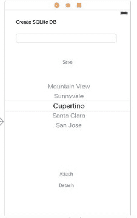
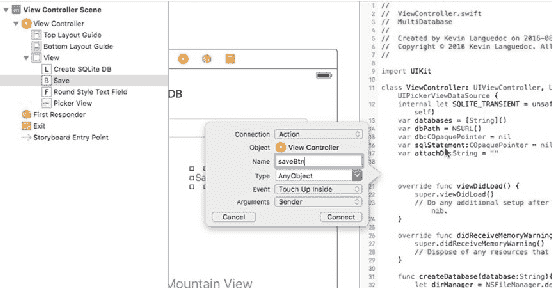
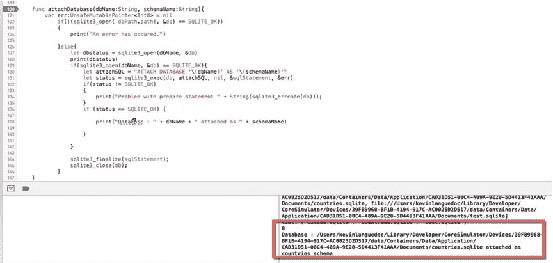
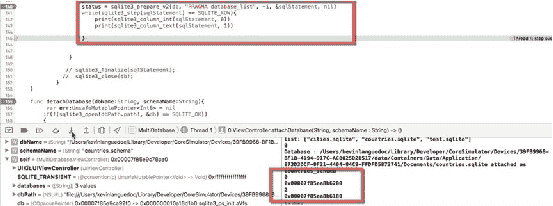
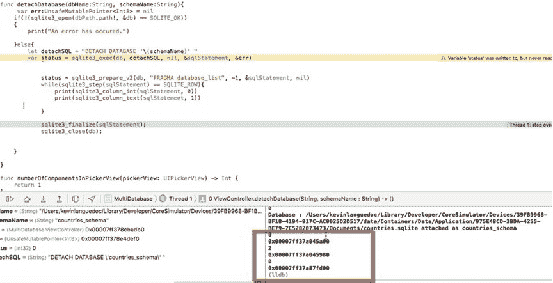
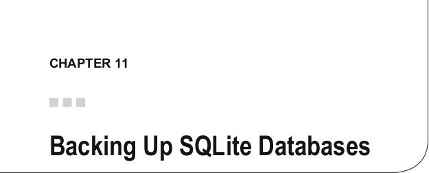

# 使用多个数据库

被添加到`IBActions`中的代码。`saveBtn`会调用稍后解释的`createDatabase`函数。调用`createDatabase`函数后，`UIPickerView`会使用数据库数组中的新值重新加载，该数组是`UIPickerView`的数据源。`attachDatabase`函数由`AttachDbBtn`调用，而`detachDatabase`由`detachDbBtn`调用。

第一个参数值`attachDb`由`dbnamePicker`的`pickerView`函数填充，我们稍后会看到。同样，对于第二个参数的值，我们只需将“schema”字符串与`attachDb`变量的名称拼接起来。

```swift
@IBOutlet weak var dbnamePicker: UIPickerView!

@IBOutlet weak var dbnameField: UITextField!

@IBAction func saveBtn(sender: AnyObject) {
    self.createDatabase(self.dbnameField.text!)
    dbnamePicker.reloadAllComponents()
}

@IBAction func attachDbBtn(_ sender: AnyObject) {
    let dbame = attachDb.components(separatedBy: ".")[0]
    self.attachDatabase(self.getDbToAttach(attachDb).path!, schemaName: dbame+"_schema")
}

@IBAction func detachDbBtn(_ sender: AnyObject) {
    let dbame = attachDb.components(separatedBy: ".")[0]
    self.detachDatabase(dbame+"schema")
}
```

### `viewDidLoad`函数

`viewDidLoad`函数为`UIPickerView`对象设置了代理和数据源。之后，代码检索 Document 目录中的 sqlite 文件列表，并填充`databases`数组：

```swift
override func viewDidLoad() {
    super.viewDidLoad()
    dbnamePicker.delegate = self
    dbnamePicker.dataSource = self

    // 获取文档目录 URL
    let documentsUrl = FileManager.default.urlsForDirectory(.documentDirectory,
        inDomains: .userDomainMask).first!

    do {
        // 获取目录内容 URL（包括子文件夹 URL）
        let directoryContents = try FileManager.default.contentsOfDirectory( at:
            documentsUrl, includingPropertiesForKeys: nil, options: [])
        print(directoryContents)

        // 如果要过滤目录内容，可以这样做：
        let sqliteFiles = directoryContents.filter{ $0.pathExtension == "sqlite" }
        databases = sqliteFiles.flatMap({$0.lastPathComponent})
        print("list:", databases)
        self.setDbpath()
    } catch let error as NSError {
        print(error.localizedDescription)
    }
}
```

### `getDbToAttach`函数

这个小函数仅用于获取要附加的数据库的名称和路径。代码从 Document 目录检索路径值，并将其存储到`db_to_attach_path`变量中：

```swift
func getDbToAttach(_ db_to_attach:String)->URL{
    let dirManager = FileManager.default)
    var db_to_attach_path = URL()
    do {
        let directoryURL = try dirManager.urlForDirectory(FileManager.
            SearchPathDirectory.documentDirectory, in: FileManager.SearchPathDomainMask.
            userDomainMask, appropriateFor: nil, create: true)
        db_to_attach_path = try! directoryURL.appendingPathComponent(db_to_attach)
    } catch let err as NSError {
        print("Error: \(err.domain)")
    }
    return db_to_attach_path
}
```

### `setDbpath`函数

`setDbPath`函数设置`UIPickerView`列表中所选数据库名称的路径值，并将其存储在`dbPath`变量中。该函数在应用启动时被调用：

```swift
func setDbpath(){
    let dirManager = FileManager.default()
    let dbname = "cities.sqlite"
    do {
        let directoryURL = try dirManager.urlForDirectory(FileManager.
            SearchPathDirectory.documentDirectory, in: FileManager.SearchPathDomainMask.
            userDomainMask, appropriateFor: nil, create: true)
        dbPath = try! directoryURL.appendingPathComponent(dbname)
    } catch let err as NSError {
        print("Error: \(err.domain)")
    }
}
```

### `createDatabase`函数

为了设置数据库，我们将使用`createDatabase`函数。该函数将获取 Document 目录的句柄，并将其分配给`directoryURL`。接下来，使用`URLByAppendingPathComponent`函数，将基于输入参数`database`的数据库名称分配给`dbPath`变量。一旦数据库名称和路径设置完毕，`sqlite3_open`将创建数据库文件并打开它。


```swift
// 任何错误都会由 `NSError` 类捕获。请参见此处：

func createDatabase(_ database:String){
    let dirManager = FileManager.default()
    do {
        let directoryURL = try dirManager.urlForDirectory(FileManager.SearchPathDirectory.documentDirectory, in: FileManager.SearchPathDomainMask.userDomainMask, appropriateFor: nil, create: true)
        dbPath = try! directoryURL.appendingPathComponent(database)
        if(!(sqlite3_open(dbPath.path!, &db) == SQLITE_OK)){
            print("无法创建数据库")
        } else {
            print("数据库：" + database + " 已成功创建 ")
            databases.append(database)
            sqlite3_close(db);
        }
    } catch let err as NSError {
        print("错误：\(err.domain)")
    }
}
```

### `attachDatabase` 函数

此函数的唯一目的是将数据库附加到已打开的连接上。为简单起见，只添加了最少的错误检查。`sqlite3_open` 确保主数据库已打开，并将 `ATTACH` 查询字符串传递给 `sqlite3_exec` 函数。如果查询没有错误，则使用 Swift 内联文本绑定将输入值绑定到查询，并执行查询。然后释放查询内存，并关闭连接以完成操作。请参见此处：

```swift
func attachDatabase(_ dbName:String, schemaName:String){
    var err:UnsafeMutablePointer<Int8>? = nil
    if(!(sqlite3_open( dbPath.path!, &db) == SQLITE_OK)){
        print("发生了错误。")
    } else {
        let dbstatus = sqlite3_open(dbName, &db)
        print(dbstatus)
        if(sqlite3_open(dbName, &db) == SQLITE_OK){
            let attachSQL = "ATTACH DATABASE '\(dbName)' AS '\(schemaName)'"
            let status = sqlite3_exec(db, attachSQL, nil, &sqlStatement, &err)
            if(status != SQLITE_OK){
                print("预处理语句出现问题 " + String(sqlite3_errcode(db)));
            }
            if (status == SQLITE_OK) {
                print("数据库：" + dbName + " 已作为 " + schemaName + " 附加")
            }
        }
        sqlite3_finalize(sqlStatement);
        sqlite3_close(db);
    }
}
```

### `detachDatabase` 函数

`detachDatabase` 函数在设计上与 `attachDatabase` 类似。使用 `sqlite3_open` 函数确保主数据库已打开后，将 `DETACH` 查询字符串连同 `sqlite3_statement` 指针一起传递给 `sqlite3_exec` 函数。使用 Swift 内联文本绑定方法将模式名称传递给查询。如果查询成功执行，则清理内存并关闭主数据库连接。请参见此处：

```swift
func detachDatabase(_ dbName:String, schemaName:String){
    var err:UnsafeMutablePointer<Int8>? = nil
    if(!(sqlite3_open(dbPath.path!, &db) == SQLITE_OK)){
        print("发生了错误。")
    } else {
        let detachSQL = "DETACH DATABASE '\(schemaName)' "
        var status = sqlite3_exec(db, detachSQL, nil, &sqlStatement, &err)
        status = sqlite3_prepare_v2(db, "PRAGMA database_list", -1, &sqlStatement, nil)
        while(sqlite3_step(sqlStatement) == SQLITE_ROW){
            print(sqlite3_column_int(sqlStatement, 0))
            print(sqlite3_column_text(sqlStatement, 1))
        }
        sqlite3_finalize(sqlStatement);
        sqlite3_close(db);
    }
}
```

### `UIPickerView` 函数

`UIPickerView` 函数包括 `numberOfComponentsInPickerView`，它配置 `UIPickerView` 中的列数。`pickerView:numberOfRowsInComponent` 指定 `UIPickerView` 中将显示的行数。此返回值通常是数据源的元素计数。`titleForRow` 在 `UIPickerView` 中显示数据源每个元素的实际值。`widthForComponent` 和 `rowHeightForComponent` 是辅助函数，用于设置在 `UIPickerView` 中显示元素的单元格的宽度和高度。最后，`didSelectRow` 返回选中的值。该值用于选择要附加的数据库。请参见此处：

```swift
func numberOfComponents(in pickerView: UIPickerView) -> Int { return 1 }

func pickerView(_ pickerView: UIPickerView, numberOfRowsInComponent component: Int) -> Int {
    return databases.count
}

func pickerView(_ pickerView: UIPickerView, titleForRow row: Int, forComponent component: Int) -> String? {
    let dbname:String = databases[row]
    return dbname
}

func pickerView(_ pickerView: UIPickerView, didSelectRow row: Int, inComponent component: Int) {
    attachDb = databases[row]
}

func pickerView(_ pickerView: UIPickerView, widthForComponent component: Int) -> CGFloat {
    return 250.0
}

func pickerView(_ pickerView: UIPickerView, rowHeightForComponent component: Int) -> CGFloat {
    return 50.0
}
```

### 构建用户界面

图 10-1 展示了应用程序的极简设计，允许用户创建数据库或从 `UIPickerView` 中选择一个数据库。用户界面包含一个 `UITextField`，用户可通过点击**保存**按钮来创建新数据库。

`UIPickerView` 包含存储在**文档**目录中的数据库列表。要附加或分离数据库，用户从列表中选择一个数据库，然后点击相应的按钮。你可能已经注意到，这些数据库不包含任何表或其他设计元素。该应用程序的目的是演示附加和分离数据库所需的最简代码。

对于此项目，你需要以下组件，它们如图 10-1 所示布局：

- **创建 SQLite 数据库** – `UILabel`
- **DbnameField** – `IBOutlet UITextField`
- **保存** – `IBAction UIButton`
- **DBNamePicker** – `IBOutlet UIPickerView`
- **附加** – `IBAction UIButton`



**图 10-1.** 用户界面设计

设计元素就位后，我们需要将其与 `ViewController` 建立连接。打开**标识助理**，然后**按住 Control 键并拖动**，在 `viewDidLoad` 函数上方与打开的 `ViewController` Swift 文件建立连接，就像我们之前在 `ViewController` 部分讨论的那样（图 10-2）。



**图 10-2.** 添加 `IBActions` 和 `IBOutlets`

### 运行应用程序

图 10-3 展示了运行中的应用程序。在此示例中，我添加了两个数据库：`cities.sqlite` 和 `countries.sqlite`。第三个数据库是为了测试目的而添加的。`cities.sqlite` 数据库是“主”数据库，在应用程序启动时打开。通过选择 `countries.sqlite` 并点击**保存**按钮，`countries.sqlite` 数据库被附加。

      

**图 10-3.** 运行中的应用程序

图 10-4 显示了附加数据库的输出。执行 `sqlite3_exec` 函数后，返回 `SQLITE_OK` 或 `0` 状态码，表明操作是否成功。对于分离操作也是如此，该操作通过 `detachDatabase` 函数执行（图 10-5）。



**图 10-4.** 附加状态

图 10-5 显示了 `PRAGMA database_list` 命令的输出，该命令返回附加到连接的数据库列表。输出控制台显示了两个数据库指针及其在数组中的索引号。



**图 10-5.** `PRAGMA database_list` 输出

图 10-6 显示了分离的数据库 `countries_schema` 的输出，该数据库之前已被附加。



**图 10-6.** 移除第二个数据库后的 `database_list` 输出

### 总结

在本章中，你已看到附加和分离数据库是一个简单的过程。虽然根据应用程序的需求，并不总是需要使用多个数据库，但这样做可以提高磁盘 I/O 性能和可靠性。



- 将内容复制到新数据库
- 备份磁盘上的数据库
- 备份内存中的数据库


## SQLite 备份方法概述

在备份 API 引入之前，执行备份的唯一方法是制作副本。虽然这仍然是一种可行的选择，但它也有其缺点，例如在打开的数据库被锁定时尝试制作副本。另一个缺点是，如果应用在复制完成前停止运行，则应用需要删除副本并重新开始。除了这两个例子外，复制过程还可能因多种方式失败并可能损坏数据库文件。简而言之，此选项没有任何内置智能功能。

但在紧急情况下，此选项确实能起作用。在 Swift iOS 环境中，你的应用需要使用 Swift 的 `FileManager` 类来物理复制数据库并将其移动到其他位置。然后，你需要确定数据库中要保留多少数据，并从生产数据库中移除多余数据以释放空间（如果需要）。为了回收一些空间，你也可以运行 `VACUUM` PRAGMA 选项。

## 制作备份副本

以下代码片段是一个使用 `FileManager` 执行备份的可能示例。

1. 首先，确保使用 `sqlite3_close` 命令关闭数据库。
2. 然后，使用 `FileManager.default` 属性获取文件系统的句柄。
3. 接下来，使用 `copyItemAtPath` 物理复制文件。
4. 然后，根据需要从数据库中删除第 n 条记录。
5. 最后，运行 `VACUUM` 以移除空空间并重新建立索引以确保万无一失。

```
func backupCopyDatabase(){
    if sqlite3_close(db) == SQLITE_OK{
        let fileMgr = FileManager.default
        do {
            try fileMgr.copyItem(atPath: self.sourcedb, toPath: self.targetdb)
            let deleteSQL = "DELETE FROM main.table"
            if(sqlite3_exec(db, deleteSQL, nil, sqlStatement, err) == SQLITE_OK){
                if(sqlite3_exec(db, "VACUUM", nil, &sqlStatement, &err) == SQLITE_OK){
                    print("database compressed")
                }
            })
        }
        catch let error as NSError {
            print("Backup error: \(error)")
        }
    }
}
```

## 备份内存中的 SQLite 数据库

SQLite 有一个备份 API，可以支持对正在运行的数据库和内存数据库进行备份。备份的工作原理是将内容从一个数据库复制到另一个 SQLite 数据库。当 API 将内容从源数据库复制到目标数据库时，它会覆盖目标数据库中的内容，因此如果需要保留所有版本的内容，你可能需要制作不同的副本。你也可以以类似的方式恢复数据库。

备份 API 允许你在源数据库上仍有共享锁时进行备份。如果你断电或遇到其他问题（例如应用崩溃），备份 API 将记住它停止的位置并从该点继续。

使用 API 备份数据库包含三个不同的步骤：

- 使用 `sqlite3_backup_init` 进行初始化。
- 使用 `sqlite3_backup_step` 执行备份。
- 最后，使用 `sqlite3_backup_finish` 清理操作。

要检查是否还有记录需要备份，可以使用 `sqlite3_backup_remaining` 函数，该函数返回数据库中剩余的记录数。`sqlite3_backup_pagecount` 提供了源数据库中待备份的总页数。

确保在开始备份之前没有任何锁是很重要的；否则，SQLite 会立即返回 `SQLITE_BUSY` 错误。为避免任何冲突，最好测试数据库是否可访问以进行备份。要运行这些测试，代码应实现 `sqlite3_busy_handler` 或 `sqlite3_busy_timeout`。前者在发生错误时调用回调函数。后者在发生锁定的情况下设置一个以毫秒为单位的计时器。它可以被重复调用直到锁被解除。

## 备份磁盘上的 SQLite 数据库

© Kevin Languedoc 2016 [175]
K. Languedoc, *《使用 Swift 和 SQLite 构建 iOS 数据库应用》*, DOI 10.1007/978-1-4842-2232-4_11


