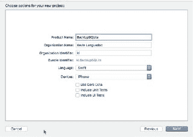
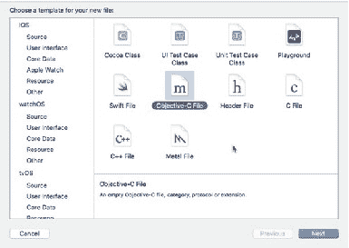
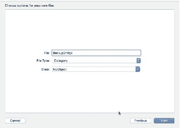
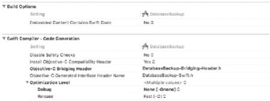
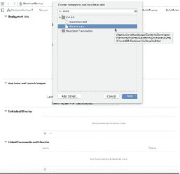
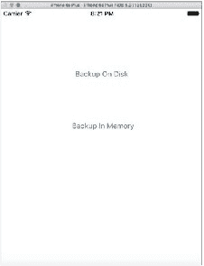
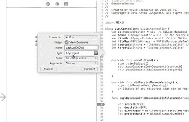
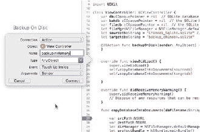
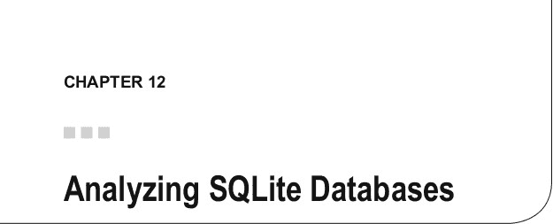

# **备份 SQLite 数据库**

磁盘备份与第一种选项类似，但使用的是 SQLite API。使用此选项时，应用实际上是将数据从源数据库移动到目标数据库。这两个数据库都是物理文件。理论上，目标数据库可以位于远程服务器上，也可以与源数据库位于同一个 `Document` 目录下。

磁盘备份操作使用了四个不同的函数来执行备份：
- `sqlite3_backup_init`
- `sqlite3_backup_step`
- `sqlite3_sleep`
- `sqlite3_backup_remaining`
- `sqlite3_backup_pagecount`
- `sqlite_backup_finish`

调用 `sqlite3_backup_init` 来创建 `sqlite3_backup` 对象。该函数接受一个源数据库指针和一个目标数据库指针作为参数。这两个指针中，一个可以指向内存数据库，另一个指向物理数据库，或者两者都可以是物理数据库指针。

下一步操作是 `sqlite3_backup_step` 函数，它会重复调用，将参数 5 中指定的第 *n* 个页数复制到目标数据库。每次迭代结束时，应用需要调用 `sqlite3_sleep`，该函数会将进程冻结 250 毫秒，以便写入过程完成。`sqlite3_backup_remaining` 在 `sqlite3_backup_step` 函数执行后返回数据库中剩余的页数。我通常在流程开始时调用 `sqlite3_backup_pagecount` 函数来确定数据库中有多少页（如本章后面的示例所示），然后在每次迭代后调用 `sqlite3_backup_remaining` 函数。

一旦源数据库完全备份完毕，就会调用 `sqlite3_backup_finish` 函数来清理 `sqlite3_backup_init` 函数分配的资源。

## **备份应用**

为了演示各种备份 API，我将创建一个单视图 iOS iPhone 应用。该应用除了实现之前的 `backupCopyDatabase` 之外，还将实现两种 SQLite 备份 API 的方法。

我使用 Chinook 数据库的副本（https://chinookdatabase.codeplex.com/）作为示例数据。如果你打算尝试运行代码，需要将数据库导入到项目中。为了使数据库可写，需要将其复制到 `Documents` 目录中，因此将 `copyDatabaseIntoDocuments` 方法添加到项目中。

图 11-1 显示了第二个屏幕，你可以在其中为单视图应用程序项目输入名称。在此示例中，我将项目命名为 `BackupSQLite`。语言当然是 Swift，目标设备是 iPhone。你可以保留其他选项不变。



*图 11-1. 备份项目：单视图模板*

由于我们将使用 SQLite 数据库和 SQLite 备份 API，因此我们需要像往常一样创建一个桥接文件。选择 Objective-C 文件模板，然后单击“下一步”进入下一个屏幕，你需要在此处指定桥接文件的名称和文件类型，该文件类型应为 Category（图 11-2）。选择此选项将启动 Xcode，它会要求为你创建桥接文件并设置 Swift 构建设置。



*图 11-2. 桥接接口*

图 11-3 提供了桥接文件选项的截图。第一个字段是文件名。此例中为 `BackupBridge`。选择 Category 文件类型后，一旦文件保存到项目中，就会触发“创建桥接”接口。



*图 11-3. BackupBridge 文件*

图 11-4 显示了允许 Xcode 设置桥接文件并将设置添加到构建设置的接口。


*图 11-4. 创建桥接头文件接口*

图 11-5 提供了由 Objective-C 桥接设置过程自动配置的 Swift 编译器构建设置的可视化视图。





*图 11-5. Swift 编译器构建设置*


记住将`sqlite3`库添加到 Linked Libraries（图 11-6），因为我们需要使用`sqlite`库。



图 11-6. 添加`sqlite`库

接下来，使用`import`关键字将头文件添加到`DatabaseBackup-Bridging-Header.h`头文件中，如以下代码片段所示：

```objectivec
#import <sqlite3.h>
```

桥接就绪后，我们可以添加执行备份的代码。

## 第 11 章 备份 SQLite 数据库

### ViewController

`ViewController`是应用程序的主控制器。我们添加三个数据库指针和一个指向`sqlite3_backup`对象的指针。我们还添加一个`FileManager`来执行文件操作，例如将数据库文件复制到 Documents 目录。源数据库和目标数据库分别定义为`sourcedb`和`targetdb`，最后两个`COpaquePointer`用于`sqlite3_statement`和`sqlite3`数据库错误。

```swift
var db:OpaquePointer? = nil // SQLite 数据库连接，用于 sourceDB 文件名
var bakdb :OpaquePointer? = nil // SQLite 备份对象
var filedb :OpaquePointer? = nil // SQLite 备份对象
let fileMgr:FileManager = FileManager.default
let sourcedb:String = "Chinook_Sqlite.sqlite" // 要备份的 SQLite 数据库
let targetdb:String = "backup_chinook.sqlite"
var sqlStatement:OpaquePointer? = nil
var err:UnsafeMutablePointer<Int8>? = nil
```

### 函数`viewDidLoad`和`copyDatabaseIntoDocuments`

在`viewDidLoad`函数中，我们为每个数据库调用`copyDatabaseIntoDocuments`函数。该函数获取文件的句柄和 Documents 目录的句柄，如果文件尚不存在，则使用`openItem`将文件复制到 Documents 目录：

```swift
override func viewDidLoad() {
    super.viewDidLoad()
    self.copyDatabaseIntoDocuments(sourcedb)
    self.copyDatabaseIntoDocuments(targetdb)
}
```

```swift
func copyDatabaseIntoDocument(_ dbFilename:String){
    var srcPath:URL
    var destPath:URL
    let dirManager = FileManager.default
    let projectBundle = Bundle.main
    do {
        let resourcePath = projectBundle.pathForResource(dbFilename.
            components(separatedBy: ".")[0], ofType: "sqlite")
        let documentURL = try dirManager.urlForDirectory(FileManager.
            SearchPathDirectory.documentDirectory, in: FileManager.SearchPathDomainMask.userDomainMask, appropriateFor: nil, create: true)
        srcPath = URL(fileURLWithPath: resourcePath!)
        destPath = try! documentURL.appendingPathComponent(dbFilename)
        if !dirManager.fileExists(atPath: destPath.path!) {
            try dirManager.copyItem(at: srcPath, to: destPath)
        }
    } catch let err as NSError {
        print("Error: \(err.domain)")
    }
}
```

### 函数`getDatabasePath`

最后，`getDatabasePath`是一个辅助函数，用于获取每个数据库文件的完整路径。该函数在`copyDatabaseIntoDocument`中使用：

```swift
func getDatabasePath(_ database:String)->URL{
    var dbfile:URL = URL.init(fileURLWithPath:"")
    let dirManager = FileManager.default
    do {
        let directoryURL = try dirManager.urlForDirectory(FileManager.
            SearchPathDirectory.documentDirectory, in: FileManager.SearchPathDomainMask.userDomainMask, appropriateFor: nil, create: true)
        dbfile = try! directoryURL.appendingPathComponent(database)
    } catch let err as NSError {
        print("Error: \(err.domain)")
    }
    return dbfile
}
```

## 备份正在运行的数据库

为了演示如何备份正在运行的数据库，您需要使用`open`命令获取正在运行的数据库的句柄，并使用`sqlite3_backup_init`初始化备份过程。对于正在运行的数据库，可能会遇到锁，因此需要逐步遍历数据库中的记录，并持续检查数据库是否被锁定。SQLite 提供了`sqlite3_sleep`函数，通常设置为 250 毫秒。每次迭代时，获取剩余记录数，直到剩下九条记录。请参见以下代码：

```swift
func backupRunningDatabase() {
    var rc:Int32 = -1
    var remaining:Int32 = 0
    var page_count:Int32 = 0
    if(sqlite3_open(self.getDatabasePath(sourcedb).path!, &db)==SQLITE_OK) {
        if(sqlite3_open(self.getDatabasePath(targetdb).path!, &filedb) == SQLITE_OK) {
```


`bakdb = sqlite3_backup_init(filedb, "main", db, "main");`

`remaining = sqlite3_backup_remaining(db)`

## 第 11 章 ■ 备份 SQLite 数据库

```c
while(remaining != 0){
rc = sqlite3_backup_step(bakdb, 10) //复制 10 页到备份数据库
if(rc == SQLITE_OK){
remaining = sqlite3_backup_remaining(db)
page_count = sqlite3_backup_pagecount(db)
if( rc==SQLITE_OK || rc==SQLITE_BUSY || rc==SQLITE_LOCKED ){
sqlite3_sleep(250);
}
}
}
sqlite3_backup_finish(bakdb)
}
}
sqlite3_close(db)
sqlite3_close(filedb)
}
```

### 备份内存数据库

创建内存备份与备份正在运行的数据库略有不同。从下面的代码中，您可以看到创建数据库内存备份是多么简单。您只需要一个指向数据库的指针和一个指向备份的指针。然后，逐步遍历数据库，直到所有记录都备份到内存数据库中：

```c
func backupInMemory(){
if(sqlite3_open(sourcedb, &db)==SQLITE_OK){
if(sqlite3_open("file::memory:", &db) == SQLITE_OK){
bakdb = sqlite3_backup_init(filedb, "main", db, "main")
sqlite3_backup_step(bakdb, -1)
sqlite3_backup_finish(bakdb)
sqlite3_close(db);
sqlite3_close(filedb)
}
}
}
```

### 构建用户界面

如图 11-7 所示，用户界面非常简单，只有两个按钮，用于调用 `backupInMemory` 和 `backupRunningDatabase` 函数。这两个按钮将以 `IBActions` 的形式连接到 `ViewController`。

第 11 章 ■ 备份 SQLite 数据库



**图 11-7.** 应用程序的用户界面

要创建连接的 `IBActions`，请在 Xcode 中打开身份助理，然后按住 control 键并从 `UIButton` 拖动一条连接线到打开的 `ViewController` 文件。在图 11-8 中，您可以看到松开鼠标按钮会触发一个弹出窗口，允许您输入 `IBAction` 的名称，对于相应的 `UIButton`，该名称将为 `backupOnDisk`。



**图 11-8.** `backupOnDisk` `IBAction`

对于“备份到内存”按钮，将 `IBAction` 命名为 `backupInMemory`。这两个 `IBActions` 的代码如图 11-9 之后所示。

第 11 章 ■ 备份 SQLite 数据库



**图 11-9.** `backupInMemory` `IBAction`

最后，两个 `IBActions` 都在 `ViewController` 中调用各自的备份函数。

```swift
@IBAction func backupOnDisk(_ sender: AnyObject) {
self.backupRunningDatabase()
}

@IBAction func backupInMemory(_ sender: AnyObject) {
self.backupInMemory()
}
```

备份完成后，剩下的就是确定备份的存储位置。在移动设备上，选项很有限，因此您需要将这些文件导出到其他位置，例如 iCloud 或其他类似服务。这些文件也可以移动到公司网络中。

## 本章小结

最后一章将介绍 SQLite 数据库的分析。



这最后一章将重点介绍 SQLite 平台提供的不同工具，以帮助您分析应用程序的数据库。除了可以通过 `sqlite3_exec` 命令执行的 `ANALYZE` 语句之外，其他工具都是外部软件程序。具体来说，在本章中，我们将通过示例讨论和探索以下技术：

- `ANALYZE` 语句
- `sqldiff` 工具
- `sqlite3_analyzer` 工具

除了我们将在 Swift 中探讨的 `ANALYZE` 语句之外，所有其他工具都是外部工具，可以帮助您分析数据库以进行支持或开发优化。

## ANALYZE 语句

`ANALYZE` 语句的作用是通过统计数据收集数据库中表和索引的信息。SQLite 通过在执行 `ANALYZE` 语句时在应用程序的数据库中创建一个 `sqlite_stats1` 表来完成此任务。SQLite 将此信息传递给 SQLite 查询优化器，优化器随后使用收集到的信息来使用最佳的查询算法以获得最佳性能。

如果您构建了数据库或启用了 `SQLITE3_ENABLE_STAT3` 或 `SQLITE3_ENABLE_STAT4`，则会收集额外的直方图信息，并分别存储在 `sqlite3_stat3` 和 `sqlite3_stat4` 表中。


