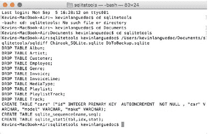

# 在数据库中运行 ANALYZE 功能

要在数据库中运行 `ANALYZE` 功能，只需执行 `ANALYZE` 语句即可，如下所示：`ANALYZE schema`

这将为整个数据库创建一张 `stat1` 表。如果你只想针对某张表，可以执行如下命令：

`ANALYZE schema.表名`

当然，你也可以使用以下命令为表中的某个索引构建 `stat1` 表：带或不带 schema 前缀的 `ANALYZE`：

`ANALYZE schema.索引名`

或者，

`ANALYZE 索引名`

© Kevin Languedoc 2016 [187]

K. Languedoc, *使用 Swift 和 SQLite 构建 iOS 数据库应用*, DOI 10.1007/978-1-4842-2232-4_12

## 在 Swift 中

在 Swift 中，`ANALYZE` 语句的执行方式与其他查询相同，如下所示：

```
func analyzeDatabase(_ name:String){
  let sql:String = "ANALYZE Chinook_Sqlite.sqlite"
  if(sqlite3_open(dbPath.path!, &db)==SQLITE_OK){
    if(sqlite3_prepare_v2(db, sql.cString(using: String.Encoding.utf8)!, -1,
                          &sqlStatement, nil)==SQLITE_OK){
      while(sqlite3_step(sqlStatement)==SQLITE_ROW){
        let output = String(cString: UnsafePointer<Int8>(sqlite3_column_
                           text(sqlStatement, 0)))
        print(output)
      }
    }
  }
  sqlite3_close(db)
}
```

## `sqldiff` 工具

`sqldiff` 实用程序是 SQLite 的一个外部应用程序。你可以从 [www.sqlite.org](http://www.sqlite.org) 的下载页面将其与 `SQLite3_Analyzer` 以及 SQLite 本身一起下载。请寻找适用于 OSX x86 的 zip 压缩包。

你只需将压缩文件解压到 OSX 机器上的某个方便目录即可。这些工具同样适用于 Windows 和 Linux。以下说明仅针对 OSX；不过，我确信它们在 Windows 和 Linux 上的工作方式相同。

`sqldiff` 实用程序用于比较两个 SQLite 数据库，并生成一个 SQL 脚本，用于将源数据库（`database1`）转换为目标数据库（`database2`）。`sqldiff` 工具很容易使用。图 12-1 展示了一个示例输出。在终端窗口中，导航到你解压该实用程序的目录，然后 `sqldiff` 将执行以下命令：


*图 12-1. `sqldiff` 输出到标准输出*

`sqldiff database1.sqlite database2.sqlite`

为了演示，我将对我用于备份的 `Chinook_SQLite.sqlite` 数据库运行该实用程序。第二个数据库是 `DbToBackup.sqlite`，这是我为备份创建的另一个空数据库。

该实用程序还有许多可供使用的选项。例如：

* `--changeset FILE`
* `--lib` 或 `L`
* `--primaryKey`
* `--schema`
* `--summary`
* `--table TABLENAME`
* `--transaction`
* `--vtab`

`--changeset` 选项将输出重定向到文件。`--lib` 选项在比较数据库之前加载用户自定义库，例如 `collating_sequences`。如果你更喜欢使用表中的主键而不是 `rowid`，那么可以使用 `--primaryKey` 选项。使用 `--schema` 标志，可以仅显示 schema 的差异，不包括内容。要精确定位两张表中发生的变化，请使用 `--summary`。但是，实际更改不会被显示。使用 `--table` 选项可以比较特定表的内容。`--transaction` 选项允许你为整个操作生成一个大型事务。最后，`--vtab` 选项适用于虚拟表，例如 `FTS3`、`FTS5` 和 `rtree` 表。

`sqldiff` 实用程序通过逐对比较 `rowid` 来工作，除非你使用了 `--primaryKey` 选项。如果内容存在于相似的表中，则输出会生成为更新语句。如果两个数据库包含不同的表，则源表会被删除（`DELETE`）并创建新表，然后使用 `INSERT` 插入内容。

当然，当前版本的工具存在一些限制。例如，该实用程序仅适用于表，并且 `rowid` 必须是可访问的，除非你使用了 `--primaryKey` 选项。此外，虚拟表的内容不会被比较，除非它最终体现在物理表中。然而，以此方式使用该工具可能会导致数据库损坏。

## `sqlite3_analyzer` 工具


`sqlite3_analyzer` 是一个方便的工具，用于衡量目标数据库中表的空间有效利用率。与之前的 `sqldiff` 工具类似，`sqlite3_analyzer` 是一个命令行工具，包含在与 `sqldiff` 工具相同的下载包中。

该实用程序会生成一份基于文本（ASCII）的报告，并保存在一个文本文件中。这份报告是人类可读的。为了演示，我将使用之前的 `Chinook_Sqlite.sqlite` 数据库文件来运行该工具。

在终端窗口中，导航到 `sqlite3_analyzer` 工具所在的目录，然后执行以下命令：

`sqlite3_analyzer database.sqlite`

例如，以下是 `DbToBackup.sqlite` 数据库的输出：

```
Last login: Mon Sep 5 17:04:01 on ttys001
Kevins-MacBook-Air:~ kevinlanguedoc$ /Users/kevinlanguedoc/Documents/sqlitetools/sqlite3_analyzer /Users/kevinlanguedoc/Documents/sqlitetools/DbToBackup.sqlite
/** Disk-Space Utilization Report For /Users/kevinlanguedoc/Documents/sqlitetools/DbToBackup.sqlite

Page size in bytes................................ 32768
Pages in the whole file (measured)................ 4
Pages in the whole file (calculated).............. 4
Pages that store data............................. 4 100.0 %
Pages on the freelist (per header)................ 0 0.0 %
Pages on the freelist (calculated)................ 0 0.0 %
Pages of auto-vacuum overhead..................... 0 0.0 %
Number of tables in the database.................. 4
Number of indices................................. 0
Number of defined indices......................... 0
Number of implied indices......................... 0
Size of the file in bytes......................... 131072
Bytes of user payload stored...................... 0 0.0 %

*** Page counts for all tables with their indices *****************************
CARS.............................................. 1 25.0 %
SQLITE_MASTER..................................... 1 25.0 %
SQLITE_SEQUENCE................................... 1 25.0 %
SQLITE_STAT1...................................... 1 25.0 %

*** Page counts for all tables and indices separately *************************
CARS.............................................. 1 25.0 %
SQLITE_MASTER..................................... 1 25.0 %
SQLITE_SEQUENCE................................... 1 25.0 %
SQLITE_STAT1...................................... 1 25.0 %

*** All tables ****************************************************************
Percentage of total database...................... 100.0 %
Number of entries................................. 3
Bytes of storage consumed......................... 131072
Bytes of payload.................................. 296 0.23 %
Average payload per entry......................... 98.67
Average unused bytes per entry.................... 43543.67
Maximum payload per entry......................... 141
Entries that use overflow......................... 0 0.0 %
Primary pages used................................ 4
Overflow pages used............................... 0
Total pages used.................................. 4
Unused bytes on primary pages..................... 130631 99.66 %
Unused bytes on overflow pages.................... 0
Unused bytes on all pages......................... 130631 99.66 %

*** Table CARS ****************************************************************
Percentage of total database...................... 25.0 %
Number of entries................................. 0
Bytes of storage consumed......................... 32768
Bytes of payload.................................. 0 0.0 %
B-tree depth...................................... 1
Average payload per entry......................... 0.0
Average unused bytes per entry.................... 0.0
Maximum payload per entry......................... 0
Entries that use overflow......................... 0
Primary pages used................................ 1
Overflow pages used............................... 0
Total pages used.................................. 1
```


```text
主页面上的未使用字节.......................... 32760 99.976 %

溢出页面上的未使用字节........................ 0

所有页面上的未使用字节........................ 32760 99.976 %

## 表 `SQLITE_MASTER`
占整个数据库的百分比........................... 25.0 %

条目数量....................................... 3

消耗的存储字节数.............................. 32768

有效载荷字节数................................ 296 0.90 %

B-tree 深度.................................... 1

每个条目的平均有效载荷........................ 98.67

每个条目的平均未使用字节...................... 10783.67

每个条目的最大有效载荷........................ 141

使用溢出的条目................................ 0 0.0 %

使用的主页面.................................. 1

使用的溢出页面................................ 0

使用的总页面.................................. 1

主页面上的未使用字节.......................... 32351 98.7 %

溢出页面上的未使用字节........................ 0

所有页面上的未使用字节........................ 32351 98.7 %

## 表 `SQLITE_SEQUENCE`
占整个数据库的百分比........................... 25.0 %

条目数量....................................... 0

消耗的存储字节数.............................. 32768

有效载荷字节数................................ 0 0.0 %

B-tree 深度.................................... 1

每个条目的平均有效载荷........................ 0.0

每个条目的平均未使用字节...................... 0.0

每个条目的最大有效载荷........................ 0

使用溢出的条目................................ 0

使用的主页面.................................. 1

使用的溢出页面................................ 0

使用的总页面.................................. 1

主页面上的未使用字节.......................... 32760 99.976 %

溢出页面上的未使用字节........................ 0

所有页面上的未使用字节........................ 32760 99.976 %

## 表 `SQLITE_STAT1`
占整个数据库的百分比........................... 25.0 %

条目数量....................................... 0

消耗的存储字节数.............................. 32768

有效载荷字节数................................ 0 0.0 %

B-tree 深度.................................... 1

每个条目的平均有效载荷........................ 0.0

每个条目的平均未使用字节...................... 0.0

每个条目的最大有效载荷........................ 0

使用溢出的条目................................ 0

使用的主页面.................................. 1

使用的溢出页面................................ 0

使用的总页面.................................. 1

主页面上的未使用字节.......................... 32760 99.976 %

溢出页面上的未使用字节........................ 0

所有页面上的未使用字节........................ 32760 99.976 %

## 定义

**页面大小（字节）**

数据库文件中单个页面的字节数。通常为 1024。

**整个文件中的页面数**

构成完整数据库所需的 32768 字节页面的数量。

**存储数据的页面**

存储数据的页面数量，这些页面可以是主 B*Tree 页面或溢出页面。右侧的数字是数据页面数除以文件中的总页面数。

**空闲列表中的页面**

当前未使用但预留供将来使用的页面数量。右侧的百分比是空闲列表页面数除以文件中的总页面数。

**自动真空开销页面**

存储数据库用于支持自动真空功能的数据的页面数量。对于不支持自动真空的数据库，此值为零。

**数据库中的表数量**

数据库中的表数量，包括用于存储模式信息的 `SQLITE_MASTER` 表。

**索引数量**
```


数据库中索引的总数。

已定义索引的数量  
192 `^(使用显式 CREATE INDEX 语句创建的索引数量。)`

## 第 12 章 ■ 分析 SQLite 数据库

隐含索引的数量  
用于实现表上 `PRIMARY KEY` 或 `UNIQUE` 约束的索引数量。

文件大小（字节）  
整个数据库文件占用的总磁盘空间。

存储的用户负载字节数  
数据库中存储的用户负载总字节数。计算此数值时，`SQLITE_MASTER` 表中的模式信息不被计入。右侧的百分比表示负载除以总文件大小。

占数据库总量的百分比  
完整数据库文件中用于存储此类信息的数据量。

条目数量  
此类别下存储的 B-Tree 键/值对的总数。

消耗的存储字节数  
存储此类别下所有 B-Tree 条目所需的磁盘空间总量。这是使用的总页数乘以页面大小。

负载字节数  
此类别下存储的负载量。负载是表条目的数据部分和索引条目的键部分。右侧的百分比是负载字节数除以消耗的存储字节数。

每个条目的平均负载  
每个条目的平均负载量。这只是负载字节数除以条目数量。

每个条目的平均未使用字节数  
此类别下所有页面中每个条目平均剩余的可用空间量。这是所有页面上未使用字节数除以条目数量。

非顺序页面  
表中或索引中不按顺序排列的页面数量。许多文件系统针对顺序文件访问进行了优化，因此少量非顺序页面可能会导致查询更快，尤其是对于不适合磁盘缓存的大型数据库文件。请注意，运行 `VACUUM` 后，每个表或索引的根页面位于数据库文件的开头，所有其他页面位于数据库文件的单独部分中，从而导致单个非顺序页面。

每个条目的最大负载  
任何条目的最大负载大小。

使用了溢出页的条目  
使用了一个或多个溢出页面的条目数量。

使用的总页数  
这是用于保存当前类别中所有信息的页面数量。这是索引页、主页面和溢出页的总和。  
使用的索引页数  
这是表 B-Tree 中仅保存键（`rowid`）信息而不保存数据的页面数量。

使用的主页面数  
这是同时保存键信息和数据的 B-Tree 页面数量。

使用的溢出页数  
此类别使用的溢出页面总数。

索引页上的未使用字节数  
所有索引页上未使用空间的总字节数。右侧的百分比是未使用字节数除以索引页上的总字节数。

主页面上的未使用字节数  
所有主页面上的未使用空间总字节数。右侧的百分比是未使用字节数除以主页面上的总字节数。

溢出页上的未使用字节数  
所有溢出页面上的未使用空间总字节数。右侧的百分比是未使用字节数除以溢出页面上的总字节数。

所有页面上的未使用字节数  
所有主页面和溢出页面上的未使用空间总字节数。右侧的百分比是未使用字节数除以总字节数。

---

本报告的全文可以导入任何 SQL 数据库引擎中以供进一步分析。以上所有文本均为 SQL 注释。用于生成此报告的数据如下：

```
*/
BEGIN;
CREATE TABLE space_used(
    name clob, -- 数据库文件中表或索引的名称
    tblname clob, -- 关联表的名称
```


`is_index` boolean, -- 若为索引则为 TRUE，若为表格则为 FALSE  
`is_without_rowid` boolean, -- 若为 WITHOUT ROWID 表格则为 TRUE  
`nentry` int, -- BTree 中的条目数  
`leaf_entries` int, -- 叶子条目的数量  
`depth` int, -- B 树的深度  
`payload` int, -- 存储在此表或索引中的数据总量  
`ovfl_payload` int, -- 存储在溢出页面中的数据总量  
`ovfl_cnt` int, -- 使用溢出存储的条目数  
`mx_payload` int, -- 最大有效载荷大小  
`int_pages` int, -- 使用的内部页面数  
`leaf_pages` int, -- 使用的叶子页面数  
`ovfl_pages` int, -- 使用的溢出页面数  
`int_unused` int, -- 内部页面上未使用的字节数  
`leaf_unused` int, -- 主页面（叶子页面）上未使用的字节数  
`ovfl_unused` int, -- 溢出页面上未使用的字节数  
`gap_cnt` int, -- 页面布局中的间隙数量  
`compressed_size` int -- 存储在磁盘上的总字节数  
);

```
INSERT INTO space_used VALUES('sqlite_master','sqlite_master',0,0,3,3,1,296,0,0,141,0,1,0,0,32351,0,0,32768);
INSERT INTO space_used VALUES('sqlite_stat1','sqlite_stat1',0,0,0,0,1,0,0,0,0,0,1,0,0,32760,0,0,32768);
INSERT INTO space_used VALUES('cars','cars',0,0,0,0,1,0,0,0,0,0,1,0,0,32760,0,0,32768);
INSERT INTO space_used VALUES('sqlite_sequence','sqlite_sequence',0,0,0,0,1,0,0,0,0,0,1,0,0,32760,0,0,32768);
COMMIT;
```

这份分析报告提供了关于数据库中页面空间使用情况的非常详细的信息。以下是关于 Cars 表的摘录。作为数据库开发者，我主要关心的是数据库表内的空闲空间量。在这里，空闲空间占比达到了 99.976%，这非常棒。这意味着页面中没有任何膨胀。

页面是数据库（实际上，是任何数据库）中的存储单位。在这个表中，只使用了一个页面。然而，数据库可以根据自身管理的需要，自由使用尽可能多的页面。当有大量的插入、删除和更新操作时，数据库可能会因为页面中存在未使用的空间而变得臃肿。

为了回收这些空间并优化数据库，您可以对数据库执行 `VACUUM` 命令（正如我们之前讨论过的），该命令可以移除空闲空间。您也可以对表重新建立索引，以优化表的 I/O 效率。

## 第 12 章 ■ 分析 SQLITE 数据库

## CARS 表

占整个数据库的百分比................................. 25.0 %  
条目数............................................... 0  
消耗的存储字节数..................................... 32768  
有效载荷字节数....................................... 0 0.0 %  
B 树深度............................................. 1  
每条记录的平均有效载荷............................... 0.0  
每条记录的平均未使用字节数........................... 0.0  
每条记录的最大有效载荷............................... 0  
使用溢出存储的条目数................................. 0  
使用的主页面数....................................... 1  
使用的溢出页面数..................................... 0  
使用的总页面数....................................... 1  
主页面上的未使用字节数............................... 32760 99.976 %  
溢出页面上的未使用字节数............................. 0  
所有页面上的未使用字节数............................. 32760 99.976 %

### 总结

本章与其他章节的不同之处在于，重点主要放在了 Xcode 和 Swift 之外。我们研究的大多数工具都是在终端中运行的。`sqldiff` 允许我们比较两个数据库，并将一个数据库的模式和内容复制到另一个数据库中。`sqlite3_analyzer` 工具会生成一份关于数据库中页面空间使用情况的报告。我们还研究了 `ANALYZE` 语句，它会创建一个 `stat1` 表来存储关于表的统计信息，SQLite 查询优化器随后会使用这些信息来选择合适的算法，以执行针对数据库的各种查询。

希望本书能对您有所帮助。


`SecondViewController`, 83 `WineryDAO` 类, 77


好的，作为高级文档工程师和翻译员，我将严格遵循您提供的注意事项和示例，为您翻译这份文本。


