# 1. 创建你的第一个 MapKit 应用

本书将以项目为基础——从简单开始，然后逐渐复杂。基于此，我们的第一个 iOS 应用将只有一个显示地图的屏幕。该地图上会有一个图钉，标记着我的城市——德克萨斯州的奥斯汀。当然，你也可以随意使用你自己的城镇作为示例！

## 开始

第一步是确保你的 Mac 上安装了最新版本的 Xcode（编写本书时是 Xcode 11）。如果你使用的是较早版本的 Xcode，这些代码可能无法编译，你也可能无法按照说明操作。Xcode 是免费的，可以从 Mac App Store 或 Apple 的开发者门户网站下载。

我们还将使用 Swift 编程语言，而不是 Apple 用于 iOS 的较旧编程语言 Objective-C。本书中的绝大部分内容可以直接应用于 Objective-C 应用程序。iOS 中使用的基础应用程序编程接口 (API) 通常是相同的。

Swift 语言自首次发布以来一直在演进。本书使用 Swift 5，该版本受 Xcode 10 及更高版本支持。

打开 Xcode，然后创建一个新应用程序。我们将创建一个新的单视图应用程序（图 1-1）。

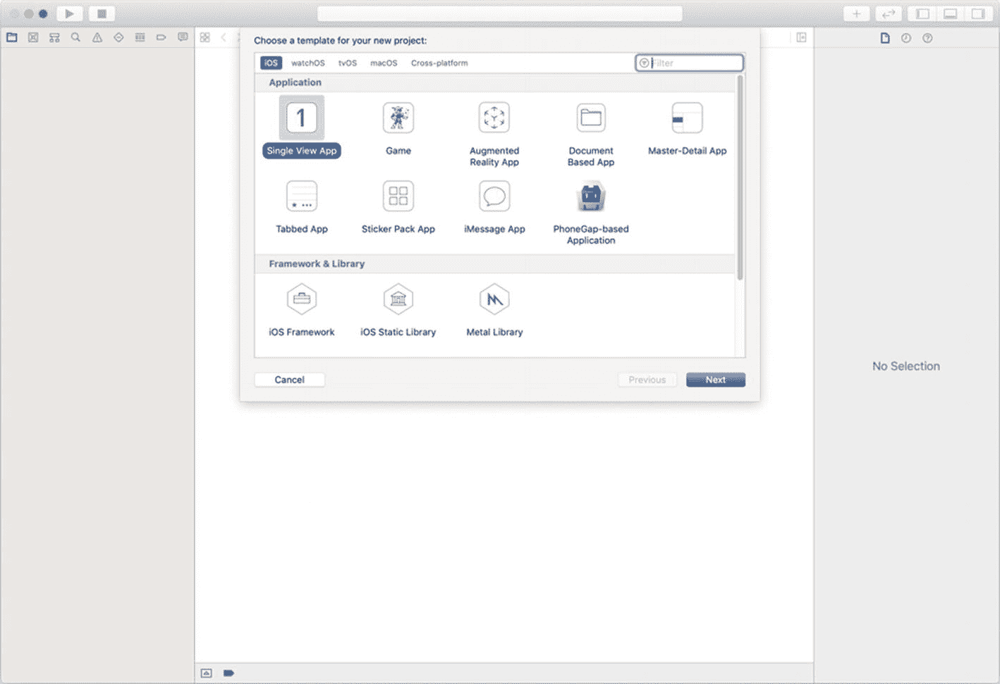

图 1-1

Xcode 中的新建项目窗口

点击“Next”按钮，然后在选项对话框中为你新项目命名，如图 1-2 所示。我将把这个新应用命名为 `FirstMapsApp`，并将其组织标识符设为 `com.buildingmobileapps.maps`，组织名称填写我的名字。

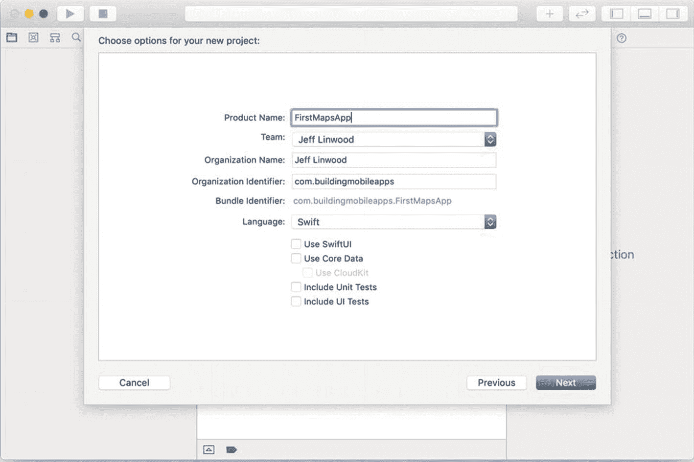

图 1-2

iOS 应用的新建项目选项

务必选择 Swift 作为语言。

对于这个项目，我们不会使用 SwiftUI——我们将使用 UIKit 作为应用程序框架。请勿勾选 SwiftUI 复选框。

我们不需要在项目中包含 Core Data——Core Data 是 Apple 用于在 iOS 上本地存储数据的技术，这个示例中我们不需要它。本书也不会使用 Core Data。

你还可以取消勾选“Include Unit Tests”和“Include UI Tests”，因为我们不会为这个项目设置任何测试。

点击“Next”，将项目保存到一个方便的位置。如果需要，你可以为代码创建 Git 仓库，但本书不会直接涉及源代码控制。随着项目进行，经常进行 Git 提交是一个好习惯，这样你可以轻松回滚到一个可用的版本。

保存项目后，Xcode 将打开你的项目并呈现应用的概览（图 1-3）。

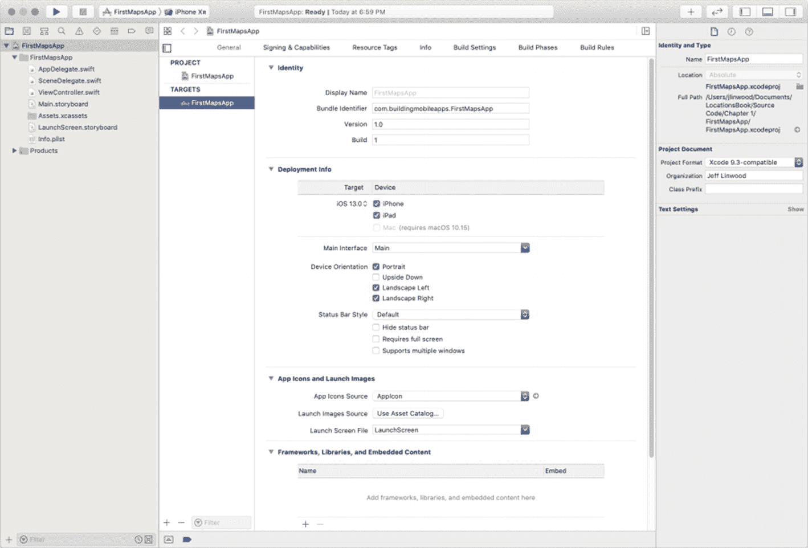

图 1-3

项目概览

你现在应该有了一个可用的 Xcode 项目——现在就在其中一个 iOS 模拟器中运行它，例如 iPhone XR（图 1-4）。

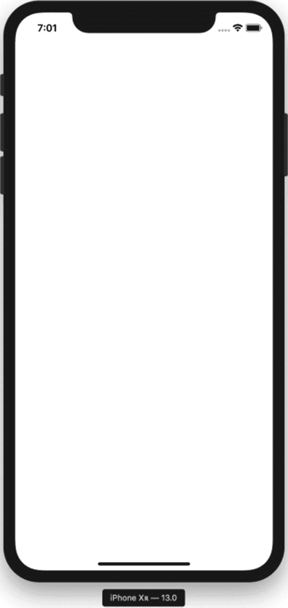

图 1-4

在模拟器中运行的新 iOS 应用

你应该会看到一个空白屏幕，因为我们还没有为应用编写任何代码。如果确实如此，那么你的开发环境已经设置好，可以继续本章剩余部分的内容了。


## 添加地图

现在，让我们在视图控制器中添加一个地图。在左侧选择故事板文件，即名为 `Main.storyboard` 的文件。故事板打开后，选择“视图控制器场景”。

在 Xcode 窗口的右上角，选择最左侧的“对象库”按钮（即上图中带有加号的按钮），如图 1-5 所示。

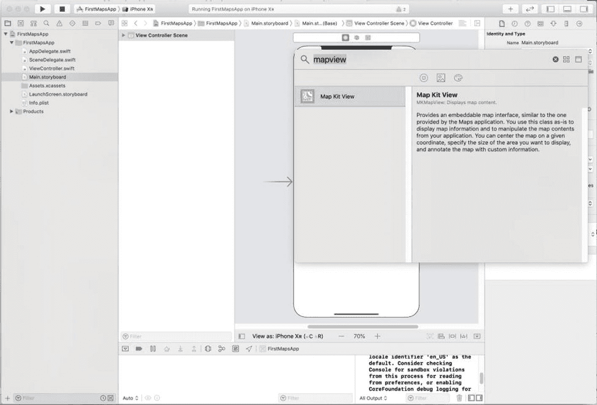

**图 1-5**  
从 Xcode 的对象库中选择 `MKMapView` 地图

你可以在列表下方的搜索框中输入“Map”，或者向下滚动直到找到“Map Kit View”。找到“Map Kit View”后，将其拖拽到你的视图控制器上（图 1-6）。

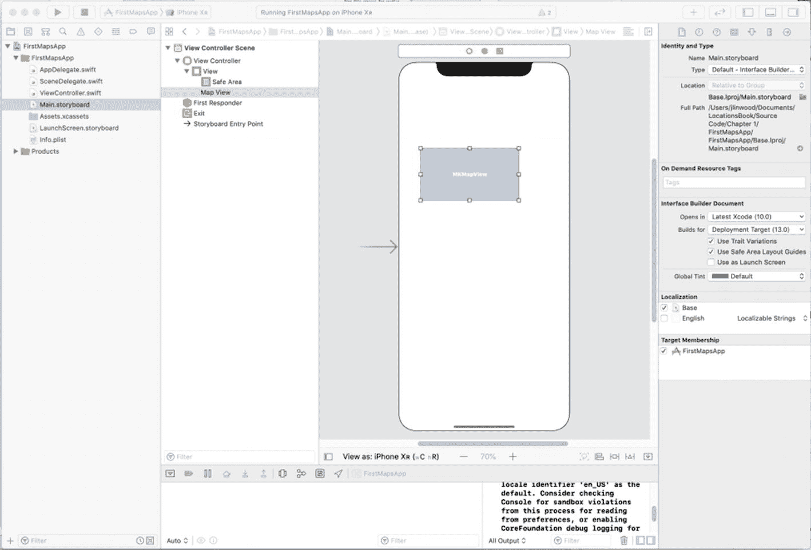

**图 1-6**  
故事板上的地图视图

地图视图不会自动扩展以填满整个屏幕，因此你需要手动拖拽地图视图的边缘，使其填满整个视图。在图 1-7 中，你可以看到地图视图如何填满顶部带有刘海屏的 iPhone XR 设备上的整个视图控制器。

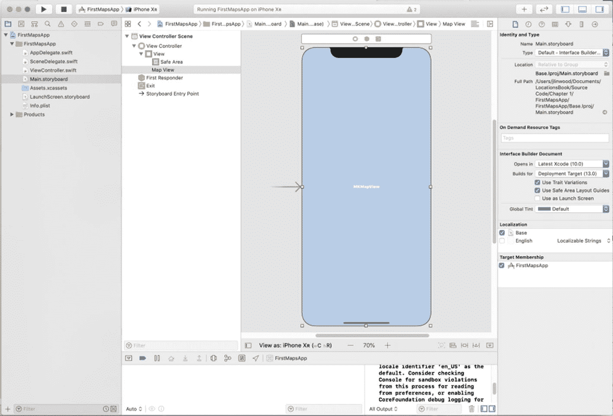

**图 1-7**  
地图视图填满视图

尽管我们将地图视图的边缘拖到了视图控制器视图的边缘，但这并不意味着地图视图会在所有尺寸的 iPhone 和 iPad 上使用整个屏幕。为了让地图视图填满视图控制器的视图（也称为其父视图），我们需要为地图视图添加约束。

在视图控制器下方的工具栏右侧，你会看到五个图标——第一个图标通常是灰色的。第三个图标（“添加新约束”）会打开“添加新约束”对话框，我们可以用它来进行布局。

取消勾选“约束到边距”复选框，因为我们打算用地图填满整个视图，不留任何边距。继续选择所有四个约束（顶部、底部、左侧和右侧）的淡红色虚线。选择后，确保所有值都为 0，然后点击“添加 4 个约束”按钮（图 1-8）。

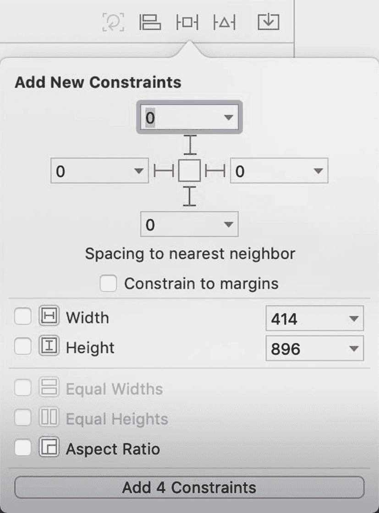

**图 1-8**  
为地图视图添加约束

现在，你的地图视图将正确填满 iPhone 或 iPad 的整个屏幕。如果你想要双重确认，可以在故事板上选择地图视图。接着，选择右侧的第五个图标“尺寸检查器”，你会看到地图视图的四个边都有约束。

现在尝试运行你的 iOS 应用，你会看到应用中有一张漂亮的大地图——如图 1-9 所示。

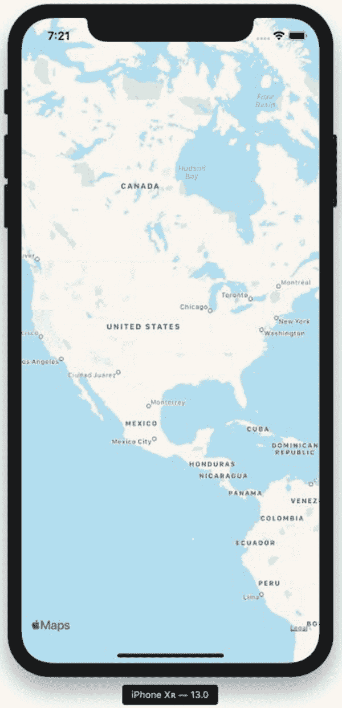

**图 1-9**  
一个带有全屏地图视图的 iOS 应用

让地图运行起来的过程相当直接，甚至无需编写任何 Swift 代码。

### 在地图上添加大头针

现在我们有了地图，是时候添加一个大头针来显示我们的家乡城市了！

在向地图添加大头针之前，我们需要使用 Xcode 的助理编辑器创建一个名为 `mapView` 的地图输出口。在 `Main.storyboard` 编辑器中打开时，从“编辑器”菜单中选择“助理”视图。你会看到 `ViewController` 类在故事板中打开，并显示在视图控制器旁边（图 1-10）。

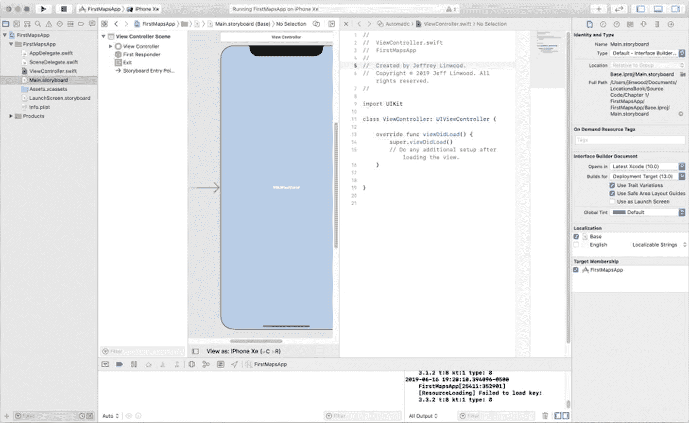

**图 1-10**  
Xcode 编辑器和助理视图

在故事板或大纲视图中选择地图视图，按住 Control 键，然后将一个输出口拖拽到 `ViewController` 类中，如图 1-11 所示。

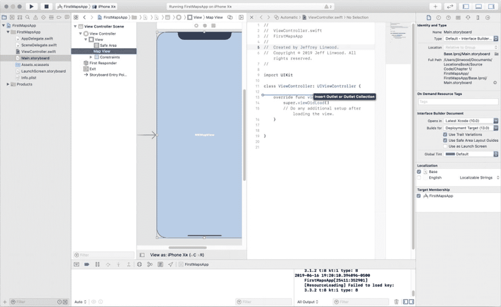

**图 1-11**  
创建输出口

创建输出口后，在出现的对话框中将其命名为 `mapView`（图 1-12）。

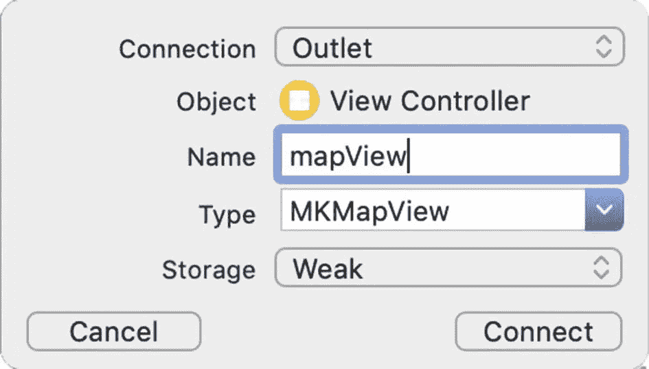

**图 1-12**  
命名输出口

你会注意到 `ViewController` 类将无法编译——这是因为我们的地图是一个 `MKMapView`，属于 `MapKit` 框架的一部分。我们需要将这个框架导入到我们的 `ViewController` 类中，以便使用 `MapKit` 框架中的类。否则，当我们尝试构建项目时，Xcode 会显示错误。

在 `import UIKit` 语句下方添加以下代码行，以导入 `MapKit` 框架。

```
import MapKit
```

除了地图本身，`MapKit` 框架还具有广泛的功能。使用 `MapKit`，我们将地图上的位置表示为标注。标注实现了 `MKAnnotation` 协议，该协议由一个纬度和经度坐标对以及可选的标题和副标题组成。`MapKit` 框架自带一个 `MKAnnotation` 的基本实现——`MKPointAnnotation` 类，但对于大多数应用，你可能会希望创建自己的 `MKAnnotation` 实现。在本章中，我们将使用 `MKPointAnnotation`，但本书后面的章节将使用我们自己的实现，以便你能看到两种方式的运作。

一旦你有了一个或多个标注，就可以使用 `MKMapView` 类上的 `addAnnotation()` 或 `addAnnotations()` 方法将其添加到地图上。

标注并不是地图显示的实际大头针——那些是标注视图，它们是 `MKAnnotationView` 类的子类。默认情况下，你会得到一个 `MKPinAnnotationView`，即你在许多地图应用中看到的红色大头针。你可以稍微自定义大头针的颜色，但对于大多数应用，你可能会想放入自己的自定义图像。我们将在本书接下来的章节中使用自己的自定义图像。

要创建一个 `MKPointAnnotation` 类型的标注，我们需要能够创建一个坐标，这可以通过 `CLLocationCoordinate2DMake()` 实现。在本章中，我们将把所有的代码添加到 `ViewController` 类的 `viewDidLoad()` 方法中。Xcode 在你创建新项目时已经为你生成了这个方法。

这个方法目前除了调用 `super.viewDidLoad()` 之外是空的。请保留这行代码在 `viewDidLoad()` 方法中，然后将以下代码放在它的下面。

传入纬度和经度（作为双精度值）来创建坐标。`MKPointAnnotation` 需要设置这个坐标，如下面的代码所示：

```
let austin = MKPointAnnotation()
austin.coordinate = CLLocationCoordinate2DMake(30.25, -97.75)
```

奥斯汀的经度将是负数，因为德克萨斯州的奥斯汀位于西半球。纬度是正数，因为该城市位于北半球。

要给标注添加标题，我们可以直接设置 `title` 属性。


```swift
austin.title = "Austin"
```

在设置`title`和坐标属性之后，我们可以调用地图视图上的一个方法来添加标注：

```swift
mapView.addAnnotation(austin)
```

运行这个类（如清单 1-1 所示），当你滚动地图到模拟器中的德克萨斯州时，你会看到 iPhone 应用显示奥斯丁的图钉。你可以继续将图钉改为你的城市或任何其他你想要的位置，也可以为不同地点添加更多图钉！

```swift
import UIKit
import MapKit
class ViewController: UIViewController {
    @IBOutlet weak var mapView: MKMapView!
    override func viewDidLoad() {
        super.viewDidLoad()
        // Do any additional setup after loading the view.
        let austin = MKPointAnnotation()
        austin.coordinate = CLLocationCoordinate2DMake(30.25, -97.75)
        austin.title = "Austin"
        mapView.addAnnotation(austin)
    }
}
```
**清单 1-1** 在地图视图上显示图钉的`ViewController`类

图 1-13 展示了带有奥斯丁图钉的 iPhone 应用。

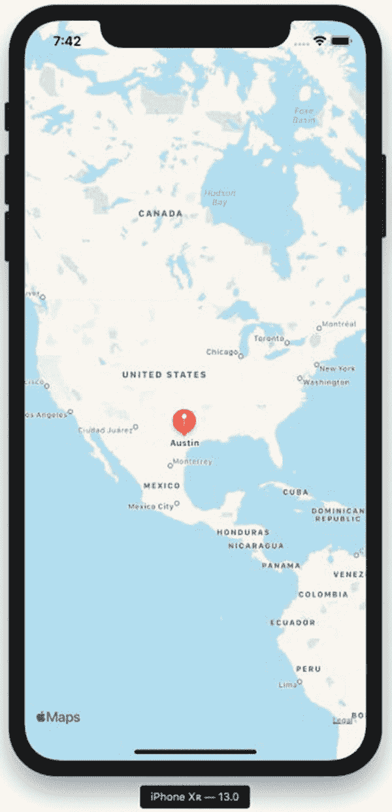

**图 1-13** 在地图上显示奥斯丁图钉的完整 iOS 应用

## 总结

我们现在创建了一个在 iOS 应用的地图上显示图钉的程序。在此过程中，我们介绍了`MapKit`框架、地图视图和标注。

在下一章中，我们将基于此处构建的基础地图应用进行扩展，在地图上显示用户的位置。如果你想尝试类似的项目，使用 Google Maps for iOS SDK 或 Mapbox SDK，请分别参阅第 7 章和第 11 章。

