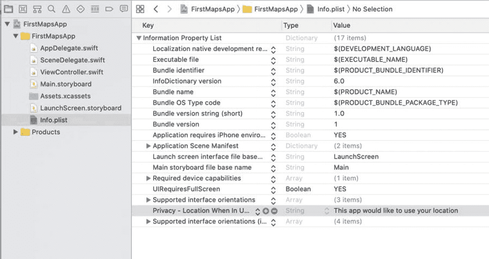
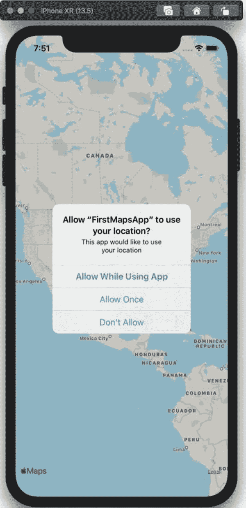
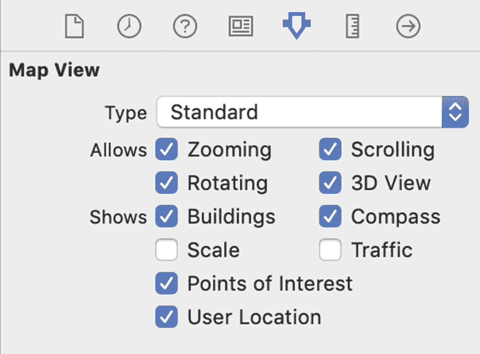
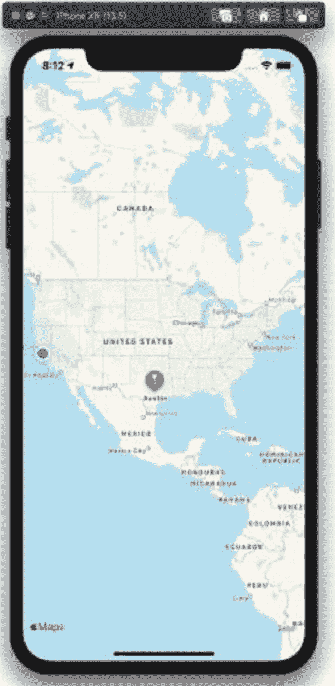

# 2. 获取用户位置

让我们进一步扩展应用，在地图上显示用户的位置。iOS 中的定位功能非常强大——你可以获取用户的当前位置，也可以随时间追踪用户位置的变化，在地图上显示其路径。为此，我们将使用`CoreLocation`框架以及之前讨论过的`MapKit`框架。

我们将为第 1 章的项目添加额外功能。该项目中`FirstMapsApp`已经包含了用于显示用户位置的地图视图。

## 隐私与位置权限

由于应用可以对用户的位置做很多处理，Apple 增加了对用户隐私的保护，作为应用开发者你需要了解这些保护措施。

iOS 应用可以请求权限，以在应用使用期间或后台使用用户的位置。当你在 iPhone 或 iPad 上使用基于位置的应用时，可能已经看到过这些弹出提示。如果你的应用没有令人信服的理由获取用户位置，用户很可能会拒绝授权。

如果你的应用需要在后台使用用户位置，iOS 会弹出确认提示，告知用户你的应用正在后台持续使用其位置，并询问是否继续提供位置信息。此时许多用户会关闭位置共享。

### Info.plist 中的位置权限设置

你的 iOS 应用需要在两个地方进行修改才能访问用户位置：`Info.plist`应用配置文件以及你的应用委托或视图控制器。根据应用需要的定位模式（使用期间或始终），`Info.plist`需要为一个或两个键设置值：

*   `NSLocationWhenInUseUsageDescription`
*   `NSLocationAlwaysAndWhenInUseUsageDescription`

这些设置可以通过 Xcode 的属性列表编辑器进行配置，因此你不需要直接以 XML 格式编辑`plist`文件。你也不需要记住这些确切的键定义——在属性列表编辑器中，相关描述列为`Privacy - Location When In Use Usage Description`和`Privacy - Location Always and When In Use Usage Description`。

在 Xcode 中选择`Info.plist`文件。属性列表编辑器将显示，如图 2-1 所示。



**图 2-1** `Info.plist` 中的位置隐私设置

任何文本都可以作为这些键的值——当应用向用户请求位置权限后，这些文本将显示给用户。继续在`Info.plist`中添加一行，将键设置为`Privacy – Location When In Use Description`，值设为“此应用希望使用您的位置”。这将引导我们进入本章的下一步——向用户请求权限。

## 向最终用户请求位置权限

既然你已经决定是在应用使用期间还是始终请求跟踪用户位置的权限，并在`Info.plist`中进行了相应配置，下一步就是通过编程方式向用户请求权限。这需要创建一个`CLLocationManager`对象，然后向用户请求相应的权限。

首先，你需要在视图控制器的顶部导入`CoreLocation`框架。接下来，我们将初始化一个位置管理器作为视图控制器的属性，以便在代码的其他方法中引用它。

```swift
import CoreLocation
```

在视图控制器的`viewDidLoad()`方法中，我们将在`CLLocationManager`对象上调用异步方法——`requestWhenInUseAuthorization()`或`requestAlwaysAuthorization()`，如清单 2-1 所示。在本例中，我们将请求“使用期间”授权，因为我们不会在后台使用用户的位置。

```swift
import UIKit
import MapKit
import CoreLocation
class ViewController: UIViewController {
    @IBOutlet weak var mapView: MKMapView!
    var locationManager: CLLocationManager!
    override func viewDidLoad() {
        super.viewDidLoad()
        // Do any additional setup after loading the view.
        let austin = MKPointAnnotation()
        austin.coordinate = CLLocationCoordinate2DMake(30.25, -97.75)
        austin.title = "Austin"
        mapView.addAnnotation(austin)
        locationManager = CLLocationManager.init()
        locationManager.requestWhenInUseAuthorization()
    }
}
```
**清单 2-1** 使用`CoreLocation`请求位置授权

将这些行添加到视图控制器后，运行应用时，你应该会看到类似图 2-2 所示的对话框出现。



**图 2-2** iOS 中的位置权限对话框

在允许或拒绝授权后，如果需要再次看到此对话框，你需要从手机或 iOS 模拟器中删除已编译的应用。


### 请求位置更新

如果用户已授权，下一步你的应用应该开始获取位置更新。为此，你需要实现 `CLLocationManagerDelegate` 协议中的一个方法——`locationManager(_:didChangeAuthorization:)`，我们将在扩展中完成。

扩展是一种围绕需要实现的协议来组织类中方法的方式。这有助于避免将所有屏幕代码放入视图控制器类所带来的代码组织结构问题。在此特定案例中，我们可以为 `CLLocationManagerDelegate` 协议创建一个扩展，并实现 `locationManager(_:didChangeAuthorization:)` 方法：

``` 
extension ViewController: CLLocationManagerDelegate {
func locationManager(_
manager: CLLocationManager,
didChangeAuthorization status: CLAuthorizationStatus) {
}
}
```

仅仅实现这个方法不会执行任何操作——你需要在调用 `viewDidLoad()` 方法请求授权之前，告诉你的位置管理器它有一个委托：

``` 
locationManager = CLLocationManager.init()
locationManager.delegate = self
locationManager.requestWhenInUseAuthorization()
```

最后，能够查看用户的状态会很不错——因此，我们为每种不同的位置授权状态实现一个 switch 方法。`ViewController` 类的代码在清单 2-2 中。

``` 
import UIKit
import MapKit
import CoreLocation
class ViewController: UIViewController {
@IBOutlet weak var mapView: MKMapView!
var locationManager:CLLocationManager!
override func viewDidLoad() {
super.viewDidLoad()
// 加载视图后进行任何其他设置。
let austin = MKPointAnnotation()
austin.coordinate = CLLocationCoordinate2DMake(30.25, -97.75)
austin.title = "Austin"
mapView.addAnnotation(austin)
locationManager = CLLocationManager.init()
locationManager.delegate = self
locationManager.requestWhenInUseAuthorization()
}
}
extension ViewController: CLLocationManagerDelegate {
func locationManager(_
manager: CLLocationManager,
didChangeAuthorization status: CLAuthorizationStatus) {
switch status {
case .authorizedWhenInUse:
print("已授权在使用时使用")
case .authorizedAlways:
print("已授权始终使用")
case .denied:
print("已拒绝")
case .notDetermined:
print("未确定")
case .restricted:
print("受限制")
@unknown default:
print("未知状态")
}
}
}
清单 2-2
从应用内显示位置授权状态
```

编译并运行此类后，你应该会看到来自位置授权状态的调试输出。它最初将显示 `Not Determined`，然后在选择允许或拒绝获取你的位置后，你将看到相应的状态。

所有这些都是使用用户位置的基本样板代码。让我们通过在**地图上显示用户的位置**来使其更真实一些！

### 在地图上显示用户的位置

打开 `Main.storyboard`，如果尚未选择，请在概览视图中选择地图。我们将需要通过 Xcode 在地图视图上设置一个属性。

选择第五个选项卡（属性检查器），如图 2-3 所示。在顶部，其中一个复选框将是“用户位置”——勾选该框。



图 2-3

地图视图上的“用户位置”复选框

就是这样！如果你在模拟器上运行，请确保向应用发送一个位置——该设置位于模拟器菜单的“功能”下，然后是“位置”。如果你想采用简单设置，请选择“Apple”，或者手动设置坐标。

继续运行应用程序——它应该看起来类似于图 2-4，并且蓝点会带有动画效果。



图 2-4

地图上的用户位置

要在地图上获得一个漂亮的动画用户位置，你真正需要做的就是这些。尽管它只是地图视图上的一个复选框，但你仍然需要在视图控制器中实现所有的 `CoreLocation` 框架隐私和权限代码。

## 小结

我们已经讨论了用户的位置隐私，以及如何使用 `CoreLocation` 框架向应用程序的最终用户请求授权。你还了解了在 iOS 的 `MapKit` 地图上显示用户位置是多么容易。

在下一章中，我们将在 `MapKit` 应用程序上显示兴趣点，并使用标注自定义每个点的显示。

