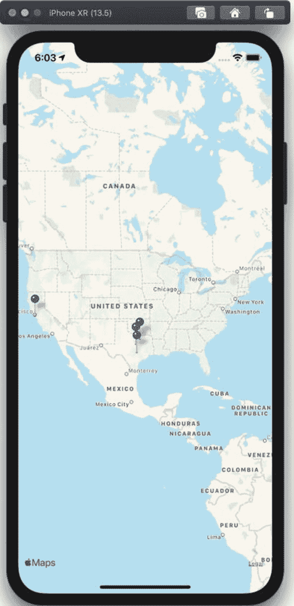
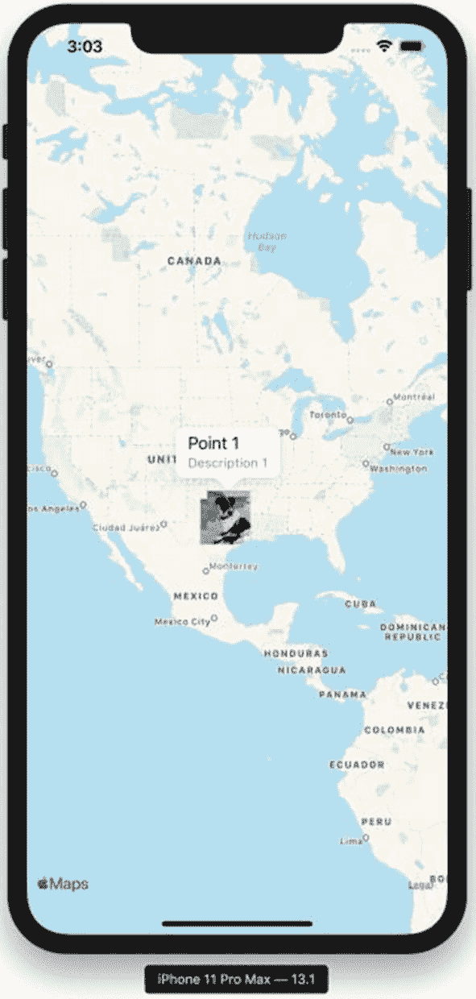

# 3. 在 MapKit 地图上显示标注

在第 1 章中，你的第一个 iOS 地图应用程序在地图上显示了一个点，并在其位置使用了默认的红色图钉。`MapKit` 框架在显示标注方面的能力远不止于此。我们可以自定义标注的图像以及用户点击标注时看到的弹出视图。

让我们继续基于第 1 章中创建的 `FirstMapsApp` 项目进行构建，然后在第 2 章中添加了用户位置。

## 理解 MapKit 和标注

`MapKit` 框架区分了标注（地图上显示的数据）和标注视图（在地图上给定坐标处为标注显示的用户界面元素）。虽然 `MapKit` 提供了 `MKPointAnnotation` 类用于基本点显示，但大多数地图应用程序会使用 `MKAnnotation` 协议的自定义实现。

类似地，`MapKit` 也包含了 `MKPinAnnotationView` 和 `MKMarkerAnnotationView` 类，用于在应用程序上显示图钉或标记。`MKAnnotationView` 类用于显示你自己的自定义图像。你可以继承 `MKAnnotationView` 类或直接使用它。

`MKMapViewDelegate` 协议上的 `mapView(_:viewFor:)` 函数允许你的应用程序将 `MKAnnotationView` 对象映射到 `MKAnnotation` 对象。由于 `MKPointAnnotation` 类的数据字段有限，使用你自己的 `MKAnnotation` 实现能提供最大的灵活性。

## 使用自定义标注类

实现你自己的标注类很简单——你需要继承 `NSObject` 类，然后实现 `MKAnnotation` 协议。

`MKAnnotation` 协议的 `title` 和 `subtitle` 属性是 `String` 可选类型。`coordinate` 属性稍微复杂一些，因为 `MapKit` 要求它支持键值观察（KVO）。实际上，这意味着它不是一个简单的 `var` 声明，而是你还需要声明它使用与 Objective-C 运行时的动态调度。你的代码声明如下所示：

``` 
@objc dynamic var coordinate: CLLocationCoordinate2D
```

一个包含 `init` 方法的基本自定义标注类，看起来像清单 3-1。

``` 
import UIKit
import MapKit
class MapPoint: NSObject, MKAnnotation {
@objc dynamic var coordinate: CLLocationCoordinate2D
var title:String?
var subtitle: String?
init(coordinate:CLLocationCoordinate2D,
title:String?, subtitle:String?) {
self.coordinate = coordinate
self.title = title
self.subtitle = subtitle
}
}
清单 3-1
在 Swift 中的标注类的实现
```

我们将在本章过程中使用这个 `MapPoint` 类，然后再对其进行扩展。对于你的特定应用程序，你可能会为此标注类添加额外的字段。继续在 Xcode 项目中创建一个名为 `MapPoint.swift` 的新文件，并添加清单 3-1 中的代码。


## 显示自定义标注

由于 `MapPoint` 类实现了 `MKAnnotation` 协议，你的代码只需构建新的 `MapPoint` 对象，然后将它们作为标注添加到地图视图上。

我们将在地图上创建两个点，并设置通用的标题和副标题。将清单 3-2 中的代码添加到 `ViewController` 类的 `viewDidLoad()` 方法末尾。

```
let point1 = MapPoint(
coordinate: CLLocationCoordinate2D(latitude: 33.0,
longitude: -97.0),
title: "Point 1",
subtitle: "Description 1"
)
mapView.addAnnotation(point1)
let point2 = MapPoint(
coordinate: CLLocationCoordinate2D(latitude: 32.0,
longitude: -98.0),
title: "Point 2",
subtitle: "Description 2"
)
mapView.addAnnotation(point2)
清单 3-2
在地图视图上显示自定义标注
```

添加这段代码并运行项目后，你不会看到与之前章节有太大区别。我们还没有自定义标注的视图。

## 自定义标注的图钉

更改每个标注显示视图的最简单方法是使用 `MKPinAnnotationView` 类。你的代码可以在 `mapView(_:viewFor:)` 函数中设置图钉颜色。此函数来自 `MKMapViewDelegate`，因此你需要将地图视图的委托设置为自定义类或当前视图控制器。为方便本章讲解，我们将为视图控制器类创建一个实现 `MKMapViewDelegate` 协议的扩展，然后在 `viewDidLoad()` 方法中通过代码设置地图视图的委托。

将以下代码行添加到 `viewDidLoad()` 方法中，用于设置地图视图委托（如果你愿意，也可以在故事板中进行设置）：

```
mapView.delegate = self
```

接下来，在视图控制器类的底部添加一个实现地图视图委托的扩展。我们将在此扩展中添加 `mapView(_:viewFor:)` 函数：

```
extension ViewController:MKMapViewDelegate {
}
```

`mapView(_:viewFor:)` 函数为给定的 `MKAnnotation` 实例返回一个 `MKAnnotationView`。我们将创建一个图钉标注视图，然后通过将图钉颜色设置为蓝色来进行一些自定义，如清单 3-3 所示。

```
extension ViewController:MKMapViewDelegate {
func mapView(_ mapView: MKMapView,
viewFor annotation: MKAnnotation) ->
MKAnnotationView? {
let pin = MKPinAnnotationView(
annotation: annotation,
reuseIdentifier: "Pin")
pin.pinTintColor = UIColor.blue
return pin
}
}
清单 3-3
使用图钉标注视图
```

添加此代码后，你应该会看到蓝色图钉出现在美国德克萨斯州的地图上，如图 3-1 所示。如果你完成了第 2 章并以该章为基础，那么你的用户位置上方也会出现一个蓝色图钉。当然，你也可以自由调整添加到自己所在位置的地图点！



图 3-1

将标注更改为显示为蓝色图钉

既然我们已经演示了基本的视图标注功能，接下来让我们继续学习一些更高级的功能。首先要改变的是用户位置现在显示为一个图钉。

## 处理用户位置

我们通常希望保持用户位置显示为默认的脉动蓝点。在代码中，我们可以检查我们提供视图的标注是否是 `MKUserLocation` 标注（即用户的当前位置）：

```
if annotation is MKUserLocation {
return nil
}
```

此检查通常会在 `mapView(_:viewFor:)` 函数的开头进行。当你返回 `nil` 时，地图会显示默认的标注视图。

将 `MKUserLocation` 检查添加到 `mapView(_:viewFor:)` 方法的开头，然后再次运行项目——用户位置（如果你启用了定位服务）将显示为发光的蓝点，而不是一个图钉。

## 复用标注视图

虽然这段代码可以工作，但它仍有改进空间。类似于表视图和可复用的表视图单元格，地图视图也支持可复用的标注。

在处理标注视图时，使用复用标识符非常重要。这允许地图视图在用户滚动地图时回收视图对象。一些标注将移出地图的可见矩形区域，而这些视图可以被回收，用于现在可见的标注。复用这些标注视图可以实现平滑滚动，尤其是在处理大量标注时。

`MKMapView` 类有一个 `dequeueReusableAnnotationView()` 函数，它接受一个复用标识符作为参数。如果复用队列中有一个标注视图在等待，你将获得那个实例。你需要对该标注视图进行的任何自定义（例如，将标注设置为当前标注）都应在检查实例是否可用的 `if let` 块内完成。

如果复用队列中没有可用的实例，你将需要创建一个标注视图并正确配置它。

我们可以通过在有可用视图时进行复用来改进清单 3-3 中的标注视图代码。用清单 3-4 中的代码替换你在地图视图委托扩展中创建的方法。我们还添加了对 `MKUserLocation` 标注的检查。

```
func mapView(_ mapView: MKMapView, viewFor annotation: MKAnnotation)
-> MKAnnotationView? {
if annotation is MKUserLocation {
return nil
}
let reuseId = "Pin"
var pin: MKPinAnnotationView
if let reusedPin =
mapView.dequeueReusableAnnotationView(
withIdentifier: reuseId)
as? MKPinAnnotationView {
pin = reusedPin
pin.annotation = annotation
} else {
pin = MKPinAnnotationView(annotation: annotation,
reuseIdentifier: reuseId)
pin.pinTintColor = UIColor.blue
}
return pin
}
清单 3-4
复用标注视图
```

虽然这段代码比之前的代码清单更复杂，但如果你在地图上显示了许多标注，滚动地图将会流畅得多。

## 出队和创建标注视图

我们可以通过让地图视图自动为我们出队一个可复用的标注视图或创建一个新的标注视图，来简化清单 3-4 中的代码。你的代码需要使用 `MKMapView` 类的 `registerClass:forAnnotationViewWithReuseIdentifier:` 函数，将标注视图类与地图视图的复用标识符进行注册。我们的代码将在 `viewDidLoad()` 方法中使用以下代码行：

```
mapView.register(MKPinAnnotationView.self, forAnnotationViewWithReuseIdentifier: "Pin")
```

将图钉标注视图类注册到地图视图后，我们可以从在 `MKMapViewDelegate` 扩展中实现的 `viewFor()` 方法中移除图钉标注视图的创建代码。这将得到清单 3-5 中更简单的实现。

```
override func viewDidLoad() {
...
mapView.register(MKPinAnnotationView.self,
forAnnotationViewWithReuseIdentifier: "Pin")
}
func mapView(_ mapView: MKMapView,
viewFor annotation: MKAnnotation) -> MKAnnotationView? {
if annotation is MKUserLocation {
return nil
}
let reuseId = "Pin"
if let pin = mapView.dequeueReusableAnnotationView(
withIdentifier: reuseId)
as? MKPinAnnotationView {
pin.annotation = annotation
pin.pinTintColor = UIColor.blue
return pin
} else {
return nil
}
}
清单 3-5
将标注视图类注册到地图视图后，简化的标注复用与创建
```

这极大地清理了我们的代码，并且如果我们的地图上有多种类型的标记，也将使我们能够轻松地添加额外的标注视图类型。


好的，作为高级文档工程师和翻译员，我将严格遵守您的要求，对给定文本进行翻译。


## 在标注视图上设置图像

你的一些地图应用想法使用内置的大头针或标记标注视图类可能就足够了。然而，你很可能需要使用 `MKAnnotationView` 类，以便设置你自己的图像。

我们将略微修改代码，为狗狗公园创建标注视图。复用标识符将是 `“DogPark”`，并且在我们的 iOS 应用资源中，还会有一张狗狗在公园里的图像。这张图像也将被命名为 `“DogPark”`。你需要下载自己的图像并将其放入 Xcode 项目的资源中，这样你才有内容可以显示。

在 `viewDidLoad()` 函数中，添加以下代码：

```
mapView.register(MKAnnotationView.self, forAnnotationViewWithReuseIdentifier: "DogPark")
```

接下来，修改 `viewFor()` 函数的内容。这段代码已被简化，因为我们不再需要向下转换出队的标注视图。我们也可以简单地从这个函数返回可选值。我们做的唯一其他修改是在标注视图上设置 `UIImage`，而不是更改大头针的色调颜色。完整的更改如代码清单 3-6 所示。

```
func mapView(_ mapView: MKMapView,
viewFor annotation: MKAnnotation)
-> MKAnnotationView? {
if annotation is MKUserLocation {
return nil
}
let reuseId = "DogPark"
let view = mapView.dequeueReusableAnnotationView(
withIdentifier: reuseId)
view?.annotation = annotation
view?.image = UIImage(named:"DogPark")
return view
}
代码清单 3-6 在标注视图上使用图像
```

在你用代码清单 3-6 替换掉将可复用大头针标注视图出队的代码后，运行项目。你将看到狗狗公园的图像代替了你的大头针。

## 为标注使用标注弹窗

为你的标注使用了自定义图像后，很可能当用户点击你的标注时，你希望显示一个标注弹窗。`MKAnnotationView` 的 `canShowCallout` 属性控制是否显示该弹窗。在为标注创建视图时，添加以下一行代码：

```
view?.canShowCallout = true
```

然后运行你的应用程序。点击一个标注后，你将看到一个弹出窗口，其中显示你设置的标题和副标题，如图 3-2 所示。



图 3-2 为标注使用图像和标注弹窗

如你所见，在地图上显示标注的方式是极其可定制的。尝试根据某个数据点为每个标注更换不同的图像，或者尝试将其中一些显示为图像，另一些显示为大头针。

## 总结

在本章中，我们以第 1 章的地图基础知识为基础，定制了地图上显示的标记。我们了解了如何使用可复用的标注视图来提高包含大量标记的地图的性能。

在下一章中，我们将讨论如何使用 Apple 的本地搜索功能，从其数据库中为你的地图提供兴趣点。

