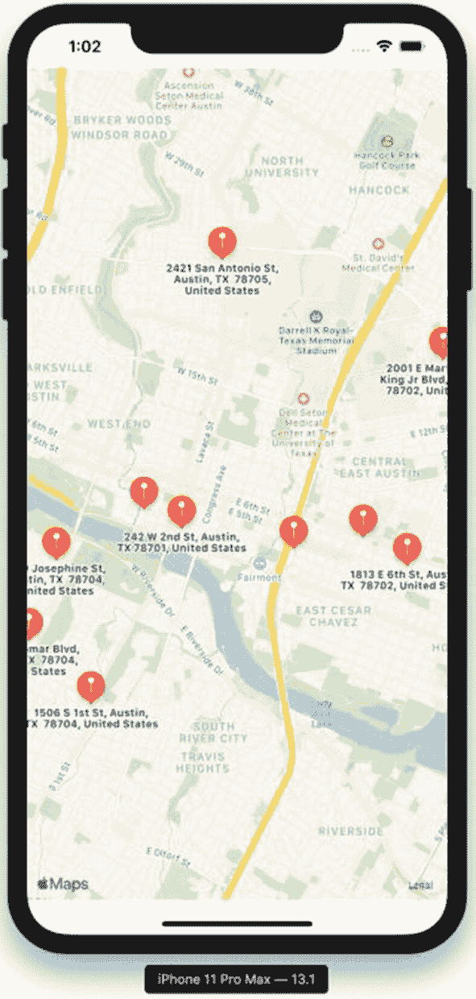
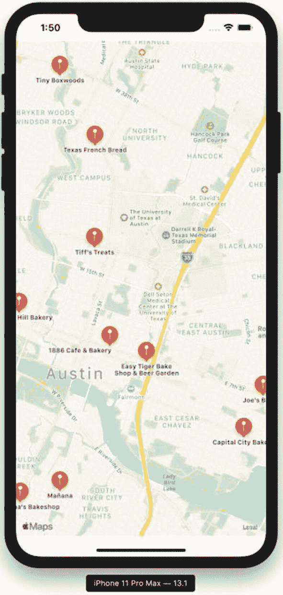

# 搜索兴趣点

Apple 拥有自己的地点和地址数据库，你可以将其用于你的 iOS 应用程序。你的代码可以调用 `MKLocalSearch` 类的实例来获取兴趣点，然后你可以将它们显示在地图视图上。这使得根据地图当前显示的地理区域实现搜索功能变得很容易。

在 Xcode 中使用“单视图应用程序”模板创建一个新的 Swift iOS 项目。将你的应用程序命名为 `SearchingForPointsOfInterest`。继续在故事板中为唯一的屏幕添加一个地图视图，并将其连接到 `ViewController` 类上一个名为 `mapView` 的插座。如果尚未导入，请同样导入 `MapKit` 框架。这些是我们在前几章中遵循的步骤，因此应该相当简单。

## 本地搜索入门

苹果为 MapKit 提供的本地搜索功能并非一个可以通过 HTTP 请求调用的 Web API，这与你在应用程序中可能使用的其他集成不同。苹果提供了两个辅助类——`MKLocalSearch` 和 `MKLocalSearch.Request`——来处理本地搜索。使用 `MKLocalSearch.Request` 实例来定义搜索内容，然后使用 `MKLocalSearch` 来执行请求并返回结果。

第一步是构建搜索请求：

```
let searchRequest = MKLocalSearch.Request()
```

搜索请求对象有四个不同的属性，你可以用它们来过滤结果：

- `naturalLanguageQuery` – 这是服务将用来查找结果的一个词或短语，例如 `“公园”` 或 `“艺术博物馆”`。
- `region` – 这是一个地图区域，通常是当前屏幕上的地图区域——可用于将搜索结果限制在一个地理位置内。
- `pointOfInterestFilter` – 仅显示与 `MKPointOfInterestCategory` 结构体中一个或多个不同类别匹配的兴趣点。例如，海滩、餐馆和商店都是不同的类别。
- `resultTypes` – 本地搜索可以返回地址、兴趣点，或者两者都返回。

并非所有这些属性都需要设置才能使用本地搜索——通常你的地图应用会使用 `naturalLanguageQuery` 和 `region`。如果你没有设置区域，本地搜索将使用设备的位置进行搜索。你不需要请求位置权限就能使用本地搜索。

如果我们在搜索请求上设置了自然语言查询，代码将如下所示：

```
searchRequest.naturalLanguageQuery = "coffee"
```

搜索请求对象描述了我们想要进行的搜索——`MKLocalSearch` 对象将执行搜索。运行搜索有两个步骤——使用搜索请求对象创建 `MKLocalSearch` 实例，然后在本地搜索上调用 `start` 方法。代码清单 4-1 包含了这些步骤的示例。

使用我们之前创建的 `MKLocalSearch.Request` 对象，初始化一个 `MKLocalSearch` 实例看起来像这样：

```
let search = MKLocalSearch(request: searchRequest)
```

`start` 方法接受一个完成处理程序作为其唯一参数。该完成处理程序将在你的 iOS 应用程序的主线程上运行，并带有两个可选参数——一个 `MKLocalSearch.Response` 类型的响应和一个 `Error` 类型的错误。

响应将包含一个 `MKMapItem` 地图项数组，其中包含搜索结果，以及一个包含所有结果的地图区域。如果你想显示所有结果，你可以将屏幕上的地图视图设置为新的区域；或者，如果你有另一种搜索结果展示方式（例如列表），你可以让用户自己滚动查找结果。

```
let searchRequest = MKLocalSearch.Request()
searchRequest.naturalLanguageQuery = "coffee"
let search = MKLocalSearch(request: searchRequest)
search.start { (response, error) in
guard let response = response else {
print("搜索时出错 - 无响应")
if let error = error {
print("错误: \(error.localizedDescription)")
} else {
print("未指定错误")
}
return
}
for mapItem in response.mapItems {
print(mapItem.name ?? "未指定名称")
}
}
代码清单 4-1 使用 MKLocalSearch 搜索兴趣点
```

使用 `guard let` 检查回调中是否提供了响应，这允许你向用户显示错误信息。对于此代码，结果将在调试控制台中看到，但你也可以向用户显示一条警告消息。


## 探索响应中的地图项

本地搜索结果将由 `MKMapItem` 对象组成。结果中的每个地图项都是一个兴趣点，并在地标对象中包含位置和地址信息、兴趣点类别，以及（如果可用）地图项的名称、电话号码、URL 和时区。这些 `MKMapItem` 对象也用于导航和路线规划，正如我们将在第 5 章中看到的那样。

地标对象来自 `MKPlacemark` 类，包含纬度、经度和街道地址信息。这些地标实现了第 3 章中讨论的 `MKAnnotation` 协议。这意味着你可以直接将地标添加到地图视图以显示结果。

## 在地图上显示搜索结果

现在你已经了解了地图项和标注之间的关系，就很容易理解如何将这些搜索结果显示在地图视图上。在尝试此代码之前，请确保你的故事板（storyboard）上有一个地图视图，并且 `ViewController` 类中有一个名为 `mapView` 的插座（outlet）变量。

之前的代码列表已增强以与地图视图配合使用——更改部分在以下代码列表中已加粗显示。

```
let searchRequest = MKLocalSearch.Request()
searchRequest.naturalLanguageQuery = "coffee"
searchRequest.region = mapView.region
let search = MKLocalSearch(request: searchRequest)
search.start { (response, error) in
    guard let response = response else {
        print("Error searching - no response")
        if let error = error {
            print("Error: \(error.localizedDescription)")
        } else {
            print("No error specified")
        }
        return
    }
    for mapItem in response.mapItems {
        self.mapView.addAnnotation(mapItem.placemark)
    }
    self.mapView.setRegion(response.boundingRegion, animated: true)
}
```

**代码清单 4-2** 在地图上显示搜索结果

上述代码列表中的更改实现了几个功能。第一个更改是将搜索请求中使用的区域设置为当前地图视图中显示的区域。第二个更改是将地图项的地标添加为标注，而不是将名称打印到调试控制台。最后一个更改是将地图视图上可见区域的边界设置为包含所有搜索结果的区域。

创建一个名为 `showCoffeeOnMap()` 的新函数，并将代码清单 4-2 中的代码放入此函数中。然后，在你的 `ViewController` 类的 `viewDidLoad()` 函数中调用这个新函数。继续在模拟器或你的设备上运行此应用程序。根据你所在地区售卖的咖啡数量，你应该会看到类似以下截图的搜索结果。



**图 4-1** 在地图视图上显示搜索结果

## 为结果创建标注

直接将地标添加为标注的一个缺点是，Apple 会使用地标的街道地址作为标注的标题，而不是使用地图项中的名称。这不是最佳的用户体验，因此让我们稍微修改一下代码，为每个地图项创建一个新的标注，如代码清单 4-3 所示。

```
for mapItem in response.mapItems {
    let annotation = MKPointAnnotation()
    annotation.coordinate = mapItem.placemark.coordinate
    annotation.title = mapItem.name
    annotation.subtitle = mapItem.phoneNumber
    self.mapView.addAnnotation(annotation)
}
```

**代码清单 4-3** 为每个搜索结果创建一个标注

将现有的 `for` 循环替换为上面的代码块，你将看到咖啡店的名称，而不仅仅是街道地址。

## 使用兴趣点类别进行过滤

Apple 的搜索能够很好地处理自然语言查询，无论你搜索的是通用内容还是更具体的内容。但是，如果你的应用会在 Apple 已定义的类别中查找兴趣点，那么使用兴趣点过滤器将改善用户体验。

使用 `MKPointOfInterestFilter` 类的实例在搜索请求上设置兴趣点过滤器。此过滤器是 iOS 13 中的新功能，在早期版本的 iOS 中不可用。创建兴趣点过滤器时，你有两种选择——你可以创建一个仅包含一个或多个类别的过滤器，或者创建一个排除一个或多个类别的过滤器。通常，你可能会使用包含过滤器，但如果你的搜索结果被来自不适合你应用的类别的无关结果填充，那么排除类别当然也很容易。

`MKPointOfInterestCategory` 结构体定义了你可以使用的所有不同类别。部分列表如下：

- 机场
- 游乐园
- 水族馆
- ATM 机
- 面包房
- 银行
- 海滩
- 啤酒厂

以此类推，直至动物园类别。如你所见，如果你正在构建一个依赖本地搜索的应用，这些过滤器可能非常有用。

要将 `MKPointOfInterestFilter` 类与 `MKLocalSearch.Request` 搜索请求一起使用，你只需设置 `pointOfInterestFilter` 属性。例如，要搜索本地面包房，请使用以下代码：

```
searchRequest.pointOfInterestFilter = MKPointOfInterestFilter(including: [.bakery])
```

如果我们将此兴趣点过滤器与前面的代码列表（该代码从本地搜索地图项结果创建标注）结合，然后移除自然语言查询字符串，我们将得到一个看起来像代码清单 4-4 的函数。

```
let searchRequest = MKLocalSearch.Request()
searchRequest.pointOfInterestFilter = MKPointOfInterestFilter(including: [.bakery])
searchRequest.region = mapView.region
let search = MKLocalSearch(request: searchRequest)
search.start { (response, error) in
    guard let response = response else {
        print("Error searching - no response")
        if let error = error {
            print("Error: \(error.localizedDescription)")
        } else {
            print("No error specified")
        }
        return
    }
    for mapItem in response.mapItems {
        let annotation = MKPointAnnotation()
        annotation.coordinate = mapItem.placemark.coordinate
        annotation.title = mapItem.name
        annotation.subtitle = mapItem.phoneNumber
        self.mapView.addAnnotation(annotation)
    }
    self.mapView.setRegion(response.boundingRegion, animated: true)
}
```

**代码清单 4-4** 使用地图标注的类别过滤器

在你的 iOS 应用上运行此代码将产生与此截图类似的结果，具体取决于你所在区域的面包房数量。



**图 4-2** 来自带有标注的类别过滤器的兴趣点

处理本地搜索相当直接，因为 Apple 提供的 `MKLocalSearch` 类没有分页搜索结果等高级功能。从搜索结果中的地图项创建自己的标注通常是最合理的做法。利用第 3 章中的技术，你可以创建自定义标注视图，例如，以匹配兴趣点的类别。

在下一章中，我们将使用 Apple 的导航 API 来创建驾车或步行路线。导航 API 也使用 `MKMapItem` 类，我们将探讨本章未涉及的地图项的其他功能，例如用户位置以及在 Apple 地图应用中打开地图项。


