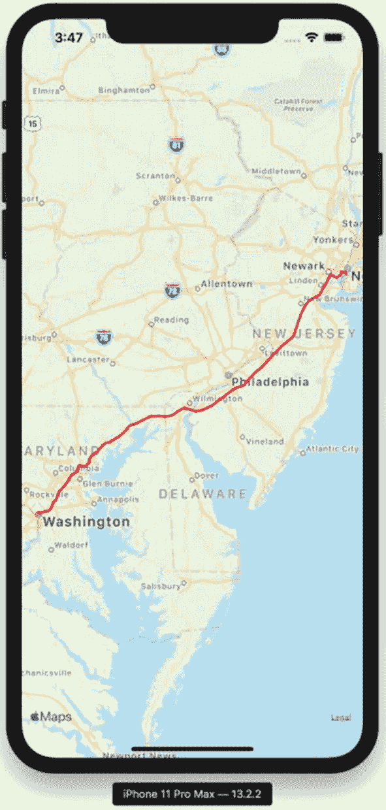
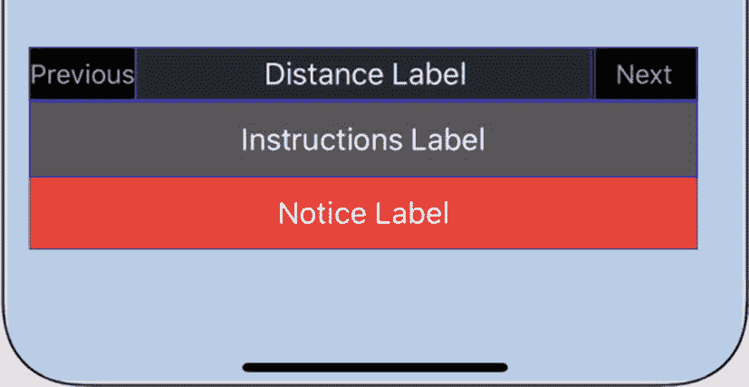
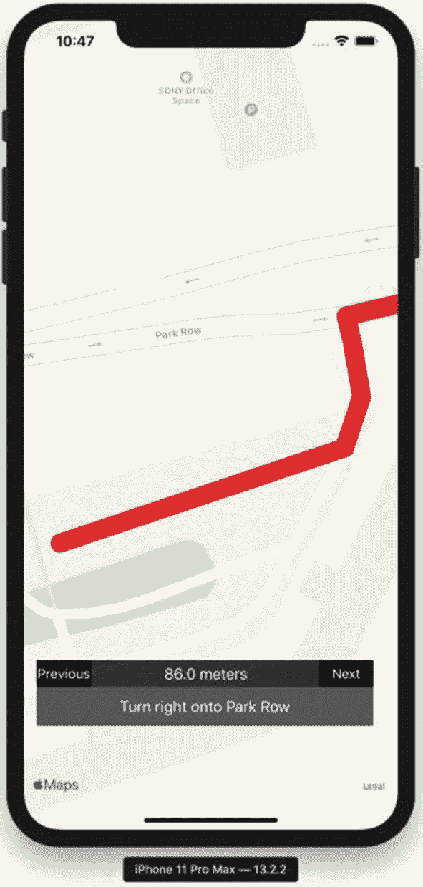

# 5. 使用 MapKit 获取路线指引

借助 MapKit，在应用程序内提供一个地点到另一个地点的步行或驾车路线指引变得非常简单。你也可以指示 Apple 地图应用打开并为用户规划路线——如果你认为用户可能更倾向于使用专用应用，这将非常有用。

在 Xcode 中使用“单视图应用程序”模板创建另一个 Swift iOS 项目。将你的应用命名为 `DirectionsMapKitApp`。继续操作，在故事板的唯一屏幕中添加一个地图视图，并将其连接到 `ViewController` 类上一个名为 `mapView` 的出口。在视图控制器中，除了 `UIKit`，还要导入 `MapKit` 框架。

如果你愿意，也可以复用前面章节中的某个项目，因为这些项目已经配置好了地图视图。

## 理解 Directions API

与本地搜索类似，Directions API 并不是一个公开可用的 REST API。相反，Apple 的路线功能是通过 `MapKit` 类来访问的。如果你的应用有网页版，Apple 也通过适用于 JavaScript 的 `MapKit` 提供了路线功能，但该产品超出了本书的讨论范围。

要使用 Directions API，你需要使用 `MKDirections` 类的一个实例。用一个 `MKDirections.Request` 对象初始化该实例，该对象指定了你想要请求的路线，然后通过 `calculate()` 或 `calculateETA()` 方法向 Apple 服务器发起异步调用。`calculate()` 方法接受一个完成处理程序作为回调，该回调接收 `MKDirections.Response` 对象或 `Error` 对象。

响应中将包含一个或多个要遵循的路线。通常，你可能只想请求一条路线，但你可以在路线请求中请求备选路线——这样做的话，如果有任何备选路线，你将获得多条路线。

这些路线是 `MKRoute` 对象，它们包含一些对向用户显示路线有用的信息——路线几何形状（可以作为叠加层添加到地图视图）、一个路线步骤列表（作为 `MKRouteStep` 对象）、总距离以及预计行程时间。

让我们通过一个简单的驾车路线示例来说明这些类是如何协同工作的。

## 开始使用路线功能

我们首先需要创建一个路线请求对象。在你的视图控制器类中创建一个名为 `getDirections()` 的新方法，然后在你的 `viewDidLoad()` 方法中调用该方法。在 `getDirections()` 方法中添加以下代码行来创建一个路线请求对象：

```
let request = MKDirections.Request()
```

本章本节的所有代码都完整地列在代码清单 5-1 中。

`MKDirections.Request` 可以接受一个起点和一个终点——两者都需要是 `MKMapItem` 对象。我们在第 4 章中讨论过 `MKMapItem` 类。你当然可以使用来自本地搜索的 `MKMapItem` 实例，也可以从 `MKPlacemark` 实例创建你自己的 `MKMapItem` 对象。地标可以通过 Core Location 坐标创建。

我们需要为起点和终点都执行此操作。由于存在一些可重复的代码，我们可以将其抽象为一个辅助函数：

```
func createMapItem(latitude:Double,
longitude:Double) -> MKMapItem {
let coord = CLLocationCoordinate2D(
latitude: latitude,
longitude: longitude)
let placemark = MKPlacemark(coordinate: coord)
return MKMapItem(placemark: placemark)
}
```

有了这个辅助函数后，为起点和终点属性创建地图项的代码如下所示，你可以将其添加到 `getDirections()` 方法中：

```
request.source = createMapItem(latitude: 40.7128, longitude: -74)
request.destination = createMapItem(latitude: 38.91, longitude: -77.037)
```

这些坐标恰好是纽约市（作为起点）和华盛顿特区（作为终点）。你可以随意用自己的起点和终点替换这些坐标，只要它们之间可以驾车通行即可。

路线请求需要一个交通类型。这些交通类型在 `MKDirectionsTransportType` 结构体中枚举，包括：

- `MKDirectionsTransportType.automobile`
- `MKDirectionsTransportType.walking`
- `MKDirectionsTransportType.transit`
- `MKDirectionsTransportType.any`

通常，你会指定 automobile、walking 或 transit 其中之一，类似于 Apple 地图 iOS 应用。在你的 `getDirections()` 函数中，添加以下代码行：

```
request.transportType = .automobile
```

在用起点、终点和交通类型设置好路线请求后，你可以从此路线请求创建一个 `MKDirections` 对象：

```
let directions = MKDirections(request: request)
```

接下来，你可以在 `MKDirections` 对象上调用 `calculate()` 或 `calculateETA()` 方法。两者都是异步的，并且只接受一个完成处理程序作为参数。在我们的例子中，我们想要获得完整的结果，包括步骤、路线图形以及时间和距离，因此我们将使用 `calculate()` 方法。以下代码通过解包响应来设置：

```
directions.calculate { (response, error) in
guard let response = response else {
print(error ?? "No error found")
return
}
}
```

我们将一个闭包传递给 `calculate()` 方法。该闭包有两个参数——一个可选的 `MKDirections.Response` 和一个可选的 `Error`。我们将使用 `guard let` 语句检查响应是否存在，然后处理错误。这段代码只是打印出错误信息，但你可以在警告视图中将其呈现给用户。

如果我们确实得到了一个有效的响应，一个简单的处理方式是在地图视图上显示路线。路线是一个 `MKPolyline`，可以作为叠加层添加到地图视图。你还需要为叠加层添加一个渲染器——这会将折线转换为图形。让我们从将路线添加到地图开始：

```
let route = response.routes[0]
self.mapView.addOverlay(route.polyline)
```


下一步是确保地图在其窗口中显示路线。我们还将添加一些内边距，这样路线的起点和终点就不会紧贴屏幕边缘。折线有一个边界地图矩形属性，你可以用它来设置可见的地图矩形及边缘内边距。

```
let padding = UIEdgeInsets(
top: 40, left: 40, bottom: 40, right: 40)
self.mapView.setVisibleMapRect(
route.polyline.boundingMapRect,
edgePadding: padding,
animated: true)
```

地图视图叠加层的渲染器是最后一块拼图。你需要在`ViewController`类中实现`MKMapViewDelegate`协议，并将地图视图的委托设置为视图控制器，如下所示：

```
class ViewController: UIViewController, MKMapViewDelegate {
@IBOutlet weak var mapView: MKMapView!
override func viewDidLoad() {
super.viewDidLoad()
// Do any additional setup after loading the view.
mapView.delegate = self
}
}
```

要让叠加层显示出来，需要使用`MKMapViewDelegate`协议中的`mapView(_ mapView:, rendererFor overlay:)`方法。该方法返回一个`MKOverlayRenderer`或其子类（如`MKPolylineRenderer`）的实例：

```
func mapView(_ mapView: MKMapView, rendererFor overlay: MKOverlay) -> MKOverlayRenderer {
let renderer = MKPolylineRenderer(overlay: overlay)
renderer.strokeColor = .red
return renderer
}
```

在这里，我们简单地为叠加层创建了一个`MKPolylineRenderer`，然后将其线条的描边颜色设置为红色。折线渲染器没有填充颜色，只有描边。

如果我们把创建方向请求的代码放入一个名为`getDirections()`的函数中，然后在`viewDidLoad()`中调用该方法，最终得到的类将如代码清单 5-1 所示。

```
import UIKit
import MapKit
class ViewController: UIViewController, MKMapViewDelegate {
@IBOutlet weak var mapView: MKMapView!
override func viewDidLoad() {
super.viewDidLoad()
mapView.delegate = self
getDirections()
}
func getDirections() {
let request = MKDirections.Request()
request.source = createMapItem(
latitude: 40.7128, longitude: -74)
request.destination = createMapItem(
latitude: 38.91, longitude: -77.037)
request.transportType = .automobile
let directions = MKDirections(request: request)
directions.calculate { (response, error) in
guard let response = response else {
print(error ?? "No error found")
return
}
let route = response.routes[0]
let padding = UIEdgeInsets(
top: 40, left: 40, bottom: 40, right: 40)
self.mapView.addOverlay(route.polyline)
self.mapView.setVisibleMapRect(
route.polyline.boundingMapRect,
edgePadding: padding,
animated: true)
}
}
func createMapItem(latitude:Double, longitude:Double) -> MKMapItem {
let coord = CLLocationCoordinate2D(
latitude: latitude,
longitude: longitude)
let placemark = MKPlacemark(coordinate: coord)
return MKMapItem(placemark: placemark)
}
func mapView(_ mapView: MKMapView,
rendererFor overlay: MKOverlay) ->
MKOverlayRenderer {
let renderer = MKPolylineRenderer(
overlay: overlay)
renderer.strokeColor = .red
return renderer
}
}
代码清单 5-1
用于显示路线的完整视图控制器类
```

在模拟器中运行此应用程序后，你应该会看到一个类似于图 5-1 的屏幕。



图 5-1
在*地图视图*上以叠加层形式显示驾驶方向

## 理解路线步骤

除了可用作地图视图叠加层的路线图形外，方向 API 还会在响应中返回每条路线的一组步骤。这些步骤是`MKRoute.Step`对象。每个路线步骤都是一个独立的、具体的操作，用户需要执行该操作来遵循方向，例如沿着一条街走 400 米，或者沿着一条路行驶 30 公里。所有距离都以米为单位，因此对于较长的距离，你可能希望转换为公里；对于美国，则转换为英尺和英里。每个步骤还包括与该步骤关联的几何图形，这样你就可以将其叠加到地图视图上。`MKRoute.Step`类的属性包括：

*   `polyline` – 该路线步骤的几何图形
*   `instructions` – 要遵循的语音指示
*   `notice` – 与该步骤关联的可选*法律信息*或*警告*
*   `distance` – 距离，以米为单位
*   `transportType` – `MKDirectionsTransportType`（汽车、公交、步行）中的一个值

如果你只想简单地遍历路线中的每个步骤并打印到控制台，可以使用类似如下的函数：

```
func printRouteSteps(_ route:MKRoute) {
for step in route.steps {
print("Go \(step.distance) meters")
print(step.instructions)
}
}
```

让我们再进一步，在我们的应用程序中构建逐步方向指示。

## 构建逐步方向指示

我们将修改已经构建好的视图控制器，但你当然也可以将逐步方向指示放在单独的屏幕上。我们要做的第一步是为逐步方向指示创建用户界面元素：

*   **上一步和下一步按钮**，用于在步骤之间切换 – 这些按钮具有黑色背景，正常状态下为白色文本，禁用状态下为浅灰色文本。两者最初都应处于禁用状态。
*   **说明标签** – 这是多行标签，以适应较长的指示。它具有深灰色背景和白色文本。
*   **通知标签** – 此标签具有红色背景和白色文本，以与说明标签区分开。
*   **距离标签** – 此标签的 alpha 分量为 0.8，以在视觉上与相邻按钮稍作区分。

继续将这些用户界面元素添加到故事板中。你可以按任意方式排列它们。你还可以使用 Auto Layout 确保这些元素在所有设备上都能正确缩放。本书的示例项目将用户界面元素放在故事板底部，按钮与距离标签处于同一行，说明标签和通知标签位于其下方。

你应该得到类似于图 5-2 的结果。



图 5-2
逐步方向指示的用户界面元素

为每个用户界面元素创建插座，并使用以下名称：

*   `previousButton`
*   `nextButton`
*   `instructionsLabel`
*   `noticeLabel`
*   `distanceLabel`

同时为两个按钮创建操作，分别命名为`previous`和`next`。我们将在这些方法中加入代码来更改显示的步骤。

最后，向视图控制器添加实例变量以跟踪当前状态。我们需要存储当前路线和当前步骤索引。我们将当前路线存储为可选类型，并将当前步骤索引初始化为零：

```
var currentRoute:MKRoute?
var currentStepIndex = 0
```


### 显示当前步骤

组织分步导航代码的一种方式是创建一个专门用于显示当前步骤的函数。此函数需要设置每个标签的内容，根据索引禁用或启用“上一步”和“下一步”按钮，并更新地图以显示当前路线段。

创建一个名为 `displayCurrentStep()` 的方法。在此函数内部，我们将进行一些基本的检查，以确保存在路线，并且当前步骤索引在路线步骤数组的有效范围内。`displayCurrentStep()` 方法的完整版本见代码清单 5-2：

```
func displayCurrentStep() {
    guard let currentRoute = currentRoute else {
        return
    }
    if (currentStepIndex >= currentRoute.steps.count) {
        return
    }
}
```

让我们为此方法添加更多功能。在检查之后，继续向 `displayCurrentStep()` 添加以下语句。我们将跟踪当前步骤，然后使用它来设置每个标签的属性：

```
let step = currentRoute.steps[currentStepIndex]
instructionsLabel.text = step.instructions
distanceLabel.text = "\(step.distance) meters"
```

如果需要，我们可以在此处为距离标签添加单位转换功能。请注意，并非每个路线步骤都有通知（通知是可选类型），所以如果没有通知，请隐藏通知标签。相反，如果有通知，请确保显示它：

```
if step.notice != nil {
    noticeLabel.isHidden = false
    noticeLabel.text = step.notice
} else {
    noticeLabel.isHidden = true
}
```

下一步是管理按钮的状态。如果当前步骤索引为零或更小，则应禁用“上一步”按钮。如果当前步骤索引是步骤总数减一或更大，则应禁用“下一步”按钮：

```
previousButton.isEnabled = currentStepIndex > 0
nextButton.isEnabled = currentStepIndex < (currentRoute.steps.count - 1)
```

我们仍然需要为这些按钮添加操作，但让我们先完成步骤显示的最后部分：在地图视图上显示路线步骤的多段线。与我们之前为整条路线所做的类似，我们将根据多段线的边界地图矩形来设置可见的地图矩形。我们还将使用相同的边缘边距来保持片段可见。将以下代码添加到 `displayCurrentStep()` 方法的末尾：

```
let padding = UIEdgeInsets(
    top: 40, left: 40, bottom: 40, right: 40)
mapView.setVisibleMapRect(
    step.polyline.boundingMapRect,
    edgePadding: padding,
    animated: true)
```

现在我们有了所有的显示代码，还需要两个部分——在路线请求 API 的完成处理器中保存路线，以及“上一步”和“下一步”按钮的操作。

### 在实例变量中保存路线

当我们在 `getDirections()` 方法中从 API 获取方向响应时，我们需要将路线存储为一个实例变量。在完成处理器内部，将路线保存到 `currentRoute` 实例变量：

```
directions.calculate { (response, error) in
    guard let response = response else {
        print(error ?? "No error found")
        return
    }
    let route = response.routes[0]
    self.currentRoute = route
    self.displayCurrentStep()
    // Additional code follows
}
```

保存路线后，调用我们在上一节中创建的 `displayCurrentStep()` 方法，将使用当前步骤初始化分步导航用户界面。

现在，我们需要为“上一步”和“下一步”按钮添加操作功能。

### “上一步”和“下一步”按钮的操作

“上一步”和“下一步”按钮的操作将更新当前步骤索引。我们需要先检查当前路线是否已设置。然后，我们还要确保更改步骤索引时保持在步骤数组的范围内。

对于 `previous()` 操作，如果当前步骤索引为零或更小，该方法将直接返回：

```
@IBAction func previous(_ sender: Any) {
    if currentRoute == nil {
        return
    }
    if (currentStepIndex <= 0) {
        return
    }
    currentStepIndex -= 1
    displayCurrentStep()
}
```

`next()` 操作类似，区别在于它检查当前步骤索引是否小于步骤总数减一：

```
@IBAction func next(_ sender: Any) {
    guard let currentRoute = currentRoute else {
        return
    }
    if (currentStepIndex >=
        (currentRoute.steps.count - 1)) {
        return
    }
    currentStepIndex += 1
    displayCurrentStep()
}
```

填写完每个操作的主体后，您的应用程序应该能够获取分步导航指令。运行应用程序并单击“下一步”按钮后，您应该会看到如图 5-3 所示的屏幕。



**图 5-3** 分步导航中的一个步骤

视图控制器的完整代码见代码清单 5-2，包含所有方法和实例变量。

```
import UIKit
import MapKit

class ViewController: UIViewController, MKMapViewDelegate {

    @IBOutlet weak var mapView: MKMapView!
    @IBOutlet weak var previousButton: UIButton!
    @IBOutlet weak var nextButton: UIButton!
    @IBOutlet weak var distanceLabel: UILabel!
    @IBOutlet weak var instructionsLabel: UILabel!
    @IBOutlet weak var noticeLabel: UILabel!

    var currentRoute: MKRoute?
    var currentStepIndex = 0

    override func viewDidLoad() {
        super.viewDidLoad()
        // 视图加载后的其他设置
        mapView.delegate = self
        getDirections()
    }

    func getDirections() {
        let request = MKDirections.Request()
        // 纽约市
        request.source = createMapItem(latitude: 40.7128, longitude: -74)
        // 华盛顿特区
        request.destination = createMapItem(latitude: 38.91, longitude: -77.037)
        request.transportType = .automobile

        let directions = MKDirections(request: request)

        directions.calculate { (response, error) in
            guard let response = response else {
                print(error ?? "未发现错误")
                return
            }
            let route = response.routes[0]
            self.currentRoute = route
            self.displayCurrentStep()

            let padding = UIEdgeInsets(top: 40, left: 40, bottom: 40, right: 40)
            self.mapView.addOverlay(route.polyline)
            self.mapView.setVisibleMapRect(
                route.polyline.boundingMapRect,
                edgePadding: padding,
                animated: true)
        }
    }

    func displayRouteSteps(_ route: MKRoute) {
        for step in route.steps {
            print("前行 \(step.distance) 米")
            print(step.instructions)
        }
    }

    func createMapItem(latitude: Double, longitude: Double) -> MKMapItem {
        let coord = CLLocationCoordinate2D(latitude: latitude,
                                           longitude: longitude)
        let placemark = MKPlacemark(coordinate: coord)
        return MKMapItem(placemark: placemark)
    }

    func mapView(_ mapView: MKMapView, rendererFor overlay: MKOverlay) -> MKOverlayRenderer {
        let renderer = MKPolylineRenderer(overlay: overlay)
        renderer.strokeColor = .red
        return renderer
    }

    @IBAction func previous(_ sender: Any) {
        if currentRoute == nil {
            return
        }
        if (currentStepIndex <= 0) {
            return
        }
        currentStepIndex -= 1
        displayCurrentStep()
    }

    @IBAction func next(_ sender: Any) {
        guard let currentRoute = currentRoute else {
            return
        }
        if (currentStepIndex >= (currentRoute.steps.count - 1)) {
            return
        }
        currentStepIndex += 1
        displayCurrentStep()
    }

    func displayCurrentStep() {
        guard let currentRoute = currentRoute else {
            return
        }
        if (currentStepIndex >= currentRoute.steps.count) {
            return
        }

        let step = currentRoute.steps[currentStepIndex]
        instructionsLabel.text = step.instructions
        distanceLabel.text = "\(step.distance) meters"

        if step.notice != nil {
            noticeLabel.isHidden = false
            noticeLabel.text = step.notice
        } else {
            noticeLabel.isHidden = true
        }

        previousButton.isEnabled = currentStepIndex > 0
        nextButton.isEnabled = currentStepIndex < (currentRoute.steps.count - 1)

        let padding = UIEdgeInsets(top: 40, left: 40, bottom: 40, right: 40)
        mapView.setVisibleMapRect(step.polyline.boundingMapRect,
                                  edgePadding: padding,
                                  animated: true)
    }
}
```

**代码清单 5-2** 具有分步导航功能的 `ViewController` 类


## 后续步骤

本段代码仍有改进空间——您可以添加一个将距离转换为正确单位的函数，或者允许用户在不同交通方式（汽车、公交或步行）之间切换。

您还可以将这段行车路线代码与上一章的本地搜索功能结合，让用户自行选择导航目的地。

## 本章小结

现在您已经对苹果地图导航有了一定了解，可以思考如何将其集成到自己的应用中，而不是将用户跳转到苹果地图或谷歌地图等其他应用程序。

第六章 6 将把关注点从地图、兴趣点和路线转向地理围栏。我们将使用 `CoreLocation` 框架中的区域监控 API 来检测用户进入或离开指定区域的时间，从而在应用内执行相应操作。

