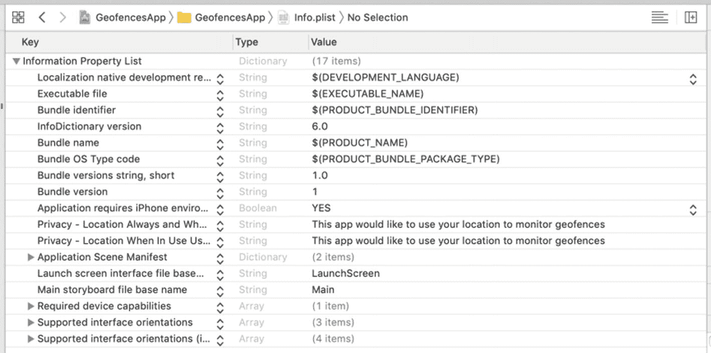
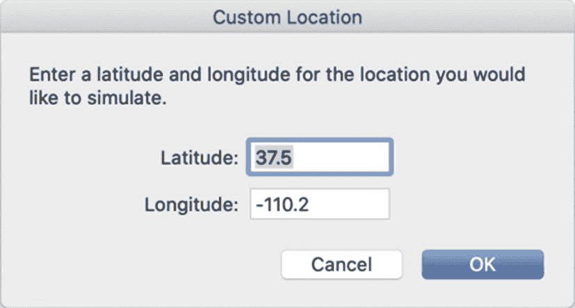
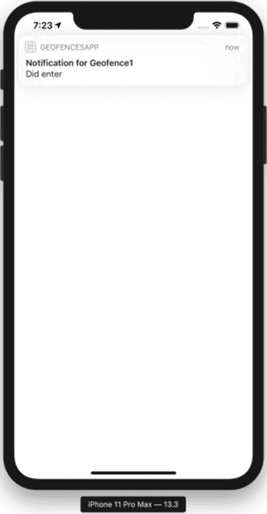

# 6. 在 CoreLocation 中使用地理围栏

您可以通过 `CoreLocation` 在 iOS 应用中支持地理围栏区域监控。iOS 内置的区域监控功能意味着您的应用无需保持前台运行，也无需持续检查用户位置而过度消耗电量。

## 区域监控概念

从概念上讲，区域监控非常简单。您的应用最多可以指定 20 个地理围栏（在 `CoreLocation` 中称为区域）。每个区域都有唯一标识符，您可以指定当用户进入或离开每个区域时是否通知应用。我们在第二章 2 中使用过的 `CoreLocation` 管理器（`CLLocationManager`）可以开始和停止监控单个区域。您还可以获取当前监控区域的列表。进入或离开区域的事件会传递给位置管理器委托，通常是一个视图控制器或应用委托类。

区域监控的难点在于其细节处理。例如，区域监控需要"始终允许"位置权限，但应用首次请求时仅会提示用户允许"使用期间"位置权限。当应用在后台运行时，若某个地理围栏触发进入或离开事件，系统才会向用户发起单独的"始终允许"权限请求。

终端用户无需为应用监控区域而接受"始终允许"位置权限，但相关触发事件仅在用户授予权限后才会生效。这就需要您向用户说明为何需要授予"始终允许"位置权限。

除了权限问题，用户进入或离开地理围栏时应用不会立即收到通知。根据苹果公司的说明，为避免向应用发送过多通知，iOS 要求至少在区域边界被跨越 20 秒后，且应用与边界保持最小距离时，才会发送通知。如果您的区域范围较小，而用户正在驾车、骑行或快速步行，他们可能在收到警报时已经越过了该区域。

## 设置基于位置的应用

本章将在第二章 2 对 `CoreLocation` 管理器的讨论基础上进行扩展。我们需要初始化位置管理器、设置委托，并请求获取用户位置的始终权限。

我们还需要在 `Info.plist` 文件中为两种权限设置提示信息：

- `隐私 - 使用期间位置使用说明`（`NSLocationWhenInUseUsageDescription`）
- `隐私 - 始终和使用期间位置使用说明`（`NSLocationAlwaysAndWhenInUseUsageDescription`）

如果您想了解更多关于位置管理器、委托和权限的信息，请参阅第二章 2。

在 Xcode 中使用单视图应用模板创建另一个 Swift iOS 项目。将您的应用命名为 `GeofencesApp`。接下来，将您的 `ViewController` 类修改为与列表 6-1 一致。

```
import UIKit
import CoreLocation
class ViewController: UIViewController {
    var locationManager: CLLocationManager!
    override func viewDidLoad() {
        super.viewDidLoad()
        locationManager = CLLocationManager.init()
        locationManager.requestAlwaysAuthorization()
    }
}
```

**列表 6-1**  
使用 `CoreLocation` 请求始终允许位置授权

我们还需要在 `Info.plist` 文件中设置权限提示文本——告诉用户我们将要监控地理围栏。

在 Xcode 中打开 `Info.plist` 文件，您会看到属性列表。添加两个位置隐私说明条目（`NSLocationWhenInUseUsageDescription` 和 `NSLocationAlwaysAndWhenInUseUsageDescription`），如图 6-1 所示。



**图 6-1**  
`Info.plist` 文件中始终和使用期间位置使用的权限描述

到目前为止，这些都是任何使用用户位置的 iOS 应用所需的步骤。接下来我们开始创建地理围栏。

## 区域监控入门

`CoreLocation` 位置管理器负责监控地理围栏，而您的应用负责告知管理器要监控哪些地理围栏。您可以在应用中通过编程方式设置地理围栏，以便从服务器获取它们，或让用户创建自己的地理围栏（例如，针对他们的家、学校和工作地点）。

第一步是确保区域监控对您所使用的区域类可用。理论上，任何继承自 `CLRegion` 的类都可以使用，但在实践中，iOS 13 中唯一继承自 `CLRegion` 的类是 `CLCircularRegion`，它在坐标周围绘制一个半径范围。`CLLocationManager` 上的静态方法 `isMonitoringAvailable(for:)` 接受一个类作为参数，因此您通常会传入 `CLCircularRegion.self`。如果监控可用，您可以创建区域并开始监控。

要创建圆形区域，您需要一个包含经纬度的 `CLLocationCoordinate2D` 中心坐标、一个半径（以米为单位）和一个唯一的字符串标识符。使用这些参数构造 `CLCircularRegion` 的代码类似如下：

```
let region = CLCircularRegion(center: coord, radius: 100, identifier: "Geofence1")
```

每个区域有两个用于触发器的布尔属性——`notifyOnEntry` 和 `notifyOnExit`。如果两者都设置为 false，地理围栏将不会执行任何操作。两者可以都设置为 true，也可以只设置其中一个。

实例化并配置区域后，使用 `startMonitoring(for:)` 方法将区域传递给位置管理器的实例。

一个完整的地理围栏监控 Swift 函数如列表 6-2 所示——请将其添加到您的 `ViewController` 类中。您可能需要将地理围栏中的纬度和经度修改为您的位置。

```
func monitorGeofences() {
    if CLLocationManager.isMonitoringAvailable(for: CLCircularRegion.self) {
        let coord = CLLocationCoordinate2D(latitude: 37.5, longitude: -110.2)
        let region = CLCircularRegion(center: coord, radius: 100, identifier: "Geofence1")
        region.notifyOnEntry = true
        region.notifyOnExit = true
        locationManager.startMonitoring(for: region)
    }
}
```

**列表 6-2**  
创建待监控的地理围栏

如上述方法所示，为地理围栏创建区域并告知 iOS 监控其进入和离开事件非常直接。该应用的下一部分将是监听用户位置的变化，这些变化将使监控进入或离开地理围栏。


## 监听地理围栏触发事件

向位置管理器注册地理围栏后，任何与该地理围栏相关的进入或离开事件都将发送至位置管理器的委托对象。

首先，在 `ViewController` 类中修改 `viewDidLoad()` 方法，将视图控制器设置为位置管理器的委托：

```
locationManager.delegate = self
```

下一步是在 `ViewController.swift` 源代码文件末尾为 `CLLocationManagerDelegate` 协议创建扩展。在此扩展中，我们将实现 `locationManager(_ manager: didEnterRegion region:)` 和 `locationManager(_ manager: didExitRegion region:)` 方法。

该扩展的基本实现如代码清单 6-3 所示。

```
extension ViewController : CLLocationManagerDelegate {
    func locationManager(_ manager: CLLocationManager,
                         didEnterRegion region: CLRegion) {
        print("已进入 \(region.identifier)")
    }
    func locationManager(_ manager: CLLocationManager,
                         didExitRegion region: CLRegion) {
        print("已离开 \(region.identifier)")
    }
}
代码清单 6-3
监听地理围栏的进入和离开触发事件
```

区域监控更高级的用法可触发应用程序内的业务逻辑，例如：提供折扣、弹出待办事项提醒或提示您签到常去地点。这些操作均应基于区域的标识符（该标识符应为唯一字符串）来实现。举例来说，您可能希望使用数据库中的主键或从服务器 RESTful 资源获取的对象 ID 作为标识符。

如果您开始监控一个与现有区域具有相同标识符的新区域，则现有区域将被替换。此外，您一次最多可监控 20 个区域，因此在设计整体系统时需考虑此限制——iOS 环境下无法监控超过此数量的区域。

您可以在模拟器中通过修改模拟 iPhone 的经纬度以匹配地理围栏来测试上述代码。在 iOS 模拟器的 **Features** 菜单下，选择 **Location** 子菜单，然后选择 **Custom Location…** 菜单项。此时将出现如图 6-2 所示的对话框。



图 6-2 iOS 模拟器中的自定义位置对话框

您应在 Xcode 的输出窗口中看到一条信息，显示“已进入 Geofence1”。将模拟器的位置更改为“City Run”或其他内置位置，您将看到一条离开地理围栏的调试信息。

## 在应用内部显示本地通知

地理围栏一个非常常见的用例是显示本地通知，即使应用处于非活跃状态也能生效。为此，您通常需要在 `AppDelegate` 类中添加功能，当然，您也可以将大部分功能封装到其自身的类中，然后让应用委托调用该类来执行功能。

使用本地通知时，您需要请求用户授权以显示通知（类似于位置权限申请）。

### 设置通知中心

首先，在 `AppDelegate` 类中添加所需的导入语句：

```
import CoreLocation
import UserNotifications
```

完成导入后，我们可以在应用委托的 `application(_ application: didFinishLaunchingWithOptions)` 方法中通过以下代码设置用户通知中心：

```
UNUserNotificationCenter.current()
    .requestAuthorization(
        options: [.alert],
        completionHandler: {allowed, error in })
UNUserNotificationCenter.current().delegate = self
```

此处，我们仅请求用户授权以显示通知提醒。如果需要，我们还可以通过将 `.sound` 和 `.badge` 添加到选项数组中来请求声音和角标权限。虽然必须指定一个完成处理程序，但保持其为空也是可以的。

下一行设置了用户通知中心的委托。这对于应用在前台运行时用户进入或离开地理围栏的情况至关重要。我们需要实现 `UNUserNotificationCenterDelegate` 委托中的 `userNotificationCenter(_ center: willPresent notification: completionHandler)` 方法。在该方法内部，我们只需添加一行代码，通过显示通知提醒来处理前台通知，其处理方式与应用在后台运行时相同。如果您愿意，也可以在此处显示一个警告视图。

要实现此通知中心委托，请为 `AppDelegate` 类添加一个扩展，如代码清单 6-4 所示。

```
extension AppDelegate: UNUserNotificationCenterDelegate {
    func userNotificationCenter(_
                                center: UNUserNotificationCenter,
                                willPresent notification: UNNotification,
                                withCompletionHandler completionHandler:
                                @escaping (UNNotificationPresentationOptions) -> Void) {
        completionHandler(.alert)
    }
}
代码清单 6-4
用于处理前台通知的用户通知中心委托扩展
```

对于一个简单的功能而言，这涉及了大量的样板代码，但如果您希望应用在前台时本地通知能正常工作，这一步骤是必不可少的。

### 为特定区域显示本地通知

下一步，我们将编写一个函数，用于根据被监控的区域创建本地通知。该函数接受两个参数——一个区域和一个布尔值，用于指示这是进入还是离开通知。

在该函数内部，我们将创建一个可变的通知内容对象，并设置其标题和正文。我们还将创建一个触发器，使通知在请求后一秒立即显示，以及一个将传递给用户通知中心的通知请求。

以下代码清单 6-5 中的 `displayNotification()` 函数应添加到 `AppDelegate` 类中。

```
func displayNotification(_ region:CLRegion, isEnter:Bool) {
    let content = UNMutableNotificationContent()
    content.title = "\(region.identifier) 状态更新"
    content.body = isEnter ? "已进入" : "已离开"
    let trigger = UNTimeIntervalNotificationTrigger(
        timeInterval: 1,
        repeats: false)
    let request = UNNotificationRequest(
        identifier: region.identifier,
        content: content,
        trigger: trigger)
    UNUserNotificationCenter.current().add(request,
                                           withCompletionHandler: nil)
}
代码清单 6-5
为给定的被监控区域显示本地通知的函数
```

现在我们已经有了根据区域创建通知的方法，接下来只需在应用委托中监听区域变化，然后调用此函数即可。


好的，作为高级文档工程师和翻译员，我将严格按照您提供的注意事项和示例格式，将给定的英文文本翻译成中文。


## 在应用程序委托中监控区域变化

在应用程序委托内部，我们需要创建另一个`CoreLocation`定位管理器的实例。即使该区域是在`ViewController`类中添加到此定位管理器的，这些定位管理器也都共享同一组区域。将定位管理器作为常量属性添加到`AppDelegate`类中：

```
let locationManager = CLLocationManager()
```

在`application(_ application: didFinishLaunchingWithOptions)`方法中，将定位管理器的委托设置为 self：

```
locationManager.delegate = self
```

现在，我们只需要在 `AppDelegate.swift` 源代码文件中，以扩展的形式实现 `CLLocationManagerDelegate` 委托，如代码清单 6-6 所示。这两个方法与我们在前面的基本区域监控示例中使用的方法完全相同。区别在于，该扩展不会打印语句，而是会调用我们在上一节中编写的`displayNotification(_ region: didEnter:)`方法。

```
extension AppDelegate : CLLocationManagerDelegate {
func locationManager(_ manager: CLLocationManager,
didEnterRegion region: CLRegion) {
self.displayNotification(region, isEnter: true)
}
func locationManager(_ manager: CLLocationManager,
didExitRegion region: CLRegion) {
self.displayNotification(region, isEnter: false)
}
}
代码清单 6-6
处理显示通知的 CoreLocation 定位管理器委托

```

现在，在模拟器中运行你的应用程序，并使用模拟器“功能”菜单和“位置”子菜单下的“自定义位置”工具，尝试进入和退出地理围栏区域。你应该会看到类似于图 6-3 的内容。



图 6-3

iPhone 模拟器显示来自地理围栏的本地通知

你可以继续在此示例的基础上进行构建，实现处理用户选择通知的功能，无论是在应用程序运行时还是在应用程序终止后。这些内容超出了本书的范围，本书主要关注地图和定位。

## 从应用程序中移除地理围栏

定位管理器包含一组当前正在被应用程序监控的地理围栏。这些区域在每次应用程序加载时都会重新创建，并且应该使用唯一标识符进行比较，而不是进行对象比较，因为从开始监控区域到从定位管理器检索区域集合，其实例可能会发生变化。定位管理器的该属性名称为`monitoredRegions`，它由一组`CLRegion`对象组成。

如果你想停止监控所有地理围栏，只需遍历区域集合，然后在定位管理器上调用`stopMonitoring(for:)`方法即可：

```
for region in locationManager.monitoredRegions {
locationManager.stopMonitoring(for: region)
}
```

如果你愿意，你可以将区域的标识符与一组已知的标识符进行比较，这些标识符是你希望继续监控的，或者是希望停止监控并随即移除的地理围栏。

至此，我们关于 iOS 区域监控和地理围栏的讨论就结束了。此功能独立于所使用的任何地图技术，并且可以在 iOS 应用程序的前台和后台使用。下一章将向你展示如何使用适用于 iOS 的 Google 地图，这是一种类似于 Apple `MapKit` 框架的技术。当然，你可以在使用 Google 地图的应用程序中使用这些地理围栏。

