# 7. 使用 Google Maps SDK 显示地图

Apple 的 `MapKit` 框架并不是 iOS 上地图应用的唯一解决方案。其他提供商也提供地图和导航技术，包括 Google、Mapbox、微软的必应地图以及 ESRI 的 ArcGIS。在本章及后续章节中，我们将使用适用于 iOS 的 Google Maps SDK。对于多平台应用，你可以在 Web、Android 和 iOS 上使用 Google 地图。这可以为你的应用程序提供一致性。你可能还想在地图中使用 Google 的图像，或者使用 Google 的驾车路线或地点信息。

本章包含了在 iOS 应用中使用 Google 地图所需的所有步骤。接下来的章节将基于我们在本章创建的项目进行构建。

### 使用 Google 地图平台

使用 Google Maps SDK 与使用 Apple 的 `MapKit` 框架类似，但也有一些不同之处。第一个区别是你需要注册 Google 地图平台。第二个区别是你需要下载 Google 地图库并将其集成到你的 Xcode 项目中。

在 [`https://cloud.google.com/maps-platform/`](https://cloud.google.com/maps-platform/) 上查找有关 Google 地图平台的更多信息。

与 Apple 地图不同，Google 地图对其功能有相关的定价和计费。在撰写本文时（2020 年初），Google 为每位用户在地图、路线和地点方面提供每月 200 美元（USD）的免费额度。此外，在撰写本文时，在移动应用程序中显示地图是免费的。这些定价优惠可能随时更改，或者在美国境外有所不同，因此在注册此服务之前请查看定价信息。


## 安装 iOS 版 Google Maps SDK 库

在 Xcode 中新建一个名为 `GoogleMapsApp` 的 iOS 项目，类型选择带 storyboard 和 Swift 的单视图应用程序——与我们目前的其他项目类似。

iOS 版 Google Maps 有两种安装方式。一种是按照 Google Maps 安装页面（`https://developers.google.com/maps/documentation/ios-sdk/start#step_2_install_the_sdk`）上的分步指南进行手动安装。这种方式相当繁琐，通常仅在您无法使用第二种方式（即使用 CocoaPods 依赖管理器）时才值得尝试。

CocoaPods 是 iOS 应用程序的依赖管理器，类似于 Mac 上的 Homebrew 或 JavaScript 的 Node Package Manager（NPM）。CocoaPods 允许您声明应用程序使用的库及其版本，然后自动下载并安装这些库，无需手动将库下载到 Xcode 项目并进行添加。这使得框架升级更加容易，并有助于避免某些库之间不兼容的问题。

如果您的系统尚未安装 CocoaPods，它以 Ruby gem 的形式分发。您需要使用以下命令在 Mac 上安装 CocoaPods：

```
sudo gem install cocoapods
```

接下来，使用命令行导航到包含新 Xcode 项目的目录。

在该目录中，键入以下命令以创建 CocoaPods `Podfile`。Podfile 包含项目的依赖项：

```
pod init
```

现在查看该目录，并打开 `pod init` 刚刚创建的 `Podfile`。其内容应类似于清单 7-1。

```
# 取消注释下一行以定义项目的全局平台
# platform :ios, '9.0'
target 'GoogleMapsApp' do
# 如果不想使用动态框架，请注释下一行
use_frameworks!
# GoogleMapsApp 的 Pods
end
```

清单 7-1
Google Maps 应用程序的新 CocoaPods Podfile

到目前为止，这些内容与 Google Maps 毫无关系。我们将把 `GoogleMaps` 库作为依赖项添加到 `Podfile` 中。在 `# GoogleMapsApp 的 Pods` 行下方，添加 `GoogleMaps` pod。添加后，您的 `Podfile` 文件应类似于清单 7-2。

```
target 'GoogleMapsApp' do
# 如果不想使用动态框架，请注释下一行
use_frameworks!
# GoogleMapsApp 的 Pods
pod 'GoogleMaps'
end
```

清单 7-2
包含 GoogleMaps 依赖项的 CocoaPods Podfile

现在依赖项已就位，CocoaPods 可以为我们下载最新版本的 Google Maps SDK，并将其配置到我们的 iOS 应用程序中。

在您运行 `pod init` 的同一目录中，从命令行运行以下命令：

```
pod install
```

CocoaPods 将安装 GoogleMaps 依赖项，同时还会为您的应用程序创建一个 Xcode workspace。这个 workspace 将包含两个 target——一个用于您的应用程序，另一个用于下载的依赖项（称为 pods）。现在您需要打开 `GoogleMapsApp.xcworkspace`，而不是 `GoogleMapsApp.xcodeproj`，来构建您的应用程序。

使用 CocoaPods，您可以通过语义化版本控制将 Google Maps 的版本固定到特定版本（在撰写本文时为 3.7.0）。有关如何使用 CocoaPods 和 Podfile 的更多信息，请参阅 `https://cocoapods.org/` 上的 CocoaPods 文档。

继续在 Xcode 中打开该 workspace。尝试在模拟器或您的设备上运行 iOS 应用程序（`GoogleMapsApp`）。您将只会看到一个空白的白色屏幕，但如果存在任何编译错误或其他问题，现在是调试它们的好时机。下一步，我们将设置 Google Maps API 密钥，以便开始使用 Google 的地图、路线和地点服务。

## 设置 Google Maps API 密钥

在进一步操作之前，您需要一个 Google Maps API 密钥。请访问 `https://cloud.google.com/maps-platform` 注册。

当您启用 Google Maps Platform 时，请勾选 Maps 的复选框，如图 7-1 所示。

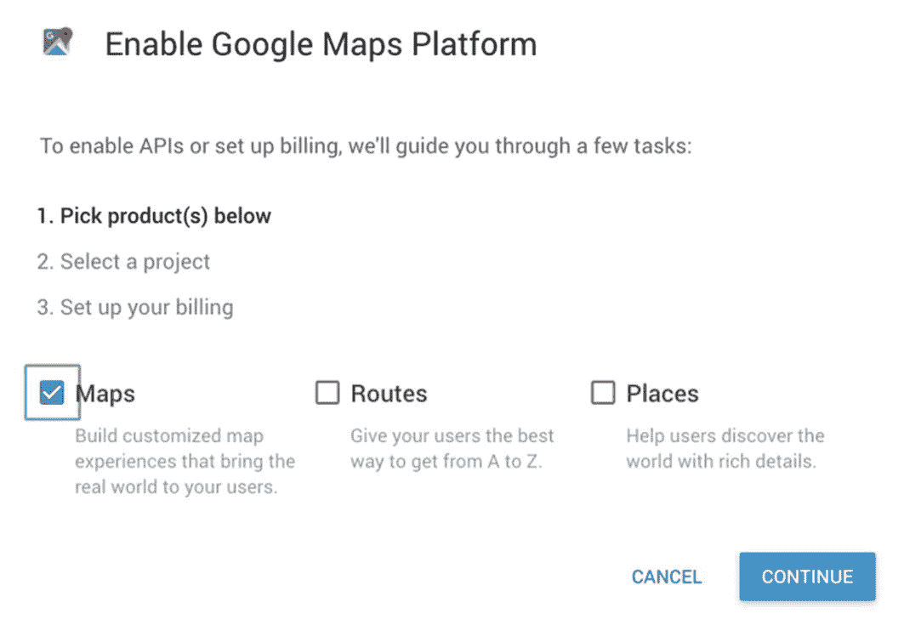

图 7-1
启用 Google Maps Platform 并选择产品

点击“继续”。在下一个屏幕（图 7-2）中，创建一个名为“First Maps Project”的新项目。

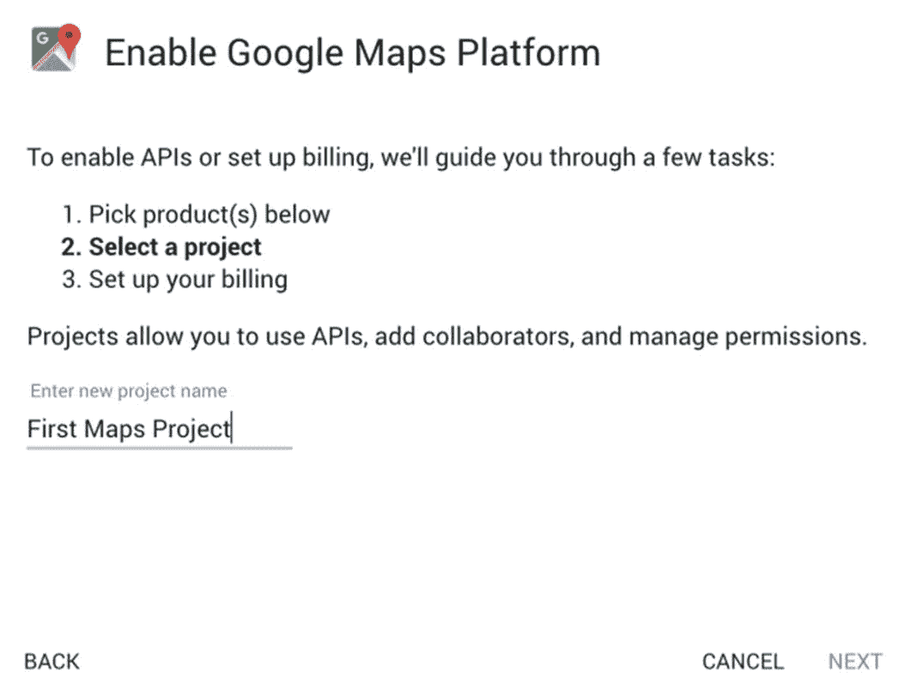

图 7-2
为 Google Cloud 创建新项目

您还需要为 Google Maps 设置一个结算账户，并关联一张信用卡，以便 Google 对超出免费配额的用量进行收费。

完成此过程后，Google 将询问您是否要为您的项目启用 Google Maps Platform，如图 7-3 所示。请继续点击“下一步”。

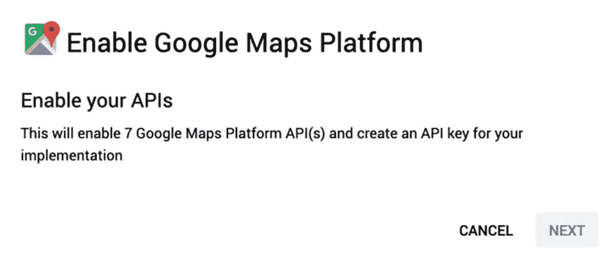

图 7-3
启用 Google Maps Platform API

您需要启用 iOS 版 Maps SDK——通过同一界面还可使用其他平台和服务。

如果在获取 Maps SDK 的 API 密钥时遇到问题，Google 网站上有其他指导说明：`https://developers.google.com/maps/documentation/ios-sdk/get-api-key`。

最后，您需要创建一个 API 密钥。在 Web 界面的“API”部分下，找到“iOS 版 Maps SDK”。选择“凭据”选项卡，然后点击“API 和服务”中的“凭据”链接。在该屏幕上，选择“创建凭据”按钮，如图 7-4 所示，然后从出现的下拉菜单中选择“API 密钥”。

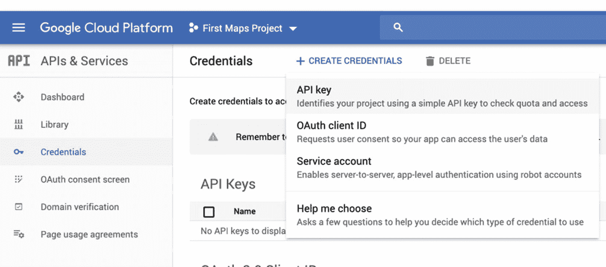

图 7-4
为 Google Maps 项目创建凭据

门户网站将为您创建一个新的 API 密钥，如图 7-5 所示。将来您仍可访问此密钥，因此无需立即保存。您需要做的是限制此密钥仅用于您的应用程序。这可以防止他人在其项目中使用您的 API 密钥，从而影响您的结算。

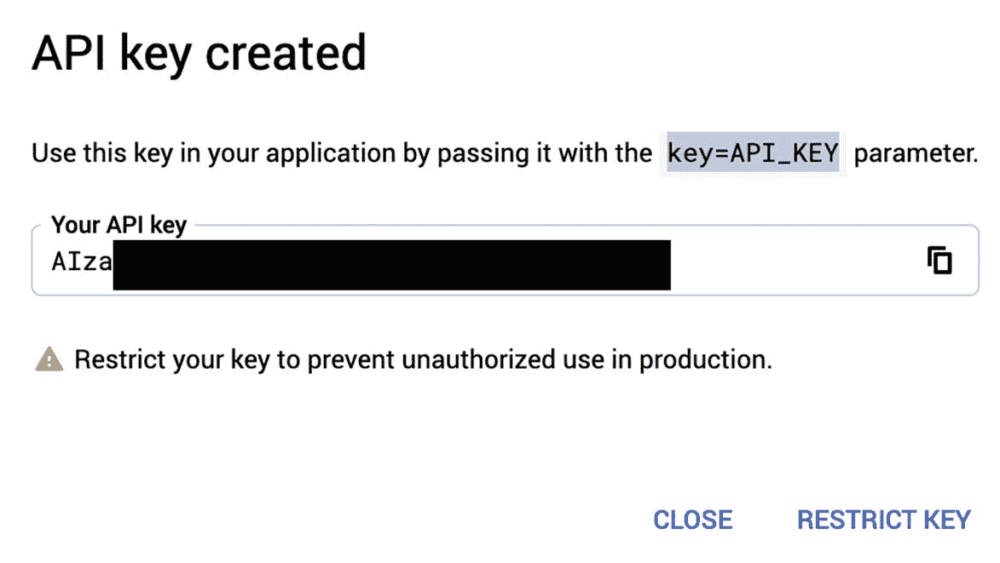

图 7-5
Google Maps API 密钥创建对话框

点击图 7-5 对话框中的“限制密钥”按钮。将出现“限制”页面（图 7-6），其中有多种选择可供挑选。将此密钥限制为仅用于 iOS 应用。为您的应用程序添加一个 iOS 包标识符。对于此项目，包标识符应为 `com.buildingmobileapps.GoogleMapsApp`。根据您的组织，您的包标识符可能不同。

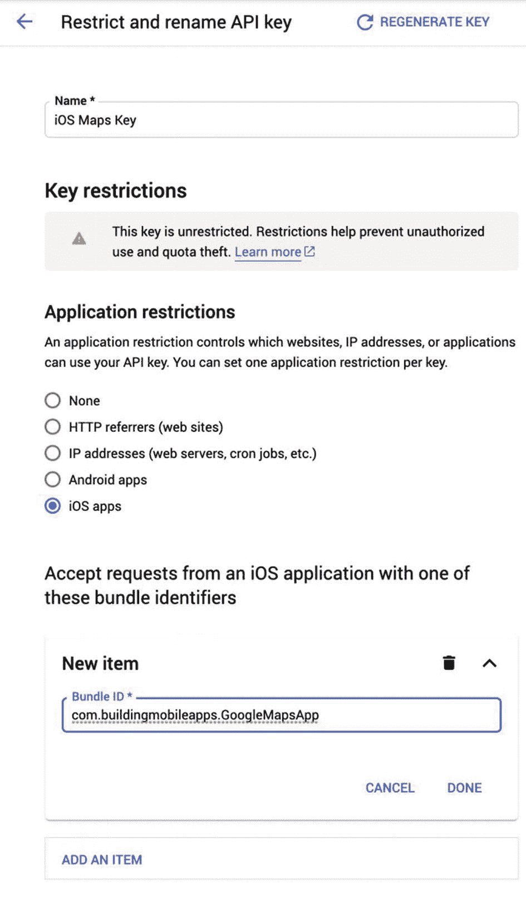

图 7-6
限制 Google Maps API 密钥的使用

添加完包标识符后，务必按下“完成”按钮，然后点击“保存”按钮以持久保存更改。保存后，您应该会看到该限制显示在您的 iOS 密钥旁边，如图 7-7 所示。

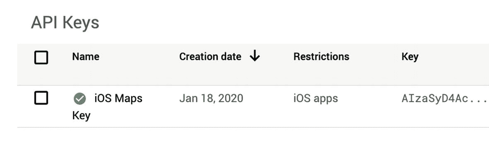

图 7-7
受限制的 iOS 地图密钥


## 在应用程序中集成 API 密钥

现在您已创建 API 密钥，并将其使用范围限制在您的 iOS 应用中，同时已将 Google Maps 库集成到项目中，下一步是在您的 iOS 应用内提供该 API 密钥。

在使用任何 Google Maps 服务（如地图、路线或地点）之前，您需要在 Google Maps SDK 中注册您的 API 密钥。如果未执行此操作，您的应用程序将会收到来自 SDK 的运行时错误。

确保 Google Maps 在使用任何服务前始终持有 API 密钥的最简单方法，是在`AppDelegate.swift`文件的`application(_:didFinishLaunchingWithOptions:)`方法中提供该 API 密钥，如代码清单 7-3 所示。您需要导入`GoogleMaps`框架，并调用`GMSServices.provideAPIKey()`。以下是经过必要修改的`AppDelegate.swift`代码清单。请将`API-KEY`替换为您在 Google Cloud Console 中创建的 API 密钥。

```
import UIKit
import GoogleMaps
@UIApplicationMain
class AppDelegate: UIResponder, UIApplicationDelegate {
    func application(_ application: UIApplication, didFinishLaunchingWithOptions launchOptions: [UIApplication.LaunchOptionsKey: Any]?) -> Bool {
        // 应用启动后的自定义覆盖点
        GMSServices.provideAPIKey("API-KEY")
        return true
    }
}
```

现在您已配置好 API 密钥，接下来可以进入最有趣的部分——在您的应用内显示 Google 地图！

## 使用地图视图显示 Google 地图

我们可以通过几种不同的方式将地图视图（`GMSMapView`）添加到 iOS 应用程序中。我们可以以编程方式将其添加为子视图，也可以将其作为`UIView`添加到故事板中，然后更改其自定义类，或者将视图控制器的视图替换为地图。

在故事板上显示地图视图是最简单的方法。只需将一个`UIView`拖到故事板上，然后将自定义类更改为`GMSMapView`，如图 7-8 所示。

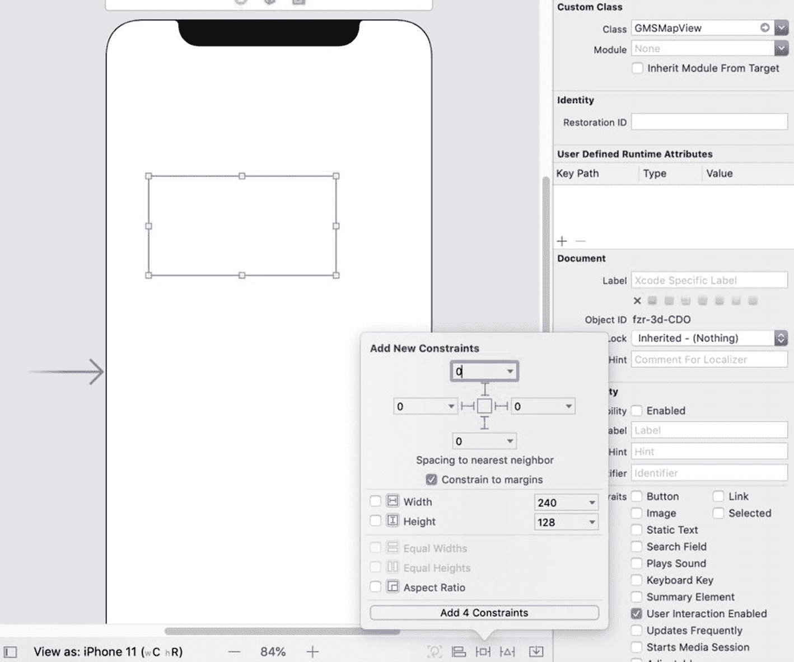

为地图视图添加约束，使其从边缘拉伸到边缘（除非您需要，否则不必担心安全区域）。现在在模拟器中运行应用程序——您应该会在应用中看到如图 7-9 所示的地图！

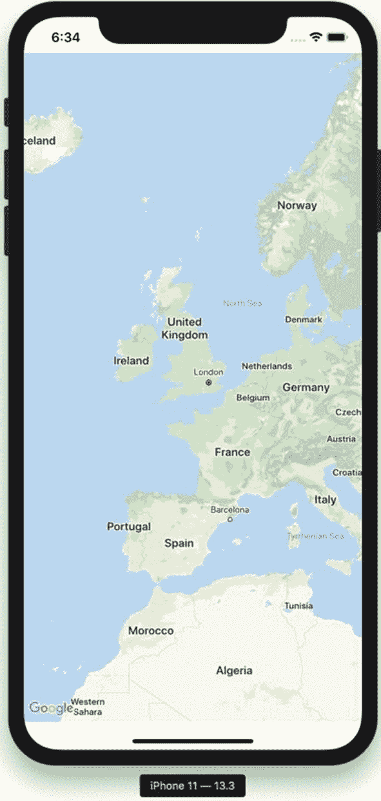

现在，为了使这个地图应用功能完整，还有最后一步。点击或轻触地图左下角的 Google 徽标，需要在已安装相应应用的情况下，打开 Google Maps iOS 应用或 iOS 版 Google Chrome 浏览器。如果最终用户没有这些应用，则会通过 Safari 打开。我们需要允许我们的应用查询正确的 URL 方案。

## 允许 Google Maps 和 Chrome 的 URL 方案

当用户点击地图左下角的 Google 徽标后，适用于 iOS 的 Google Maps SDK 将尝试打开 Google Maps 应用或 Google Chrome 应用。SDK 会在打开这些应用之前检查它们是否已安装在用户的手机上。最终的备选方案是通过 Safari 打开 URL。

早期版本的 iOS 允许任何应用检查手机上是否安装了其他应用。不幸的是，该功能被滥用，因此 Apple 限制了对该权限的使用。任何您希望检查的应用包标识符都需要在`Info.plist`文件中明确声明。

在`Info.plist`中添加一行。键名应为`LSApplicationQueriesSchemes`。出现的下拉菜单中没有对应的条目，因此您需要准确输入该名称。将类型从 String 更改为 Array。现在，您可以将应用要查询的任何 URL 方案添加到该数组中。以下是 Google Maps 和 Google Chrome 的两个方案：

*   `comgooglemaps`
*   `googlechromes`

您完成后的`Info.plist`文件应类似于图 7-10。

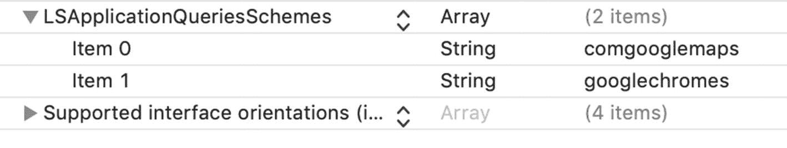

现在所有必需的信息都已设置完毕，我们可以继续更改地图视图显示信息的方式了。

## 更改地图视图的显示选项

如果我们想更改地图视图的显示选项，则需要通过代码来实现。使用 Xcode 的 Assistant 视图，为 Google 地图视图在您的`ViewController`类上创建一个输出口，并将其命名为`mapView`，如图 7-11 所示。

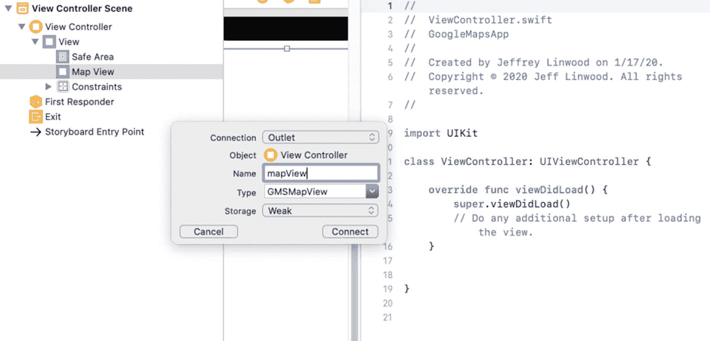

该输出口属性应如下所示：

```
@IBOutlet weak var mapView: GMSMapView!
```

您还需要在`ViewController`类的顶部添加导入`GoogleMaps`框架的语句：

```
import GoogleMaps
```

现在运行您的 iOS 应用程序，以确保一切正常。此时您应该还看不到任何变化。让我们继续更改地图的位置。使用 Google Maps 时，我们会创建一个相机位置，然后将地图视图动画移动到新位置。将以下行添加到您的`viewDidLoad()`方法中：

```
let camera = GMSCameraPosition.camera(
    withLatitude: 30.25,
    longitude: -97.7,
    zoom: 7)
mapView.animate(to: camera)
```

如果您想查看德克萨斯州奥斯汀以外的地点，请将纬度和经度替换为您选择的坐标！您最终的`ViewController`类应类似于代码清单 7-4。

```
import UIKit
import GoogleMaps
class ViewController: UIViewController {
    @IBOutlet weak var mapView: GMSMapView!
    override func viewDidLoad() {
        super.viewDidLoad()
        // 加载视图后的其他设置
        let camera = GMSCameraPosition.camera(
            withLatitude: 30.25,
            longitude: -97.7,
            zoom: 7)
        mapView.animate(to: camera)
    }
}
```

现在我们掌握了在 iOS 上使用 Google Maps SDK 的基础知识，接下来可以继续探讨更高级的主题，例如将地图类型更改为卫星、地形或混合模式，添加地图标记，或提供驾驶路线。我们将重用本章中构建的 Xcode 项目，以避免重复所有设置和安装说明。

## 探索 Google 地图视图

在上一章中，我们完成了使用适用于 iOS 的 Google Maps SDK 所需的全部设置。如果您尚未学习第 7 章，请从那里开始，因为本章将在此基础上继续讲解。

在本章中，我们将探索 Google 地图视图的功能。具体来说，我们将学习地图类型、地图标记和形状的使用。


## 更改地图瓦片类型

首先打开你在第 7 章中构建的应用程序。我们将扩展该项目，因此无需重复配置谷歌地图。

谷歌地图提供了五种不同的地图类型，这些类型在 `GMSMapViewType` 枚举中定义：

*   `hybrid` – 带标签的卫星瓦片
*   `none` – 无瓦片，无标签
*   `normal` – 默认选项，带标签的街道地图
*   `satellite` – 卫星瓦片，但无标签
*   `terrain` – 适用于户外应用程序，带标签

设置地图类型很简单——在第 7 章`ViewController`类的`viewDidLoad()`方法底部添加一行代码，如代码清单 8-1 所示。

```
override func viewDidLoad() {
super.viewDidLoad()
...
mapView.mapType = .terrain
}
```

如果你希望让用户能够在卫星、地形和街道地图选项之间切换，可以始终允许用户自行设置地图类型。地图类型可以在运行时无障碍地更改。

## 显示地图标记

在谷歌地图上显示地图标记很简单——只需创建一个`GMSMarker`对象作为地图标记，指定位置和标题，然后告诉该标记它属于哪个地图。

这与`MapKit`略有不同，在`MapKit`中，你直接将标记添加到地图上。在`ViewController`类中创建一个名为`addMarker()`的新函数，代码如代码清单 8-2 所示。

```
func addMarker() {
let marker = GMSMarker()
marker.title = "奥斯汀"
marker.snippet = "德克萨斯州"
marker.position = CLLocationCoordinate2D(
latitude: 30.25, longitude: -97.75)
marker.map = mapView
}
```

在`viewDidLoad()`方法中添加对`addMarker()`的调用，然后运行应用程序。点击地图标记以显示信息窗口后，你应该会看到类似的效果。图 8-1 中的信息窗口将显示`title`和`snippet`属性（如果存在的话）。

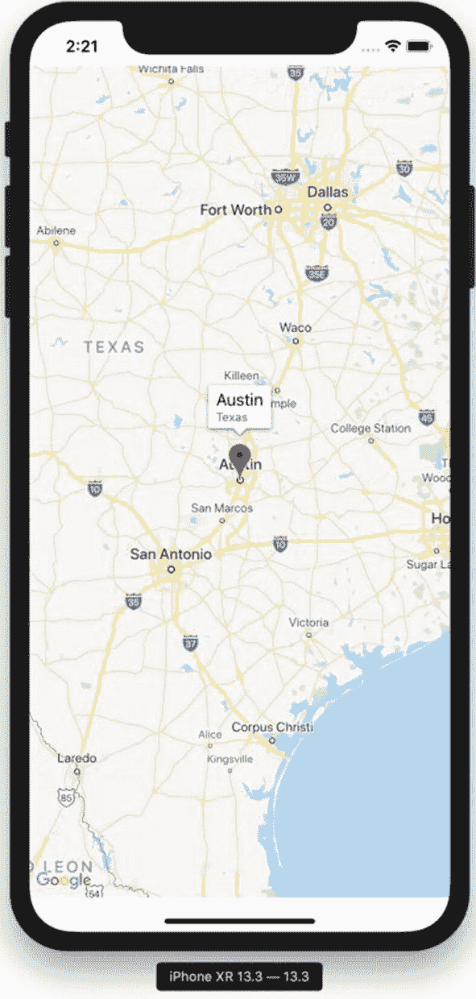

### 更改标记图标

默认情况下，标记会显示为红色大头针。标记的`icon`和`iconView`属性控制着标记的显示方式。`icon`属性接受一个`UIImage`对象。`iconView`属性接受一个`UIView`对象。`iconView`属性优先于`icon`属性——如果你设置了`iconView`，`icon`属性将被忽略。

`GMSMarker`类提供了一个辅助函数，可以用你指定的颜色（作为`UIColor`）创建标记图标的`UIImage`。如果你想在地图上显示不同颜色的标记，这会很有帮助。要将标记图标更改为蓝色，你可以这样操作：

```
marker.icon = GMSMarker.markerImage(with: .blue)
```

你可以将任何颜色作为参数传递给`markerImage()`方法。

### 响应标记事件

`GMSMapViewDelegate`协议包含许多你可能在地图应用程序中使用的不同回调方法。

对于标记而言，你最常实现的功能可能是在用户点击标记或信息窗口时执行某些操作。通常，如果标记有信息窗口，你只会在用户点击信息窗口时执行操作，但也可以监听标记的点击事件，执行一些操作，同时仍然显示信息窗口。

第一步是将`mapView`的`delegate`属性设置为视图控制器：

```
mapView.delegate = self
```

接下来，创建一个`ViewController`类的扩展，实现`GMSMapViewDelegate`协议：

```
extension ViewController: GMSMapViewDelegate {
}
```

要在用户点击信息窗口时执行操作，请实现协议中的`mapView(_ didTapInfoWindowOf marker:)`方法：

```
func mapView(_ mapView: GMSMapView,
didTapInfoWindowOf marker: GMSMarker) {
print("信息：\(marker.title ?? "无标题")")
}
```

你可以访问地图视图以及与该信息窗口关联的标记。如果你需要在用户点击标记时执行操作，请实现`mapView(_didTap marker:)`方法。如果地图视图不需要处理点击的默认行为（显示信息窗口），则返回`true`；如果地图视图应继续执行默认行为，则返回`false`。以下代码片段返回`false`，因此地图视图将运行此代码，然后显示信息窗口：

```
func mapView(_ mapView: GMSMapView,
didTap marker: GMSMarker) -> Bool {
print("标记：\(marker.title ?? "无标题")")
return false
}
```

### 用户数据和标记

前面的示例只是打印出标记的标题（如果有）。通常，你会希望呈现一个新的视图控制器，其中包含所选标记所代表地点的详细信息。这需要某种方式将选中的标记对象与标识符或数据对象关联起来。`GMSMarker`类有一个可选的`userData`属性，可用于存储任何内容——字符串、数字，或者你自己的对象。iOS 版谷歌地图 SDK 会直接忽略它——你的代码负责对它进行处理。这使得传入自定义数据变得非常容易——例如，如果你的地图标记显示`City`对象，只需将用户数据属性设置为`City`类的对应实例即可。你也可以传入一个标识符，比如整数或 UUID，然后让详情视图控制器从数据存储中进行查找。

我们可以通过在`addMarker()`方法中为标记添加用户数据来尝试这一点：

```
marker.userData = 1234
```

然后，如果我们修改扩展中的`mapView(_didTap marker:)`方法，就可以看到打印出的用户数据：

```
func mapView(_ mapView: GMSMapView,
didTap marker: GMSMarker) -> Bool {
print("标记：\(marker.title ?? "无标题")")
print(marker.userData ?? "无用户数据")
return false
}
```

同样，你可能会用它来呈现一个新的视图控制器，以显示关于该标记的更多详细信息，但这说明了如何从标记中检索这些用户数据。

## 在地图上添加形状

你可能想要在地图上添加线条、多边形或圆形。例如，如果你有从一个地方到另一个地方的驾驶路线，你可能希望在地图上显示整个路径。你可能还想使用地图上的圆形进行数据可视化，例如，说明地震震级的强度或城镇中居住的人口数量。


### 圆形

一般来说，所有这些覆盖物的工作原理都类似，所以让我们从最简单的例子——圆形开始。`GMSCircle` 类与 `GMSMarker` 类相似，你需要用纬度和经度设置其位置，然后将一个地图作为属性赋值给它。它与标记的不同之处在于，你必须设置圆形在地图上覆盖的半径。此半径以米为单位，并对应实际地理位置。标记通常以相同的固定尺寸显示，无论你在地图上的缩放级别如何。除了设置半径，你还可以设置圆形的内部填充颜色、描边轮廓的颜色以及轮廓的宽度。

以下代码在德克萨斯州的奥斯汀市上空创建了一个浅灰色、半透明的圆形，半径为 20 公里，并带有深灰色轮廓：

```
func addCircle() {
    let circle = GMSCircle()
    circle.fillColor = UIColor(white: 0.6, alpha: 0.7)
    circle.strokeColor = .darkGray
    circle.radius = 20 * 1000
    circle.position = CLLocationCoordinate2D(
        latitude: 30.25, longitude: -97.75)
    circle.map = mapView
}
```

从 `viewDidLoad()` 方法中调用 `addCircle()`，运行你的应用，你会在 Xcode 模拟器中看到与图 8-2 类似的内容。

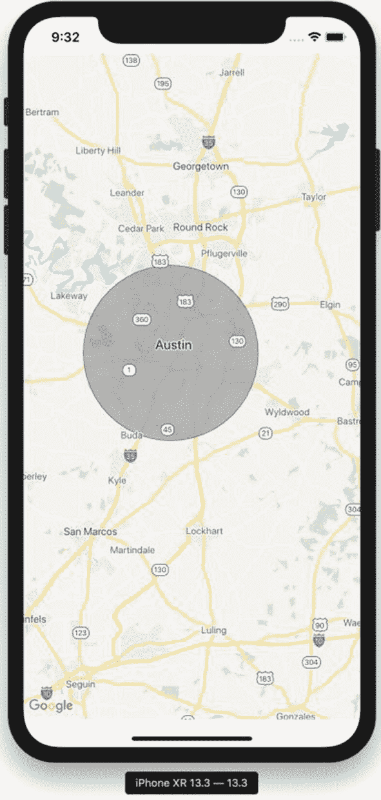

图 8-2

在地图上显示圆形

现在我们显示了圆形，接下来继续介绍下一种覆盖物：折线。

### 折线与路径

如果你要在应用中显示一条路线或路径，可以使用折线来显示由一条或多条不同线段组成的线条。在 iOS 版 Google Maps SDK 中，其工作原理是：你将路径构建为一个 `GMSMutablePath` 对象，其中包含两个或更多的位置坐标，按它们将被连接起来的顺序排列。然后你使用该路径构建一个 `GMSPolyline` 对象。路径代表数据（经纬度以及顺序），而折线则为地图提供渲染选项——线条颜色和宽度。Google 地图的折线没有填充颜色，只有描边颜色和描边宽度。

首先，创建一个路径：

```
let path = GMSMutablePath()
```

你可以向路径中添加 `CoreLocation` 坐标或经纬度对。在本例中，我们使用经纬度对向路径中添加德克萨斯州的几个城市。此路径将有两个线段：

```
path.addLatitude(30.25, longitude: -97.75)
path.addLatitude(29.4, longitude: -98.5)
path.addLatitude(29.76, longitude: -95.37)
```

现在我们有了一个包含两个或更多坐标的路径，我们可以用它来构建一条折线：

```
let polyline = GMSPolyline(path: path)
```

你可以通过定义新的描边颜色和描边宽度来设置折线的显示选项：

```
polyline.strokeColor = .red
polyline.strokeWidth = 3
```

最后，你需要记得告知折线要在哪个地图上显示：

```
polyline.map = mapView
```

以下是所有这些语句组合成一个函数的形式：

```
func addPolyline() {
    let path = GMSMutablePath()
    path.addLatitude(30.25, longitude: -97.75)
    path.addLatitude(29.4, longitude: -98.5)
    path.addLatitude(29.76, longitude: -95.37)
    let polyline = GMSPolyline(path: path)
    polyline.strokeColor = .red
    polyline.strokeWidth = 3
    polyline.map = mapView
}
```

如果你从应用中调用该函数，它看起来会类似于图 8-3。

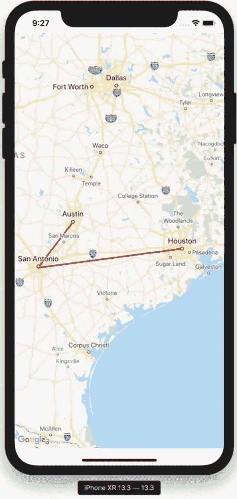

图 8-3

根据经纬度对路径显示折线

通常，你可能会在循环中构建路径，从数据库、API 调用的 JSON 响应或其他某种数据结构中读取数据。如果你在使用 Google Directions API，你可以从有效路线返回的编码路径中创建路径。我们将在下一章中构建一个使用 Google Directions API 和 Google 地图的驾车导航应用。

### 多边形

多边形与折线类似，都是用坐标路径构建的。不同之处在于，多边形会在最后一个坐标和第一个坐标之间绘制额外的线条，从而完成形状的轮廓。此外，与圆形类似，你可以在多边形上设置填充颜色。以下是一个使用与之前折线相同坐标绘制的多边形示例：

```
func addPolygon() {
    let path = GMSMutablePath()
    path.addLatitude(30.25, longitude: -97.75)
    path.addLatitude(29.4, longitude: -98.5)
    path.addLatitude(29.76, longitude: -95.37)
    let polygon = GMSPolygon(path: path)
    polygon.strokeColor = .black
    polygon.strokeWidth = 2
    polygon.fillColor = UIColor(
        red: 1, green: 0, blue: 0, alpha: 0.3)
    polygon.map = mapView
}
```

上述代码与折线代码的唯一区别在于使用了 `GMSPolygon` 类而不是 `GMSPolyline` 类，并且能够指定填充颜色。

在 `viewDidLoad()` 方法的末尾调用 `addPolygon()` 方法，你应该会看到一个三角形出现，就像图 8-4 中所示的那样。

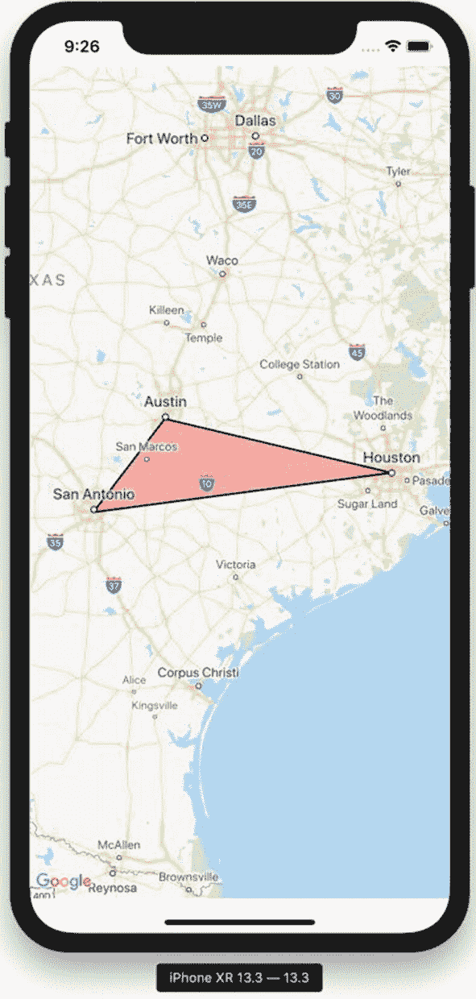

图 8-4

在地图上显示多边形

现在你已经了解了如何在地图上绘制形状，是时候讨论如何在不再需要它们时将其移除。

### 移除标记和形状

每个标记或形状都有一个 `map` 属性，指向它们所显示的地图视图。如果你想从地图上清除一个标记或形状，只需将 `map` 属性设置为 `nil`：

```
mapMarker.map = nil
```

这对于移除单个标记或形状，或不同组别的标记或形状非常有用。如果你正在处理搜索结果并将其显示在地图上，你可能希望在显示新结果之前清除地图上所有之前的结果。要清除地图上所有的标记和形状，只显示地图瓦片，请在地图视图上使用 `clear()` 方法：

```
mapView.clear()
```

然后你就可以创建任何你需要的新标记或形状了。

## 总结

在本章中，我们讨论了如何使用地图视图的 `mapType` 属性来更改地图视图中使用的地图瓦片。我们还向地图添加了标记，并学习了如何更改标记图标。我们还学习了如何处理用户轻点标记或信息窗口时的事件，以及如何在我们可以使用的标记上传递自定义数据。最后，我们研究了如何添加圆形、折线和多边形，以及如何移除标记和形状。

在下一章中，我们将基于对折线和路径的讨论，在地图视图上使用 Google Directions API 提供驾车导航指引。


好的，作为一名高级文档工程师和翻译员，我已仔细阅读了注意事项和示例。这是遵循您指定格式的英文文本的中文翻译：


