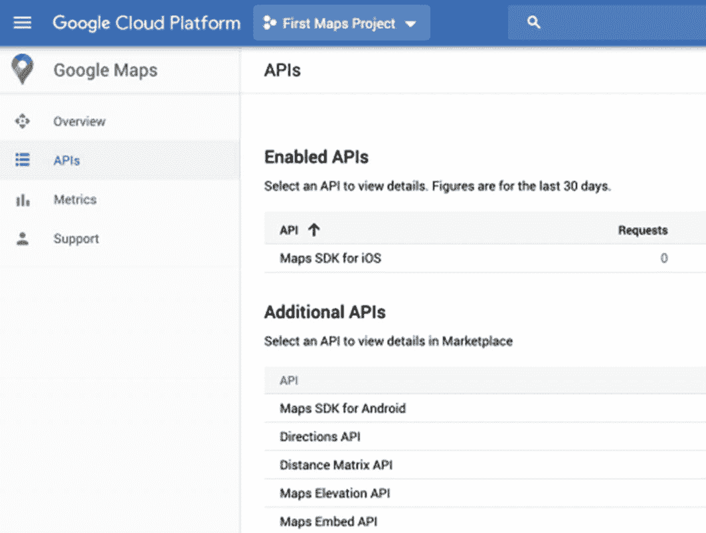
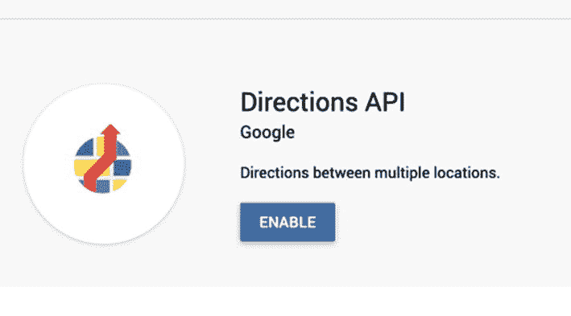
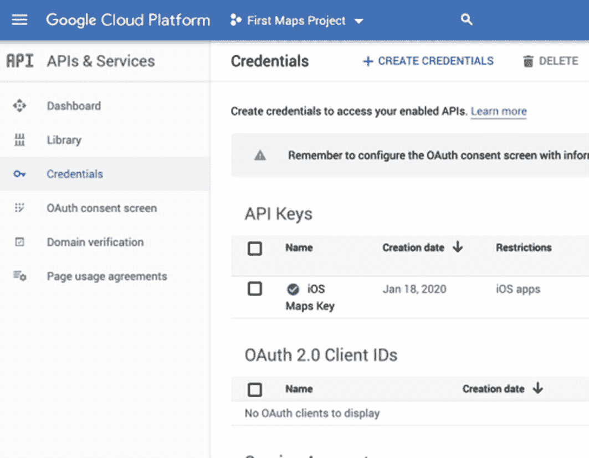
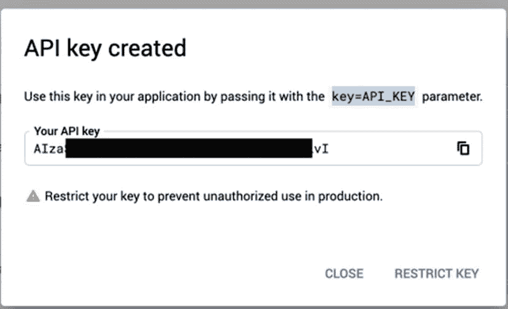
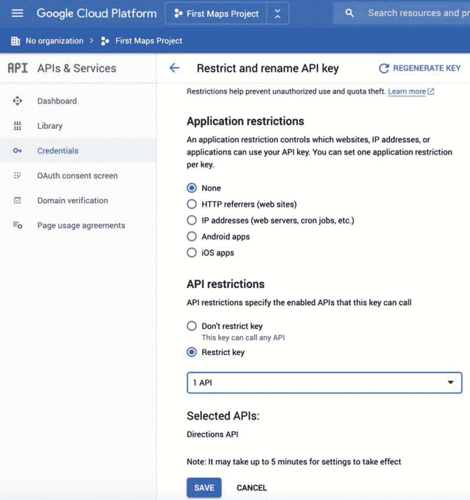
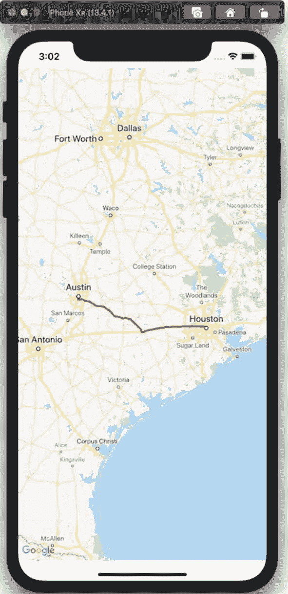

# 9. 将 Google Directions API 与导航功能结合使用

Google Directions API 是一个简单的 HTTPS API，可用于获取前往目的地的驾驶路线。Google Directions API 本身并未提供原生的 Swift 实现方式，您需要向 Google 发起 HTTPS API 调用，并解析响应中的 JSON 结果。成功响应的一部分是一条路径，该路径可以转换为折线并显示在地图上。

本章将基于第 7 章和第 8 章已完成的工作展开。在第 7 章中，我们使用 CocoaPods 和 Google Maps API 搭建了一个基础的 iOS 应用程序项目。在第 8 章中，我们讨论了如何在地图上显示形状和标记。本章我们将复用第 7 章和第 8 章中的同一个项目，或者你也可以创建一个新项目，该项目需要使用 Google Maps iOS SDK，并在故事板上有一个地图视图。

为了启用 Google Directions API 并创建一个新的 API 密钥以用于 HTTP API，我们需要做一些额外的工作。

## 设置 Google Directions API

在第 7 章中，我们创建了一个 API 密钥并启用了 Google Maps API。由于我们当时只选择启用了地图，因此需要将 Google Directions API 添加到我们的 Google Cloud 项目中。登录您的账户，地址为 [`https://cloud.google.com/maps-platform`](https://cloud.google.com/maps-platform)。

从侧边栏的菜单中选择“API”（图 9-1）。



图 9-1

已启用的 API 以及 Google 地图的附加 API

您会在这里看到您为 Google 地图添加的 API，以及一个可以在项目中使用的附加 API 列表。在“附加 API”下，您会找到 Google Directions API（图 9-2）。



图 9-2

启用 Google Directions API

在此处启用 Directions API。

**注意**
如果您忘记启用 Google Directions API，当您发出 HTTP 请求时，将会收到类似以下的错误消息：“此 API 项目未获授权使用此 API。”

启用 Directions API 后，您需要创建一个新的 API 密钥。访问 Google Cloud Platform 的 API 和服务凭据页面，地址为 [`https://console.cloud.google.com/apis/credentials`](https://console.cloud.google.com/apis/credentials)。您应该会看到您的 iOS 地图密钥，如图 9-3 所示。



图 9-3

用于创建 API 密钥的凭据页面

创建一个新的凭据，当下拉菜单出现时，选择“API 密钥”。系统会生成一个新的 API 密钥，但它将是未加限制的——下一步是限制此 API 密钥。

## 限制 API 密钥

在出现的对话框中选择“限制密钥”按钮（图 9-4）。



图 9-4

API 密钥创建对话框，显示“限制密钥”按钮

尽管您可能想要将 Google Directions API 密钥限制为仅限 iOS 应用使用，但这对于向 Google Directions API 发起 HTTPS 调用是无效的。如果您打算将 API 密钥直接嵌入到 iOS 应用中，则需要在应用限制中选择“无”。

最佳实践是像我们在示例项目中所做的那样，**不**将 API 密钥嵌入到应用中——这种方法适用于原型设计和开发，但这意味着如果有人能搜索您应用中的静态字符串，他们就有可能提取出该字符串。

如果您将此项目作为开源项目上传到公共 Git 仓库，也需要格外小心。一旦 API 密钥被发布，即使您之后又提交了一个将其移除的 commit，也很容易被人获取到。

另一种方法是，构建一个 Web 服务来代理您的应用向 Google 发出的请求。您的 Web 服务可以是唯一知晓您 API 密钥的代码，它可以部署在应用服务器上，或者以函数的形式部署在无服务器云环境中。将 API 密钥放入环境变量或上下文变量中，而不是直接嵌入到代码或配置文件中。

如果您的应用有标准的用户注册和身份验证功能，您可以通过要求提供有效的用户凭据来控制对此 Web 服务或函数的访问。

这样做还有一个好处：当您需要轮换 Google API 密钥时，不会破坏现有移动应用——您只需为 Web 服务或云函数设置一个新的环境变量，然后重启该服务或函数即可。

对于本项目，我们可以暂时将这些担忧放在一边，以便尝试使用 Google Directions API。只是**不要**将此源代码上传到您的公共 Git 仓库，如果不小心上传了，请从 Google Cloud Platform 中删除该 API 密钥。

在 API 限制下，将此密钥限制为仅用于 Google Directions API，然后保存更改，如图 9-5 所示。



图 9-5

限制 API 密钥页面

保存 Google Directions API 密钥后，请记下它。

## 使用 Google Directions API

遗憾的是，Google 并没有为 Google Directions API 提供一个用于 iOS 或 Swift 的官方辅助库。我们可以改用标准的 iOS 网络库来发起 API 调用。Google Directions API 由一个 HTTPS 端点组成，它接收请求参数并返回 JSON 响应（同时也有一个 XML 端点）。

要在 Swift 中实现此 API，我们可以使用 `URLSession` 类（及其相关类）来发起 HTTPS 调用。我们可以使用 `JSONSerialization` 类将 JSON 解析为字典和数组，或者为 JSON 响应定义一个实现 `Codable` 协议的数据结构，并使用 `JSONDecoder` 类。第二种方法要清晰得多，因为第一种方法需要在 Google Directions API 响应的嵌套结构中大量使用 `if let` 和 `guard let` 语句。在本章中，我们将创建一组基础的 Swift 结构来保存 Directions API 的响应。


### 创建 URL

Google Directions API 是基于 HTTPS 的 API，你可以轻松地在网页浏览器中测试请求。你需要声明一个常量来保存支持 Google Directions API 的 API 密钥。我们在本章的第一部分已经设置了该 API。以下值是一个示例 API 密钥；请用你自己的密钥替换：

```
let apiKey = "AIzaZZZZZZZZZZZZZZZZZ"
```

你还需要构建 API 调用的 URL。你可以向 Google Directions API 发送许多不同的参数。以下三个参数是必需的：

`origin` – 街道地址、坐标集或 Google 地点 ID

`destination` – 与 `origin` 相同

`key` – 有效的 API 密钥

你可能包含的其他参数有：

`mode` – 驾车（默认）、步行、骑自行车、公共交通

`waypoints` – 路线的中间目的地（公共交通除外）

`alternatives` – true/false；如果存在多条路线且未指定中间途经点，将返回多条路线

`avoid` – 收费站、高速公路、渡轮、室内；在计算路线时要避开的交通方式

除上述参数外，你还可以考虑 `transit_routing_preference`、`language`、`arrival_time`、`departure_time`、`region`、`units` 和 `traffic_model`。请参阅 Google Directions API 文档页面（`https://developers.google.com/maps/documentation/directions/intro`）中每个参数的详细说明。

一个 Google Maps Directions URL 的示例如下所示，其中 API 密钥会被插入到字符串中：

```
let directionsUri = "https://maps.googleapis.com/maps/api/directions/json?origin=Austin,TX&destination=Houston,TX&key=\(apiKey)"
```

你当然可以使用自己的位置或有趣的地点作为起点或终点。

### 使用 URLSession 调用 Directions API

我们需要自己调用 Google Directions API。使用标准的 `URLSession` 及其相关类，我们将创建一个数据任务，然后调用另一个方法将响应处理为 `Data` 对象。

以下 `retrieveDirections()` 方法仅处理网络方面，不处理数据处理。将清单 9-1 中的方法添加到你的 `ViewController` 类中。如果你想通过文本字段向用户询问起点和终点，或者可能使用用户的当前位置作为纬度/经度对，你也可以扩展此方法以接受起点和终点的参数。

```
func retrieveDirections() {
    let directionsUri = "https://maps.googleapis.com/maps/api/directions/json?origin=Austin,TX&destination=Houston,TX&key=\(apiKey)"
    let session = URLSession(configuration: .default)
    guard let url = URL(string: directionsUri) else {
        print("Could not parse directions URI into URL")
        return
    }
    let task = session.dataTask(with: url) { (data, response, error) in
        guard let data = data else {
            print("Error returning data from url")
            print(error?.localizedDescription ?? "No error defined")
            return
        }
        self.processDirections(data)
    }
    task.resume()
}
```

**清单 9-1** 向 Google Directions API 发起 HTTPS 调用

下一步是处理我们从 HTTPS 调用中获得的 `Data` 对象，并将其转换为可用的数据结构。

### 处理导航响应

我们向 Google Directions API 发出的请求要求返回 JSON 响应。我们也可以请求 XML，但 XML 更难解析。对于 JSON，我们需要使用 `JSONDecoder` 来解码 `Data` 对象。我们将基于 Google Directions API 的 JSON 响应定义一组数据结构。

Google Directions API 的完整 JSON 响应太长，无法在本书中列出，但你可以在网页浏览器中发起 HTTPS 请求来查看完整响应。清单 9-2 中给出了 JSON 响应的编辑版本，用 `...` 标记了删除的部分。最值得注意的是，地理编码的途径点已被修剪，折线的编码路径已被修剪，路线中的步骤数已缩减为一个。

```
{
    "geocoded_waypoints": [
        ...
    ],
    "routes": [
        {
            "bounds": {
                "northeast": {
                    "lat": 30.2671031,
                    "lng": -95.3657891
                },
                "southwest": {
                    "lat": 29.69176959999999,
                    "lng": -97.7506595
                }
            },
            "copyrights": "Map data ©2020 Google, INEGI",
            "legs": [
                {
                    "distance": {
                        "text": "165 mi",
                        "value": 265936
                    },
                    "duration": {
                        "text": "2 hours 33 mins",
                        "value": 9172
                    },
                    "end_address": "Houston, TX, USA",
                    "end_location": {
                        "lat": 29.76043,
                        "lng": -95.3698084
                    },
                    "start_address": "Austin, TX, USA",
                    "start_location": {
                        "lat": 30.2671031,
                        "lng": -97.74307949999999
                    },
                    "steps": [
                        {
                            "distance": {
                                "text": "0.5 mi",
                                "value": 776
                            },
                            "duration": {
                                "text": "3 mins",
                                "value": 167
                            },
                            "end_location": {
                                "lat": 30.2649534,
                                "lng": -97.73539049999999
                            },
                            "html_instructions": "向东行驶...",
                            "polyline": {
                                "points": ...
                            },
                            "start_location": {
                                "lat": 30.2671031,
                                "lng": -97.74307949999999
                            },
                            "travel_mode": "DRIVING"
                        },
                        ...
                    ],
                    "traffic_speed_entry": [ ],
                    "via_waypoint": [ ]
                }
            ],
            "overview_polyline": {
                "points": ...
            },
            "summary": "TX-71 E and I-10 E",
            "warnings": [ ],
            "waypoint_order": [ ]
        }
    ],
    "status": "OK"
}
```

**清单 9-2** 来自 Google Directions API 的修剪后的 JSON 响应

检查此 JSON 响应，我们可以确定哪些字段对我们的应用程序有用，哪些可以忽略。例如，我们可能正在构建一个徒步应用程序，因此可以忽略交通字段。我们还将从折线路径创建边界框，因此不需要单独解析它。

让我们从响应的一些基本数据结构开始，如清单 9-3 所示，以便我们可以在地图上显示路线的概览。我们只获取路线和概览折线中的点。在 `ViewController.swift` 文件中定义这些结构，以便于引用。

我们在这里使用 `Codable` 以便于在 JSON 和数据结构之间进行序列化。否则，我们必须将嵌套的响应解析为一系列字典和数组，这样生成的 Swift 代码将不太容易维护。

```
struct GoogleDirectionsResponse: Codable {
    var routes: [Route]?
}

struct Route: Codable {
    var overview_polyline: OverviewPolyline?
}

struct OverviewPolyline: Codable {
    var points: String?
}
```

**清单 9-3** Google Directions API 响应的数据结构

定义好数据结构后，我们可以解码来自 HTTPS 响应的 `Data` 对象（清单 9-4）。在此过程中，我们确实需要使用 `do-try-catch` 语句，以便处理任何 JSON 解码错误或我们定义的数据结构与响应之间的不匹配（例如缺少必需的属性）。

最后，解析出响应后，我们检查响应中是否有任何概要点，如果有，则将其传递给另一个方法进行显示。该方法将在主线程上执行，因为它会更改用户界面。

```
func processDirections(_ data: Data) {
    let decoder = JSONDecoder()
    do {
        let response = try decoder.decode(GoogleDirectionsResponse.self, from: data)
        print(response)
        guard let points = response.routes?.first?.overview_polyline?.points else {
            return
        }
        // 在地图上显示折线必须在主线程上进行
        DispatchQueue.main.async {
            self.displayOverviewPolyline(points)
        }
    } catch let error as NSError {
        print("JSON Error: \(error)")
    }
}
```

**清单 9-4** 将 JSON 响应解码为数据结构

将清单 9-4 中的方法添加到你的 `ViewController` 类中。我们仍然需要编写 `displayOverviewPolyline()` 方法来向用户显示路线的走向。


### 将路线显示为折线

Google Directions API 的响应中包含路线上的点，这些点以编码字符串形式提供，可转换为`GMSPath`对象。此路径对象代表路线上的所有点，包括所有路段的起点和终点。你可以使用路径创建折线，然后为该折线配置合适的描边颜色和宽度。

你还需要将折线的`map`属性设置为谷歌地图视图。我们还在函数末尾将折线作为视图控制器的成员变量进行存储（见代码清单 9-5）。

将折线添加为`ViewController`类的成员变量：

```
var routePolyline: GMSPolyline?
```

有关折线和路径的更多信息，请参见第 8 章。

```
func displayOverviewPolyline(_ points:String) {
guard let routePath = GMSPath(
fromEncodedPath: points) else {
return
}
let polyline = GMSPolyline(path: routePath)
polyline.strokeColor = .red
polyline.strokeWidth = 3
polyline.map = mapView
self.routePolyline = polyline
updateMapBounds(routePath)
}
代码清单 9-5
在谷歌地图上将 Google Directions API 响应显示为折线
```

需要提醒的是，与任何其他用户界面修改一样，此方法必须在主线程上调用。

在该方法末尾，我们调用了一个方法，该方法根据路线经过的路径更新地图的边界框。

### 更新地图边界框

`GMSCoordinateBounds`类用于创建边界框，然后你可以将其与相机更新配合使用，在地图视图中显示世界的矩形区域。你可以使用`GMSPath`对象（例如路线概览中使用的点列表）来创建这样的边界。该边界不会有额外的内边距，但相机更新允许你以`UIEdgeInsets`结构的形式指定内边距。

将其与地图视图上的`moveCamera()`方法调用相结合，我们得到以下函数（代码清单 9-6），你可以将其添加到`ViewController`类中。

```
func updateMapBounds(_ routePath: GMSPath) {
let bounds = GMSCoordinateBounds(path: routePath)
let insets = UIEdgeInsets(top: 100, left: 100, bottom: 100, right: 100)
let cameraUpdate = GMSCameraUpdate.fit(bounds, with: insets)
mapView.moveCamera(cameraUpdate)
}
代码清单 9-6
在地图视图中显示完整路线
```

你可以根据需要调整这些边缘内边距，为路线留出足够的填充空间。让路线拉伸到整个屏幕可能会显得很奇怪。

现在所有函数都已就绪，尝试在模拟器中运行你的应用。你应该会看到谷歌地图上为你的路线显示一条红线，如下图所示。如果遇到问题，请仔细检查驾驶路线的 API 密钥（你可以随时在网页浏览器中测试该 URL）。



**图 9-6** — 在谷歌地图上显示谷歌方向

至此，我们完成了本项目中对 Google Directions API 的使用。构建应用的下一步可能是添加逐向导航，将路线分解为不同的路段和步骤。

### 后续步骤：显示每个路段和每个步骤

为了扩展此项目，我们需要在项目中添加额外的数据结构来解码路线的每个路段，以及每个路段的每个步骤。你还可以添加上一步和下一步按钮，用于在步骤列表中上下移动，显示 HTML 指令并在地图上展示步骤折线。

最后，完成本项目后，请返回 Google Cloud Platform 控制台（[`https://console.cloud.google.com/`](https://console.cloud.google.com/)）并删除你的 Google Directions API 密钥。清理项目凭据总是一个好习惯！

在第 10 章中，我们将使用 Google Places SDK for iOS 搜索兴趣点并将其显示在谷歌地图上。你可以将本章的工作与第 10 章的搜索功能结合起来，自行构建一些有趣的应用！

