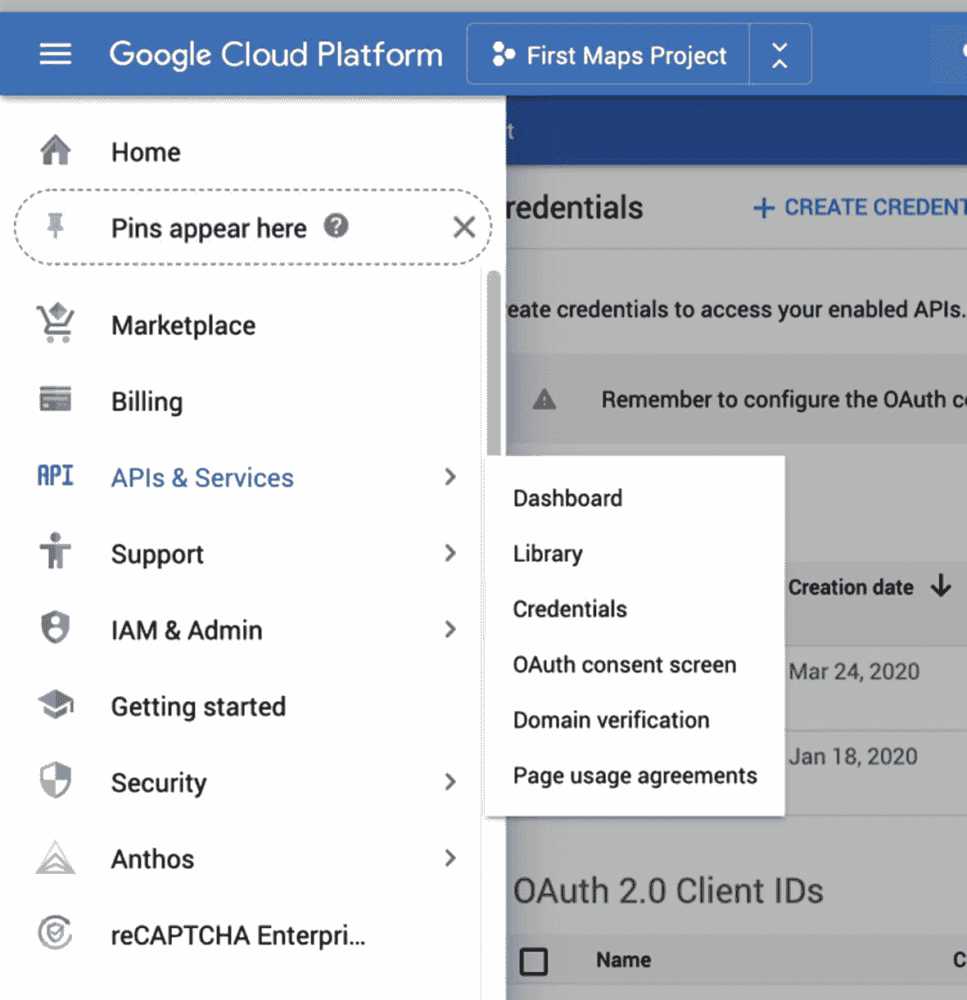
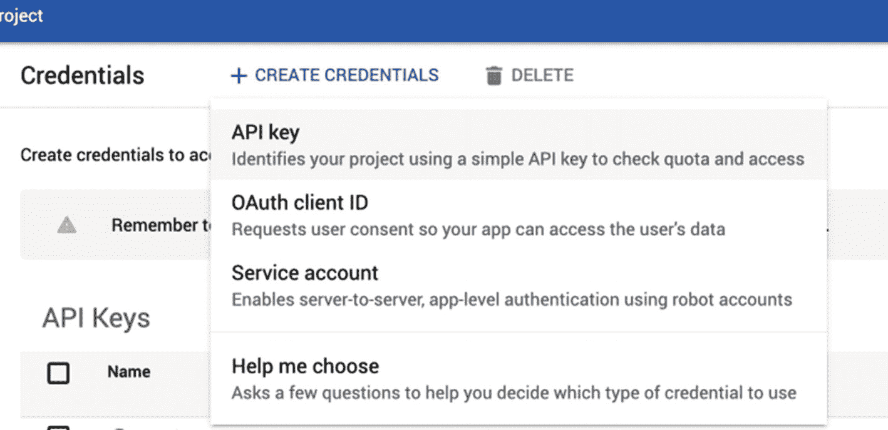
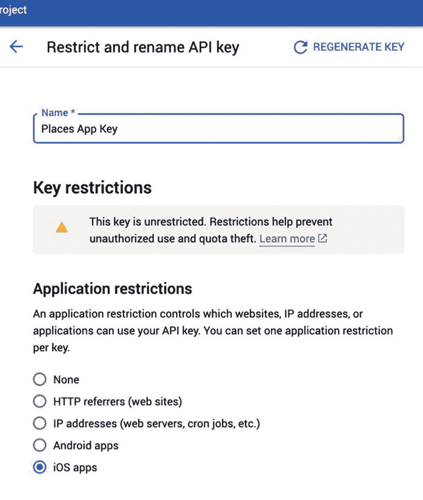
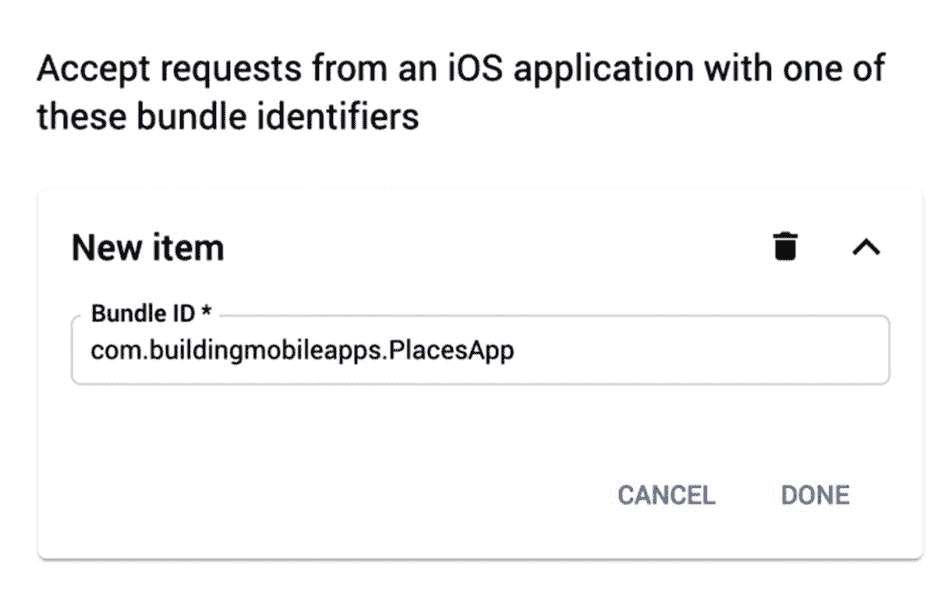
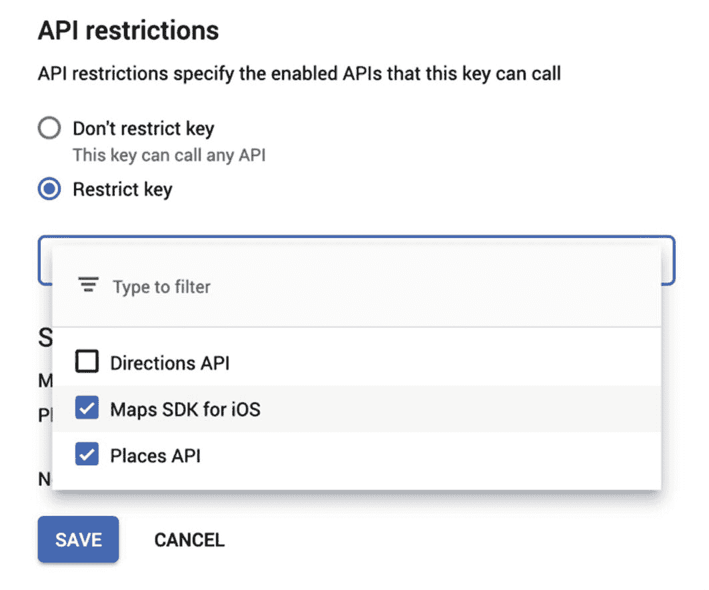
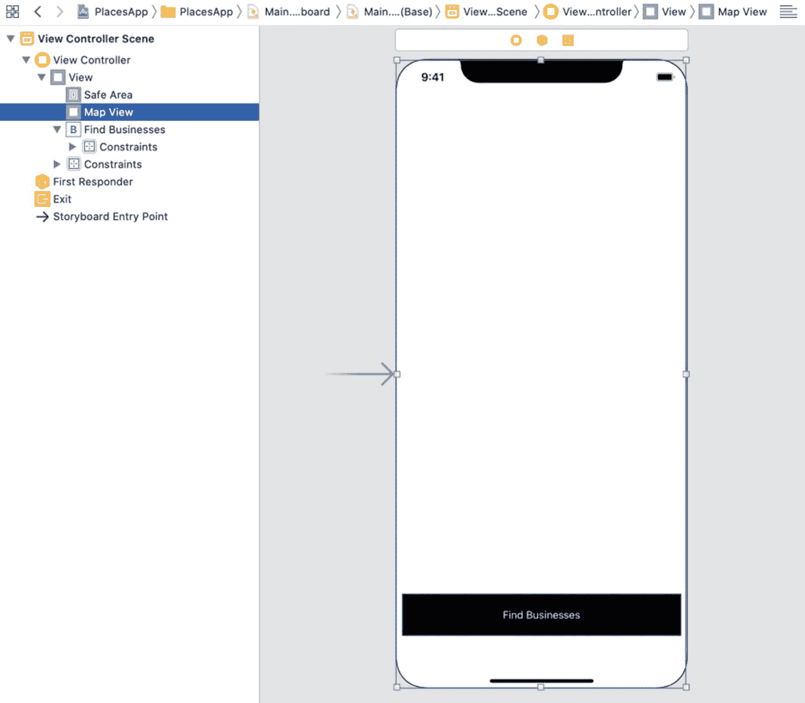
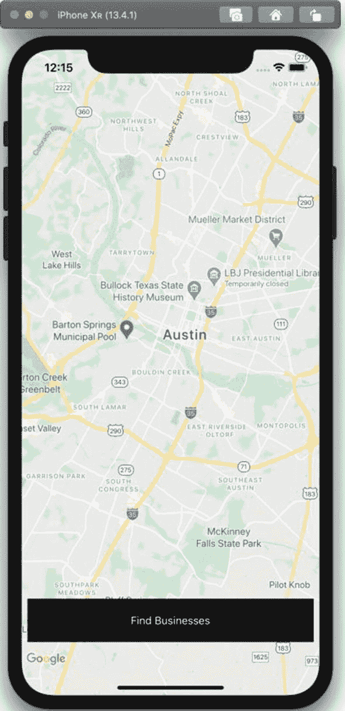
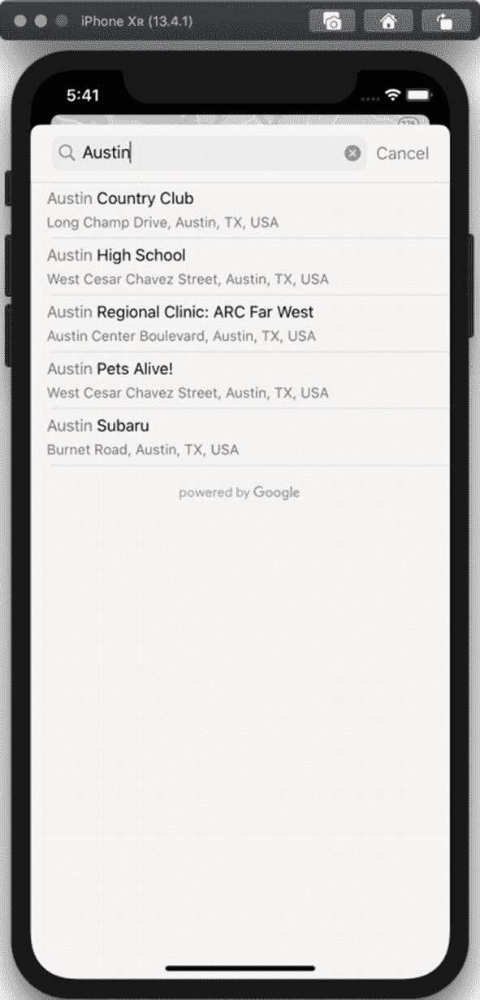
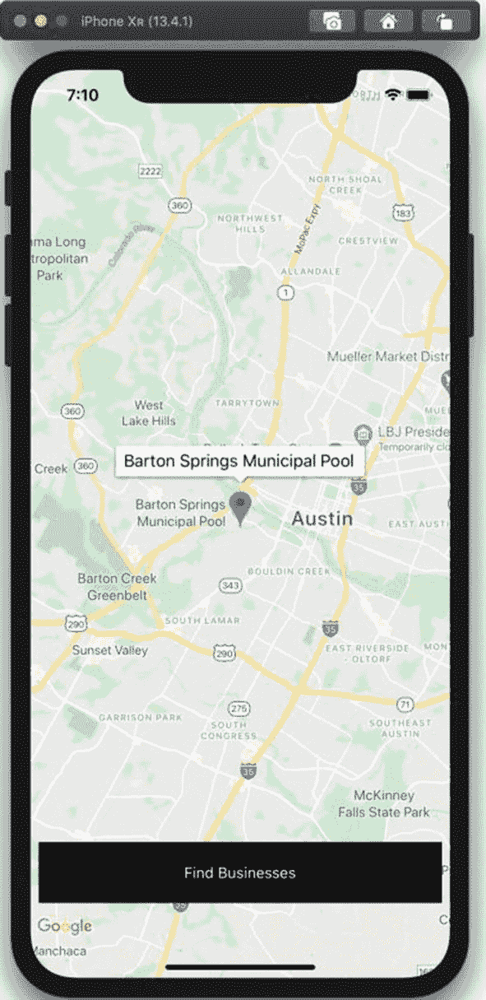

# 10. 在 iOS 应用中使用 Google Places

Google Places 通过 Google Places SDK 为 iOS 应用提供了丰富的位置和照片数据库。借助该 SDK，你的移动应用可以增强其定位能力，提供更多细节和照片，甚至提供带有自动补全功能的地点搜索。

我们将基于第 7 章关于 CocoaPods 和在移动应用中使用 Google API 的讨论进行扩展。特别是，获取 Google Places API 密钥与获取 Google Directions API 或 Google Maps API 的密钥类似。

Google Places 采用按使用量付费的计费模式，并配有计费额度，应能覆盖开发和测试中的使用量。请查阅 Google Maps Platform 计费网站（[`https://developers.google.com/maps/billing/gmp-billing`](https://developers.google.com/maps/billing/gmp-billing)）获取最新信息。此外，你还可以在那里找到关于使用成本以及更改地点请求中的字段如何影响定价的更多详细信息。

## 构建带地图的地点查找器

本章的项目将基于谷歌地图视图中当前可见的区域，为 Google Places 数据库中的商家创建一个搜索界面。我们首先介绍 Google Places 自动补全视图控制器，然后在章末添加谷歌地图标记。

本项目演示了如何在 Google Places 中通过名称（使用自动补全功能）搜索地点，以及如何将 Google Places SDK for iOS 集成到你的项目中。我们将使用 Google Places 的全屏自动补全搜索视图控制器，这使得添加此功能变得相当简单。

## 创建项目

在 Xcode 中创建一个新的单视图应用（Single View Application），使用 Swift 语言。选择故事板作为用户界面框架。将应用命名为`PlacesApp`。本章的示例项目使用`com.buildingmobileapps`作为组织标识符，使应用的包标识符为`com.buildingmobileapps.PlacesApp`。在本章下一节创建 API 密钥并限制其使用时，我们将使用此包标识符。


### 获取 Google Places API 密钥

与前几章中获取 Google Directions API 密钥（或第 7 章中获取 Google Maps API 密钥）类似，你需要获取一个 Google Places API 密钥。你需要访问 [Google Cloud Console](https://console.cloud.google.com)，该控制台位于此 URL：[`https://console.cloud.google.com`](https://console.cloud.google.com)，然后在你的项目中启用 Google Places API。

你还需要创建一个新的 API 密钥。首先，进入“凭据”界面，该界面位于 Google Cloud Platform 菜单的 “API 和服务” 部分下（图 10-1）。



图 10-1：API 和服务菜单中的凭据位置

点击 **创建凭据** 按钮，然后选择 **API 密钥**（图 10-2）。



图 10-2：创建 API 密钥

当显示包含你的 API 密钥的对话框时，请将密钥复制到剪贴板，或者稍后从控制台中获取。点击对话框上的 **限制密钥** 按钮，这将打开一个页面，允许你设置此 API 密钥适用于哪些 API 和应用程序。

第一步是给你的 API 密钥起一个容易记住的名称，例如 `Places App Key`，如图 10-3 所示。接下来，将此密钥的使用限制为 iOS 应用。



图 10-3：命名 API 密钥并将其限制为 iOS 应用

选择 iOS 应用后，你将看到一个用于输入应用包标识符的输入框。输入你应用的包标识符，然后点击文本框下方的 **完成** 按钮（图 10-4）。



图 10-4：将 API 密钥使用限制为单个包标识符

最后，你需要限制该密钥可用于哪些 API。对于本章的项目，我们将使用 Places API 和 iOS 版 Maps SDK。选择 **限制密钥**，然后从下拉菜单中选择这两个 API。如果你未看到这些 API，则需要在主仪表盘屏幕上为你的项目启用它们（图 10-5）。



图 10-5：将 API 密钥使用限制为两个 API

保存这些更改，控制台将返回“API 密钥”界面。我们稍后将在应用中使用此 API 密钥，因此请保持页面打开。不过，与某些仅一次性提供密钥的供应商不同，你随时可以返回控制台检索你的 API 密钥。

我们的下一步是使用 CocoaPods 在应用项目中包含 Google Places SDK 和 Google Maps SDK。

### 设置 CocoaPods

如果你是 CocoaPods 新手，请参阅第 7 章中关于如何在 Mac 上安装它的讨论。我们将按照类似的过程来设置我们的应用项目。第一步是打开 Mac 上的“终端”应用程序，并将目录更改为包含我们项目的目录。然后，使用以下命令为你的项目创建一个 `Podfile`：

```
pod init
```

该命令会创建一个 `Podfile` 文件。我们将添加两个依赖项，一个用于 iOS 版 Google Places SDK，另一个用于 iOS 版 Google Maps SDK。在编辑器中打开 `Podfile`，并添加这些依赖项，使其类似于代码清单 10-1。

```
target 'PlacesApp' do
# 如果您不想使用动态框架，请注释下一行
use_frameworks!
# PlacesApp 的 Pod
pod 'GooglePlaces', '3.8.0'
pod 'GoogleMaps', '3.8.0'
end
```

代码清单 10-1：Google Places 和 Google Maps SDK 的 Podfile

编辑完 `Podfile` 后，运行以下命令来安装依赖项，然后创建一个 Xcode 工作区：

```
pod install
```

现在，只能使用 `PlacesApp.xcworkspace` 文件在 Xcode 中打开项目，而不是使用 `PlacesApp.xcodeproj` 文件，否则 CocoaPods 依赖项将不会包含在构建中。

在 Xcode 中打开 `PlacesApp.xcworkspace` 文件，然后我们就可以开始构建应用了！

### 为 Google Places 和 Google Maps 提供 API 密钥

构建项目的下一步是为 iOS 版 Google Places SDK 以及 iOS 版 Google Maps SDK 指定 API 密钥。我们可以对两者使用相同的 API 密钥，因为我们在本章第一部分已为这两个 API 启用了支持。对于 Google Places，`GMSPlacesClient` 类有一个名为 `provideAPIKey()` 的静态方法，你需要在调用 Google Places SDK 中的任何其他内容之前使用它。类似地，对于 Google Maps，我们将调用 `GMSServices` 类的 `provideAPIKey()` 方法。在 `AppDelegate` 类中添加 `GooglePlaces` 和 `GoogleMaps` 框架的导入语句。我们将在应用委托的 `application(_:didFinishLaunchingWithOptions:)` 方法中为这两个 Google SDK 提供 API 密钥。

代码清单 10-2 是 `AppDelegate` 类的节选，省略了一些我们未修改的样板方法。将 `apiKey` 常量的值替换为你本章前面创建的 API 密钥。

```
import UIKit
import GooglePlaces
import GoogleMaps
@UIApplicationMain
class AppDelegate: UIResponder, UIApplicationDelegate {
func application(_ application: UIApplication, didFinishLaunchingWithOptions launchOptions: [UIApplication.LaunchOptionsKey: Any]?) -> Bool {
let apiKey = "AIza..."
GMSPlacesClient.provideAPIKey(apiKey)
GMSServices.provideAPIKey(apiKey)
return true
}
}
```

代码清单 10-2：`AppDelegate` 类节选

现在你已经设置好了 Google Places 和 Maps SDK，让我们使用它们为项目添加一些功能吧！


### 创建用户界面

你的视图控制器需要两个用户界面元素——一个 Google 地图视图和一个用于在地图区域内查找商家的按钮。使用故事板（图 10-6），你可以将 `UIView` 和 `UIButton` 拖拽到 `ViewController` 类的主视图上。将 `UIView` 的类标识改为 `GMSMapView`，使其成为 Google 地图视图。为地图视图添加约束，使其填满视图中的所有可用空间，然后为按钮添加约束，将其固定在屏幕底部。将按钮文字改为“查找商家”，并选择你喜欢的任何颜色或字体，使其在地图上突出显示。



**图 10-6**

展示地图视图和按钮的故事板

需要注意一点：按钮不能是地图视图的子视图；它必须是 `ViewController` 屏幕主 `UIView` 的子视图。

运行项目后，如果一切设置正确，你的项目将类似于图 10-7。



**图 10-7**

应用程序的用户界面

你也可以通过编程方式创建地图视图和按钮。

使用 Xcode 的助手视图，为 Google 地图视图创建一个名为 `mapView` 的 outlet：

```
@IBOutlet weak var mapView: GMSMapView!
```

接下来，为按钮创建一个名为 `findBusinesses` 的操作。你的 `ViewController` 类中应该有类似这样的操作：

```
@IBAction func findBusinesses(_ sender: Any) {
}
```

至此，我们对故事板的操作就结束了。项目的下一步是当用户点击按钮时，显示 Google Places 自动完成视图控制器。

## 了解自动完成搜索

当你向项目中添加某种地点搜索功能时，你会希望包含自动完成功能——强制用户输入与数据库中完全相同的名称很难成功。适用于 iOS 的 Places SDK 包含了自动完成的用户界面元素，以及通过编程方式进行自动完成查询的方法，这样你就可以实现自己的用户界面。

Places SDK 包含两个现代用户界面元素。第一个是独立的全屏视图控制器，负责处理文本搜索和显示结果。另一个用户界面元素是与你实现的搜索栏配合使用的搜索结果视图控制器。在本章中，我们将使用独立的视图控制器，但两种不同用户界面的搜索概念是相似的。

配置和显示自动完成全屏视图控制器的基本步骤如下：

-   创建 `GMSAutocompleteViewController` 类的实例。
-   为地点搜索设置地理边界。
-   确定你需要从查询中获取哪些数据字段。
-   按地点类型（城市、街道地址、场所）筛选结果。
-   显示视图控制器。
-   实现委托，用于处理搜索完成或用户取消时的回调。

当我们逐步构建项目中的地点搜索功能时，让我们更详细地了解每一步。

### 创建自动完成视图控制器

为了启动我们的地点搜索项目，我们需要创建 `GMSAutocompleteViewController` 类的实例。我们还需要为自动完成视图控制器设置一个委托，并且将在本章后面创建一个扩展来处理这些委托方法。现在，直接将自动完成视图控制器的委托设置为 `self`：

```
let vc = GMSAutocompleteViewController()
vc.delegate = self
```

本节及后续章节中的所有代码片段都将放入我们之前创建的 `findBusinesses()` 操作中。该函数的完整版本可在清单 10-3 中找到，该清单位于各个步骤的讨论之后。

### 为搜索设置地理边界

我们可以使用自动完成搜索，告诉 Google Places 要搜索哪个地理区域的地点。你可以将此区域用作偏好设置，这样该地理空间内的结果会在列表顶部得到提升；或者作为限制条件，该地理区域之外的地点（即使很近）也完全不会显示。

在我们的项目中，我们将使用 Google 地图视图中的可见区域作为边界。该区域需要转换为 `GMSCoordinateBounds` 对象，你可以使用 `GMSCoordinateBounds` 构造函数来完成：

```
let region = mapView.projection.visibleRegion()
let bounds = GMSCoordinateBounds.init(region: region)
vc.autocompleteBounds = bounds
```

我们还将限制结果，只显示在地理边界内找到的地点：

```
vc.autocompleteBoundsMode = .restrict
```

你不必如此严格——你可以将结果偏向于地图中找到的地点，但如果用户正在寻找某个特定地点，并且该地点恰好靠近地图但不在其中，它仍然会作为结果显示。这是自动完成搜索的默认行为。如果你想使用此行为，请不要设置 `autocompleteBoundsMode` 参数，或者将其设置为 `.bias` 值。

你也不必使用任何地理边界，在这种情况下，只需省略设置 `autocompleteBounds` 属性即可。你也可以自己构建地理边界，例如，如果你正在为某个特定区域或城市构建地点搜索。

下一步是确定你的视图控制器需要从 Google Places API 获取哪些数据字段。

### 请求数据字段子集

默认情况下，Google Places API 会为自动完成返回所有数据字段，包括需要额外付费的高级字段（如评论）。由于你可能不需要所有字段，你可以设置结果中确实需要的特定字段集。

要构建字段列表，你需要使用 OR（`|`）运算符组合一组 `GMSPlaceField` 枚举值。以下是你可以用于应用程序的其中几个字段列表：

-   `coordinate`
-   `formattedAddress`
-   `name`
-   `openingHours`
-   `phoneNumber`
-   `photos`
-   `placeID`
-   `rating`
-   `website`

就我们而言，我们将坚持使用基本的地点详细信息，只请求名称、地点 ID 和坐标。稍后我们将使用这些信息在地图上创建标记。

我们的代码将枚举值中的原始值组合为无符号整数，然后从中构造一个 `GMSPlaceField` 值。如果 `GMSPlaceField` 构造函数未能创建对象，我们也从函数中返回。这个特定的 API 本可以设计得更容易使用一些，例如，接受一组值。我们还需要设置自动完成视图控制器的 `placeFields` 属性：

```
// 地图标记所需
let fields = UInt(GMSPlaceField.name.rawValue) |
UInt(GMSPlaceField.placeID.rawValue) |
UInt(GMSPlaceField.coordinate.rawValue)
guard let placeFields = GMSPlaceField(rawValue: fields) else {
return
}
vc.placeFields = placeFields
```

不要与字段混淆，我们现在需要告诉 Google Places 我们想要哪种类型的搜索结果。


### 按类型筛选结果

自动完成视图控制器支持不同类型的地点搜索结果。支持的类型以及"无筛选"选项，均可在 `GMSPlacesAutocompleteTypeFilter` 枚举中找到。这些选项包括：

- `noFilter`
- `address`
- `city`
- `establishment`
- `geocode`
- `region`
- `city`

若要在自动完成视图控制器中使用这些选项之一，您需要创建一个 `GMSAutocompleteFilter` 实例，然后设置该筛选器的 `type` 属性。在自动完成视图控制器上，您需要通过筛选器对象设置 `autocompleteFilter` 属性：

```
let filter = GMSAutocompleteFilter()
filter.type = .establishment
vc.autocompleteFilter = filter
```

我们使用了 `establishment` 类型，但您当然也可以使用其他筛选器。不妨尝试一下，看看在您所在区域它们返回何种类型的结果。

### 显示视图控制器

自动完成视图控制器需全屏显示，因此您可以像图 10-8 所示那样，以模态形式从您的视图控制器中呈现它：



*图 10-8：显示 Google 地点的自动完成视图控制器*

```
present(vc, animated: true, completion: nil)
```

如果您愿意，可以在一个方法中创建自动完成视图控制器，然后在另一个方法中显示它。在本项目中，为简单起见，我们将这两个步骤合并到了一个方法中。

完整的 `findBusinesses()` 方法，包含上述所有步骤，如代码清单 10-3 所示。

```
@IBAction func findBusinesses(_ sender: Any) {
    let vc = GMSAutocompleteViewController()
    vc.delegate = self
    // 在此区域搜索地点
    let region = mapView.projection.visibleRegion()
    let bounds = GMSCoordinateBounds.init(region: region)
    vc.autocompleteBounds = bounds
    // 仅返回地图上可见的结果
    vc.autocompleteBoundsMode = .restrict
    // 地图标记所需
    let fields = UInt(GMSPlaceField.name.rawValue) |
                 UInt(GMSPlaceField.placeID.rawValue) |
                 UInt(GMSPlaceField.coordinate.rawValue)
    guard let placeFields = GMSPlaceField(rawValue: fields) else {
        return
    }
    // 仅返回所需的字段
    vc.placeFields = placeFields
    // 我们正在查找商家/兴趣点
    let filter = GMSAutocompleteFilter()
    filter.type = .establishment
    vc.autocompleteFilter = filter
    // 以模态形式显示
    present(vc, animated: true, completion: nil)
}
```

*代码清单 10-3：显示用于 Google 地点搜索的自动完成视图控制器*

当用户从列表中选择一个地点或决定取消时，您的视图控制器需要关闭自动完成视图控制器。我们将在下一节关于实现自动完成搜索的委托方法中讨论这一点。

### 为自动完成实现委托

通过 `GMSAutocompleteResultsViewControllerDelegate` 协议，当自动完成视图控制器发生某些事件时，您的应用程序会收到通知。我们将以 `ViewController` 类的扩展形式，实现该委托中的几个方法。

具体来说，用户选择地点、用户取消搜索请求或发生不可恢复错误时调用的函数是必需的。可选方法则用于通知委托：自动完成请求已发出、自动完成请求已更新、以及用户已从列表中选择了一个值（但尚未调用 API 获取地点详细信息）。

为您的 `ViewController` 类添加一个遵循 `GMSAutocompleteResultsViewControllerDelegate` 协议的扩展：

```
extension ViewController: GMSAutocompleteViewControllerDelegate {
}
```

如果您此时尝试编译项目，Xcode 会提示该协议有必需的方法，并会为您创建这三个必需方法的存根。您可以让 Xcode 自动完成，或者从代码清单 10-4 中复制定义。

如代码清单 10-4 所示，我们先在所有三个方法中关闭自动完成视图控制器。将这些函数添加到您的扩展中。

```
func viewController(_ viewController: GMSAutocompleteViewController,
                    didAutocompleteWith place: GMSPlace) {
    viewController.dismiss(animated: true, completion: nil)
}

func viewController(_ viewController: GMSAutocompleteViewController,
                    didFailAutocompleteWithError error: Error) {
    viewController.dismiss(animated: true, completion: nil)
}

func wasCancelled(_ viewController: GMSAutocompleteViewController) {
    viewController.dismiss(animated: true, completion: nil)
}
```

*代码清单 10-4：在自动完成视图控制器委托中实现方法*

接下来，让我们为第一个方法（当用户选择一个地点时）添加一些功能。我们将打印出地点详情，以及我们从 Google Places API 请求的字段。如果存在任何必需的第三方属性，我们也会将其打印出来。

当您处理从 Google Places API 返回的地点时，其中一些地点可能包含您必须显示的属性信息。这些属性会以 `attributions` 属性的形式出现在 `GMSPlace` 对象上。有关 Google 当前属性政策的更多信息，请参阅此网页：[`https://developers.google.com/places/ios-sdk/attributions`](https://developers.google.com/places/ios-sdk/attributions)。

我们更新后的方法将类似于这样：

```
func viewController(_ viewController: GMSAutocompleteViewController,
                    didAutocompleteWith place: GMSPlace) {
    viewController.dismiss(animated: true, completion: nil)
    print(place)
    print(place.attributions ?? "No attributions")
}
```


## 在地图上显示地点

如果打算在地图上显示 Google 地点数据，则必须使用 Google 地图，而非 iOS 的 `MapKit` 地图或其他提供商的地图。你可以在地图之外显示地点数据，但需要显示归因网页上提供的“Powered by Google”图像：[`https://developers.google.com/places/ios-sdk/attributions`](https://developers.google.com/places/ios-sdk/attributions)。

我们将以地图标记的形式，在地图上显示所选地点。首先，在你的 `ViewController` 类中添加一个名为 `addMarker` 的新函数。该函数将接受一个 `GMSPlace` 对象作为参数，参数名为 `place`：

```
func addMarker(_ place:GMSPlace) {
}
```

现在，在自动完成视图控制器委托扩展的第一个方法的末尾（即在打印地点详情之后）调用该 `addMarker` 方法：

```
print(place)
print(place.attributions ?? "No attributions")
addMarker(place)
```

我们在第 8 章中讨论了如何向 Google 地图添加地图标记。我们将使用从 Google Places API 请求的地点字段来填充标记，然后将其显示在地图上，如清单 10-5 中的代码所示。

```
func addMarker(_ place:GMSPlace) {
let marker = GMSMarker()
marker.position = place.coordinate
marker.title = place.name
marker.icon = GMSMarker.markerImage(with: .blue)
marker.userData = place
marker.map = mapView
}
清单 10-5
在 Google 地图上显示来自 Google Places SDK 的地点
```

当你运行项目时，应该会看到一张 Google 地图出现。在地图上缩放或滚动以找到你想要搜索地点的位置，然后点击“查找商家”按钮。你将看到自动完成视图控制器出现。当你选择其中一个地点时，会看到一个蓝色标记出现在地图上。点击该标记会显示来自 Google Places API 的名称，如图 10-9 所示。



图 10-9
在 Google 地图中展示 Google Places 地点的地图标记

我们将 `GMSPlace` 对象放入地图标记的 `userData` 属性中，以便以后能够访问该地点的数据。例如，你可以扩展此应用程序，以便在用户点击标记时检索该地点的照片。

## Places SDK 中的其他功能

Google Places SDK for iOS 中还有许多我们在本章未涉及的其他功能。我们只讨论了用于自动完成搜索的全屏视图控制器，并未涉及如何实现自定义搜索用户界面。我们也没有讨论如何根据给定的 place ID 请求地点详情，而我们可以利用这一点从 API 获取更多数据字段。

此外，你还可以将用户的当前位置转换为一个地点，从而告知用户他们所在的位置。利用地点照片数据字段中的信息，如果 Google Places 中存有照片，你可以检索这些照片。

本章结束我们对 Google 地图平台及其 iOS 组件的讨论。在下一章中，我们将学习如何开始使用另一个地图提供商 Mapbox。

