# 11. 开始使用 Mapbox SDK

在本章中，我们将在 iOS 应用中设置并使用 Mapbox 地图。Mapbox 是一个独立的地图数据提供商，为 iOS、Android 和 Web 发布软件开发工具包。Mapbox 允许你轻松地为地图设置样式，从而为你的应用程序赋予自定义的外观和感觉。我们将在下一章中处理地图样式。

我们在本章构建的示例应用程序，与我们使用 Apple 的 `MapKit` 和 Google 地图构建的入门应用程序类似。

## 获取 Mapbox 访问令牌

你需要一个访问令牌才能使用 Mapbox 服务，因此你需要在 [`www.mapbox.com`](http://www.mapbox.com) 创建一个账户。在创建账户的同时，也花点时间了解 Mapbox 的定价和免费层限制。在撰写本文时，你可以在免费级别下使用 Mapbox，最多支持 25,000 名月度活跃移动设备用户，超出该数量的用户则需要付费。这种情况肯定会发生变化，因此在将其集成到你的应用程序之前，请确保 Mapbox 符合你的需求和预算。

创建好 Mapbox 账户并查看定价后，你需要创建一个访问令牌以在 Mapbox 应用程序中使用。虽然你可以使用默认的访问令牌，但最好为你的每个 Mapbox 项目创建独立的访问令牌，以防你需要撤销某个令牌或限制其功能。在你的 Mapbox 账户页面上找到“创建令牌”按钮（图 11-1）。

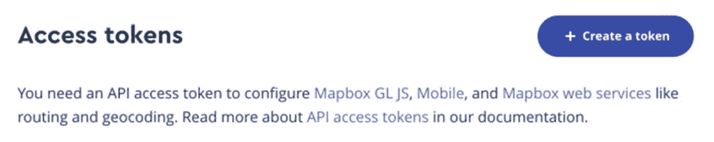

图 11-1
“创建令牌”按钮

点击“创建令牌”按钮，并在下一个屏幕（图 11-2）上将你的访问令牌命名为 `FirstMapboxApp`（或你选择的任何其他名称）。令牌作用域的默认设置即可。

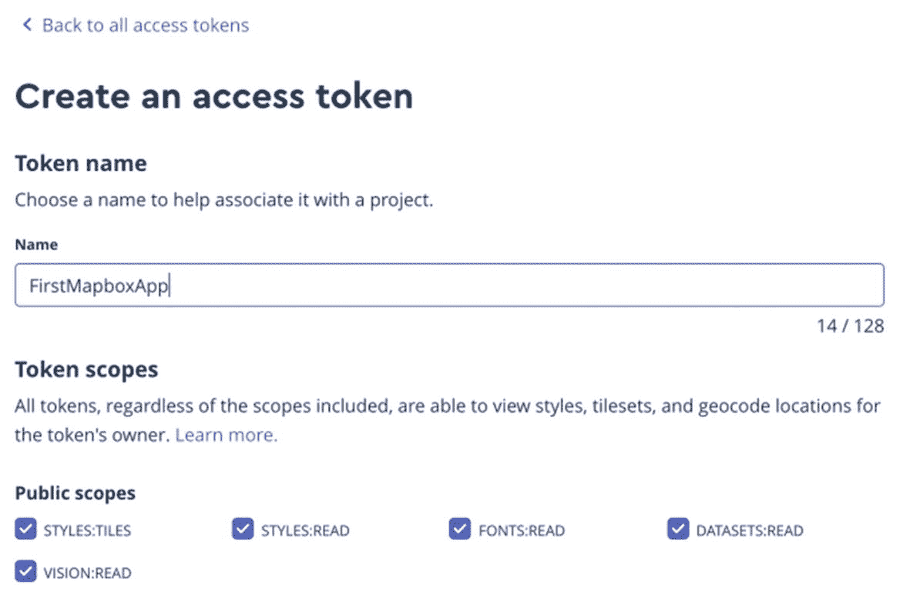

图 11-2
创建访问令牌

创建你的令牌（位于“创建访问令牌”屏幕底部），然后如果 Web 应用程序提示，请确认你的密码。你将进入访问令牌列表页面。请对你的访问令牌保密，不要公开分享，例如不要将其放在源代码仓库中。在我们设置好 Xcode 项目后，我们会将此访问令牌添加到应用程序的 `Info.plist` 文件中。

现在我们已经拥有了访问令牌，让我们创建一个 Xcode 项目并添加 Mapbox SDK for iOS。


## 使用 Mapbox SDK 启动新项目

我们将构建一个新的 iOS 应用程序来演示 Mapbox 的功能。在 Xcode 中创建一个名为 `FirstMapboxApp` 的新项目。该项目应为单视图应用程序，使用 Swift 作为编程语言，并使用 storyboard/UIKit 作为用户界面，如图 11-3 所示。

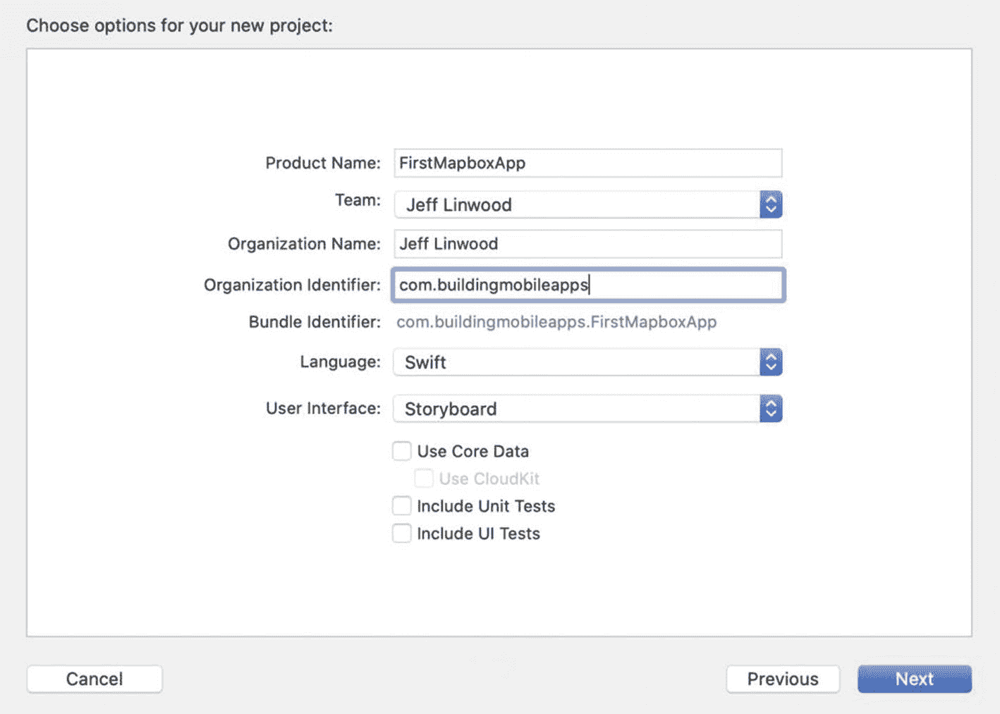

图 11-3

在 Xcode 中创建 FirstMapboxApp 项目

创建此 Xcode 项目后，我们需要安装 Mapbox SDK。与 Google Maps 或 MapKit 不同，Mapbox SDK 是开源的。在应用程序中包含该 SDK 的最简单方法是使用 CocoaPods，这与我们安装 Google Maps for iOS SDK 的方式类似。如果你尚未在 Mac 上安装 CocoaPods，请访问 [`cocoapods.org/`](https://cocoapods.org/) 获取安装说明。

设置好 CocoaPods 后，进入命令行，并将目录切换到刚创建的项目文件夹 (`FirstMapBoxApp`)。

在该目录中，使用以下命令为你的项目创建一个 CocoaPods `Podfile`：

```
pod init
```

你创建的 `Podfile` 将如清单 11-1 所示。

```
target 'FirstMapboxApp' do
# 如果不想使用动态框架，请注释下一行
use_frameworks!
# FirstMapboxApp 的 Pods
end
清单 11-1
为项目生成的 Podfile
```

在此文件中，我们有一个指向 Xcode 项目的 target，以及一个用于列出项目所依赖库（在 CocoaPods 中称为 pods）的位置。我们只需要为 Mapbox 添加一个 pod，然后声明要使用的版本，如清单 11-2 所示。在撰写本文时，该版本为 5.8。

```
target 'FirstMapboxApp' do
# 如果不想使用动态框架，请注释下一行
use_frameworks!
# FirstMapboxApp 的 Pods
pod 'Mapbox-iOS-SDK', '~> 5.8'
end
清单 11-2
将 Mapbox CocoaPods 库添加到项目

```

编辑并保存 `Podfile` 文件后，在命令行中运行以下命令：

```
pod install
```

CocoaPods 将下载 Mapbox 库并将其安装到 Pods 文件夹中。你还会看到一个新的 `FirstMapboxApp.xcworkspace` 文件，你将在 Xcode 中打开它。此工作区将包含你的项目以及 CocoaPods 中的所有依赖项。

现在，打开该工作区。在你项目的 `Info.plist` 文件（图 11-4）中，为 `MGLMapboxAccessToken` 添加一个条目，并将其字符串值设置为你的访问令牌。

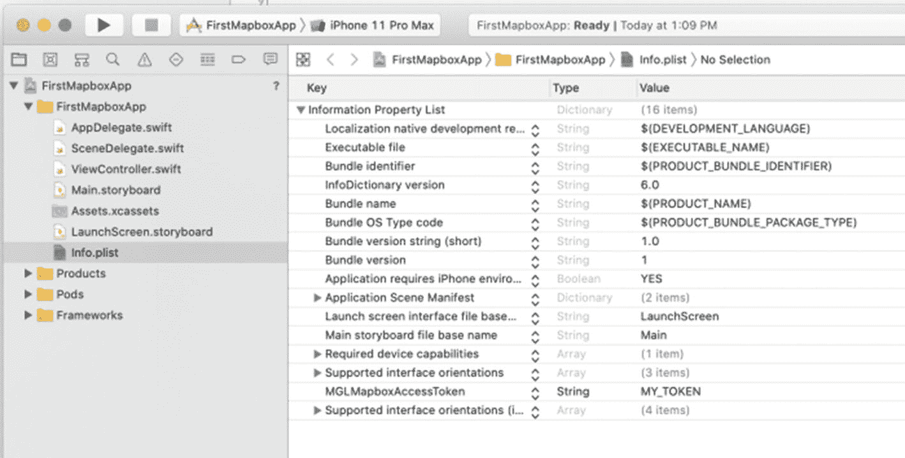

图 11-4

带有 Mapbox 访问令牌设置的项目 Info.plist 文件

添加访问令牌后，我们就拥有了使用 Mapbox 所需的一切。让我们开始将地图添加到默认视图控制器中。

## 显示地图视图

Mapbox 提供了一个名为 `MGLMapView` 的地图视图类（MGL 是 Mapbox GL 的缩写）。要在 storyboard 中使用该地图视图类，请将一个 `UIView` 拖到你的视图控制器上，然后在身份检查器中将自定义类更改为 `MGLMapView`，如图 11-5 所示。

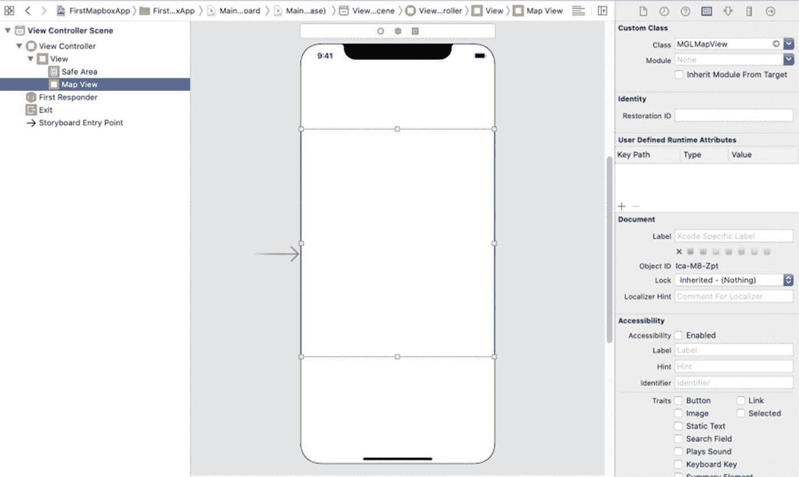

图 11-5

设置 MGLMapView 自定义类

让我们确保一切就绪。继续运行该应用程序。你应该会在 iOS 模拟器中看到一张基本的世界地图，类似于图 11-6。

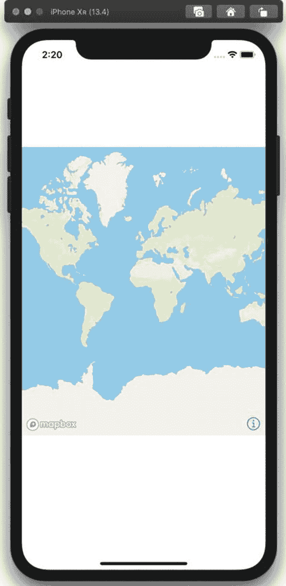

图 11-6

在地图视图中显示基本世界地图

提示

如果你看到一张带有信息按钮的空白地图，可能需要再次检查 Info.plist 文件中的 Mapbox 访问令牌。

现在我们有了地图视图，让我们通过将地图居中于新位置并选择不同的地图样式来改变地图的显示方式。

## 自定义地图视图的外观

我们的第一个任务是为地图视图创建一个 outlet，以便我们可以通过编程方式更改其属性。使用 Xcode 助理将一个 outlet 拖入 `ViewController` 类。将该 outlet 命名为 `mapView`。声明将如下所示：

```
@IBOutlet weak var mapView: MGLMapView!
```

你还需要在类顶部添加一条 import 语句：

```
import Mapbox
```

现在已将地图视图声明为变量，你可以轻松地将地图居中于新位置。在你的 `viewDidLoad()` 方法中，添加以下两行。请随意调整纬度和经度以匹配你的位置——我选取的位置是德克萨斯州奥斯汀的中心：

```
mapView.centerCoordinate = CLLocationCoordinate2D(
latitude: 30.2,
longitude: -97.75)
mapView.zoomLevel = 10
```

运行应用程序后，你会看到地图现在显示更多细节。通过编程方式调整缩放级别也很容易，缩放级别为 10 足以显示奥斯汀市中心。

Mapbox 的最佳特性之一是更改地图渲染方式的便捷性。你可以创建自己的地图样式，然后使用样式 URL 引用它们。或者你也可以使用一些内置的 Mapbox 样式——这些样式可通过 `MGLStyle` 类获得。尝试将地图视图的样式 URL 更改为户外样式：

```
mapView.styleURL = MGLStyle.outdoorsStyleURL
```

`MGLStyle` 类上可用的其他地图样式包括：

* `darkStyleURL`
* `lightStyleURL`
* `streetsStyleURL`
* `satelliteStyleURL`
* `satelliteStreetsStyleURL`

在第 12 章中，我们将使用相同的 `styleURL` 属性更详细地研究地图样式。接下来，我们继续在地图上显示一个基本标记。


## 在地图上显示点标注

Mapbox SDK 支持在地图上显示标记、叠加层和线条作为标注，类似于 iOS 的 `MapKit` 或 Google Maps。让我们从一个基础示例开始，展示一个简单的地图标记及其关联的标注弹窗。我们需要实现两个不同的步骤。第一步是创建标注并显示它。第二步是采用 `MGLMapViewDelegate` 协议，然后实现 `mapView:annotationCanShowCallout` 函数。让我们从显示标注开始。

当我们在特定的经纬度处理标注时，可以使用 `MGLPointAnnotation` 类。该类的实例具有 `coordinate`、`title` 和 `subtitle` 属性，类似于苹果 MapKit 框架中的 `MKPointAnnotation` 类。请继续创建一个名为 `displayAnnotation` 的函数，如代码清单 11-3 所示。你需要在 `viewDidLoad()` 方法的末尾调用 `displayAnnotation()`。

```
func displayAnnotation() {
    let annotation = MGLPointAnnotation()
    annotation.coordinate = CLLocationCoordinate2D(
        latitude: 30.25,
        longitude: -97.75)
    annotation.title = "Austin"
    annotation.subtitle = "Texas"
    mapView.addAnnotation(annotation)
}
```

代码清单 11-3：在地图视图上显示标注

我们还需要采用 `MGLMapViewDelegate` 协议。可以通过扩展 `ViewController` 类来实现。将代码清单 11-4 中的扩展添加到 `ViewController.swift` 文件的底部。

```
extension ViewController: MGLMapViewDelegate {
    func mapView(_ mapView: MGLMapView,
                 annotationCanShowCallout annotation: MGLAnnotation) -> Bool {
        return true
    }
}
```

代码清单 11-4：地图视图委托的扩展

委托中实现的唯一方法控制当用户选择某个标注时是否显示弹窗。如果我们有一些不显示信息的标注，这里可以有更复杂的逻辑，但我们可以直接返回 `true`。Mapbox 的默认行为是在一个简单的弹窗中显示标注的 `title` 和 `subtitle` 属性。

最后，我们需要告诉地图视图它有一个委托。在 `viewDidLoad()` 方法内部，添加这一行代码：

```
mapView.delegate = self
```

未来我们始终可以实现委托协议中的更多方法。现在继续运行项目，以便你能看到这个基础示例是如何工作的。你的代码应该类似于代码清单 11-5。

```
import UIKit
import Mapbox

class ViewController: UIViewController {
    @IBOutlet weak var mapView: MGLMapView!

    override func viewDidLoad() {
        super.viewDidLoad()
        // Do any additional setup after loading the view.
        mapView.centerCoordinate = CLLocationCoordinate2D(
            latitude: 30.2,
            longitude: -97.75)
        mapView.zoomLevel = 10
        mapView.styleURL = MGLStyle.outdoorsStyleURL
        mapView.delegate = self
        displayAnnotation()
    }

    func displayAnnotation() {
        let annotation = MGLPointAnnotation()
        annotation.coordinate = CLLocationCoordinate2D(
            latitude: 30.25,
            longitude: -97.75)
        annotation.title = "Austin"
        annotation.subtitle = "Texas"
        mapView.addAnnotation(annotation)
    }
}

extension ViewController: MGLMapViewDelegate {
    func mapView(_ mapView: MGLMapView,
                 annotationCanShowCallout annotation: MGLAnnotation) -> Bool {
        return true
    }
}
```

代码清单 11-5：Mapbox 的完整视图控制器类

在 iOS 模拟器中运行项目，然后点击标记后，你应该会看到类似图 11-7 的内容。

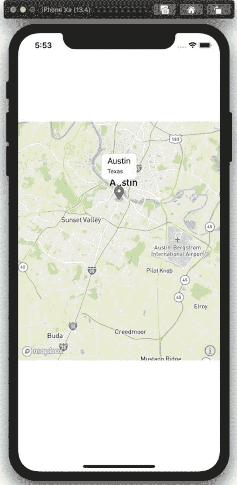

图 11-7：在地图视图上显示带有弹窗的标记

这是一个关于如何开始使用 Mapbox 的简单示例，但我们还没有真正涵盖任何使 Mapbox 与其他地图提供商不同的功能。在下一章中，我们将深入探讨如何使用 Mapbox 自定义地图的外观和感觉。这将为你的移动应用程序赋予独特的个性，而且操作起来非常简单。

## 使用 Mapbox 自定义地图样式

现在你已经了解了 Mapbox SDK 的基础使用方法，是时候深入研究 Mapbox 的一些独特之处了。使用 Mapbox，你几乎可以完全控制地图中显示的样式和功能。

在本章中，我们将在 Mapbox Studio 中创建一个自定义地图样式。然后我们将在 iOS 应用中使用该样式。

本章大部分内容将侧重于使用 Mapbox Studio，这是一个基于 Web 的工具，允许你自定义地图样式。本章的 iOS 部分非常简单，因为 Mapbox SDK 易于使用。我们在前一章已经了解了如何更改地图样式，这已经是我们需要做的全部了。

### 准备地图样式

对于这个项目，我们需要一个包含 Mapbox SDK 的 iOS 应用程序、一个正确配置的访问令牌，以及在视图控制器上有一个地图视图。你可以重复使用第 11 章的项目，也可以创建一个新的应用程序。你的视图控制器类应该有一个指向 Storyboard 中名为 `mapView` 的地图视图的出口。

### 更改地图视图上的默认样式

正如我们在前一章讨论的，地图视图使用样式 URL 来决定从服务器加载哪些瓦片。我们讨论了可以从 `MGLStyle` 类获取的内置样式 URL – 深色、浅色、户外、街道、卫星和卫星街道。要设置这些样式 URL，你的代码会是这样的：

```
mapView.styleURL = MGLStyle.outdoorsStyleURL
```

不过，Mapbox 并不仅仅局限于这些内置样式。你可以创建自己的 Mapbox 样式，这些样式会有一个类似于以下的统一资源标识符（URI）：

```
mapbox://styles/jefflinwood/aabb773344
```

地图视图对象的 `styleURL` 属性接受 `URL` 对象，你可以通过调用 `URL(string:)` 构造函数自行构造这些对象。在地图视图上设置样式 URL 会是这样：

```
mapView.styleURL = URL(string: mapStyleURI)
```

这就是你设置 iOS 应用以使用你创建的自定义样式所需做的全部工作。在本章的其余部分，我们将使用基于 Web 的 Mapbox Studio 应用程序来创建自定义样式。在你保存并发布该样式后，它将拥有自己的 `mapbox://` URI，你可以将其用于你的应用。


### 使用 Mapbox Studio 创建地图样式

Mapbox 提供了一个基于网页的应用程序 `Mapbox Studio`，你可以用它来自定义应用程序的地图样式。这些地图可用于你的 iOS 应用，同时也能在 Web 和 Android 应用中使用。所有样式的设计工作都在一个地方完成，从而让你的应用用户在不同平台上获得一致的体验。让我们首先打开地址为 [`https://studio.mapbox.com/`](https://studio.mapbox.com/) 的 `Mapbox Studio`（图 12-1）。

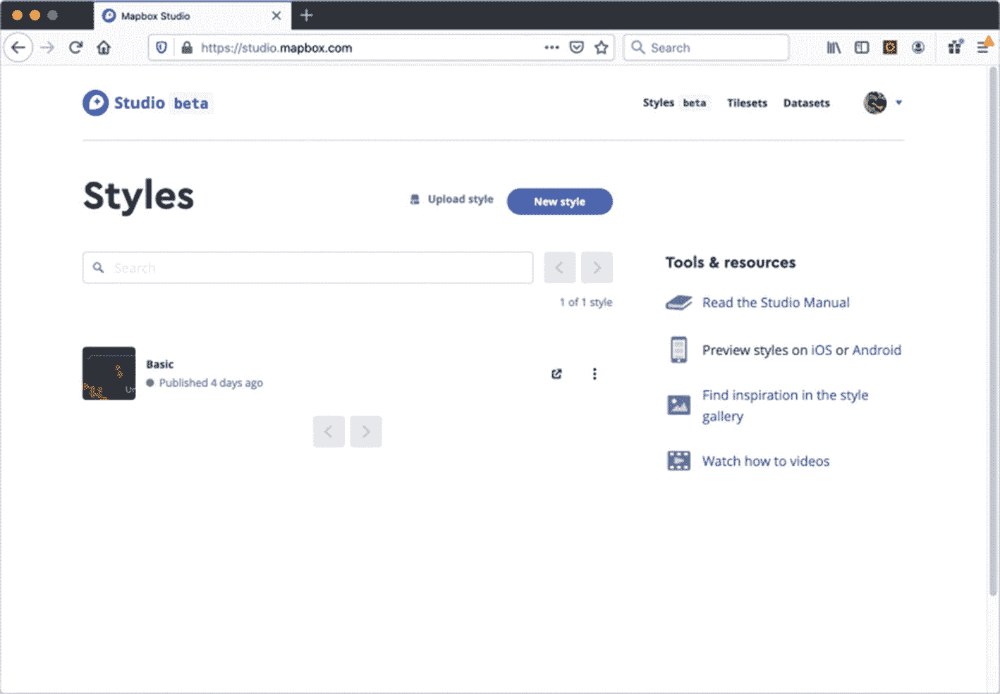

图 12-1

`Mapbox Studio`

浏览 `Mapbox Studio`，你会发现示例样式、文档和有用的视频。不妨看看一些工具和资源，了解该应用的新功能——在撰写本文时，`Mapbox Studio` 仍处于测试版发布阶段。

接下来，我们创建一个新样式。点击 Studio 主页上那个大大的蓝色按钮 `New Style`（新建样式）。你会看到一个巨大的模板选择界面。花些时间浏览一下所有不同的模板及其变体（图 12-2）——你可能会找到一个非常适合你应用的样式。

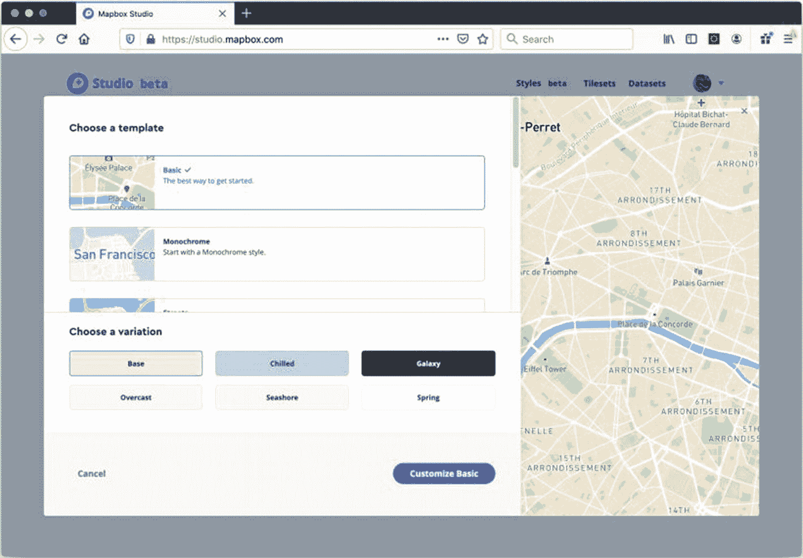

图 12-2

`Mapbox Studio` 样式模板

对于本项目，我们将使用 `Basic`（基础）模板的 `Galaxy`（星系）变体（图 12-3）——但你完全可以根据自己的选择，使用任何变体来创建项目。

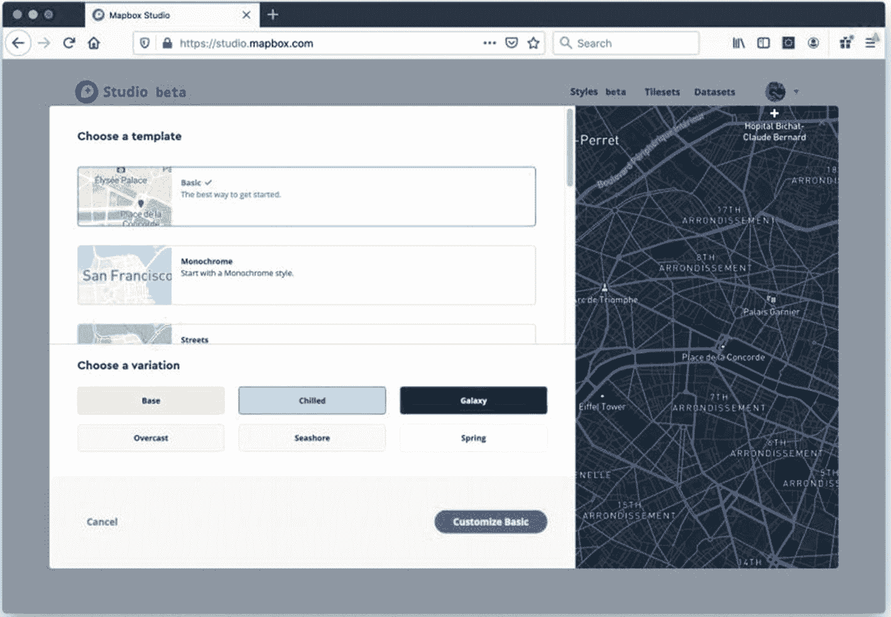

图 12-3

使用 `Galaxy` 变体的 `Basic` 模板

选择 `Galaxy`（或其他变体），然后点击 `Customize Basic`（自定义基础）按钮，进入详细的样式编辑器，如图 12-3 所示。

样式编辑器（图 12-4）拥有几个不同的功能，但如果您想要自定义地图的显示效果，其中一种方法是调整地图上各个图层的显示。左侧边栏中的 `Components`（组件）视图是执行此操作的最简单方式。例如，你可以选择 `Road network`（道路网络），选取 `Galaxy` 变体中使用的一种颜色，然后从颜色选择器中挑选一种新颜色。类似地，你还可以更新水体、地名标签或地图中任何其他元素使用的颜色。

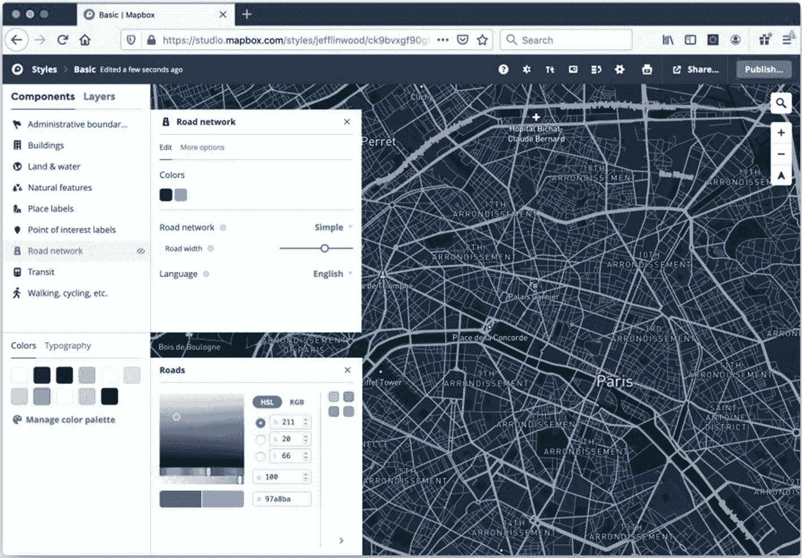

图 12-4

样式编辑器，左侧边栏显示组件

你可以完全控制哪些要素显示在地图上，也可以将它们禁用。例如，如果你不需要在地图上显示分区名称，可以通过在 `Components`（组件）侧边栏中选择 `Place labels`（地名标签）组件，向下滚动到 `Settlement subdivisions`（聚落分区），然后关闭开关来轻松禁用它，如图 12-5 所示。

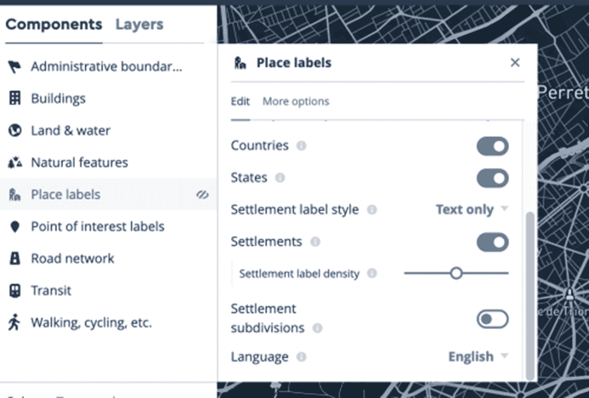

图 12-5

在 `Mapbox Studio` 中更改分区地名的显示

如果你需要更精细的控制，侧边栏中的 `Layers`（图层）视图下可以查看所有图层，并且每个图层都有一个详细的样式编辑器，为你提供非常大的控制权。

从侧边栏中选择 `Layers`（图层），选取 `state-label`（州标签）图层，然后查看不同的选项。你可以在此处选择不同的字体、更改其大小以及调整文本设置（图 12-6）。

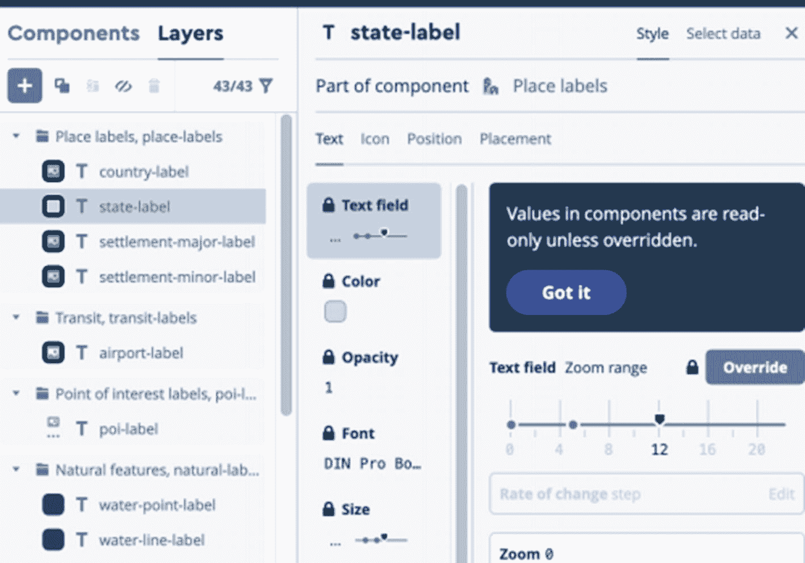

图 12-6

地名标签的文本样式

在这个项目中，我们不打算在这个层级更改任何内容，但拥有这样的选项是非常强大的。关闭可能遮挡示例地图视图的任何已打开的样式编辑器，然后使用窗口右侧带有放大镜图标的搜索栏，将地图的中心视点更改为你的位置（图 12-7）。

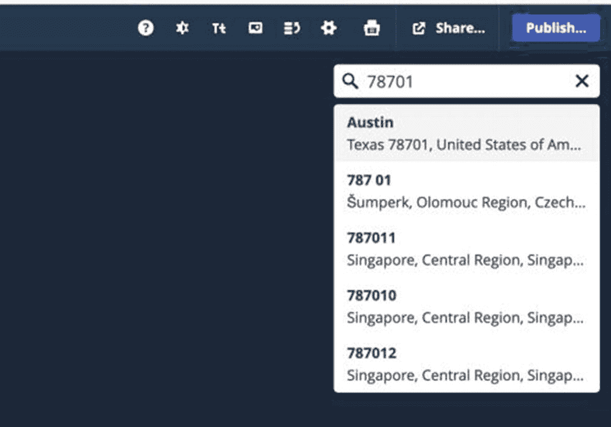

图 12-7

`Mapbox Studio` 的位置选择器

选择你的位置，然后放大或缩小，直到得到你希望看到的地图视图（图 12-8）。

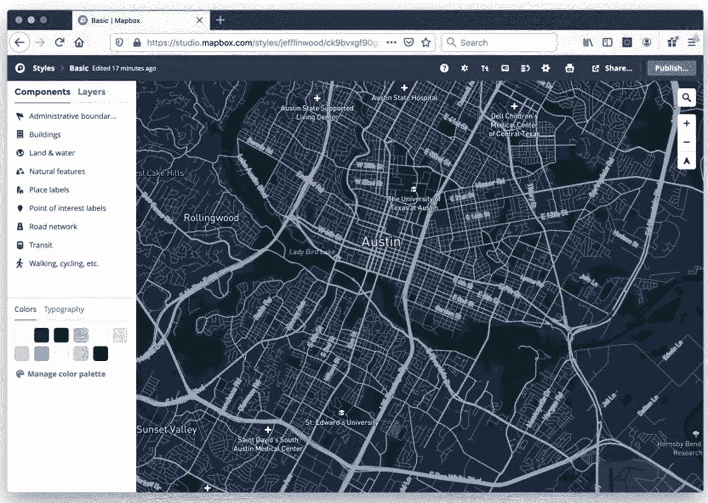

图 12-8

`Mapbox Studio` 显示德克萨斯州奥斯汀，而非默认位置

探索你的区域，如果地图样式不完全符合你的要求，不妨花些时间用编辑器来修改它！

如果你对地图样式感到满意，或者只是想在你的 iOS 应用中查看这张地图，请点击编辑器右上角的 `Publish`（发布）按钮。将会弹出一个对话框（图 12-9），左侧显示你已发布的地图样式，右侧显示你正在编辑的草稿版本。这让你可以轻松对比和对照你的编辑内容。如果一切看起来不错，并且你想替换现有样式，请继续点击 `Publish`（发布）。如果你想从现有样式派生出一个新样式，请点击 `Publish as new`（发布为新样式）。如果你选择 `Publish as new`，`Mapbox` 会将你的更改保存为一个副本，名称类似 `Basic-copy`。

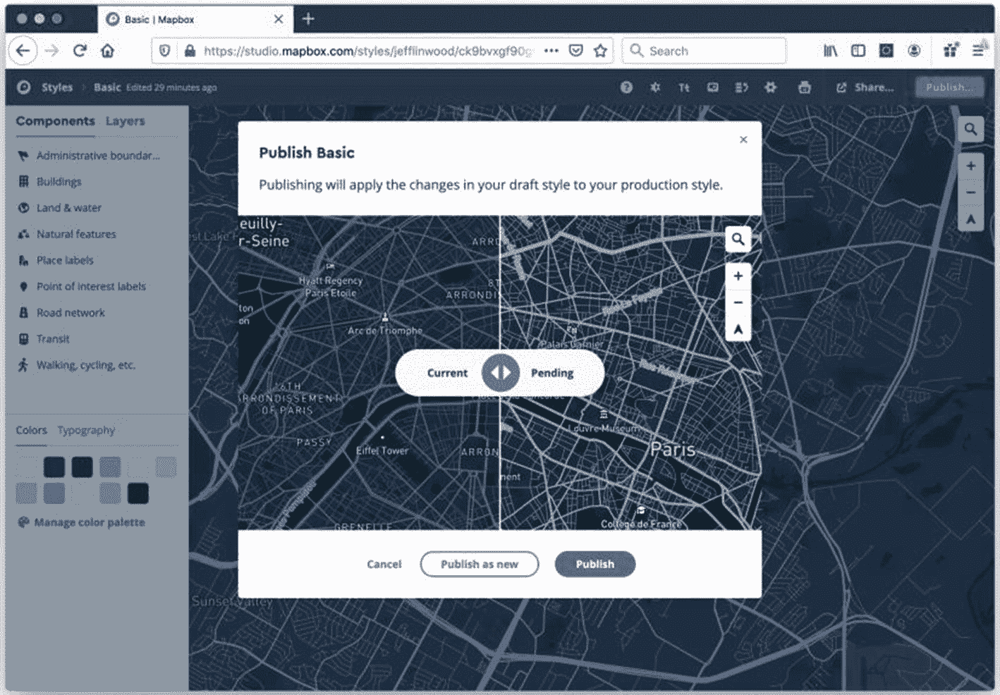

图 12-9

发布地图样式对话框

无论是发布了新地图样式还是创建了新地图样式后，请点击左上角的 `Styles`（样式）按钮，返回 `Mapbox Studio` 主屏幕。你会在主屏幕上看到列出的样式，如图 12-10 所示。

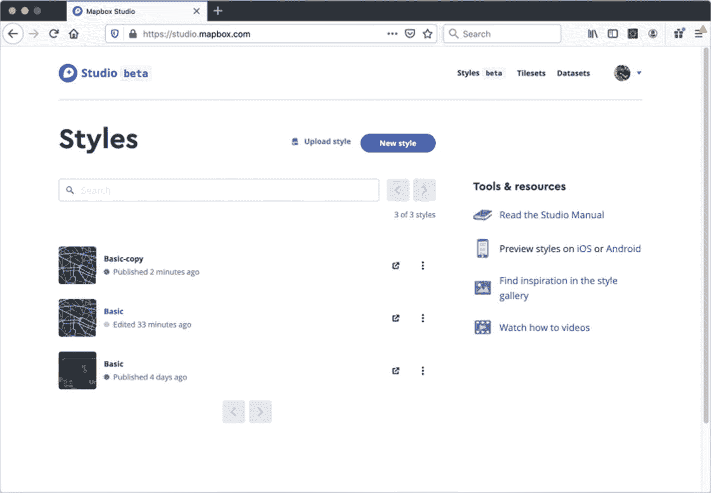

图 12-10

显示新样式的 `Mapbox Studio` 主屏幕

现在，让我们在 iOS 应用中尝试使用我们的新地图样式！在地图样式的右侧，你会看到一个三点按钮，点击它会打开一个弹出菜单（图 12-11）。点击该按钮，然后点击出现的剪贴板图标，复制你地图样式的 `Mapbox` 样式 URL。

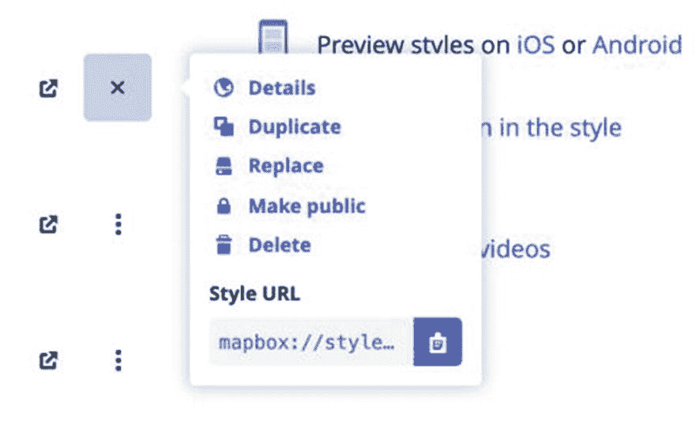

图 12-11

地图样式的弹出菜单，包含样式 URL 和复制按钮

保存好样式 URL，然后返回 `Xcode`。我们将告诉地图视图使用该样式，然后运行我们的 iOS 应用，以查看新的地图样式。


### 在应用中显示新地图样式

将该样式 URL 复制到你的 iOS 应用中，并在 `ViewController` 类中将其存储在一个名为 `mapStyleURI` 的常量中。你的 URL 将因你的账户和样式而异：

```
let mapStyleURI = "mapbox://styles/jefflinwood/zfgwe"
```

现在，按照本章前面讨论的方法，设置地图样式 URL：

```
mapView.styleURL = URL(string:mapStyleURI)
```

你还可以将地图的起始位置设置为你熟悉的区域。一个完整的 `viewDidLoad()` 方法如代码清单 12-1 所示。

```
override func viewDidLoad() {
super.viewDidLoad()
// 加载视图后的其他设置
mapView.centerCoordinate = CLLocationCoordinate2D(
latitude: 30.2,
longitude: -97.75)
mapView.zoomLevel = 10
mapView.styleURL = URL(string: mapStyleURI)
}
代码清单 12-1
viewDidLoad 方法，展示新的样式 URL
```

请务必在你的类中设置 `mapStyleURI` 常量。现在运行应用，你将在 iOS 应用中看到新的地图样式，类似于图 12-12。

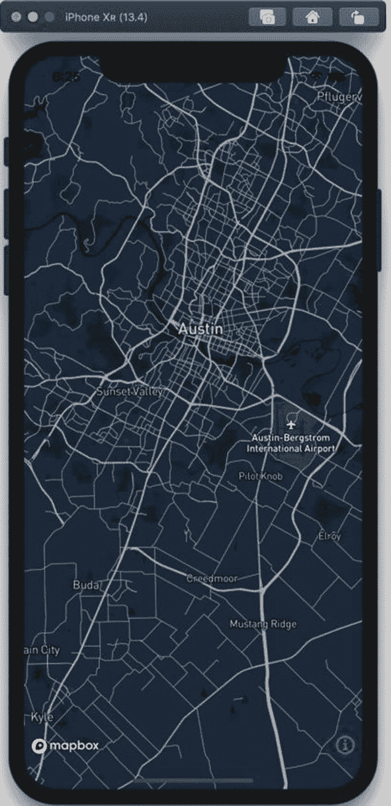

图 12-12

在 iOS 应用中显示新的地图样式

使用 Mapbox Studio，你可以在 Web 上根据需要随时更新样式，只要将更改发布到现有样式，你的 iOS 应用将在下次加载地图时自动应用这些更改。

在下一章中，我们将把一个数据集上传到 Mapbox Studio，然后在 iOS 应用中展示。你可以将此技术用于需要在 Mapbox Studio 中自定义样式的要素，或者当数据量过大，无法在地图上以标记注释形式合理处理（考虑到性能）时使用。

### 在 Mapbox Studio 中使用数据集

使用 Mapbox Studio，我们可以将大型数据集作为新图层添加到地图中。在本章中，我们将在第 12 章创建的自定义地图样式基础上继续构建。加载数据集后，我们无需任何更改即可在地图视图中查看它。我们还将了解当用户与地图交互时，如何检索底层数据要素。

本章使用我们在第 12 章中使用 Mapbox Studio 创建的项目作为基础。如果你尚未创建自定义地图样式并在地图视图中显示，请先按照说明进行操作。

### 地震地图

该项目涉及收集关于地震的 GeoJSON 数据，将该数据作为数据集上传到 Mapbox Studio，然后根据数据创建瓦片集。拥有瓦片集后，我们可以在 Mapbox Studio 中自定义数据的显示外观，包括增加地图上数据点的大小以匹配地震的震级。然后，我们可以在应用中显示数据，并检测用户何时点击了其中一个地震点。完成该项目后，我们将得到一个如图 13-1 所示的应用。


图 13-1

应用中的地震数据点

让我们从第一步开始，收集我们需要在地图上显示的数据。

### 下载地震数据

我们用于可视化的地震数据集来自美国地质调查局（USGS）。如果你对此感兴趣，并想了解更多关于地震监测和研究的信息，请访问他们的网站 [`www.usgs.gov/natural-hazards/earthquake-hazards`](https://www.usgs.gov/natural-hazards/earthquake-hazards)。

你还可以访问 [`https://earthquake.usgs.gov/earthquakes/map/`](https://earthquake.usgs.gov/earthquakes/map/) 查看地震地图，该地图会从服务器频繁刷新。我们将制作类似的内容，但使用历史地震数据。

地震目录（可通过 [`https://earthquake.usgs.gov/fdsnws/event/1/`](https://earthquake.usgs.gov/fdsnws/event/1/) 访问）列出了地震危害计划支持的所有不同 API。我们的目的是查询历史地震信息，然后将结果作为 GeoJSON 返回。GeoJSON 是一种用于地理要素（包括点、线和多边形及其相关属性）的数据编码格式。

我们将用于下载数据的 URL 是：

```
https://earthquake.usgs.gov/fdsnws/event/1/query?format=geojson&starttime=2020-01-01&endtime=2020-01-02
```

我们将开始时间指定为 2020 年 1 月 1 日，结束时间指定为 2020 年 1 月 2 日。我们还要求服务器返回 GeoJSON 格式，而不是 XML、CSV 或其他格式。你将看到一个包含 610 个不同要素的大型 GeoJSON 文件。代码清单 13-1 包含该 JSON 文件的编辑示例，只包含一个要素及其两个属性。

```
{
"type": "FeatureCollection",
"metadata": {
"generated": 1587256320000,
"url": "https://earthquake.usgs.gov/fdsnws/event/1/query?format=geojson&starttime=2020-01-01&endtime=2020-01-02",
"title": "USGS Earthquakes",
"status": 200,
"api": "1.8.1",
"count": 610
},
"features": [
{
"type": "Feature",
"properties": {
"mag": 1.3,
"title": "M 1.3 - 38km SE of Tanana, Alaska"
},
"geometry": {
"type": "Point",
"coordinates": [
-151.59520000000001,
64.892200000000003,
2.5
]
},
"id": "ak02021ksej"
}
],
"bbox": [
-179.2752,
-53.0907,
-1.75,
175.8577,
69.6006,
392.48
]
}
代码清单 13-1
地震 API 查询的 GeoJSON 响应示例
```

发起 API 调用，然后将结果下载到 GeoJSON 文件中——尝试使用 Web 浏览器或 `curl` 命令。本书的可下载源代码中，在第 13 章文件夹中也包含了该 GeoJSON 文件。如果你愿意，可以尝试使用 API 查询其他日期范围。对于这个特定项目，我们将使用 `mag` 属性（地震震级），因此其他 GeoJSON 源可能与此过程不完全匹配。然而，这里使用的概念可以很好地迁移到其他项目。

接下来，我们将获取刚刚下载的地震列表，并将它们上传到 Mapbox Studio。


### 在 Mapbox Studio 中创建数据集

`Mapbox Studio` 允许您在云端保存和编辑 `GeoJSON` 要素的集合，例如我们刚刚下载的地震数据。这些数据集可以转换为瓦片集，然后便可在我们在第 12 章中使用的 `Mapbox Studio` 样式编辑器中进行编辑。我们将完成从上传数据集到在编辑器中设置要素样式的整个过程。

首先，我们在 `Mapbox Studio` 上创建一个数据集。访问 `Mapbox Studio` 的数据集页面 (图 13-2) ([`https://studio.mapbox.com/datasets/`](https://studio.mapbox.com/datasets/))，或点击右上角的“数据集”链接。您将看到您已创建的所有数据集，或上传新数据集的选项。

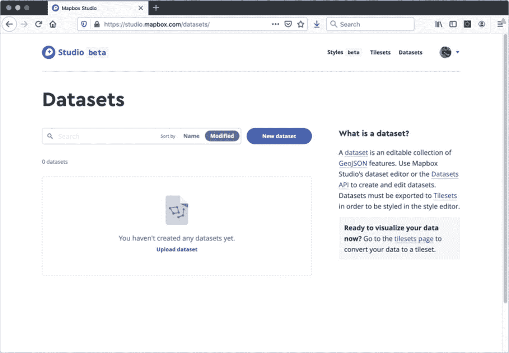

图 13-2
`Mapbox Studio` 数据集网页

点击蓝色的 `新建数据集` 按钮，会弹出一个对话框，提供创建空白数据集或上传 `GeoJSON` 文件的选项。在对话框的标签栏中选择 `上传` (图 13-3)。

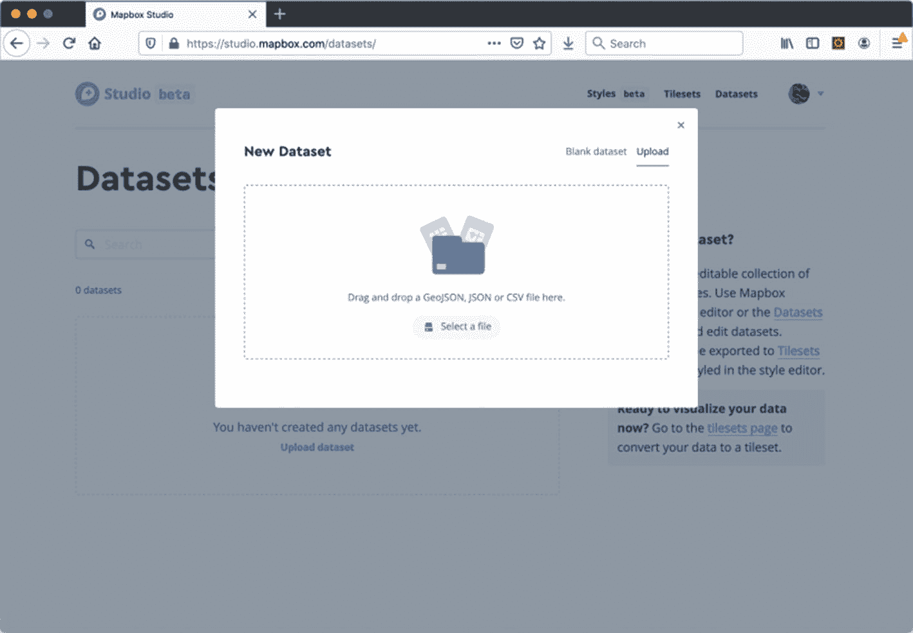

图 13-3
向 `Mapbox Studio` 上传新数据集

选择您在本章上一部分下载的 `GeoJSON` 文件，然后上传。`Mapbox Studio` 将处理该文件并找到所有 `GeoJSON` 要素 (图 13-4)。

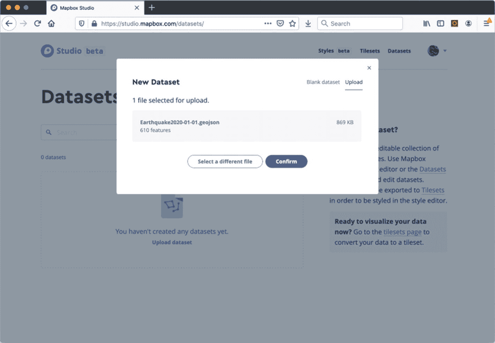

图 13-4
确认数据集上传到 `Mapbox Studio`

如果 `Mapbox` 找到的要素数量与您期望在 `GeoJSON` 文件中看到的数量一致，请点击 `确认` 按钮。您可以随意命名您的数据集，但默认名称将是您上传文件的名称。在我们的例子中，默认名称是 `Earthquake2020-01-01`。如果这个名称可以接受，请点击 `创建` 按钮。

`Mapbox Studio` 将导入这些要素，您会看到一条确认消息，类似于图 13-5 中的对话框。

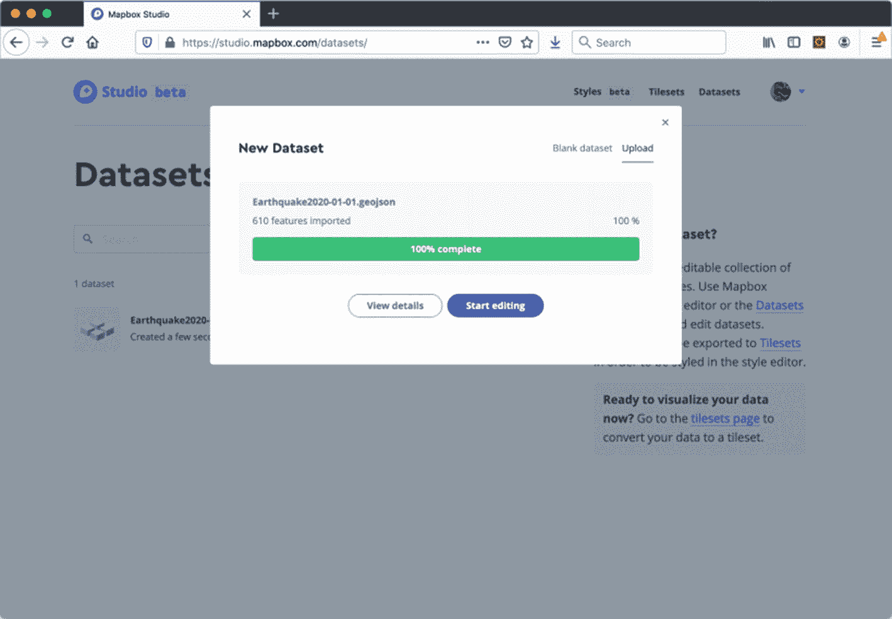

图 13-5
数据集上传确认对话框

如果您开始编辑数据集，您将看到数据集在简单的地图背景上绘制出来 (图 13-6)。您可以选择数据集中的任何点，并检查或修改数据。

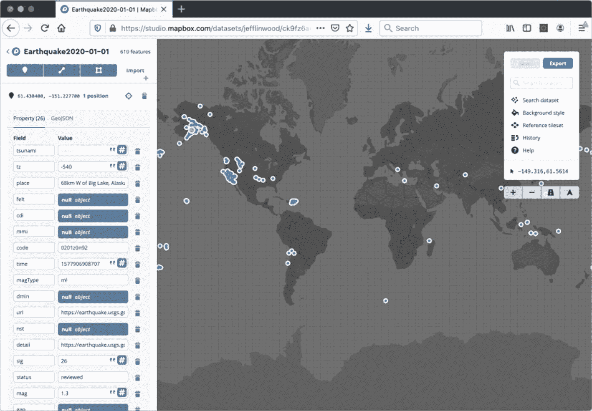

图 13-6
显示一个地震点的数据集编辑器

在我们的案例中，我们使用的是来自 API 的干净数据，因此无需检查数据是否存在异常或清理缺失值。我们也可以快速浏览一下数据，看看刚才导入的数据集是否合理，以及是否与我们预期数据点出现的位置相匹配。

此数据集已正确导入，我们可以根据此数据集创建一个瓦片集。数据集和瓦片集之间的区别在于，我们可以在瓦片集中修改数据在地图上的呈现方式，而不是编辑数据集中的数据值。

点击左上角的蓝色 `Mapbox` 图标返回数据集屏幕 (图 13-7)，或在网页浏览器中导航到 [`https://studio.mapbox.com/datasets/`](https://studio.mapbox.com/datasets/)。选择您刚刚上传的地震数据集旁边的三点弹出菜单，然后从弹出菜单中选择 `查看详情`。

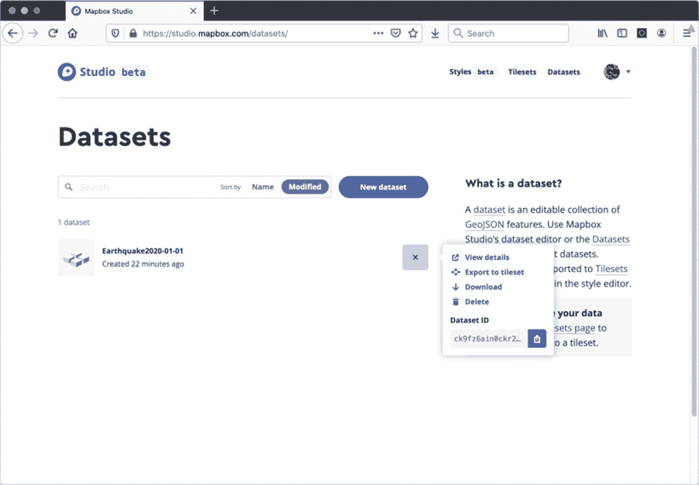

图 13-7
用于查看数据集详情的弹出菜单

图 13-8 中显示的数据集详情屏幕允许您将此数据集导出为瓦片集。

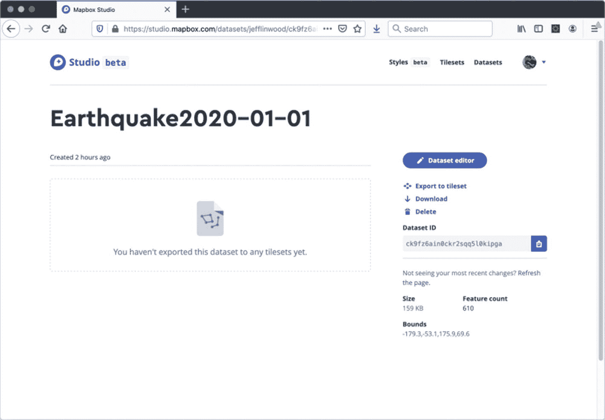

图 13-8
数据集详情屏幕

在下一节中，我们将创建一个瓦片集。这个瓦片集将用于 `Mapbox Studio` 样式编辑器中，以更改数据在地图上的外观。

### 创建瓦片集

在数据集的详情屏幕上，`Mapbox Studio` 提供了一种创建瓦片集的简单方法。点击右侧栏中的 `导出为瓦片集` 链接。将出现一个对话框 (图 13-9)，询问您是希望导出到新瓦片集还是更新连接的瓦片集。

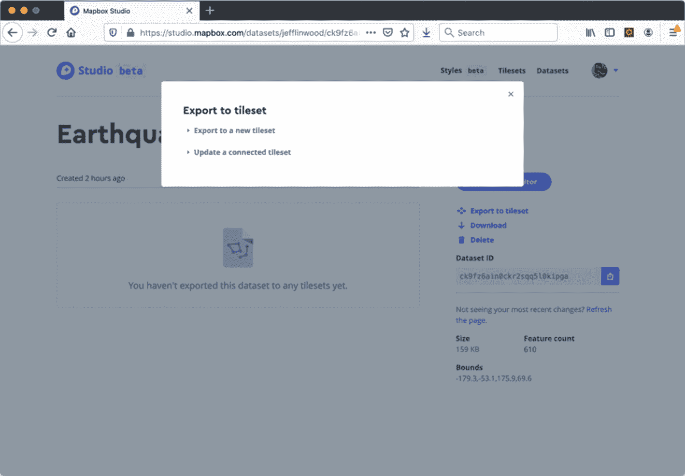

图 13-9
导出为瓦片集对话框

我们将导出到新瓦片集，因此点击该链接。会出现一个文本框，其中包含一个建议的瓦片集名称（与数据集同名）。如果没问题，点击 `导出`，然后 `Mapbox` 会将数据集处理成瓦片集。此转换完成后，您会看到数据集详情屏幕上出现一个已连接的瓦片集 (图 13-10)。

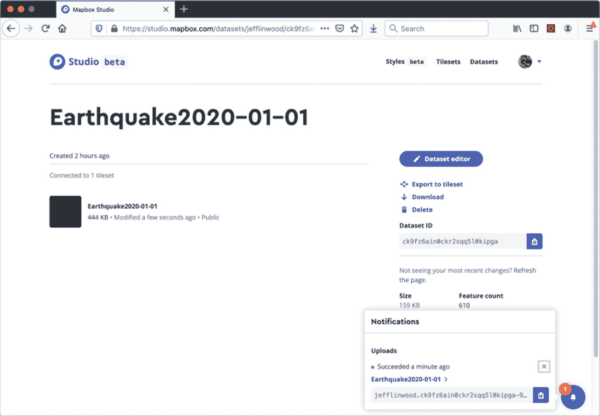

图 13-10
数据集详情屏幕上的已连接瓦片集及处理通知

如果您点击该瓦片集，您将看到瓦片集内数据的预览，就像它在地图上布局的样子。这有助于确认数据集导出处理正确。

我们的下一步是将这个瓦片集添加到我们在第 12 章创建的地图样式中。如果您尚未创建地图样式，请按照第 12 章的说明进行操作。

### 将瓦片集添加到样式

现在我们需要打开我们的地图样式，将瓦片集作为一个图层添加。点击网页右上角的 `样式` 选项卡，或导航到 [`https://studio.mapbox.com/`](https://studio.mapbox.com/) 查看您的样式列表。选择您在上一章创建的地图样式，然后点击进入样式编辑器。

在样式编辑器中，选择左侧边栏中的 `图层` 选项卡。我们需要添加一个新图层，因此点击 `图层` 选项卡右上角的加号按钮。当 `新图层` 窗口出现时，将显示一个数据源列表，其中包括历史选举结果。

在筛选框中输入 `earthquake`，您将看到您的瓦片集出现 (图 13-11)。

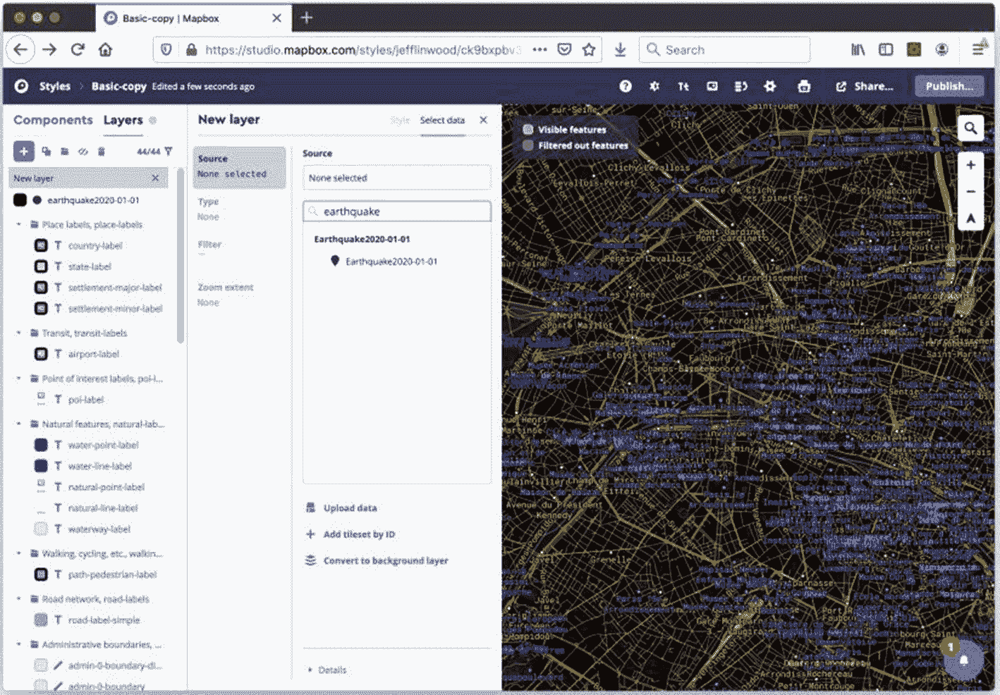

图 13-11
将瓦片集添加到地图样式

在搜索结果窗口中选择该瓦片集，然后缩放到世界上另一个构造活跃且有地震的地区，比如阿拉斯加。您将看到我们上传的 `GeoJSON` 中的要素显示在地图上，如图 13-12 所示。绿色圆点仅用于参考，并非瓦片集的初始显示方式。它们表明您的所有数据都将显示在地图上——您可以应用一个过滤器，根据条件不显示某些数据。如果某个数据点被过滤掉，该数据将会以红点的形式显示在此处。

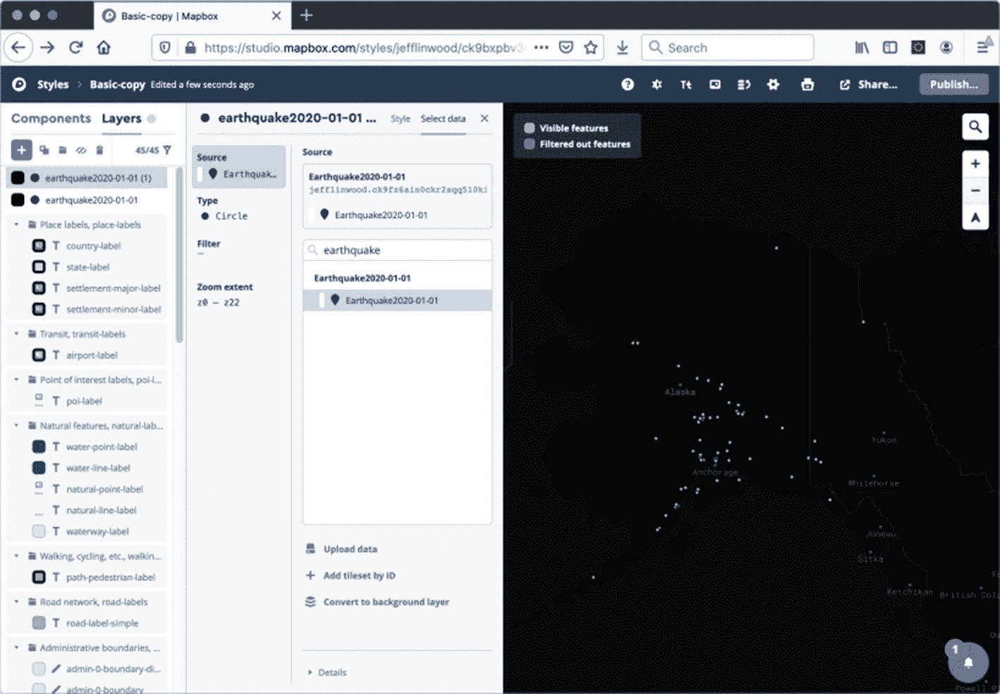

图 13-12
将瓦片集添加到地图工作室，要素显示为绿色圆点

现在我们已经添加了瓦片集，我们可以更改其在任何使用此样式的地图中的显示方式。


### 使用 Mapbox Studio 为要素设置样式

在图层侧边栏中，找到你刚刚添加的地震图块集。点击它，你会看到一个图层样式编辑面板以窗口形式弹出（图 13-13）。

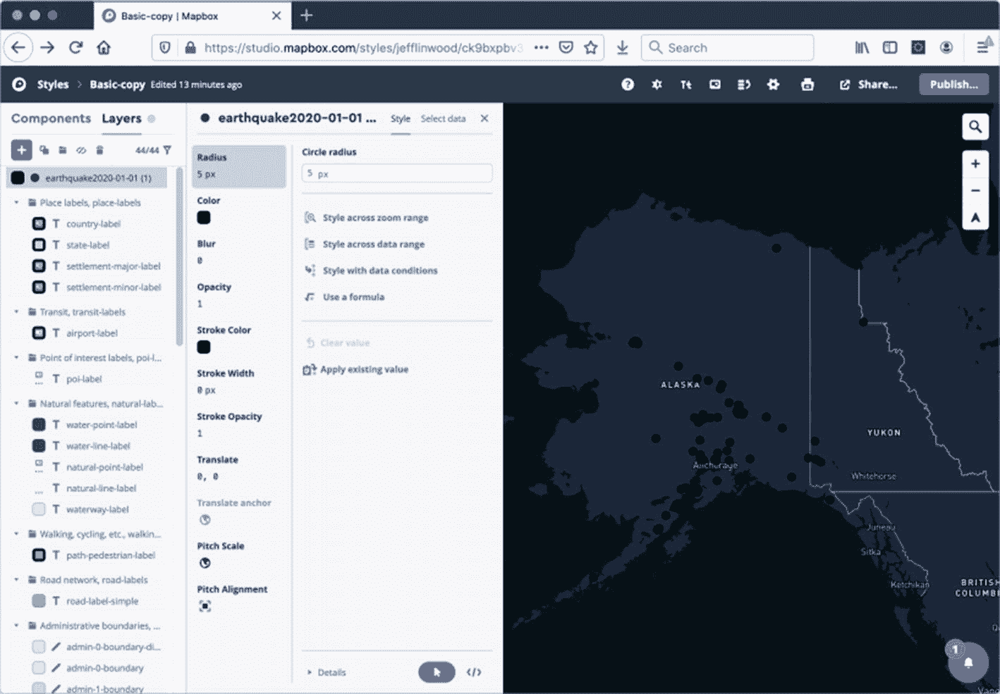

图 13-13 地震图层的默认图块

这也许很难看清，但地图上的每个数据点都以 5 像素的圆形显示，填充为黑色，没有轮廓。这在深色地图上无法提供很好的对比度，所以让我们更改填充颜色（标记为 `color` 的属性）。选择该颜色属性，会弹出一个颜色选择器。选择一个更亮的颜色，例如红色。如果你正在查看有过地震的区域，你将立即看到地图上的数据点改变了颜色，如图 13-14 所示。

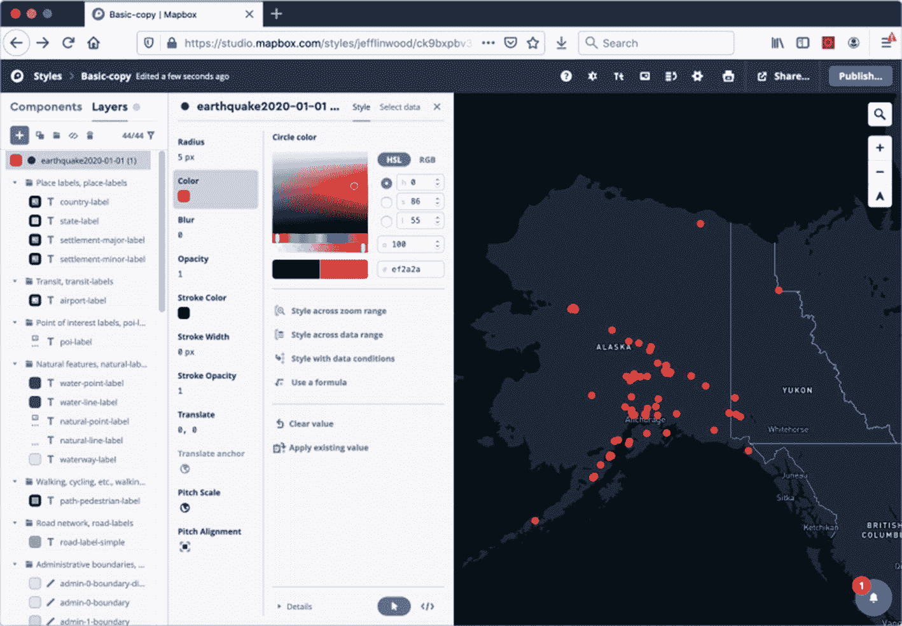

图 13-14 数据点填充为红色

你还可以更改描边颜色和描边轮廓，以使数据点的对比度更高。尝试将描边颜色设置为十六进制颜色值 `ece9e9`，并将描边宽度调整为 1 像素。如果你愿意，也可以在这里选择自己的颜色；这不会影响项目。

接下来，让我们尝试通过用于显示点的圆半径来传递一些关于地震震级的信息。Mapbox Studio 允许你利用地图中每个要素的属性来更改地图样式的属性。选择半径，然后选择“按数据范围设置样式”的链接。你会看到一个数据字段选择器弹出，让你可以找到一个数值型数据字段。查找 `mag` 数据字段，它是震级（magnitude）的缩写（图 13-15）。

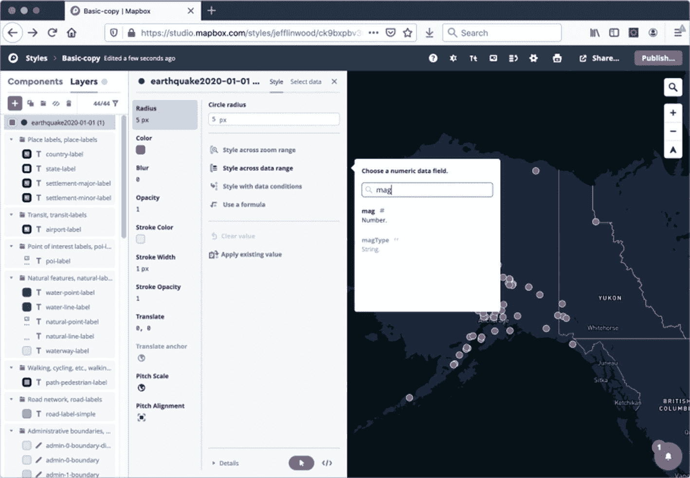

图 13-15 选择震级数据字段来改变半径字段

选择了震级字段后，会出现几个选项用于改变半径。我们将采用简单的线性插值，最小震级对应 5 像素，最大震级对应 15 像素。

图 13-16 展示了选择按数据范围设置样式并使用震级字段后，圆形的半径设置。

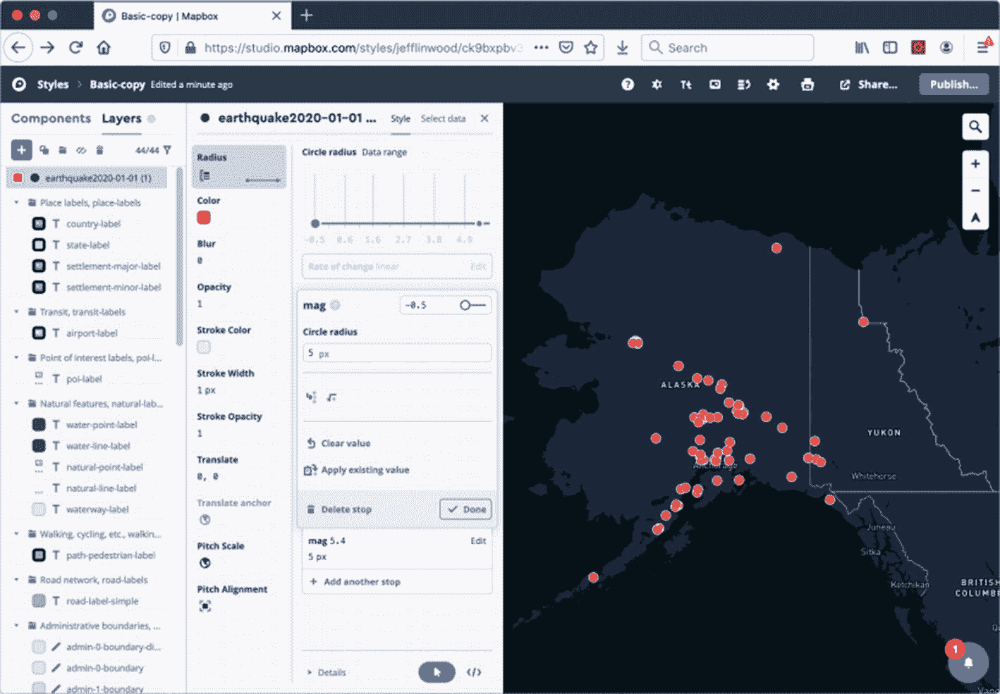

图 13-16 编辑地震数据的半径数据设置

这个设置视图可能有点令人困惑。震级数据点的线性插值有两个断点——最低值 `–0.5`，和最高值 `5.4`。两者的圆半径都是 5 像素，所以没有变化。

我们要做的是保留最低设置不变，然后更改最高值。点击底部的值 `5.4`，然后将圆半径改为 `15 px`，如图 13-17 所示。你将看到折线图立即开始显示半径值从左到右上升。除非你想更改某个断点的值，否则不要修改你看到的滑块上的数值。

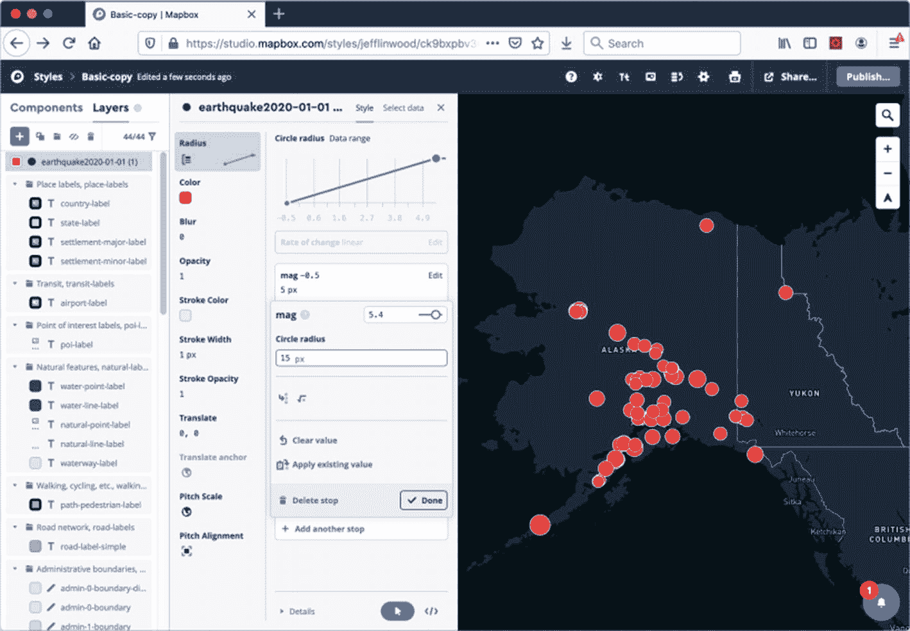

图 13-17 调整半径随震级线性变化

务必点击“完成”以保存对半径的更改。你可以在此处添加更多断点，以便为中间值设置半径。

你也可以更改其他值，例如颜色或描边大小，使其随震级变化，或随数据集中其他属性变化。请随意进行实验。

现在，让我们发布地图样式的更改。点击屏幕右上角蓝色的“发布”按钮，如图 13-17 所示。点击发布后，会弹出一个对话框，通过直观地显示差异来让你确认更改（图 13-18）。

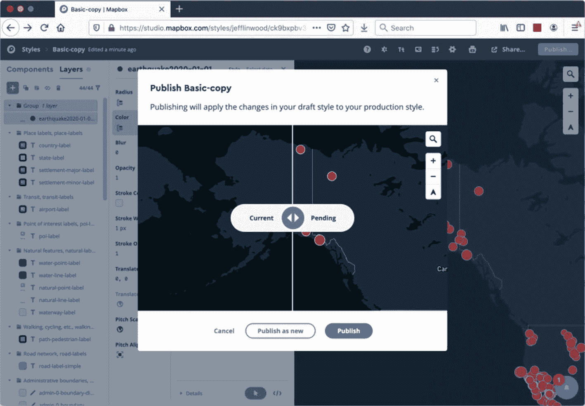

图 13-18 发布对地图样式的更改

你可以在该对话框中看到你添加的数据，以及应用的新地图样式。如果一切看起来没问题，点击“发布”，你的更改将对使用此地图样式的任何网站或移动应用生效。如果你想发布此地图样式的新版本，例如，为了避免改变现有用户的视觉和体验，你也可以通过此对话框进行操作。

你会收到一条漂亮的确认消息，提示样式已成功发布（图 13-19）。

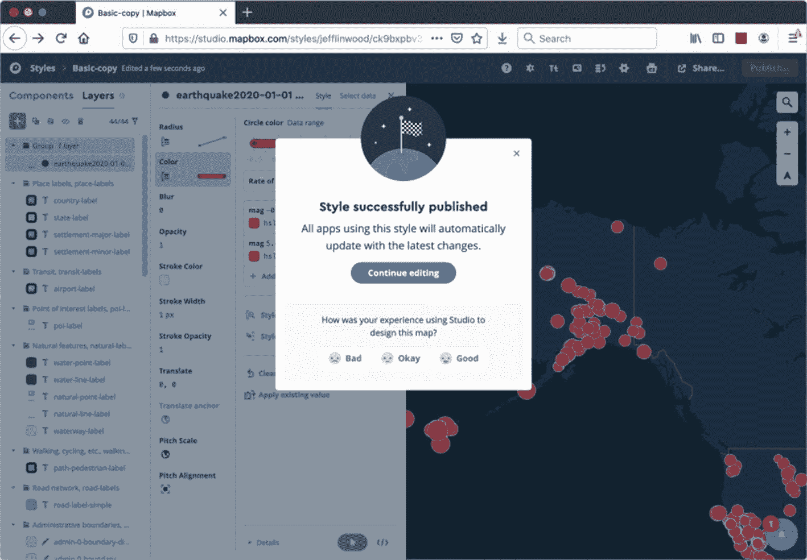

图 13-19 地图样式的发布确认消息

现在我们可以离开 Mapbox Studio，打开 Xcode 来查看应用中的更改。

### 在应用中显示数据集

运行第 12 章的应用，应该能显示你刚刚编辑的地图样式，并带有地震数据点。无需更改代码。如果没有看到地震数据，请确保你在 Mapbox Studio 中发布了地图样式，并且你正在查看世界上发生过地震的区域。

以下代码片段将在你的地图中显示阿拉斯加州的大部分区域：

```
mapView.centerCoordinate = CLLocationCoordinate2D(
latitude: 61.2,
longitude: -149.9)
mapView.zoomLevel = 3
```

你可能还想再次确认你的应用程序是否使用 `styleURL` 属性正确设置了地图样式。你可以在 Mapbox Studio 的主屏幕上，通过点击样式旁边的弹出菜单并复制其中的样式 URL 来找到地图样式：

```
mapView.styleURL = URL(string: mapStyleURI)
```

在模拟器中运行你的应用后，你应该会看到类似图 13-20 的内容。

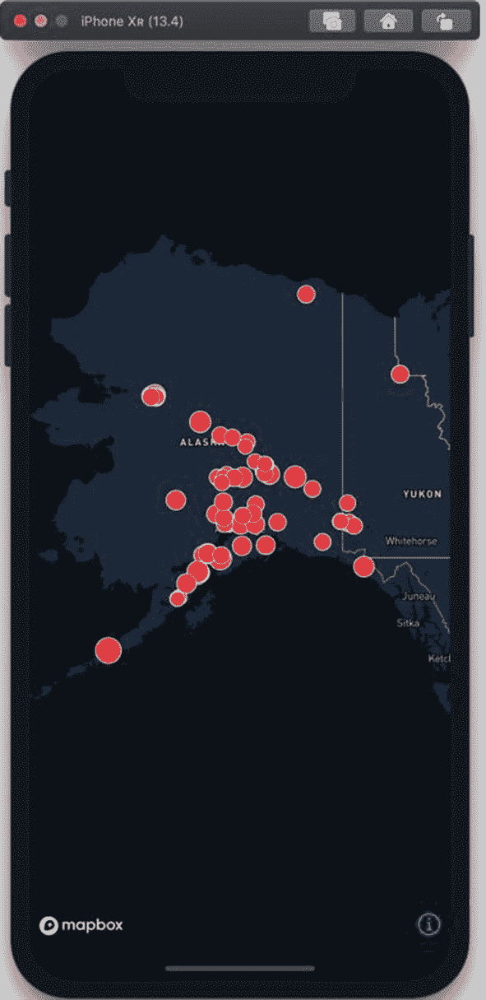

图 13-20 应用中的地震数据点

虽然这些数据点不像我们在第 11 章中使用的地图标记，但它们是用户点击地图时我们可以检测到的要素。在本项目的最后一部分，让我们在用户点击某个数据点时，在控制台上打印一些信息。


### 检测对要素的轻点

当用户轻点地图时执行某些操作，我们需要向地图视图添加一个标准的 `UIKit` 轻点手势识别器。`MGLMapView` 类已内置多个轻点识别器，用于检测滚动、缩放等地图操作的用户输入。我们需要添加一个轻点手势识别器，并仅当内置轻点手势识别器未处理该轻点时，才触发其操作。这是 Mapbox 地图视图的常见模式，并非局限于检测数据要素的轻点用例。

在您的 `ViewController` 类中添加清单 13-2 中的方法，然后在视图控制器的 `viewDidLoad()` 方法中调用 `addGestureRecognizer()` 函数。

```
func addGestureRecognizer() {
let tapGR = UITapGestureRecognizer(target: self,
action: #selector(mapTapped(sender:)))
for recognizer in mapView.gestureRecognizers!
where recognizer is UITapGestureRecognizer {
tapGR.require(toFail: recognizer)
}
mapView.addGestureRecognizer(tapGR)
}
清单 13-2
向地图视图添加轻点手势识别器
```

轻点手势识别器将调用名为 `mapTapped(sender:)` 的方法，我们也需要实现该方法。当地图被轻点时，我们将要求地图视图识别该点上的任何要素，然后将这些要素列出到控制台。如果需要，您也可以指示地图视图仅显示特定图层中的要素。

`mapTapped(sender:)` 方法需要添加 `@objc` 注解才能使选择器正常工作。该方法的实现如清单 13-3 所示。

```
@objc func mapTapped(sender: UITapGestureRecognizer) {
let mapPoint = sender.location(in: mapView)
let features = mapView.visibleFeatures(at: mapPoint)
print(features)
}
清单 13-3
当用户轻点应用时查找可见的地图要素
```

将上述方法添加到应用中，然后运行应用。请确保同时在 `viewDidLoad()` 方法中添加对 `addGestureRecognizer()` 的调用。当您轻点某个地震圆圈时，将在 Xcode 的控制台中看到该要素的属性输出。

### 结论

这是此处最简单的实现方案——例如，我们可以轻松扩展此方案，以更新应用内界面（如底部工具栏）中的标签，显示数据点的相关信息。地图返回的地震数据要素将是 `MGLPointFeature` 对象。如果我们上传了包含折线或多边形的 GeoJSON 数据，它们将是实现 `MGLFeature` 协议的其他类，例如 `MGLPolylineFeature` 或 `MGLPolygonFeature`。

这是一个相当复杂的项目，但我希望您喜欢处理真实数据并使用 Mapbox Studio 构建可视化效果。

在下一章中，我们将离开 Mapbox Studio，将注意力转向使用 Mapbox 提供驾驶导航。我们将创建一个应用，使用 Mapbox Navigation 框架提供逐向导航的用户体验。

