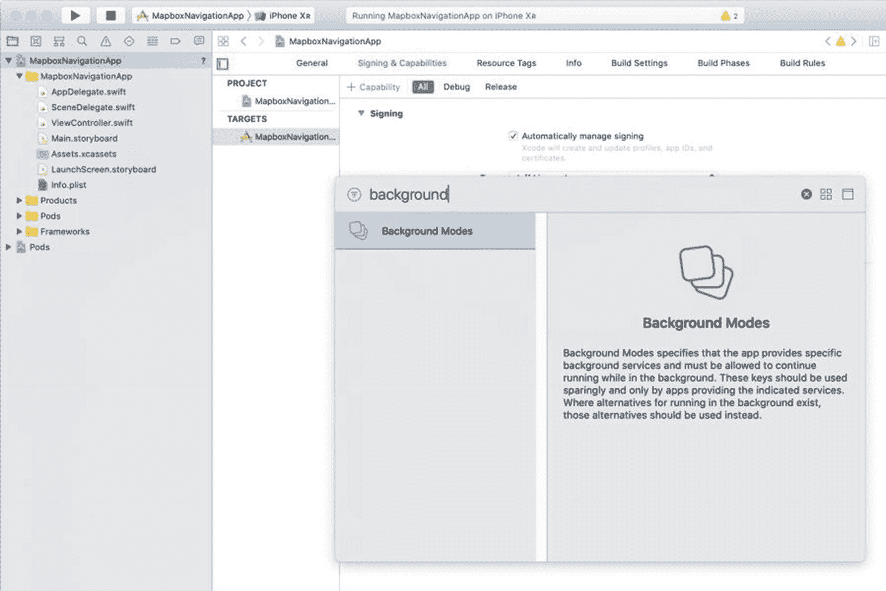
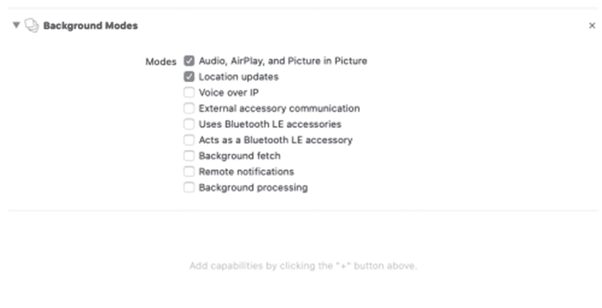
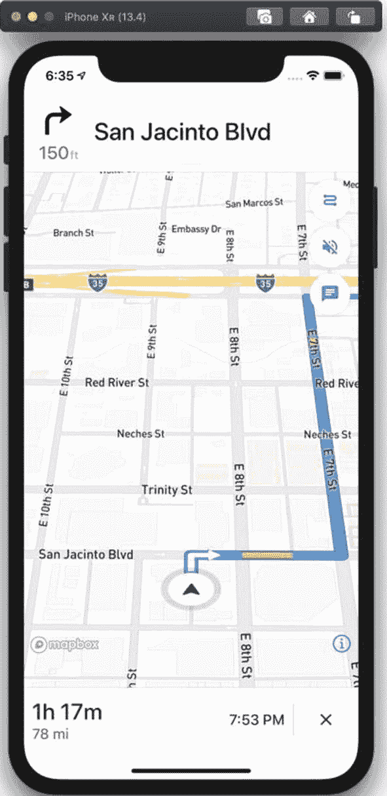
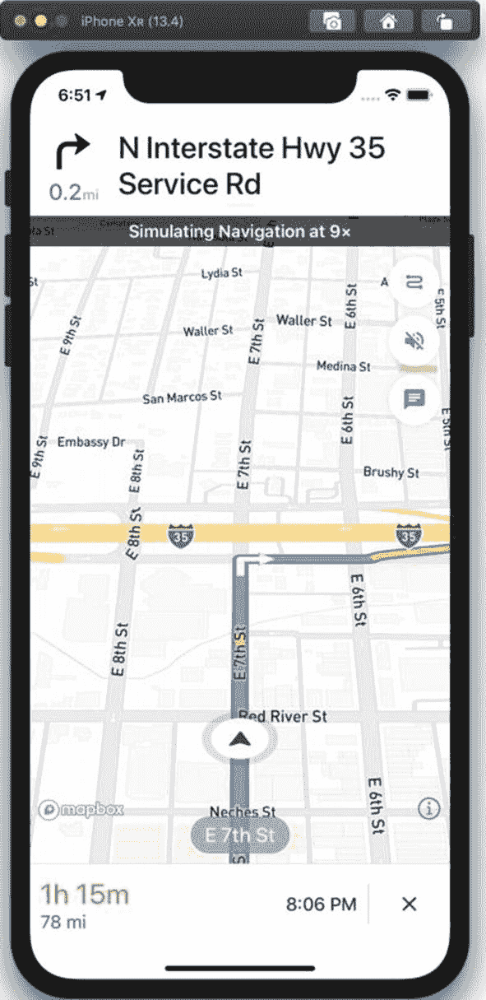

# 使用 Mapbox 的逐向导航

除了适用于 iOS 的 Mapbox 地图 SDK 之外，Mapbox 还提供了适用于 iOS 的逐向导航用户界面 SDK。通常，这种导航风格适用于提供内置驾驶导航的应用，例如拼车服务或包裹递送服务。

在本章中，我们将构建一个简单的导航应用，该应用将从用户的当前位置导航到目的地。我们将使用 Mapbox 提供的标准逐向导航用户界面，即 Mapbox Navigation 框架。如果您希望构建自己的用户界面，可以使用 Mapbox Core Navigation 框架为该用户界面提供路线更新支持。Mapbox Navigation 框架构建在 Mapbox Core Navigation 框架之上。

无论哪种情况，您的应用都使用 Mapbox Directions API 来创建起点和目的地之间的路线。与其他 Mapbox API 一样，在将其集成到您的应用之前，请检查 Directions API 的定价，以确保您了解免费层和分层定价的运作方式。

## 设置您的应用项目

在深入探讨 Mapbox Navigation 框架之前，我们需要创建一个新的 iOS 应用项目，使用 CocoaPods 对其进行设置，然后添加一些功能和 `Info.plist` 条目。

首先，在 Xcode 中创建一个新的 iOS 单视图应用。将应用命名为 `MapboxNavigationApp`。选择与之前项目相同的默认设置，即使用 storyboard/UIKit 和 Swift。

### 设置 CocoaPods

生成 iOS 应用后，关闭 Xcode 中的项目，并在与项目相同的目录中打开命令行。我们将为此项目初始化 CocoaPods，然后编辑 `Podfile` 以包含 Mapbox Navigation 框架。使用以下命令生成 `Podfile`：

```
pod init
```

创建 `Podfile` 后，在文本编辑器中打开它，并将 Mapbox Navigation 框架作为依赖项包含在内。您的完整 `Podfile` 应如清单 14-1 所示。

```
target 'MapboxNavigationApp' do
# 如果不希望使用动态框架，请注释下一行
use_frameworks!
# MapboxNavigationApp 的 Pods
pod 'MapboxNavigation', '~> 0.39.0'
end
清单 14-1
使用 Mapbox Navigation 框架的应用的 Podfile
```

关闭文本编辑器并保存 `Podfile`。然后从命令行使用以下命令安装依赖项：

```
pod install
```

安装 CocoaPods 后，您需要在 Xcode 中打开 `MapboxNavigationApp.xcworkspace` 工作区，而不是 Xcode 项目。

### 向 Info.plist 添加条目

为了使用 Mapbox SDK，我们下一步需要做的是向 Xcode 工作区中的 `Info.plist` 文件添加两个条目。打开该文件，并添加以下两个属性：

- `MGLMapboxAccessToken`
- `Privacy` - Location When In Use Usage Description

访问令牌条目可以是您在前面的 Mapbox 章节（参见第 11 章说明）中已经使用过的同一个访问令牌。位置使用说明将在应用首次访问用户位置时显示给用户。示例说明可以是“此应用将使用您的位置以提供应用内导航并改进地图”。

这样就处理好了 `Info.plist` 文件的设置。我们还需要为应用添加功能，以便应用在后台模式下运行。

### 添加必需的功能

Mapbox Navigation 框架需要两种不同的后台模式功能。如果您不设置后台音频模式，应用将立即崩溃并提示您添加该模式。虽然您可以通过 `Info.plist` 文件添加这些后台模式，但也可以通过 Xcode 项目将其作为功能添加。

在 Xcode 中选择 `MapboxNavigationApp` 目标，然后选择 **Signing & Capabilities** 选项卡。点击 **+ Capability** 按钮以添加一项功能。从功能列表中选择 **Background Modes**，如图 14-1 所示。



图 14-1

向应用目标添加后台模式功能

选择 **Audio, Airplay, and Picture in Picture** 以及 **Location updates**（图 14-2）。



图 14-2

为导航选择后台模式

现在，我们已经完成了使用 Mapbox Navigation 框架的所有设置。让我们继续了解 Mapbox Directions API。


## 使用 Mapbox Directions API

你的应用需要利用 Mapbox Directions API 计算两个或多个不同途经点之间的路线。虽然你可以直接向 Directions API 发起 HTTPS 调用，但使用 `MapboxDirections` 框架中的辅助类要简单得多。

开始使用 Mapbox Directions API 所需的关键类包括 `Waypoint`、`RouteOptions`、`Directions` 和 `Route`。

`Waypoint` 是路线上的地点。当骑行或步行时，你最多可以设置 25 个途经点来规划方向。如果你正在驾驶，但不需要路线考虑交通状况，同样最多可以使用 25 个途经点。如果你确实希望考虑交通状况，则只能使用两到三个途经点。

`RouteOptions` 包含途经点以及所使用的交通方式——步行、骑行、驾驶或考虑交通状况的驾驶。这还包括规划路线时需要考虑的任何设置，例如避开收费站、渡轮或避免掉头。你也可以请求获取路线中每一程的单独步骤。

当我们在 `MapboxNavigation` 框架中使用逐向导航用户界面时，我们将使用 `RouteOptions` 的一个子类，名为 `NavigationRouteOptions`。

`Directions` 类代表 Directions API。通过使用该类的共享单例实例，你可以使用 `calculate(_:completionHandler:)` 方法异步调用 API。将路线选项作为第一个参数传入，并将一个闭包作为第二个参数传入。

最后，一次成功的路线查询调用会至少将一个路线作为参数传递给完成处理程序。如果路线有两个途经点，那么它会包含一程（一个 `RouteLeg` 对象），并且每增加一个途经点就会多出一程。

综合以上所有内容，我们可以编写两个简单的方法来为我们的路线请求创建途经点，然后调用 directions API。

第一个方法（清单 14-2）创建了途经点，本例中是从德克萨斯州奥斯汀到德克萨斯州圣安东尼奥的阿拉莫之旅。如果你愿意，也可以将用户的当前位置作为第一个途经点。

```
func createWaypoints() -> [Waypoint] {
    let austinCoordinate = CLLocationCoordinate2D(
        latitude: 30.27, longitude: -97.74)
    let alamoCoordinate = CLLocationCoordinate2D(
        latitude: 29.426, longitude: -98.486)
    let austin = Waypoint(coordinate: austinCoordinate,
                          name: "Austin")
    let alamo = Waypoint(coordinate: alamoCoordinate,
                         name: "The Alamo")
    return [austin, alamo]
}
```

将 `createWaypoints()` 方法添加到你的 `ViewController` 类中。你还可以看到构造一个途经点相当简单直接。

清单 14-3 中的 `getDirections()` 方法将这些途经点传入一个新的 `RouteOptions` 实例，然后调用 Mapbox Directions API。如果你的项目中未正确设置 Mapbox 访问令牌，此操作将失败。然后我们遍历路线中唯 一一程的每个步骤。如果我们有超过两个途经点，就会有额外的程。路线、程和步骤对象上有许多不同的属性，例如预估时间、以米为单位的距离以及方向（针对步骤），你可以自行查看——其中一些可能对自定义用户界面有用，而另一些可能不必要。

```
func getDirections() {
    let waypoints = createWaypoints()
    let options = RouteOptions(waypoints: waypoints,
                               profileIdentifier: .automobile)
    options.includesSteps = true
    Directions.shared.calculate(options) {
        (waypoints, routes, error) in
        guard let route = routes?.first else {
            print(error ?? "No Error")
            return
        }
        guard let firstLeg = route.legs.first else {
            return
        }
        print(firstLeg.name)
        for step in firstLeg.steps {
            print(step.instructions)
        }
    }
}
```

尝试通过从你的 `viewDidLoad()` 方法中调用 `getDirections()` 来使用此函数，然后在控制台中查看输出。

你可以自行在以上函数的基础上进行构建，将路线中的坐标作为折线添加到你的 Mapbox 地图上。相反，我们将使用更简单的方法，即使用 `MapboxNavigation` 框架中预构建的逐向导航用户界面。

### 显示导航用户界面

要显示默认的导航用户界面，我们需要创建一个 `NavigationViewController`，然后从我们的 `ViewController` 类中以模态方式呈现它。我们可以完全通过编程方式实现，也可以为导航视图控制器添加一个 storyboard 引用，然后在我们的视图控制器的 `prepareForSegue` 方法中进行配置。在此项目中，我们不会使用 storyboard。另外，为了清晰起见，这是一个与 Apple 的 `UIKit` 框架中的 `UINavigationController` 类不同且用途不同的类。

我们将基于前面讨论的代码进行构建，但会做一些更改。例如，我们可以保留创建途经点的方式，但我们将使用 `NavigationRouteOptions` 类而不是 `RouteOptions`——导航路线选项带有针对逐向导航优化的配置。我们不会打印出某些路线属性，而是创建一个 `NavigationViewController` 类的实例，并将路线作为参数传入。创建该实例后，我们将其作为全屏视图控制器以模态方式呈现。在导航视图控制器底部有一个内置的关闭按钮，可以将用户返回到我们的原始视图控制器。

我们还借此机会为我们的路线请求添加一个功能，即避开收费站。你也可以选择避开渡轮、高速公路、限制通行的道路或隧道。所有这些都是通过 `MBRoadClasses` 类枚举的。只能选择避开其中一项，不能组合，尽管 API 允许使用道路类的数组。

清单 14-4 是我们的 `startNavigation()` 方法。你可以看到它在闭包中与现有的 `getDirections()` 方法的主要不同之处。

```
func startNavigation() {
    let waypoints = createWaypoints()
    let options = NavigationRouteOptions(
        waypoints: waypoints)
    options.roadClassesToAvoid = [.toll]
    Directions.shared.calculate(options) {
        (waypoints, routes, error) in
        guard let route = routes?.first else {
            print(error ?? "No error")
            return
        }
        let navVC = NavigationViewController(for: route)
        navVC.modalPresentationStyle = .fullScreen
        self.present(navVC,
                     animated: true,
                     completion: nil)
    }
}
```

从你的 `viewDidLoad()` 方法中调用 `startNavigation()` 方法。你可以替换我们在第 13 章中创建的 `getDirections()` 方法。你将看到一个带有指令、预估到达时间和剩余距离的地图视图，类似于图 14-3。



现在，用户界面已经启动并运行，探索一下它的工作原理——你可以在顶部向左或向右滑动，在路线的不同步骤之间切换。完成后，按下右下角的 x 按钮关闭导航视图控制器。


### 使用 Mapbox 模拟导航

虽然你确实可以使用 GPX 文件在 iOS 模拟器上模拟导航，但你可能需要使用 Mapbox 为路线提供的模拟功能。这对于测试非常有用，因为它能严格遵循你指定的路线，并且允许你调整速度，如图 14-4 所示。



*图 14-4 — 模拟导航，速度提升至正常速度的九倍*

要使用 Mapbox 的模拟功能，你需要修改 `startNavigation()` 方法。你需要创建一个导航服务（`NavigationService`），用它来填充导航选项（`NavigationOptions`），然后将这些选项传递给 `NavigationViewController`，而不是仅仅将路线传给 `NavigationViewController`。

导航服务（`MapboxNavigationService`）通过传入路线和 `simulating` 参数的 `.always` 枚举值进行实例化：

```swift
let navService = MapboxNavigationService(
route: route, simulating: .always)
```

使用该导航服务创建 `NavigationOptions` 的实例：

```swift
let navOptions = NavigationOptions(
navigationService: navService)
```

我们将把这些选项连同路线一起传递给导航视图控制器。使用导航模拟时，路线本身不会改变：

```swift
let navVC = NavigationViewController(for: route,
options: navOptions)
```

将上述代码行放入我们的 `startNavigation()` 方法中，并替换创建 Mapbox 导航视图控制器的调用，最终的方法如代码清单 14-5 所示。

```swift
func startNavigation() {
    let waypoints = createWaypoints()
    let options = NavigationRouteOptions(
        waypoints:waypoints)
    options.roadClassesToAvoid = [.toll]
    Directions.shared.calculate(options) {
        (waypoints, routes, error) in
        guard let route = routes?.first else {
            print(error ?? "No error")
            return
        }
        let navService = MapboxNavigationService(
            route: route, simulating: .always)
        let navOptions = NavigationOptions(
            navigationService: navService)
        let navVC = NavigationViewController(for: route,
                                             options: navOptions)
        navVC.modalPresentationStyle = .fullScreen
        self.present(navVC,
                     animated: true,
                     completion: nil)
    }
}
```

*代码清单 14-5 — 使用模拟驾驶启动导航*

将你的 `startNavigation()` 方法替换为代码清单 14-5 中的 Swift 代码后，运行你的项目。你应该会看到从起点到终点之间的一段加速行驶的路线。

### 自定义导航体验

如果你不喜欢应用的显示效果，可以为用户界面创建自定义样式，包括日间和夜间模式。这些样式可以为地图图块使用你的 Mapbox 地图样式，也可以使用 `UIAppearance` 协议来设置单个用户界面元素的样式。例如，你可以使用此功能来匹配你品牌的颜色，使导航看起来与你的应用融为一体。

导航 SDK 还内置了许多其他功能，例如支持 CarPlay、语音选项以及确定途经点应使用的道路侧（对拼车或配送应用非常有用）。

如果你愿意，可以使用 `MapboxCoreNavigation` 框架创建自己的导航用户界面。你需要监听 `routeControllerProgressDidChange` 通知。这些通知包含 `RouteProgress` 类形式的更新位置信息，你可以用它来更新用户界面。你可以获取关于已行驶距离、剩余距离、剩余路段和步骤以及其他信息。你还可以获取关于当前路段和当前步骤进度的更细粒度信息。当前步骤的进度提供了关于下一个路口、到下一个路口的距离、用户到下一个操作的距离等信息，以及其他可用于构建用户界面的信息。

### 结论

如果逐向导航用户体验对你的应用有所帮助，那么使用 Mapbox 预构建的组件可以非常轻松地实现。与在其他方向 API 之上构建你自己的解决方案相比，你可以为用户提供更简单的体验，并且在你的应用中维护更少的代码。

在第 15 章中，我们将探讨 Mapbox 的离线地图功能——这是 Mapbox 提供而其他地图 SDK 无法复制的技术解决方案之一。

