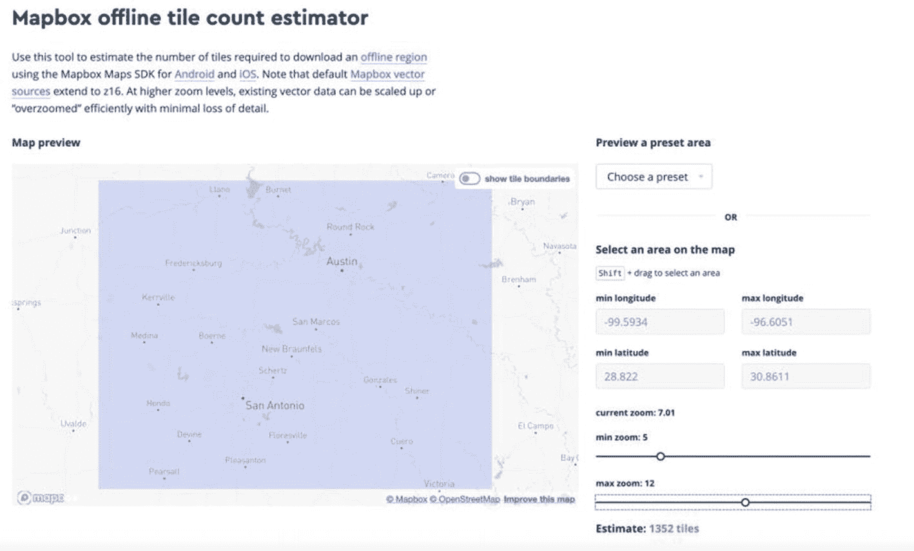

# 15. 使用 Mapbox 离线地图

许多移动应用程序需要在蜂窝网络覆盖不佳或没有覆盖的区域工作。作为一名开发者，如果你想提供地图功能，有几种方法可以实现，但最好的方法是使用一个既支持在线也支持离线使用的地图框架。适用于 iOS 的 Mapbox SDK 提供了下载离线地图图块并将其存储在用户手机上以供日后在地图视图中使用的功能。我曾使用此离线功能为新疆西哥山脉创建了一款徒步应用，并为在公路旅行中使用 iPad 的儿童提供地图。

在本章中，我们将使用 Mapbox 地图的离线包技术下载地图的一个区域以供离线使用。然后，你可以尝试将手机设置为飞行模式，以查看应用如何处理离线图块。

与其他地图 API 一样，请查看离线地图图块的价格，并确保它符合你的使用场景。

## 设置你的应用程序项目

本项目基于第 11 章中 Mapbox 的基础知识，包括设置项目和获取访问令牌。在 Xcode 中创建一个新项目，命名为 `OfflineMapsApp`。如果你愿意，也可以重用第 11 章中的 `FirstMapboxApp` 项目。

该项目将是一个使用 Swift 和故事板的单视图应用程序（Single View Application），与我们之前的所有项目类似。

在你的项目目录中运行 `pod init` 以生成 `Podfile`。将 Mapbox SDK 添加到你的 CocoaPods 文件中，如代码清单 15-1 所示。

```ruby
target 'OfflineMapsApp' do
  use_frameworks!
  # Pods for OfflineMapsApp
  pod 'Mapbox-iOS-SDK', '~> 5.8'
end
```

*代码清单 15-1 — 离线地图应用的 Podfile*

现在运行 `pod install` 来为你的项目设置 Mapbox SDK。从现在开始，请使用 Xcode 打开工作区文件，而不是项目文件。

将你的 Mapbox 访问令牌作为 `MGLMapboxAccessToken` 条目添加到 `Info.plist` 文件中。同时，向视图控制器添加一个 Mapbox 地图视图。在视图控制器中创建一个名为 `mapView` 的插座变量。你还应该在视图控制器类的顶部导入 `Mapbox` 框架。

所有这些在第 11 章中都有更详细的介绍，因此如果你想查看这些步骤的更具体说明，请先按照那一章进行操作。


## 了解离线地图下载

大多数地图引擎，无论是在 Web 端还是移动端，都会缓存已下载的地图瓦片，以提供更好的性能或降低带宽成本。例如，在适用于 iOS 的 Mapbox SDK 中，该缓存将包含最多 50 MB 的瓦片或样式信息。Mapbox 更进一步，允许作为开发者的你创建一个由 `MGLOfflinePack` 类表示的离线地图瓦片包。你的应用会根据你选择的地理坐标和缩放级别从 Mapbox 下载地图瓦片。这种组合被称为区域（region），并且可以与 `MGLOfflineRegion` 协议一起使用。该协议的唯一实现位于 `MGLTilePyramidOfflineRegion` 类中。

在地图瓦片下载过程中，你的应用可以处理状态更新，这样你就能了解下载的进度以及何时完成。Mapbox 会触发多个可供观察的通知。离线包就是通知中的 `userInfo` 变量。每个离线包都有一个关联的 `progress` 变量，其中包含 `MGLOfflinePackProgress` 结构体。通过此结构体，你可以获取已下载的资源数量、已下载的字节数、已下载的瓦片数量，以及待下载资源的最小和最大数量。这样，你就可以为用户提供一个进度条、一个带有进度消息的旋转指示器，或其他任何方式，来告知他们下载进度。

### 估算使用的瓦片数量

在创建应用时，请务必注意你将允许用户下载的最大瓦片数量，尤其当你开发面向大众市场的应用并且免费提供时。默认情况下，Mapbox 允许每个用户下载最多 6000 个地图瓦片，但你可以覆盖此设置并下载更多。

如果你对为用户提供多少瓦片没有很好的概念，可以尝试使用 Mapbox 的离线瓦片数量估算工具（图 15-1），访问地址为 [`https://docs.mapbox.com/playground/offline-estimator/`](https://docs.mapbox.com/playground/offline-estimator/)。



图 15-1

Mapbox 离线瓦片数量估算器

由于 Mapbox 使用矢量瓦片，你可以让应用缩放到低于你下载的最大缩放设置的级别。例如，你可以为德克萨斯州中部这个区域下载离线地图瓦片，从最小缩放级别 5 到最大缩放级别 12。

你的地图仍然可以进一步缩放到 13 或 14 级；只是会缺少这些级别的任何额外细节。Mapbox 矢量瓦片的最大缩放级别是 16，因此你不能请求超过该级别的瓦片。

## 下载离线地图包

下载离线地图包的第一步是定义该区域的地理边界。这可以是一个已定义的区域，带有东北角和西南角，或者你也可以直接使用地图视图中当前显示的地图的边界。

要创建你自己的边界，请根据代码清单 15-2 中的代码，在你的 `ViewController` 类中创建一个函数。这些坐标定义了德克萨斯州中部的一个区域，与我们用于离线地图瓦片估算器的坐标相同。

```
func createOfflineRegionBounds() -> MGLCoordinateBounds {
    let southwest = CLLocationCoordinate2D(
        latitude: 28.822,
        longitude: -99.5934)
    let northeast = CLLocationCoordinate2D(
        latitude: 30.8611,
        longitude: -96.6051)
    return MGLCoordinateBounds(sw: southwest,
                               ne: northeast)
}
```

代码清单 15-2  
创建离线区域边界

上述方法返回一个 `MGLCoordinateBounds` 结构体。你也可以调用 `mapView.visibleCoordinateBounds` 来获取地图视图中显示的地图的边界。你可能知道你的应用服务于特定地理区域，在这种情况下，你可能希望定义固定坐标。或者，你可以让用户自行在地图上选择一个区域，然后点击下载按钮，来决定下载哪些瓦片。

一旦你有了边界集，就可以创建一个 `MGLTilePyramidOfflineRegion` 区域。这是你可以创建的唯一种类的离线区域。它需要边界、最小地图缩放级别、最大地图缩放级别以及要使用的地图样式。通常，你会使用与地图视图相同的地图样式，但如果你愿意，也可以指定另一个样式 URL。

创建区域的一个示例如下：

```
let region = MGLTilePyramidOfflineRegion(
    styleURL: mapView.styleURL,
    bounds: bounds,
    fromZoomLevel: 5,
    toZoomLevel: 8)
```

我们将在下载离线地图包的方法中使用此代码片段，所以暂时不要将其放入你的类中。

下一步是添加一个离线地图包。`MGLOfflineStorage` 类是一个单例（通过 `MGLOfflineStorage.shared` 访问），你可以调用其上的 `addPack` 方法。该方法接受区域、上下文（context）和一个完成处理程序。`context` 参数是一个通用存储变量，接受一个 `Data` 实例。你可以将任何你喜欢的内容放入上下文中。我们将采用简单的方法，将一个字符串作为上下文存储，并使用 UTF-8 编码。完成处理程序将离线包和一个错误作为可选参数。一旦你获取到离线包，就在该包上调用 `resume()` 方法来启动下载过程。

下载离线地图包的完整方法如代码清单 15-3 所示。将 `downloadOfflineMapPack()` 方法添加到你的 `ViewController` 类中。要测试你的代码，请在 `viewDidLoad()` 方法的末尾调用此方法。

```
func downloadOfflineMapPack() {
    let bounds = createOfflineRegionBounds()
    let region = MGLTilePyramidOfflineRegion(
        styleURL: mapView.styleURL,
        bounds: bounds,
        fromZoomLevel: 5,
        toZoomLevel: 8)
    let packName = "Central Texas"
    guard let nameData = packName.data(using: .utf8) else {
        return
    }
    MGLOfflineStorage.shared.addPack(
        for: region,
        withContext: nameData) { (pack, error) in
            guard let pack = pack else {
                print("Unable to create pack")
                print(error?.localizedDescription ??
                    "No error given")
                return
            }
            pack.resume()
    }
}
```

代码清单 15-3  
下载离线地图包

你可以指定自己的离线地图包名称；它仅用于你项目的引用。你可以在此存储一个 GUID 或一个名称/值属性的字典。

通常，你会希望了解下载过程何时完成，或者你可能想向用户显示进度。让我们来看看当 Mapbox SDK 下载离线地图包时发送的通知。

如果你想了解各个部分是如何组合在一起的，视图控制器的完整代码见代码清单 15-4。


### 监控离线地图包下载

离线地图下载器会发送三种不同的通知。这些是标准的 iOS 通知，通过 `NotificationCenter` 进行监控，请勿与推送通知混淆：

-   `MGLOfflinePackProgressChanged`
-   `MGLOfflinePackError`
-   `MGLOfflinePackMaximumMapboxTilesReached`

让我们重点关注进度变更通知。我们需要在 `viewDidLoad()` 方法中订阅这些进度变更通知。将以下代码片段中的代码添加到您的 `viewDidLoad()` 方法中：

```
NotificationCenter.default.addObserver(
self,
selector: #selector(offlinePackProgressChanged),
name: NSNotification.Name.MGLOfflinePackProgressChanged,
object: nil)
```

我们还需要定义 `offlinePackProgressChanged` 方法，并确保它具有 `@objc` 注解。将以下函数定义添加到您的类中：

```
@objc func offlinePackProgressChanged(
notification: NSNotification) {
print("Offline pack progress changed")
}
```

如果您继续在 `viewDidLoad()` 方法中添加通知观察者，然后添加 `offlinePackProgressChanged()` 方法，并在模拟器中运行应用程序，您将看到大量打印语句，表明某些事情正在发生！

如果我们想获取更多详细信息，可以从通知中获取。通知的可选 `object` 属性就是离线包。离线包有一个名为 `progress` 的属性，它是一个 `MGLOfflinePackProgress` 结构体。让我们将已完成的字节数打印到控制台：

```
@objc func offlinePackProgressChanged(
notification: NSNotification) {
guard let pack = notification.object
as? MGLOfflinePack else {
return
}
print("Offline pack progress changed")
print(pack.progress.countOfBytesCompleted)
}
```

修改函数以显示这些信息，将使我们能更多地了解应用程序的进度，但当然还不能直接呈现给最终用户。他们可能更希望看到某种百分比，以便知道距离完成还有多远。您可以通过进度视图来实现这一点，但现在我们只是简单地将百分比打印到控制台。将以下代码添加到 `offlinePackProgressChanged` 方法的末尾：

```
let percentageResources = Int(round(100 *
Float(progress.countOfResourcesCompleted) /
Float(progress.countOfResourcesExpected)))
print("Resources: \(percentageResources)%")
```

要将其与进度视图一起使用，您可以简单地将进度视图的进度值设置为已完成的资源数量除以期望的资源数量：

```
progressView.progress = Float(progress.countOfResourcesCompleted) /
Float(progress.countOfResourcesExpected)))
```

一旦完成的资源数量等于期望的数量，您可以使用计时器取消进度条，并可选地弹出一个警告视图。

当我们组合所有代码后，最终会得到一个视图控制器类，该类将显示一个 Mapbox 地图，但所有下载进度都将显示在控制台上以进行调试。`ViewController` 类的完整代码清单如代码清单 15-4 所示。

```
import UIKit
import Mapbox
class ViewController: UIViewController {
@IBOutlet weak var mapView: MGLMapView!
var progressView: UIProgressView!
override func viewDidLoad() {
super.viewDidLoad()
// 加载视图后进行任何其他设置
mapView.centerCoordinate = CLLocationCoordinate2D(
latitude: 30.2,
longitude: -97.75)
mapView.zoomLevel = 10
mapView.styleURL = MGLStyle.outdoorsStyleURL
NotificationCenter.default.addObserver(
self,
selector: #selector(offlinePackProgressChanged),
name: NSNotification.Name.MGLOfflinePackProgressChanged,
object: nil)
downloadOfflineMapPack()
}
@objc func offlinePackProgressChanged(
notification: NSNotification) {
guard let pack = notification.object
as? MGLOfflinePack else {
return
}
let progress = pack.progress
print("Offline pack progress changed")
print(progress.countOfBytesCompleted)
let percentageResources = Int(round(100 *
Float(progress.countOfResourcesCompleted) /
Float(progress.countOfResourcesExpected)))
print("Resources: \(percentageResources)%")
}
func createOfflineRegionBounds() -> MGLCoordinateBounds {
let southwest = CLLocationCoordinate2D(
latitude: 28.822,
longitude: -99.5934)
let northeast = CLLocationCoordinate2D(
latitude: 30.8611,
longitude: -96.6051)
return MGLCoordinateBounds(sw: southwest,
ne: northeast)
}
func downloadOfflineMapPack() {
let bounds = createOfflineRegionBounds()
let region = MGLTilePyramidOfflineRegion(
styleURL: mapView.styleURL,
bounds: bounds,
fromZoomLevel: 5,
toZoomLevel: 8)
let packName = "Central Texas"
guard let nameData = packName.data(using: .utf8) else {
return
}
MGLOfflineStorage.shared.addPack(
for: region,
withContext: nameData) { (pack, error) in
guard let pack = pack else {
print("Unable to create pack")
print(error?.localizedDescription ??
"No error given")
return
}
pack.resume()
}
}
}
代码清单 15-4
完整的 ViewController 类
```

### 使用离线地图磁贴的注意事项

当您设置应用程序使用离线地图磁贴时，需要考虑几个限制。首先是定价。确保您了解每个用户将下载多少磁贴，以及这如何符合您的预算。使用这个数字来驱动最大缩放级别或地图区域的最大尺寸。同时还要考虑用户执行下载需要多长时间。如果在下载地图磁贴时阻止用户继续使用应用程序，请提供进度条或其他用户界面。如果地图磁贴数量很大，请告知用户他们应该在可以访问无线以太网时自行启动此过程，除非他们愿意承担运营商的高额带宽费用。

Mapbox 对用户可以下载的地图磁贴数量提供了一些软限制。目前，所有下载区域的地图磁贴总数限制为 6000 个，但您可以通过调用 `MGLOfflineStorage` 类上的 `setMaximumAllowedMapboxTiles` 方法来自行提高此限制。一旦您触及内置限制或您自己设置的限制，Mapbox SDK 将发布 `MGLOfflinePackMaximumMapboxTilesReached` 通知。您可以像监听离线地图磁贴下载进度一样来监听此通知。如果达到限制，您的应用程序将需要删除现有的离线地图包，才能继续将地图磁贴下载到新包中。

最后，Mapbox 不允许从应用程序重新分发离线地图磁贴（例如，分发到其他用户手机上的另一个应用程序副本），因此请阅读服务条款，以确保您的应用程序整体设计能与 Mapbox 的解决方案兼容。


