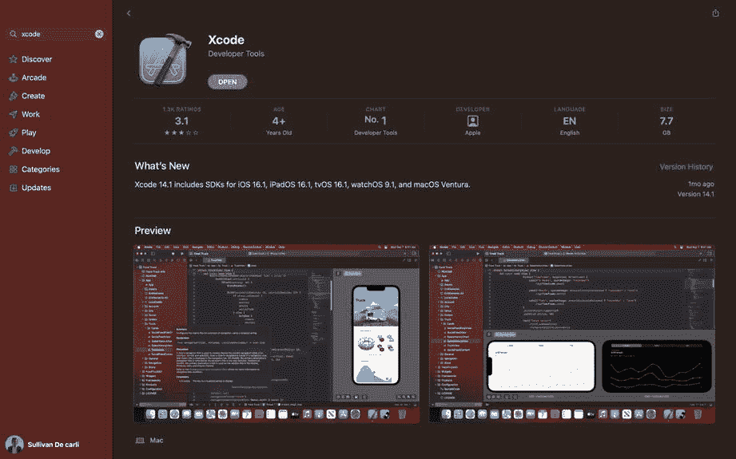
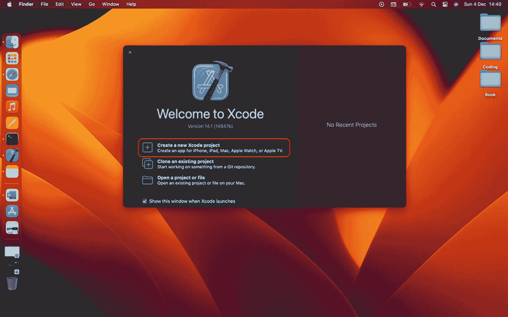
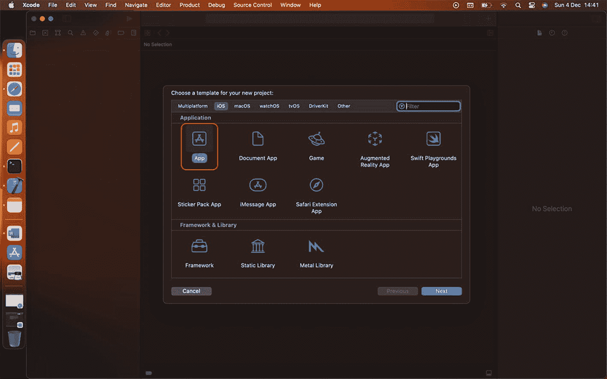
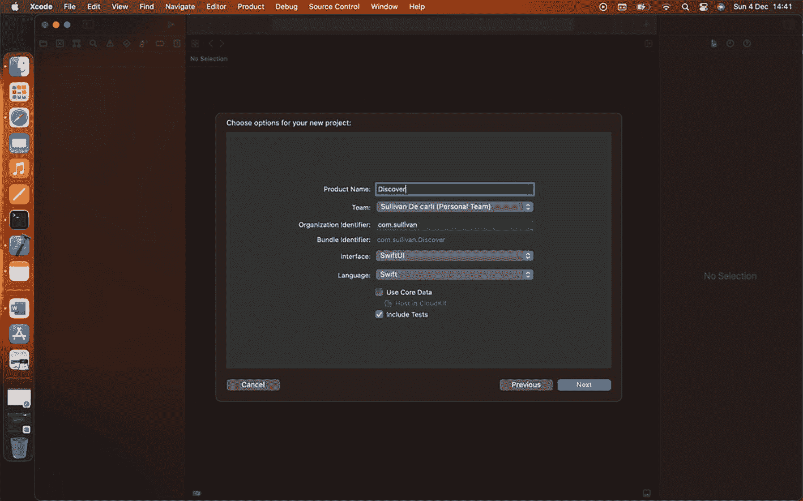
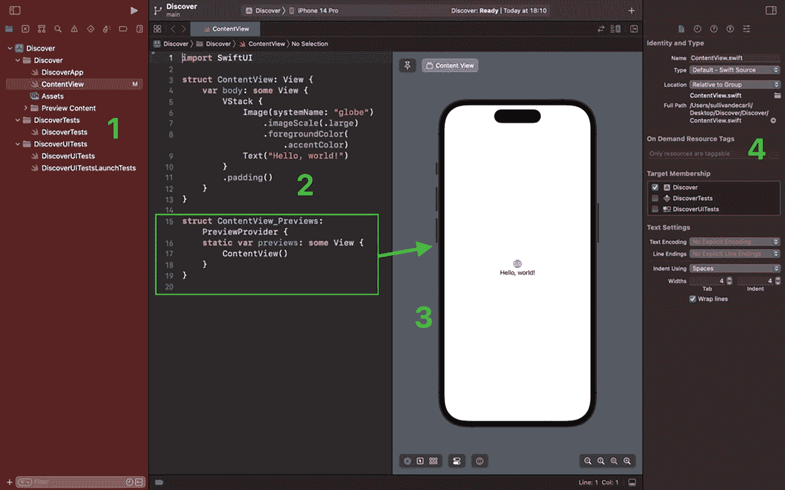
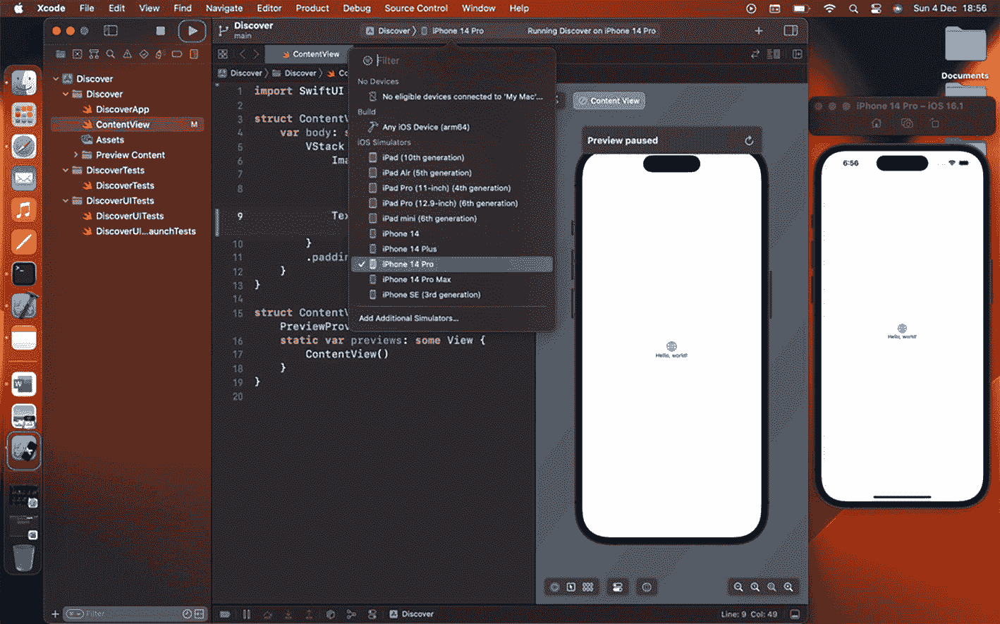
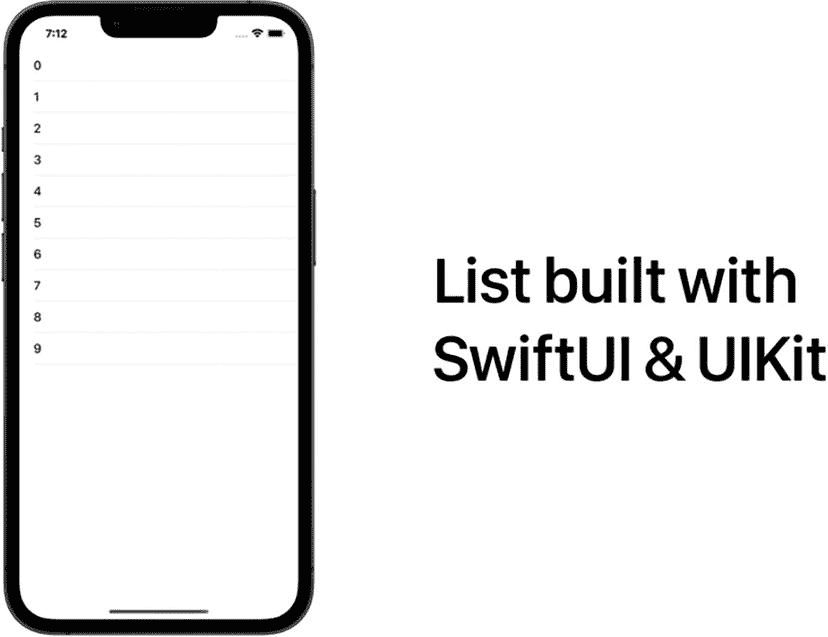

# 1. SwiftUI 简介

本章专为 iOS 开发的初学者而设计。我将引导你了解 `Xcode` 的主要功能，这是你创建项目并运行代码的工具。然后，我们将创建一个简单的应用程序：一张显示几个地点的地图。

通过这种方式，我们将探索一些用于构建用户界面的 SwiftUI API，以及 Swift 的一些基础知识（例如创建模型）。让我们开始吧！

## Xcode 界面导览

要构建 iOS 应用程序，你首先需要 `Xcode`。这款由 Apple 开发的软件将成为你编写 Swift 代码、创建用户界面、构建和调试项目以及完成更多工作的得力工具。你可以把它想象成摄影界的 Photoshop，或是 UI 设计领域的 Sketch 和 Figma。

该软件在 Mac App Store 上架；你可以轻松地从那里下载。在你的 Mac 上打开 App Store，搜索 `Xcode`，然后点击“下载”（因为我已下载，所以显示的是“打开”）：



屏幕显示了 Xcode 应用程序 14.1 版本，并配有“打开”按钮、2 个预览屏幕、“新功能”以及其他特性。

**图 1-1** 从 App Store 下载 Xcode

在撰写本文时，最新版本是 `Xcode 14.1`。我建议你至少下载 `Xcode 14`；否则，本书中的许多功能将无法复现。

由于这是一个相当庞大的程序（7GB），下载需要一些时间。下载完成后，你就可以打开它。系统会询问你是否要下载 macOS 和 watchOS 的附加组件。你可以跳过此步骤，因为本书范围内我们只需要 iOS。

接着，将出现以下页面，提示你开始一个新项目：



屏幕显示了 Xcode 欢迎对话框，其中有“创建一个新的 Xcode 项目”、“克隆一个现有项目”和“打开一个项目或文件”等选项。“创建一个新的 Xcode 项目”处于选中状态。

**图 1-2** Xcode 欢迎界面

点击 **创建一个新的 Xcode 项目**，将出现以下页面：



屏幕显示了一个用于为新项目选择模板的对话框。iOS 选项卡处于高亮状态，并且从 8 个模板列表中选择了“App”图标。

**图 1-3** Xcode – 选择模板

`Xcode` 会为你提供一系列模板。事实上，你可以使用 Swift 语言构建很多东西，例如 Apple Watch 应用程序、在 iPhone 上运行的游戏、Safari 扩展程序或 Mac 的实用程序。我们先从 iOS 平台中选择 **App**。其他项目也是如此，尽管我们的应用程序也能在 iPad 上运行。

现在，请你输入 **Discover** 作为项目名称；这将是我们用 SwiftUI 编写的第一个项目名称。

同时，请确保已选中 SwiftUI 框架和 Swift 语言。

（确保在“团队”字段中填写了你的姓名或企业名称。如果你是 `Xcode` 新手，那里应填写你用于 App Store 的 Apple 帐户。该帐户应该是你的团队名称。对我来说，它是“Sullivan De Carli（个人团队）”。）



屏幕显示了一个对话框，用于为新项目选择选项，包括产品名称（Discover）、团队、组织标识符、捆绑包标识符、界面（SwiftUI）、语言（Swift），并且勾选了“包含测试”。

**图 1-4** Xcode – 项目设置

太棒了！现在将你的项目保存到你喜欢的任意位置；我通常保存在桌面上。我们可以开始探索 `Xcode` 的功能了！



屏幕显示的“内容视图”被标记为 1 到 4 个面板。面板 1 包含 3 个文件夹。面板 2 中有一个代码片段被高亮显示。面板 3 包含一个带有“Hello, World!”文本的移动设备屏幕。面板 4 显示了身份和类型、目标成员资格以及测试设置。

**图 1-5** Xcode – 界面导览

`Xcode` 由不同的选项卡组成；每个选项卡都有不同的用途：


### 1 – 左侧标签页显示了项目包含的所有文件。默认情况下，会有三个主要文件夹：一个包含应用的入口点，名为 `DiscoverApp`，类似于 Web 开发中的 `index.html`。`ContentView` 是默认提供的，它是一个用于呈现用户界面的起始模板。最后还有一个 `Assets` 文件夹，你可以用来存储图片和视频；这非常实用，因为它能减小你上传的任何素材文件的体积。此外，这个文件夹还会包含你的应用图标。

另外两个文件夹则用于测试。你可以在这里运行测试，检查代码是否健壮，或者用户界面是否响应正常。底部还有一个搜索过滤器，顶部有一系列标签页，在我们运行应用时将会非常有用。

### 2 – 第二个区域正是我们要工作的地方！从这里我们可以编写代码，并查看文件的内容。另外，在 SwiftUI 中，每个 SwiftUI 视图都附带一个名为 `Preview` 的结构体（在绿色方框内）。它负责在右侧向你呈现屏幕预览。如果你删除这段代码，将无法使用 Canva 功能。

### 3 – Canva 于 2019 年引入；它是一种便捷的方式，可以让你实时看到正在构建的用户界面。从这里，你可以观察到当你在代码中进行更改时，应用的外观会如何变化。

例如，尝试在第二个面板中，紧跟在 `Text("Hello, world!")` 之后添加关键字 `.bold()`。你的文本会立刻变为粗体。

### 4 – 右侧标签页将显示你当前正在查看的文件的信息。在这里，你可以重命名文件、更改编程语言，甚至可以编辑一些用户界面元素，例如字体和元素间距（如果你点击顶部的最后一个按钮进行导航）。请注意，在本书中，我们不会经常用到这个部分。

现在，你可以构建你的项目了。我建议你点击 Xcode 左上角的构建按钮，具体位置如下：



屏幕显示了一个内容视图的代码。在 iOS 模拟器下，选择了 iPhone 14 Pro。Hello World 程序的移动预览暂停在内容视图中，并且该内容同样显示在 iPhone 14 Pro 的移动屏幕上。

**图 1-6** 在 Xcode 上运行的模拟器

一旦你点击它，一个模拟器应用就会弹出，并呈现一个运行着你应用的虚拟 iPhone。你也可以在顶部面板选择其他类型的 iPhone 或 iPad，这样就可以看到你所构建的内容如何适应不同的屏幕尺寸。

关于 Xcode 需要介绍的内容还有很多。到目前为止，我强调的都是需要了解和识别的主要点，但我们将在编码过程中发现更多的功能。我们将在下一章中实际操作，并使用 Xcode 和 SwiftUI 构建我们的第一个应用。

## SwiftUI 的不同之处

SwiftUI 是由苹果公司在 2019 年的全球开发者大会上推出的；它是全球开发者用来为苹果平台构建应用的声明式框架。在撰写本文时，它的版本是 4。

正如苹果所说，SwiftUI 让你用更少的代码编写出更好的应用。这是真的吗？在 SwiftUI 之前，我们使用的是 UIKit，这是苹果在 2014 年推出的一个用于构建用户界面的命令式框架。它仍然可用，但随着苹果公司将重点转移到 SwiftUI，它正在被逐渐取代。

为了理解这两个框架的演变，让我们来做一个比较：构建两个用户界面，每个界面都由一个显示从 1 到 10 元素的列表组成。其中一个我们将使用 UIKit 构建，另一个将使用 SwiftUI 构建。用户界面看起来像这样：



一个移动屏幕上显示一个从 0 到 9 的空白编号列表。文字说明为：用 SwiftUI 和 UIKit 构建的列表。

**图 1-7** 在 iPhone 上显示的列表

观察以下 UIKit 中的代码：

```
import UIKit
class ViewController: UIViewController, UITableViewDelegate, UITableViewDataSource {
let tableView = UITableView()
override func viewDidLoad() {
super.viewDidLoad()
view.addSubview(tableView)
tableView.register(UITableViewCell.self, forCellReuseIdentifier: "Cell")
tableView.dataSource = self
tableView.delegate = self
}
override func viewDidLayoutSubviews() {
super.viewDidLayoutSubviews()
tableView.frame = view.bounds
}
func tableView(_ tableView: UITableView, numberOfRowsInSection section: Int) -> Int {
return 10
}
func tableView(_ tableView: UITableView, cellForRowAt indexPath: IndexPath) -> UITableViewCell {
let cell = tableView.dequeueReusableCell(withIdentifier: "Cell", for: indexPath)
cell.textLabel?.text = "\(indexPath.row)"
return cell
}
}
```

如你所见，我们在顶部导入了 UIKit 框架。我们向类中传入了两个委托：`UITableViewDelegate` 和 `UITableViewDataSource`。然后，我们声明了一个 `UITableView` 来创建列表，并在 `viewDidLoad` 方法中手动添加了它。

这个方法在视图被加载并呈现给用户时调用。我们还遵守了这个协议，提供了两个函数，分别返回行数以及每行的组成内容，这里是一个带有显示当前行号文本的单元格。

为了遵守协议并呈现一个由十行组成的基本用户界面，需要写不少代码。

现在让我们用 SwiftUI 来编写它：

```
import SwiftUI
struct ContentView: View {
var body: some View {
List(0..<10) { index in
Text("\(index)")
}
}
}
```

就是这样！如你所见，使用 SwiftUI，我们的列表代码要简短得多。我们在文件顶部导入框架。然后直接在 `body` 变量中声明了一个列表，它包含从 0 到 10 的 11 个元素及其组成：一个显示 1 到 10 的文本。创建这个 `List` 实际上只需要两行代码，更加清晰易读。

既然我们看到了 SwiftUI 在构建用户界面方面高效得多，那么接下来我们将介绍一些基础知识。我们将创建一个小的应用程序来介绍一些应用编程接口。


