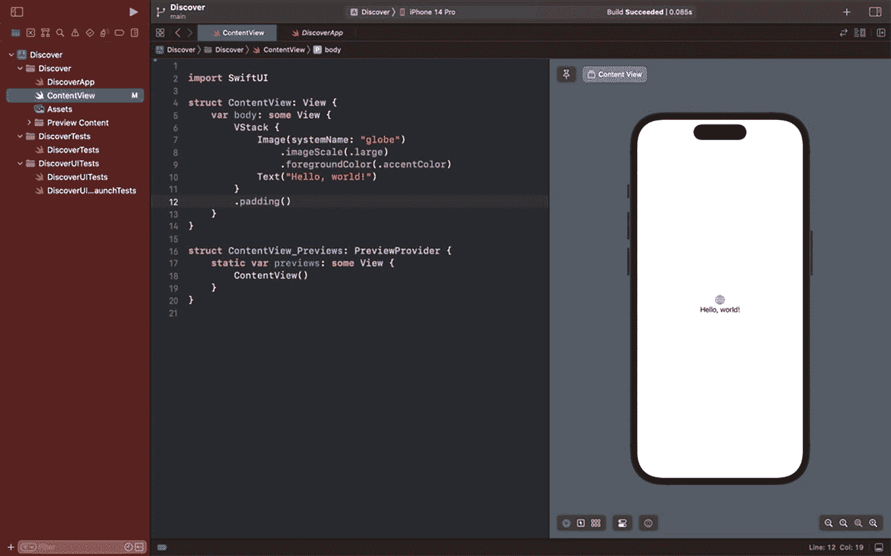
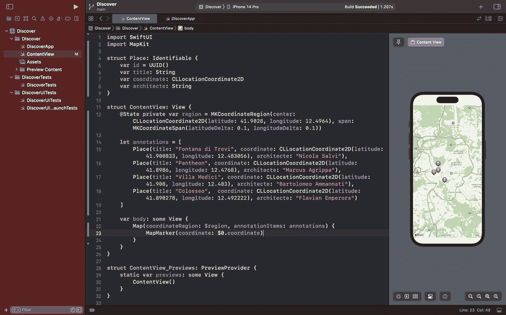

# 使用 SwiftUI 编写代码

要理解 SwiftUI，最好的方式就是构建一个应用程序。因此，我们将构建一个简单的应用，在地图上显示几个地点。同时，我会解释一些关于 SwiftUI 的基础知识。

前往我们之前创建的名为 *Discover* 的 Xcode 项目。运行该应用。你应该会看到以下起始模板：



屏幕左侧面板显示 discover 应用的 ContentView 代码，右侧面板显示一个包含“Hello, World!”文本的移动设备屏幕视图。

**图 1-8** – 带模拟器运行的 Xcode

为了重现这个界面，因为它使用了 Apple 地图，我们需要导入一个名为 *MapKit* 的框架来访问其 API。因此，在文件顶部添加以下代码行：

```
import MapKit
```

然后，在代码 `struct ContentView` 的正上方，复制/粘贴以下代码：

```
struct Place: Identifiable {
    var id = UUID()
    var title: String
    var coordinate: CLLocationCoordinate2D
    var architecte: String
}
```

我们刚刚实现了一个模型，用于基于此模型创建一些数据项。

让我为你解释一下这段代码：

Swift 中的 `struct` 用于存储变量。这里我们给这个 `struct` 命名为 `Place`。

`Identifiable` 是一个协议，用于使此类可被标识。由于我们将在 *List* 中显示数据，我们需要使每个数据项变得可识别。

然后，我们添加了几个变量：`UUID` 类型用于提供唯一标识符，`String` 类型用于文本，以及 `CLLocationCoordinate2D` 类型用于传递坐标（纬度和经度）。

太好了，我们刚刚创建了一个所谓的模型，即通过几个变量将我们的对象（`Place`）模块化。

现在，我们可以着手处理用户界面了。

在 `struct ContentView` 下方，添加以下代码行：

```
@State private var region = MKCoordinateRegion(center: CLLocationCoordinate2D(latitude: 41.9028, longitude: 12.4964), span: MKCoordinateSpan(latitudeDelta: 0.1, longitudeDelta: 0.1))
```

什么是 `@State` 变量？

> *一种属性包装器类型，可以读取和写入由 SwiftUI 管理的值。*
> 
> ——来自 Apple 文档

这将允许我们操作数据。这里我们传递了对应于罗马市坐标的坐标值。

然后，我们声明了一个包含地点数组的常量。由 `[]` 声明的数组很适合呈现一系列数据。

在你之前声明的 `@State` 之后，立即复制/粘贴以下代码：

```
let annotations = [
    Place(title: "Fontana di Trevi", coordinate: CLLocationCoordinate2D(latitude: 41.900833, longitude: 12.483056), architecte: "Nicola Salvi"),
    Place(title: "Pantheon", coordinate: CLLocationCoordinate2D(latitude: 41.8986, longitude: 12.4768), architecte: "Marcus Agrippa"),
    Place(title: "Villa Medici", coordinate: CLLocationCoordinate2D(latitude: 41.908, longitude: 12.483), architecte: "Bartolomeo Ammannati"),
    Place(title: "Colosseo",  coordinate: CLLocationCoordinate2D(latitude: 41.890278, longitude: 12.492222), architecte: "Flavian Emperors")
]
```

太好了，现在我们有所有必要的输入来在 *Map* 上展示位置信息以及一些要显示的地点。

在 `body` 变量内部，用以下代码行替换 *VStack*：

```
Map(coordinateRegion: $region, annotationItems: annotations) {
    MapMarker(coordinate: $0.coordinate)
}
```

这个 `Map` 修饰符将在我们的应用中显示一张地图。我们传递了之前定义的 `region` 参数（包含罗马的坐标），并使用 `$` 符号；这是用于 `@State` 变量的语法。同时，我们还添加了注释（之前声明的四个地点）。

为了呈现这些注释，我们使用了 `MapMarker`，并传入对象中的坐标。

如果你正确地遵循了这些简短教程，你的画布应该会显示一张带有四个标记的地图，如下所示：



屏幕左侧面板显示 discover 应用的 ContentView 代码主体，右侧面板显示一张带有地图和四个标记位置的移动设备屏幕视图。

**图 1-9** – 我们的地图应用

## 总结

如果你是 Swift 新手，本章有助于向你介绍 Xcode——你为 Apple 平台构建应用的工具。接着，我们通过创建模型和编写静态数据了解了 Swift 的基础知识。然后，我们使用地图来显示标记，并从框架 `MapKit` 中导入以访问 Apple 的地图 API。

现在，我们对如何创建静态数据模型并呈现它们有了更清晰的概念，我们可以继续讨论后端了。接下来的章节将聚焦于 Firebase，以及如何从后端下载数据、呈现数据、修改数据和处理用户输入。让我们深入探索 Firebase 控制台。

