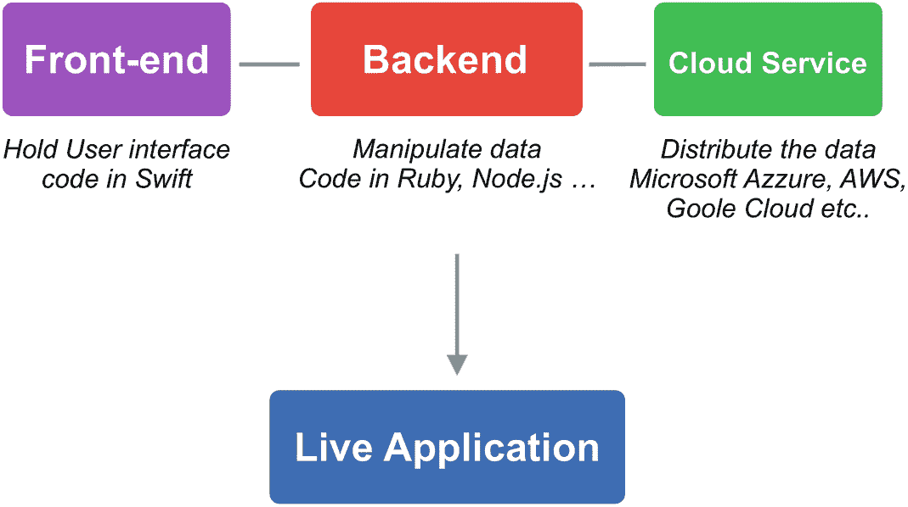
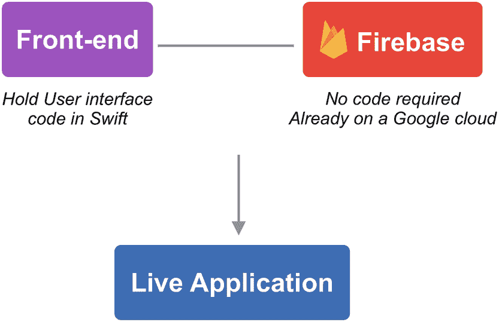

# 什么是 Firebase？

Firebase 是一种我们称之为后端即服务（`BaaS`）的服务。这意味着，你无需运行自己的服务器来支撑在线应用，而是通过它们的服务来读取、写入、更新和删除数据、认证用户以及执行许多其他操作！

看看下面这张图，它展示了一个使用运行在云端的自定义后端构建的原生 iOS 应用：

**图 2-1** – 一个使用云服务上的后端主机构建的 iOS 应用

如你所见，该应用将与一台虚拟机通信，虚拟机通常用 `Ruby`、`Node.js` 或 `PHP` 编码，它本身由云服务（也可能是物理服务器，但如今已很少见）托管，例如亚马逊云服务、谷歌云平台、微软 Azure 等。在具有庞大用户群的复杂应用中，通常需要一名前端开发者（此处指 iOS 开发者）、一名后端开发者来开发逻辑和 API，以及一名 `DevOps` 负责将所有这些部署到云服务并分发。全栈开发者也能完成这项工作，但这较为少见，且需要非常丰富的经验。

现在，让我们看看一个使用 Firebase 构建的 iOS 应用：

**图 2-2** – 一个使用 Firebase 后端构建的 iOS 应用

如你所见，架构要简单得多。我们的 iOS 应用通过 Firebase 提供的、附带详尽文档的 API 来向 Firebase 发送通知和接收数据。无需在服务器端编写代码，也无需将其托管给第三方提供商，因为它已经构建在谷歌云之上，你无需任何部署！此外，如果你之后想实现更复杂的交互，借助 Firebase Cloud 函数，你仍然可以运行后端代码。从团队角度看，你只需要一名 iOS 开发者，就可以准备在 App Store 上发布应用了。

我们已经看到使用 Firebase 比运行你自己的后端代码要简单得多，但不仅如此：它还附带了一系列开箱即用的工具，有助于加速你的开发。

例如，它们有用于通过多个第三方提供商（如 Apple、Facebook、Google 等）认证用户的 API。它们还预装了 Google Analytics，可以直接使用。

此外，还有一系列第三方提供商的扩展，可以将用户注册到邮件列表，或者通过 RevenueCat 实现应用内购买而无需编写代码。

你可以通过这个链接了解它们：

`HTTPS://FIREBASE.GOOGLE.COM/PRODUCTS/EXTENSIONS`

Firebase 既有优点也有缺点。列表如下：

**优点：**

-   你可以更快地发布应用。除非需要执行一些更高级的功能，否则你无需在后端编写代码。
-   你可以访问谷歌云平台，而无需自己在运维方面做任何操作。
-   你获得了开箱即用的、支持第三方的认证 API。例如，你无需为一个 Google 登录接口使用一个 API，再为 Facebook 登录使用另一个 API。你可以直接通过 Firebase 的 API 实现。
-   你无需担心可扩展性和服务器管理。

**缺点：**

-   数据的所有权不属于你。最好的做法是每天对数据进行快照，并将其存储在一个安全的位置。
-   在一些需要完全控制后端的复杂应用中，你可能会受到限制，因为用户界面严重依赖后端。

总的来说，如果你想以最快、最便宜的方式发布应用（无需聘请后端开发者），那么 Firebase 是一个很好的选择。你可以专注于重要的事情：构建你的产品并监控使用情况，这样你就可以实现用户想要的功能。得益于随 Firebase “免费”附带的、由 Google Analytics 提供支持的事件跟踪和应用分析，这也会变得更加容易。

话不多说，让我们来探索 Firebase，创建我们的第一个项目，并让我们的 iOS 应用与其通信。

