# 设置 Firebase 账户和项目

要开始使用 Firebase，你需要注册他们的服务，这些服务隶属于 Google，因此你需要一个 Gmail 账户。如果你还没有，请先注册一个 Gmail 账户。然后访问 Firebase 网站（`https://firebase.google.com`），点击“开始使用”，你就会进入 Firebase 控制台。你应该会看到类似这样的界面：

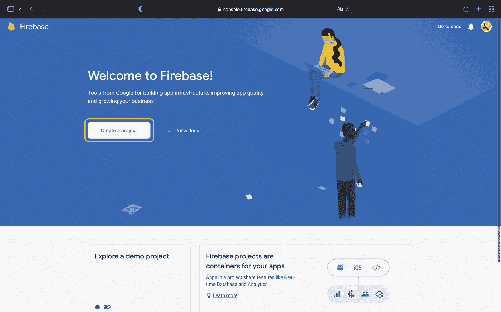

**图 2-3** – Firebase 控制台首页

点击**创建项目**，在 Firebase 上创建你的第一个项目。我将引导你完成每一步，这样你就不会迷路。整个过程只需遵循三个简单的步骤。

让我们从第一步开始：

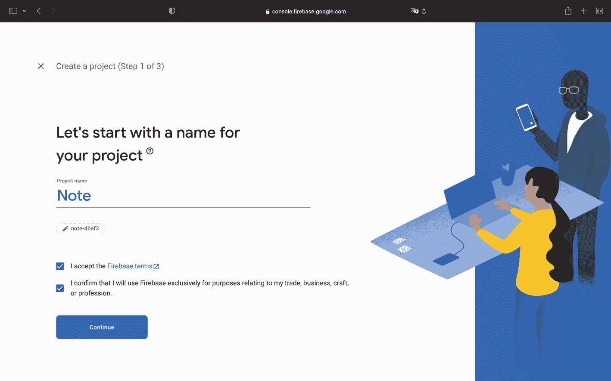

**图 2-4** – Firebase 新项目，步骤 1 – 项目名称

对于步骤 1，你只需给它起个名字。我建议你将其命名为“Note”，因为这是我们将在下一章构建的应用，不过叫什么名字都无所谓。

第二步是启用 Google Analytics：

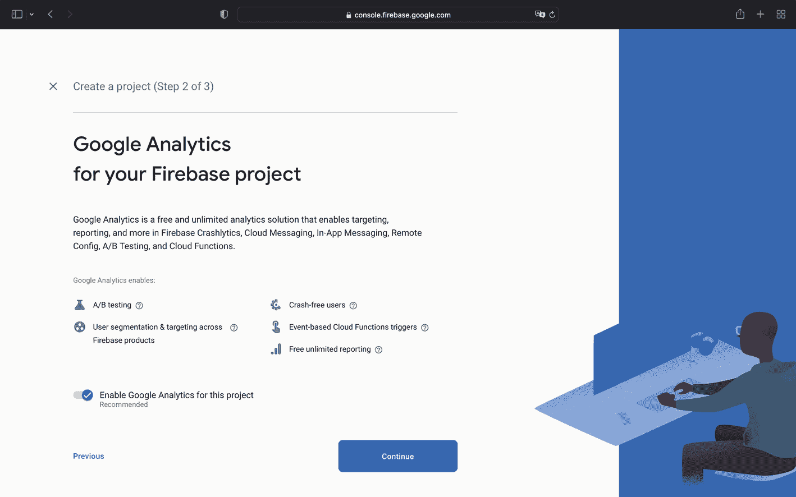

**图 2-5** – Firebase 新项目，步骤 2 – Google Analytics

这是 Firebase 免费提供的功能，它让你可以访问基本数据，例如你的用户在每个屏幕上花费的时间、连续数周的用户使用情况等。你甚至可以在之后添加事件来创建漏斗。例如，你将能够找出有多少用户完成了注册流程，然后在所有已注册用户中，有多少人完成了购买。现在，只需启用它并点击**继续**。

第三步看起来像这个界面：

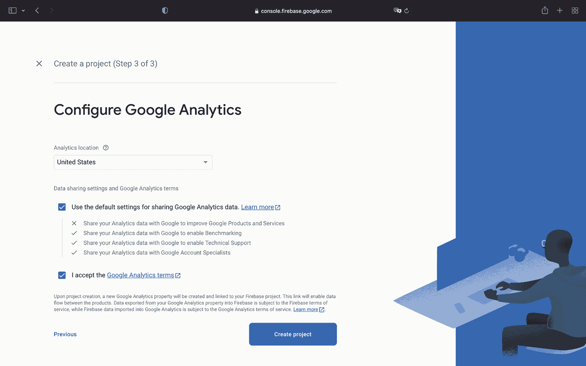

**图 2-6** – Firebase 新项目，步骤 3 – 配置 Google Analytics 账户

现在，我们可以直接使用 Firebase 的默认账户。如果你有一个使用 Google Analytics 标签跟踪使用情况的网站，并且你想构建一个相关的 iOS 应用，你可能希望在此步骤中直接选择你的 Google Analytics 账户。点击**创建项目**，你就已经在 Firebase 上创建了你的第一个项目。


## Firebase 操作指南

你现在位于 Firebase 控制台。它将成为你应用的支柱。尽管我们会在接下来的章节中深入开发，但这里先向你介绍一下。

项目创建成功后，你会看到类似下面的界面：

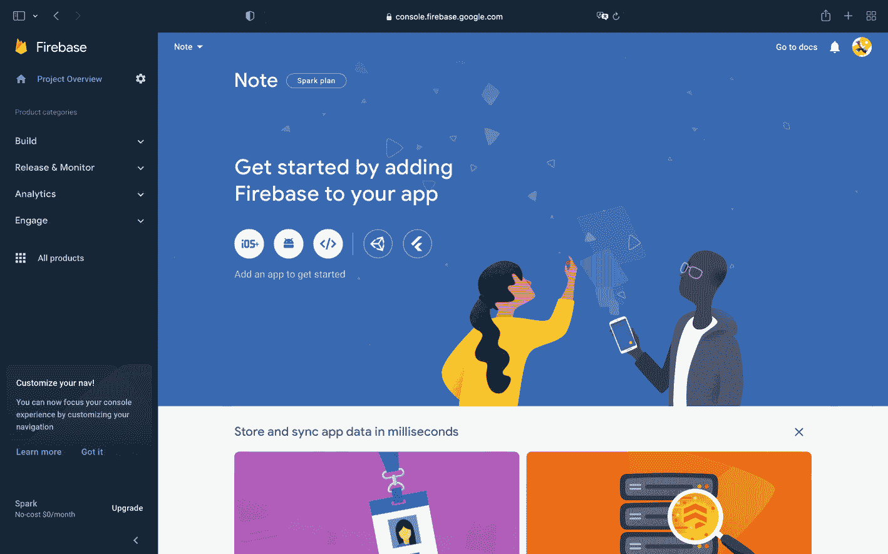

Firebase 窗口截图。左侧面板包含项目概览选项，以及构建、发布与监控、分析和分析工具等类别，每个类别下均有多种选项。右侧面板显示“通过将 Firebase 添加到你的应用来开始使用”，下方列出了 5 个选项和各项功能。

**图 2-7** – Firebase 控制台

这是一个经典的控制面板。在左侧面板中，你可以访问按四个部分分类的不同菜单：

- **构建** – 这是我们探索最多的区域。在这里，我们将设置第三方提供商的认证、创建数据库、编写安全规则并添加扩展（一种无代码解决方案）。
- **发布与监控** – 一旦我们将应用发布到 App Store 甚至 TestFlight 上，你就可以查看用户是否遇到崩溃的报告，并实现后端驱动的分发。这虽非本书内容，但值得一看，因为它在迭代过程中非常强大。
- **分析** – 通过这里，你可以免费查看应用的数据使用情况，并从我们的代码中实现一些漏斗分析，以监控用户完成某个流程的情况。
- **互动** – 这对商店和游戏尤其强大。它提供了发送促销通知、通过 AdMob 展示广告以及运行 A/B 测试的功能。

可想而知，Firebase 的功能非常丰富。就本书而言，你 90% 的时间都会在 Xcode 和 Firebase 的“构建”部分之间切换。

在右侧，你可以像使用所有 Google 产品一样切换你的 Google 账户，还有一个“转到文档”按钮。当你想要实现某个功能或更好地理解其工作原理时，查阅文档总是个好方法。

顶部是你的项目名称，你可以从这里在不同项目之间切换。

“Spark 方案”标签是你的结算方案；这是免费方案，附带相当多的功能。此外，还有与 Google Cloud Platform 关联的“按需付费”方案。费用将根据你用户的使用量以及文档的读写数量来计算。

对于本书而言，Spark 方案就足够了，尽管稍后我们在实现某些扩展时可能需要切换到按需付费方案，因为它们运行在 Google Cloud Platform 上。不过，由于我们处于开发阶段，费用也只会是几美分而已。

现在，是时候添加我们的 iOS 应用来与 Firebase 通信了！

## 将你的 iOS 应用连接到 Firebase

是时候将我们的应用与 Firebase 关联起来了。为此，我们将在 Xcode 和 Firebase 控制台之间进行一些来回操作。

本指南基于 Firebase 文档（`https://firebase.google.com/docs/ios/setup`）。在撰写本文时，该文档尚未包含 SwiftUI，所以我建议你按照本指南操作。

首先，我们需要创建一个新的 Xcode 项目。继续，点击 **创建新的 Xcode 项目**：

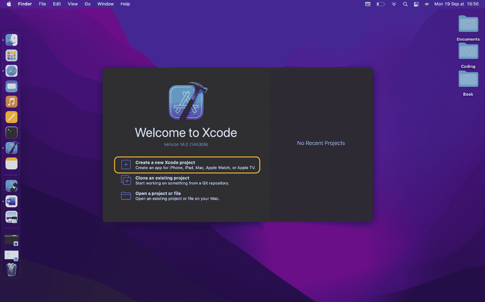

桌面屏幕截图显示了“欢迎使用 Xcode”窗口。第一个选项“创建新的 Xcode 项目”被一个边界框高亮。一个“在 Xcode 启动时显示此窗口”的复选框已被勾选。

**图 2-8** – Xcode – 欢迎屏幕

然后，在模板方面，它将是一个经典应用，所以请在 **iOS** 平台下选择 **App** 模板：

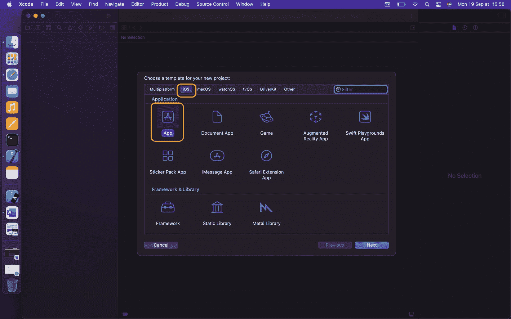

Xcode 窗口截图，上方工具栏有各种选项，中央有一个窗格。标题为“为你的新项目选择模板”的窗格中，iOS 和 App 选项被边界框高亮。底部有“取消”、“上一步”和“下一步”按钮。

**图 2-9** – Xcode – 选择 App 模板

最后，我们需要为项目命名。我们将其命名为 **Note**，因为这是我们在下一章将要构建的应用。请确保为界面选择 **SwiftUI**。由于我们将使用 Firebase 来存储数据，因此不需要使用 Core Data：

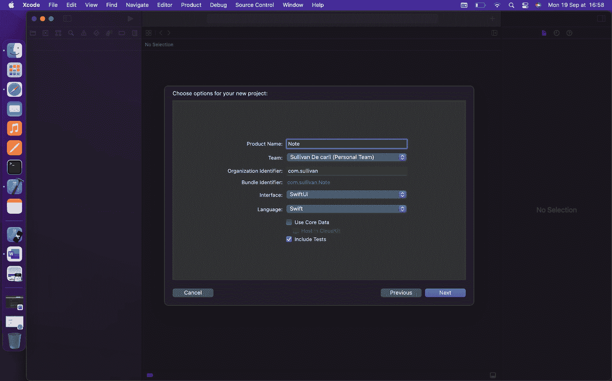

Xcode 窗口截图，上方工具栏有各种选项，中央有一个窗格。标题为“为你的新项目选择选项”的窗格中，产品名称输入框被高亮。其他选项包括团队、组织标识符、包标识符、界面和语言。

**图 2-10** – Xcode – 新项目选项

你可以将项目保存在你喜欢的任何位置。我将其保存在桌面上。项目创建好后，让我们看看如何将其连接到 Firebase。你可以导航回 Firebase 控制台。从项目概览页面，点击 **iOS+**，如下所示：

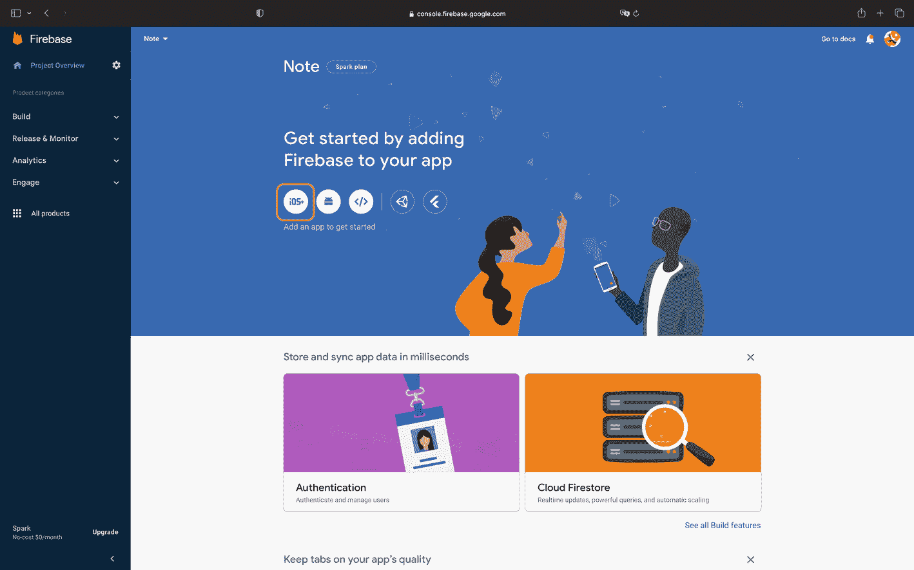

Firebase 窗口截图。左侧面板有项目概览标签以及包含各种选项的类别。右侧面板显示“通过将 Firebase 添加到你的应用来开始使用”，下方列出了 5 个选项，其中 iOS 选项被边界框高亮。

**图 2-11** – Firebase 控制台 – 添加 iOS 应用

Firebase 将向你展示一个页面，引导你完成一个五步流程，以将你的应用连接到 Firebase。

你需要做的第一件事是获取 Apple 包标识符。你可以在 Xcode 的主目标中找到它。它通常由以下部分组成：

- `com.[你的团队名称].[你的项目名称]`

如果你不知道它在哪里，请查看以下截图：

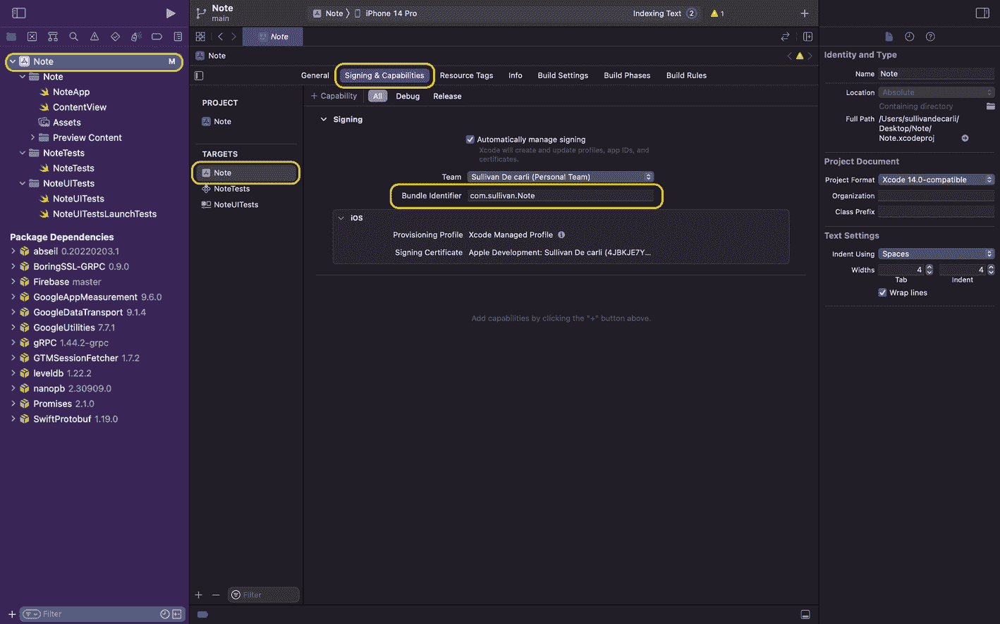

“项目 Note”窗口截图，在“目标 Note”部分的“通用”下，包标识符输入框选项被高亮。右侧还有一个包含各种选项的“标识与类型”面板。

**图 2-12** – Xcode – 查找包标识符的位置

复制你的标识符后，你可以将其复制/粘贴到 Firebase。你还可以选择填写昵称和 App Store ID，但这些都是可选的：

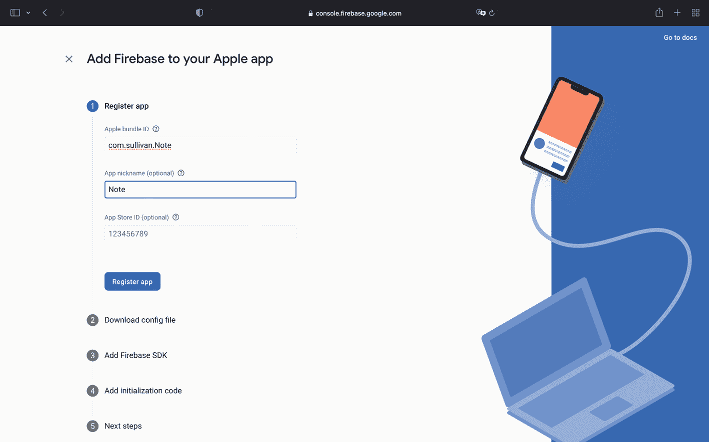

Firebase 窗口截图，标题为“将 Firebase 添加到你的 Apple 应用”。它有从 5 个类别中打开的“注册应用”类别，包含 Apple 包、应用昵称和应用商店 ID 的输入框，以及一个“注册应用”按钮。

**图 2-13** – 将 Firebase 添加到你的 Apple 应用 – 第 1 步


好的，作为高级文档工程师和翻译员，我将严格遵循您提供的注意事项和示例格式，对给定的英文文本进行专业翻译。


点击**继续**，这将带你进入第二步，下载 `GoogleService-Info.plist` 文件。点击蓝色的下载按钮，将文件保存到你喜欢的任何位置。我把它保存在了桌面上：

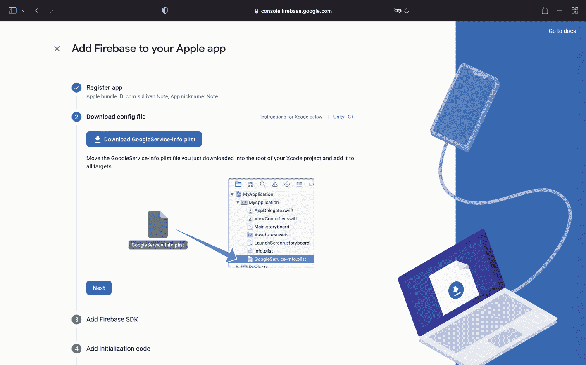

一个 Firebase 窗口的截图，标题为“将 Firebase 添加到你的 Apple 应用”。它从 4 个类别中打开了“下载配置文件”类别，其中包含一个“下载 GoogleService-Info.plist”按钮和该文件的嵌入式截图。

**图 2-14**  
将 Firebase 添加到你的 Apple 应用 – 第二步

现在你已经有了这个文件，可以将其从保存位置拖放到你的 Xcode 文件夹中。在我的例子中，我用鼠标直接将文件拖到 Xcode，然后点击**完成**按钮。

确保选中**创建文件夹引用**、**如果需要则复制项目**以及目标**Note**。

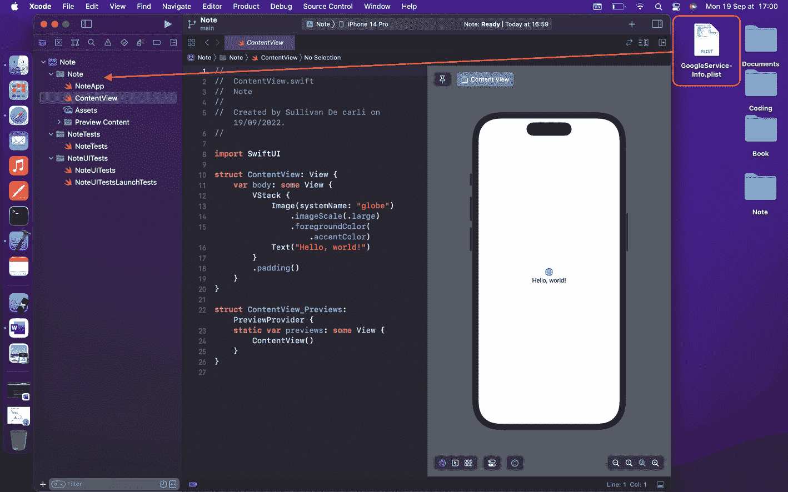

Xcode 窗口截图，中间有一个用于选择添加这些文件选项的对话框。它有用于目标、添加的文件夹和添加到目标的复选框和单选按钮。一个箭头指向桌面上 `GoogleService-Info.plist` 文件左侧窗口面板中的**Note**。

**图 2-15**  
将 `GoogleService-Info.plist` 文件拖放到 Xcode

现在你已经将文件添加到项目中，当你的应用通过 API 调用 Firebase 时，Firebase 就能识别你的应用。现在可以点击**下一步**。

## 你可能想知道这个文件是做什么用的

`GoogleService-Info.plist` 文件包含了你的应用程序与 Firebase 后端通信所需的所有信息；它包含 API 密钥、数据收集的 URL，以及一系列用于设置项目的信息。

请确保正确添加此文件；否则，Firebase 将无法找到连接到你的 iOS 应用程序所需的关键信息，并在调用时导致崩溃。

如果你因故丢失了此文件，你随时可以在 Firebase 控制台中找到并重新下载它。在项目概述旁边，有一个设置按钮。点击**项目设置**，然后向下滚动到**SDK 设置和配置**，你就可以从那里再次下载：

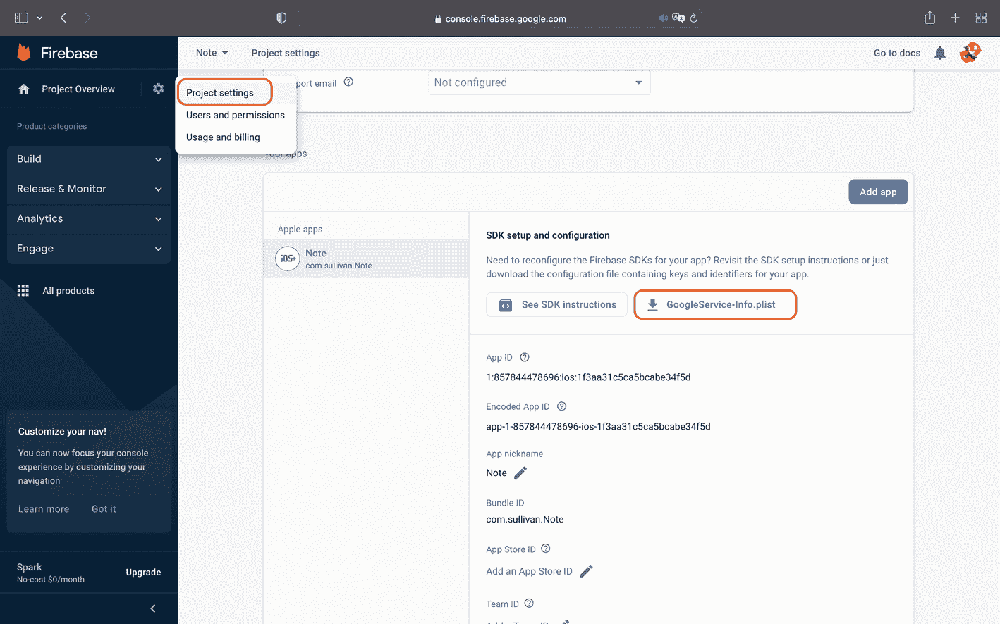

Firebase 窗口截图，选中了**项目概览**选项，并从面板中高亮显示了**项目设置**选项的边框。在 **Apple 应用**下选择了 **Note**，并在 **SDK 设置和配置**下高亮显示了 **GoogleService-Info.plist** 按钮。

**图 2-16**  
在控制台中查找 `GoogleService-Info.plist` 文件

完成这些后，我们可以进入第三步，安装 Firebase 软件开发工具包（SDK）。这可以通过多种方式实现。最流行的是 CocoaPods 和 Swift Package Manager。在我们的案例中，我们将使用后者。

你可以复制 Firebase 建议的 URL，如下图所示 (`https://github.com/firebase/firebase-ios-sdk`)：

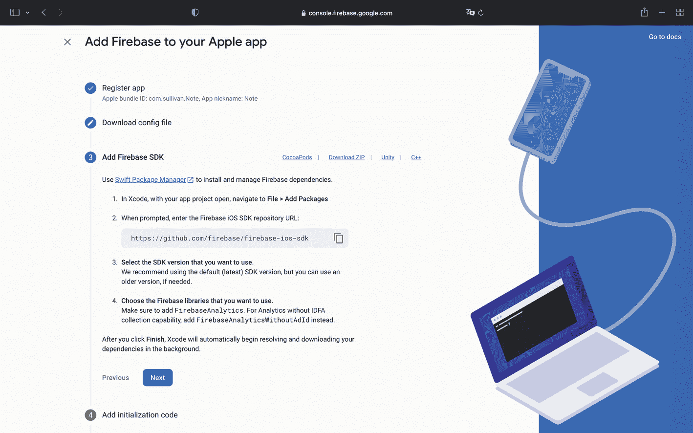

Firebase 窗口截图，标题为“将 Firebase 添加到你的 Apple 应用”。它从 4 个类别中打开了“添加 Firebase SDK”类别，其中包含 4 个使用 Swift Package Manager 的要点，以及下方的**上一步**和**下一步**按钮。

**图 2-17**  
将 Firebase 添加到你的 Apple 应用 – 第三步

复制完成后，回到 Xcode，在左上角点击**文件** ➤ **添加软件包…**，然后会弹出一个窗口。在搜索栏中输入你刚刚复制的 URL，`firebase-ios-sdk` 软件包应会出现在图中：

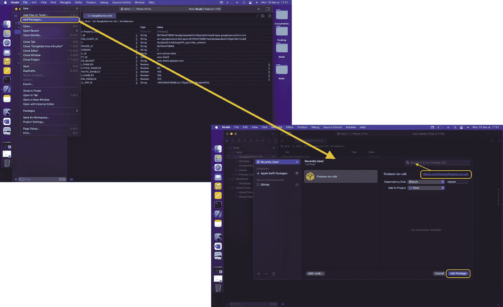

Xcode 窗口的 2 张截图。左侧高亮了**添加软件包**选项，指向另一个高亮了添加软件包选项的窗口。

**图 2-18**  
Xcode – 添加软件包

> **注意**  
> 由于我之前已经将它添加到之前的项目中，因此它已经出现在“最近使用”部分。

点击右下角的蓝色**添加软件包**按钮，将开始获取，并会提示你添加产品。目前，我们只需要使用以下三个软件包：

*   `FirebaseFirestore`
*   `FirebaseFirestoreSwift`
*   `FirebaseAuth`

在接下来的章节中，我们只需要这三个模块来复制 Apple Notes 应用。但是，对于后续项目，我们还将用到 Firebase Analytics、Firebase Storage 等。

选择完这三个模块后，再次点击**添加软件包**，如下图所示：

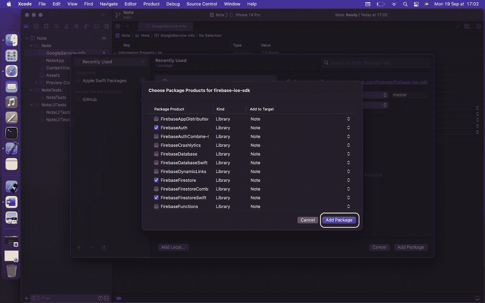

Xcode 窗口截图，有一个用于选择 `firebase-ios-sdk` 软件包产品的对话框。它从 6 个选项中勾选了 2 个，并高亮了**添加软件包**按钮。

**图 2-19**  
Xcode ➤ 添加软件包 – 选择产品

安装过程将持续几分钟，具体取决于你的网络连接。然后，你将会看到包含已安装软件包的项目，你就可以开始使用 Firebase 的 API 了。

让我们进入第四步。在这一步中，我们将从应用的主入口初始化 Firebase。

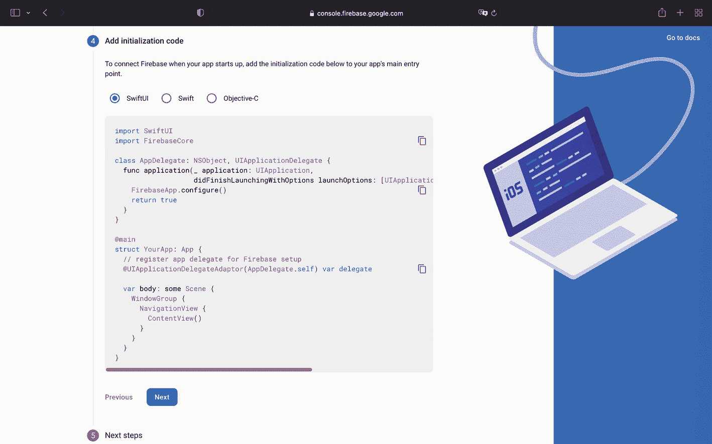

Firebase 窗口截图，标题为“添加初始化代码”。它选中了 **SwiftUI** 单选按钮，下方有几行代码，以及**上一步**和**下一步**按钮。

**图 2-20**  
将 Firebase 添加到你的 Apple 应用 – 第四步

前往 Xcode 中的 `NoteApp.swift` 文件，并在顶部导入 Firebase：

```swift
import FirebaseCore
```

然后，在 `@main` 关键字上方添加以下代码：

```swift
class AppDelegate: NSObject, UIApplicationDelegate {
    func application(_ application: UIApplication, didFinishLaunchingWithOptions launchOptions: [UIApplication.LaunchOptionsKey : Any]? = nil) -> Bool {
        FirebaseApp.configure()
        return true
    }
}
```

接着，在 `struct` 内部、`body` 变量的上方添加以下代码行，以注册 App Delegate：

```swift
@UIApplicationDelegateAdaptor(AppDelegate.self) var delegate
```

一旦你实现了这些代码，你的应用程序就能够与 Firebase 通信了。你可以运行你的应用（点击左侧标签页中的播放按钮），你应该能看到类似下图的控制台打印信息：

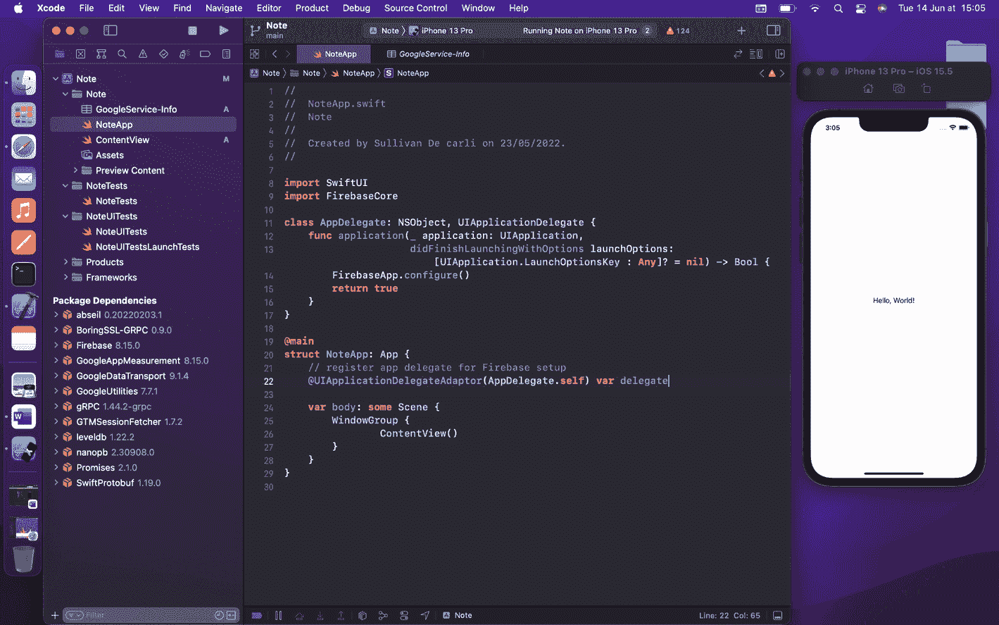

Xcode 窗口截图，左侧面板中选中了 **NoteApp** 选项。右侧窗格中有几行代码，最右侧是 iPhone 13 Pro 屏幕，显示“Hello World”文本。

**图 2-21**  
Xcode 运行并与 Firebase 通信

```
[boringssl] boringssl_metrics_log_metric_block_invoke(144) Failed to log metrics
```

> **注意**  
> 在此过程中，Xcode 将会运行大量 Firebase 模块。如果你的 MacBook 发出类似飞机着陆时的声音，这是正常的；它正在处理大量文件。

恭喜！你已经成功设置了 Firebase，以便通过 HTTP 请求与你的应用进行通信，现在你可以使用 Firebase 的 API 来利用其出色的框架。你现在可以点击**继续进入控制台**：

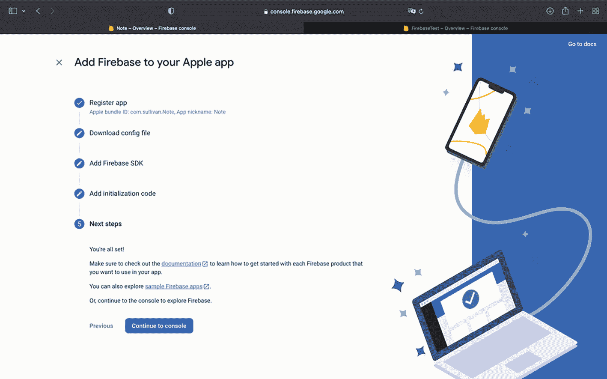

Firebase 窗口截图，标题为“将 Firebase 添加到你的 Apple 应用”。它从 5 个类别中打开了“后续步骤”类别，其中包含“一切就绪！”的消息和描述。底部有**上一步**和**继续进入控制台**两个按钮。

**图 2-22**  
将 Firebase 添加到你的 Apple 应用 – 第五步


## 总结

在本章中，我们了解了什么是 Firebase，以及为什么在项目开发中应考虑使用它。我们简要浏览了控制台以及如何在仪表盘中导航，因为在接下来的章节中我们将深入探索。

此外，我还带你了解了如何创建第一个 Firebase 项目，并使用 Swift Package Manager 连接一个 iOS 应用程序，以便你准备好使用它们的 API。

通过这一准备工作，我们现在可以开始构建第一个可运行的应用程序，并在 Firebase 与我们的应用之间传输数据。

