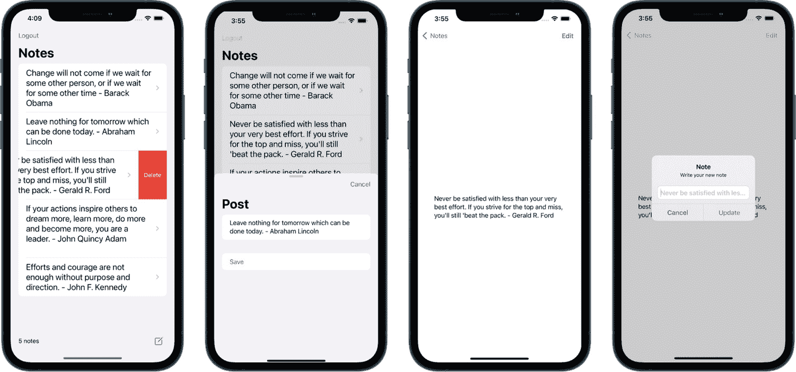
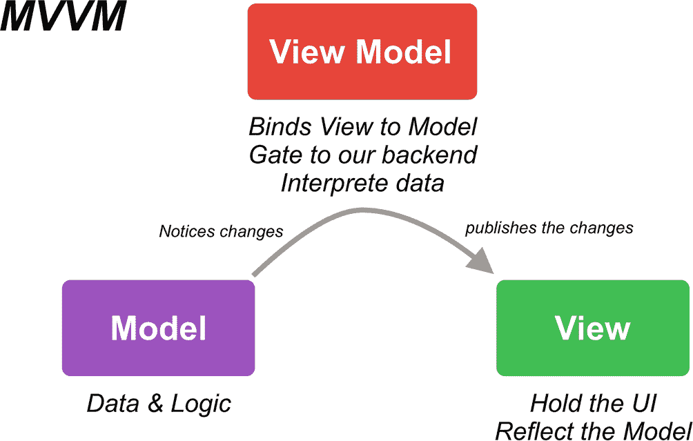
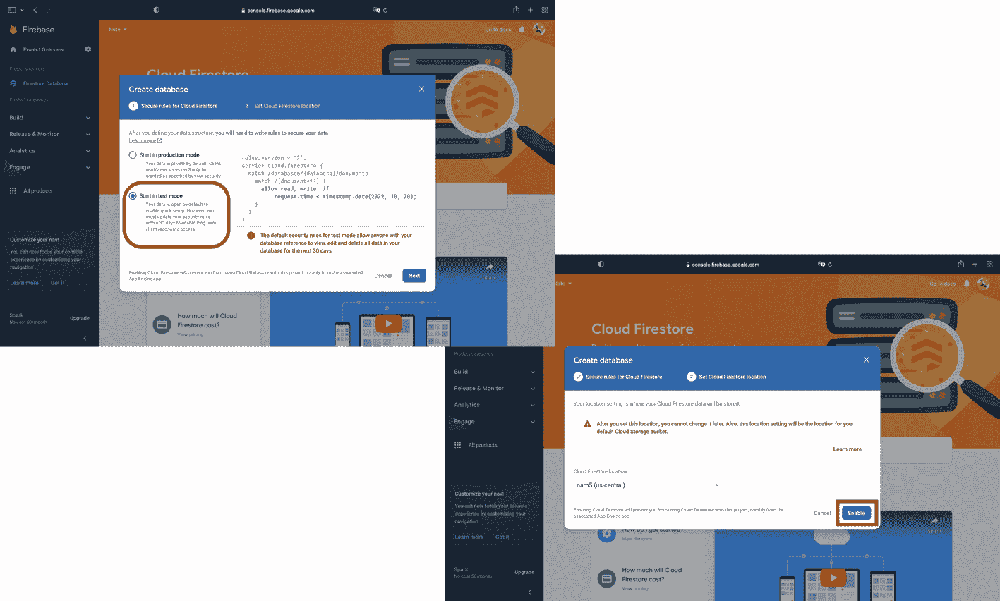
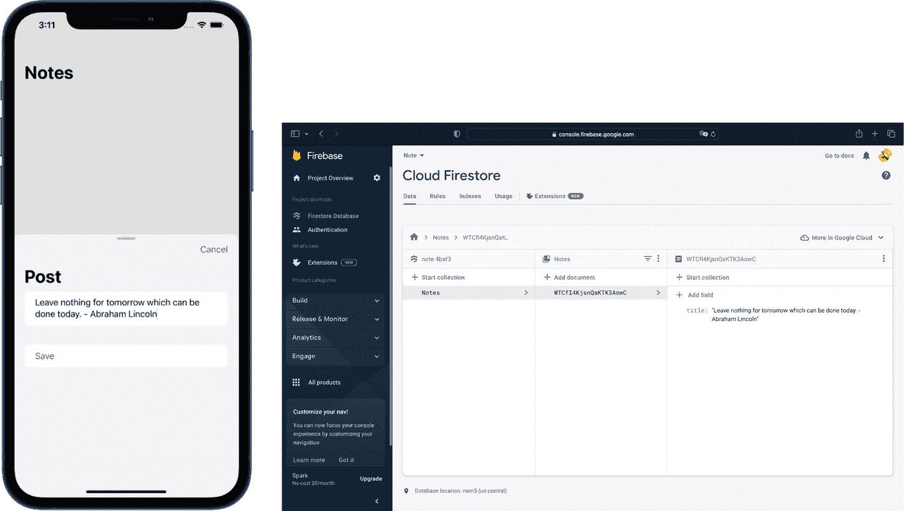
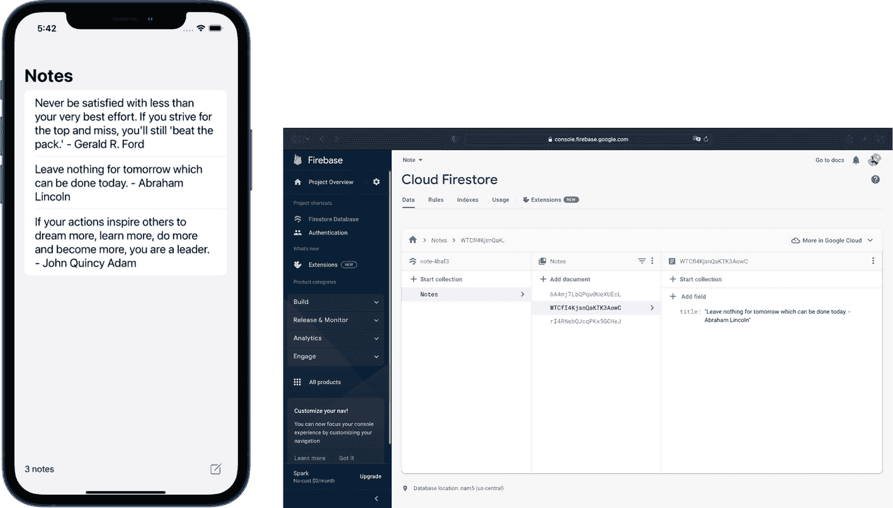
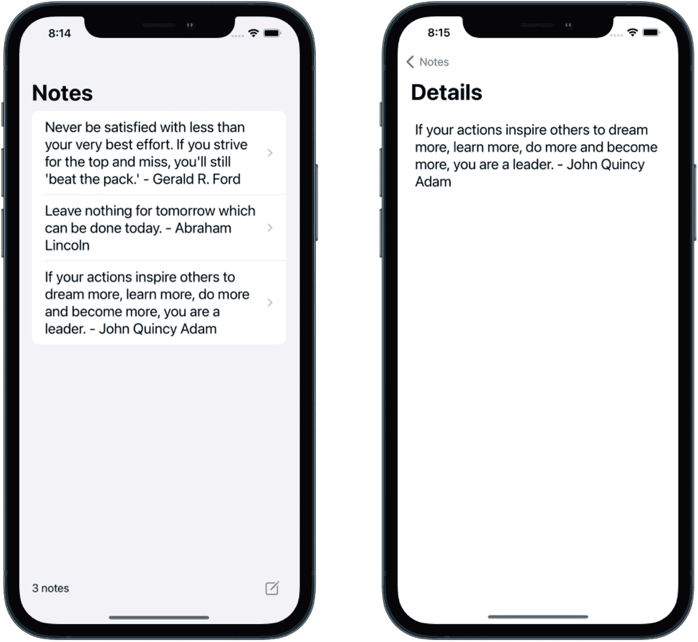
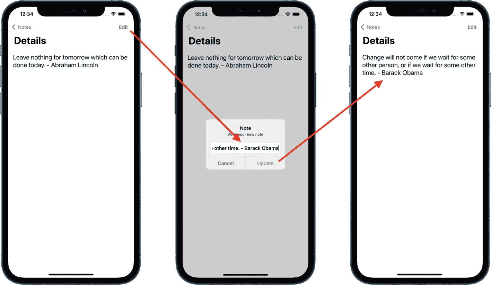
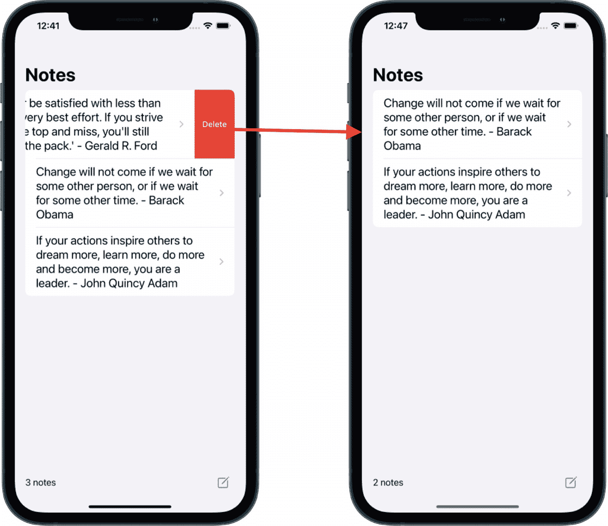

# 3. 体验 Firestore

在本章中，我们将通过一个经典的编程练习来专注于 Firebase Firestore：创建-读取-更新-删除（CRUD）。Firestore 是一个基于 NoSQL 文档的数据库，它允许我们无需管理基础设施即可查询、同步和存储数据。

在介绍了我们的应用架构和 MVVM 设计模式之后，我们最终将离开“它是如何工作的”理论和设置部分，进入编码环节，构建一个 iOS 应用程序，该应用将复制苹果产品自带的 Apple Notes 应用。它将如下图所示：



四个手机屏幕显示一个深色背景，上面有 3 条笔记可供编辑、发布和更新。

**图 3-1** 我们将要构建的笔记应用的屏幕截图

该应用将包含一个笔记列表——我们可以直接从主屏幕删除笔记——一个用于上传新笔记的表单，以及一个用于完整阅读笔记的详情页面，并且我们能够编辑笔记。

在本章结束时，你将能够恰当地构建你的 iOS 项目，并向 Firestore 发起 API 调用。

## 介绍 MVVM 设计模式

你可能想知道 MVVM 是什么以及它的全称。MVVM 是 Model-View-ViewModel（模型-视图-视图模型）的缩写；这是一种被 SwiftUI 开发者社区广泛使用的架构。将其视为一种“如何组织我的代码”的解决方案。

在第 1 章中，我们使用了 SwiftUI，并且几乎是毫无结构地将所有代码拼凑在一起。作为入门介绍，这样做没问题。然而，随着我们的应用变得更加复杂，代码可能会变得难以阅读并引发冲突。这时，应用架构就派上用场了！

它将帮助我们把代码分解成多个文件。每个文件都有一个特定的目的：

-   **模型** 负责构建我们的数据结构并包含逻辑。
-   **视图模型** 将负责管理数据，接收模型的更新通知，并在我们的场景中负责与 Firebase 的调用通信。
-   **视图** 将向用户展示我们的用户界面：列表、按钮、文本、图像等等。它会将数据与我们的视图模型绑定。

你可能在想，我们的应用为什么需要架构。嗯，当你希望与多人协作开发一个项目，或者应用变得复杂时，它就变得很重要。它有助于预防代码中的错误。总的来说，它具有以下优点：

-   我们将实现关注点分离。这样，每个文件都有自己的职责，我们可以避免错误和冲突。
-   更容易阅读和识别错误。例如，如果出现 UI 问题，你应该在视图中查找；如果出现 HTTP 请求问题，视图模型就是需要检查的文件。数据缺失？你可能需要在模型中添加它。

现在，请花点时间看看下面展示设计模式的图表：



一个架构图。模型注意到数据和逻辑的变化，并与视图模型通信，视图模型将视图绑定到模型，充当通往后端的门户，并解释数据。视图发布更改。

**图 3-2** 图形化的 MVVM 架构

如你所见，模型与视图模型进行通信，视图模型负责解释数据并将其传递给视图，而视图仅负责呈现用户界面，并同时将用户意图通知给视图模型。

例如，在我们即将构建的应用中，模型将由一个标识符和一个标题组成。此结构将通知负责向 Firebase 发起读取调用的视图模型，然后将数据在视图内的列表中呈现。

当数据以相反方向流动时会发生什么？

如果数据是通过视图模型从视图传递到模型，那么视图将通知视图模型，视图模型将解释此操作，然后修改模型。例如，当用户删除一条笔记时，视图将通知视图模型，视图模型会根据模型中存储的信息，通知 Firebase 删除该文档。

现在，如果这对你来说听起来仍然有点抽象，别担心。通过在本书的实践中应用它，一切都会变得清晰。


## 创建 Firestore 数据

在开始编码之前，Firebase 仍需要进行一些设置才能使用 Firestore 数据库。前往你的 Firebase 控制台，在左侧面板中找到 Firestore Database 部分，然后点击 `Create database` 按钮，如下图所示：


屏幕显示了一个 Firestore 数据库，并带有 Cloud Firestore 的说明面板，用于创建数据库。

**图 3-3** Firebase 控制台 – Firestore 部分

此时会弹出一个窗口，引导你完成两个步骤。第一步是选择如何启动数据库。我们将选择测试模式，因为本章只是初步探索 Firebase。我们无需设置规则来将 Firebase 的使用限制在已认证用户等范围内。此外，我们使用的是 Spark 计划，尚未输入信用卡信息，因此在计费方面没有问题。

第二步是选择数据存储位置。只需选择离你较近的区域即可。我选择了美国中部，但如果你打算将应用分发到欧洲市场，那么选择中欧作为数据库位置会更优，因为距离更近，效率也稍高。请按照以下说明完成这两个步骤：



两个屏幕分别显示了数据库的创建过程、底部的两个选项，以及右侧的警告和启用选项。

**图 3-4** Firestore 两步设置

现在我们的数据库已经激活，是时候回到 Xcode 了。打开我们之前创建并连接到 Firebase 的 Note 项目。

根据我们之前讨论的 MVVM 架构，接下来要创建 Model。

点击 `Create a new file ➤ Swift File` 并将其命名为 `Note`。然后粘贴以下代码：

```
import Foundation
import FirebaseFirestoreSwift
struct Note: Codable {
@DocumentID var id: String?
var title: String?
}
```

这就是我们的 Model 所需的全部内容：一个标识符和一个用于存储稍后将在表单中输入的文本的标题。

请注意，我们导入了 `FirebaseFirestoreSwift` 以使用 `@DocumentID` 关键字。这个关键字来自 Firebase，用于帮助我们正确地将文档与 Firebase 的标识符进行映射。

下一步是创建我们的 View Model。这个文件将负责根据我们刚创建的 Model 将数据传递给 View。它还将使用 Firebase 的 API 与 Firebase 进行通信，因此我们需要在顶部导入 Firestore 框架。

点击 `Create a new file ➤ Swift File` 并将其命名为 `NoteViewModel`，然后在顶部导入框架：

```
import FirebaseFirestore
```

然后，你可以将以下代码复制/粘贴到你的文件中：

```
class NoteViewModel: ObservableObject {
@Published var notes = [Note]()
private var databaseReference = Firestore.firestore().collection("Notes")
// 用于发布数据的函数
// 用于读取数据的函数
// 用于更新数据的函数
// 用于删除数据的函数
}
```

很好，我们刚刚创建了一个符合 `ObservableObject` 的类。它允许该类的实例稍后在视图中使用，这样当发生变化时，视图将使用更新后的更改重新加载。

然后，我们使用 `Published` 创建了一个对 Model 的引用，以告知程序当 Model 发生更改时重新加载。

此外，我们还添加了一个变量，以便引用我们刚刚命名为 `Notes` 的 Firestore 集合。添加这个引用很有用，这样我们在编写获取、读取、删除或更新数据的函数时，无需多次编写它。

现在是时候在之前留下的注释下方添加将数据发布到 Firestore 的函数了：

```
// 用于发布数据的函数
func addData(title: String) {
do {
_ = try databaseReference.addDocument(data: ["title": title])
}
catch {
print(error.localizedDescription)
}
}
```

这里没有什么太多需要评论的。我们使用的是 Firebase 的 `addDocument` API，传递我们的数据：标题（字符串）。如果出现错误，它也会捕获错误，并在控制台中通过 `catch` 打印出来。

对于 Model-View Model 将数据发布到 Firestore 来说，这已经足够了。现在是时候构建我们的用户界面了。我们将为表单创建 UI，并处理从 `ContentView.swift` 文件中呈现它的逻辑。

继续操作，点击 `Create a new file ➤ SwiftUI View` 并将其命名为 `FormView`：

```
import SwiftUI
struct FormView: View {
@Environment(\.dismiss) var dismiss
@State var titleText = ""
var body: some View {
// ...
}
}
```

这些代码行将有助于处理视图的呈现和用户通过标题输入的文本。

现在让我们构建一个表单。在 `body` 变量内添加以下代码：

```
NavigationStack {
Form {
Section {
TextEditor(text: $titleText)
.frame(minHeight: 200)
}
Section {
Button(action: {
// TODO: 上传数据
}) {
Text("立即保存")
}.disabled(self.titleText.isEmpty)
.foregroundColor(.yellow)
}
}.navigationTitle("发布")
.toolbar {
ToolbarItemGroup(placement: .destructiveAction) {
Button("取消") {
dismiss()
}
}
}
}
```

很好！我们刚刚添加了一个包含表单的 `NavigationStack`，该表单由一个 `TextEditor`（对于长文本输入来说比 `TextField` 更好）组成。此外，我们还添加了一个发布按钮，如果没有文本输入则禁用；以及另一个按钮作为导航的一部分位于顶部，用于关闭视图。

现在，我们可以从 `ContentView.swift` 文件中调用这个屏幕了！添加以下 `@State` 来观察视图的呈现状态：

```
import SwiftUI
struct ContentView: View {
@State private var showingSheet = false @State private var postDetent = PresentationDetent.medium
var body: some View {
// ...
}
}
struct ContentView_Previews: PreviewProvider {
// ...
}
```

现在是时候创建带有按钮的底部栏，以模态方式呈现我们的表单了。

在 `body` 变量内添加以下代码：

```
NavigationStack {
List {
// TODO: 显示我们的笔记
}
.toolbar {
ToolbarItemGroup(placement: .bottomBar) {
Text(" X 条笔记") // TODO
Spacer()
Button {
// 写一条新笔记
showingSheet.toggle()
} label: {
Image(systemName: "square.and.pencil")
}
.imageScale(.large)
.sheet(isPresented: $showingSheet) {
FormView().presentationDetents([.large, .medium])
}
}
} }.navigationTitle("笔记")
```

我们刚刚添加了另一个 `NavigationStack`，其中包含一个列表（我们将在下一部分用数据填充它），并在底部添加了一个按钮，复制了 Apple Notes 应用中的功能，这要感谢 SF Symbols。

> **SF Symbols** 是 Apple 构建的图标库。截至目前，它提供了超过 4,400 个符号。这样，你无需设计师技能即可将漂亮的图标集成到你的应用程序中。如果你想查看可以选择哪些图标，可以从以下页面下载 Apple 的应用：
> 
> [`https://developer.apple.com/sf-symbols/`](https://developer.apple.com/sf-symbols/)

这个页面将在点击按钮时呈现，并且可以从表单中关闭。

你可以运行你的应用程序并检查交互；你应该能够多次访问表单并关闭它。

既然我们的用户界面已经准备就绪，是时候将数据发布到 Firestore 并再次前往 `FormView` 了。

在 `body` 变量上方添加以下观察者：

```
@ObservedObject private var viewModel = NoteViewModel()
```

这将实现 View 和 View Model 之间的数据绑定。现在我们只需要在我们之前留下 `// TODO: upload data` 注释的地方，在按钮操作中调用我们之前创建的函数即可，如下所示：

```
var body: some View {
NavigationStack {
Form {
Section {
// ..
}
Section {
Button(action: {
self.viewModel.addData(title: titleText)
titleText = ""
dismiss()
}) {
// ..
}
// ...
}
}.navigationTitle("发布")
// ...
}
}
```


瞧！我们只需从视图模型中调用函数，将标题文本的内容发布到 Firebase，然后使用 `dismiss()` 关闭视图。

运行你的应用，输入一些文字，然后点击“立即保存”。



左侧的移动屏幕显示“发布”下方有一条笔记，右侧的 Web 屏幕显示 Cloud Firestore 笔记面板中的数据选项卡，下方添加了相应的笔记，以及“添加字段”选项。

**图 3-5** 向 Firestore 上传数据

让我们看看你的 Firebase Firestore 控制台发生了什么：

恭喜！我们刚刚完成了对 Firebase API 的首次调用，在 Notes 集合中添加了一个文档。你甚至可以继续添加任意多个文档！

现在是时候读取这些笔记并将它们显示在我们的列表中了！

## 从 Firestore 读取数据

现在该读取我们的笔记了，因为我们已经向 Firestore 发布了几条笔记。在我们的 `ContentView.swift` 文件中，我们添加了一个由 `List` 组成的 `NavigationView`。我们将在这个列表中显示数据，但还没有添加获取这些数据的函数。接下来进入 `NoteViewModel.swift` 文件，在我们留下的注释下方添加以下函数：

```
// 读取数据的函数
func fetchData() {
    databaseReference.addSnapshotListener { (querySnapshot, error) in
        guard let documents = querySnapshot?.documents else {
            print("没有文档")
            return
        }
        self.notes = documents.compactMap { queryDocumentSnapshot -> Note? in
            return try? queryDocumentSnapshot.data(as: Note.self)
        }
    }
}
```

这个从 Firestore 读取数据的函数之前缺失了。它添加了一个监听器，以便我们的前端能够基于我们创建的 `Note` 模型实时接收来自后端的更新。

现在让我们在 `ContentView` 中使用它来获取数据并在列表中显示。就像我们在 `FormView` 中所做的那样，我们也需要观察视图模型。请在 `ContentView.swift` 文件中的 `body` 变量上方添加以下代码行：

```
@ObservedObject private var viewModel = NoteViewModel()
```

现在我们已经准备好监听视图模型的更新，接下来实现 UI（仍在 `ContentView.swift` 文件中）：

```
import SwiftUI

struct ContentView: View {
    // ...
    var body: some View {
        NavigationStack {
            List {
                ForEach(viewModel.notes, id:\.id) { Note in
                    VStack(alignment: .leading) {
                        Text(Note.title ?? "").font(.system(size: 22, weight: .regular))
                    }.frame(maxHeight: 200)
                }
            }.onAppear(perform: self.viewModel.fetchData)
            .toolbar {
                ToolbarItemGroup(placement: .bottomBar) {
                    Text("\(viewModel.notes.count) 条笔记")
                    Spacer()
                    Button {
                        // ...
                    } label: {
                        Image(systemName: "square.and.pencil")
                    }
                    // ...
                }
            }
        }.navigationTitle("笔记")
        // ..
    }
}
```

我们刚刚基于模型实现了一个列表，并为每个元素分配了一个标识符；否则，当我们添加或删除笔记时，SwiftUI 将无法知道引用哪个元素。这就是 `id:\.id` 的作用。

此外，我们使用 `.onAppear` 修饰符来获取数据，这样每当视图出现时就会调用该函数。

我们还添加了代码 `viewModel.notes.count`，让用户知道我们的应用中有多少条笔记注册了，类似于苹果的 Notes 应用。

运行应用，你添加的所有数据都会出现在那里。我添加了几条美国总统的名言。我的列表看起来像这样：



左侧的移动屏幕显示 3 条笔记，右侧的 Web 屏幕显示云存储，第三条笔记位于“添加字段”选项下。

**图 3-6** 从 Firestore 读取数据

## 在视图之间传递数据

现在，如果我们想阅读完整的引言呢？从列表中阅读并不容易。如果能显示另一个包含更多细节的屏幕会很酷。这就是我们要实现的功能。这里的挑战是如何使用正确的标识符在视图之间传递数据。让我们开始吧。

我们将创建一个 `DetailsView` 来在 `ScrollView` 中呈现文本，以便我们能阅读完整文本。

创建一个新的 SwiftUI 视图文件，命名为“`DetailsView`”，并向其中添加以下代码：

```
import SwiftUI

struct DetailsView: View {
    var note: Note
    var body: some View {
        Text("\(note.title ?? "")")
    }
}

struct DetailsView_Previews: PreviewProvider {
    static var previews: some View {
        DetailsView(note: Note(id: "bKrivNkYirmMvHyAUBWv", title: "问题从来都不简单。我引以为傲的一点是，你很少会听到我简化问题。巴拉克·奥巴马"))
    }
}
```

这样，我们就有了一个引用，可以将数据从 `ContentView` 传递到我们的 `DetailsView`。同时，我们需要在预览中用一些默认数据进行初始化；否则，Xcode 不会允许我们运行应用。

我们还用笔记的标题替换了“Hello, world”文本，如果数据不存在，则通过 `?? ""` 传递一个默认的空字符串。

现在是时候让行变得可点击并传递数据了。让我们回到 `ContentView` 文件，将包含文本的 `VStack` 嵌入到 `NavigationLink` 修饰符中，如下所示：

```
struct ContentView: View {
    // ...
    var body: some View {
        NavigationStack {
            List(viewModel.notes, id: \.id) { Note in
                NavigationLink(destination: DetailsView(note: Note)) {
                    VStack(alignment: .leading) {
                        Text(Note.title ?? "").font(.system(size: 22, weight: .regular))
                    }.frame(maxHeight: 200)
                }
            }.onAppear(perform: self.viewModel.fetchData)
        }
        .toolbar {
            // ...
        }
        .navigationTitle("笔记")
    }
}
```

这就是我们需要做的全部工作。使用 SwiftUI 的 `NavigationLink`，我们只需要传递要呈现的视图以及它们需要包含的数据。这里我们引用了在 `DetailsView` 中也调用的 `Note` 模型，以使其正常工作。

请注意，`NavigationLink` 只能在 `NavigationView` 内部工作，因为它是该协议的一部分。

现在你可以运行你的应用并点击某一行；它将打开 `DetailsView` 并根据你点击的行显示详细信息。

但让我们稍微改进一下 `DetailsView` 的用户界面。我们将为导航栏添加一个标题，并将文本放入 `ScrollView` 中，这样当文本较长时我们可以完整阅读。在 `body` 变量中实现以下代码：

```
NavigationStack {
    ScrollView {
        VStack {
            Text(note.title ?? "")
                .font(.system(size: 22, weight: .regular))
                .padding()
            Spacer()
        }
    }
}.navigationTitle("详情")
```

这样看起来更好了！我们现在符合最初的用户界面设计：



两个移动屏幕以两种格式显示笔记。第一个有 3 条笔记，第二个有 1 条笔记。

**图 3-7** 从列表导航到另一个视图

得益于 `NavigationLink`，我们的每一行都自动出现了一个 `>` 符号，向用户指示该行是可点击的。现在，如果我们写错了一条笔记该怎么办？让我们为此实现一个编辑器吧！


## 从 Firestore 更新数据

在本节中，我们将实现一个新的屏幕来编辑笔记，并将文本条目保存到 Firestore。但首先，让我们前往 `View Model`，添加将其更新到 Firestore 的必要功能。

将以下代码粘贴到 `NoteViewModel.swift` 中：

```
// 更新数据的函数
func updateData(title: String, id: String) {
    databaseReference.document(id).updateData(["title" : title]) { error in
        if let error = error {
            print(error.localizedDescription)
        } else {
            print("笔记更新成功")
        }
    }
}
```

如您所见，我们在文档中传递了一个标识符，以让 Firestore 知道需要更新哪个文档。然后，我们在 `updateData` 函数中传递要修改的标题。和往常一样，如果有错误，我们会打印出来。

是时候处理用户界面了。我们将使用一个包含 `TextField` 的弹窗提示，让用户更新文本。在 `DetailsView` 顶部添加以下代码：

```
@State private var presentAlert = false
@State private var titleText: String = ""
@ObservedObject private var viewModel = NoteViewModel()
```

我们需要这些参数来进行交互：

- `@State` 布尔值，用于控制弹窗的显示
- `@State`，用于跟踪 `TextField` 的输入内容

当然，我们的 View Model 会从我们的 View 中获取信息以进行更新。

现在，我们可以从 `DetailsView` 中展示我们的 `Alert` 了。首先，我们需要在这个屏幕上添加一个“编辑”按钮；我们将通过 `toolbar` 来实现。您可以将其直接添加到 `navigationTitle` 下方：

```
.toolbar {
    ToolbarItemGroup(placement: .confirmationAction) {
        Button {
            presentAlert = true
        } label: {
            Text("编辑").bold()
        }.alert("笔记", isPresented: $presentAlert, actions: {
            TextField("\(note.title ?? "")", text: $titleText)
            Button("更新", action: {
                // TODO: 更新数据并清空文本
            })
            Button("取消", role: .cancel, action: {
                presentAlert = false
                titleText = ""
            })
        }, message: {
            Text("写下您的新笔记")
        })
    }
}
```

太棒了！现在我们可以展示 `Alert`，并在过程中传递数据。我们现在可以添加更新笔记的函数了。在 `DetailsView` 中我们留下 `// TODO:` 注释的位置添加以下代码：

```
self.viewModel.updateData(title: titleText, id: note.id ?? "")
titleText = ""
```

瞧！我们现在可以运行应用并编辑笔记了。输入的字段现在将使用相应的标识符填充选定的笔记。

假设您想把亚伯拉罕·林肯的语录

“今天能做的事，不要留给明天。—— 亚伯拉罕·林肯”

改成巴拉克·奥巴马的另一句名言：

“如果我们等待其他人，或者等待其他时间，改变就不会到来。—— 巴拉克·奥巴马”

前往您的列表，导航到详情页，点击编辑按钮。然后输入上述文本。您会看到文本将在 `DetailsView` 中更新，然后更新到我们的 `List` 中：



三个手机屏幕以三种格式显示笔记，用于编辑和更新，以及更新后的笔记。

**图 3-8** 从模拟器中编辑笔记

我们现在正在编辑笔记，它在后端和用户界面中都是实时编辑的。

现在，如果您想删除笔记呢？让我们来实现最后一个功能。

## 从 Firestore 删除数据

让我们实现最后一步：从 Firestore 中删除数据。我们在 `NoteViewModel` 中为此留了一个标记。前往该文件并添加以下代码：

```
// 删除数据的函数
func deleteData(at indexSet: IndexSet) {
    indexSet.forEach { index in
        let note = notes[index]
        databaseReference.document(note.id ?? "").delete { error in
            if let error = error {
                print("\(error.localizedDescription)")
            } else {
                print("ID 为 \(note.id ?? "") 的笔记已删除")
            }
        }
    }
}
```

在删除函数中，我们提供了一个 `indexSet`，这有助于引用我们的列表，然后传递我们在 Model 中创建的标识符，以便将正确的 ID 信息传递给 Firestore 以删除正确的文档（即在行中选定的那个）。和往常一样，如果有错误，我们会打印错误，如果成功，我们会打印文档标识符。

现在，让我们在屏幕上实现它！前往 `ContentView.swift` 文件：

```
struct ContentView: View {
    // ...
    var body: some View {
        NavigationStack {
            List {
                ForEach(viewModel.notes, id:\.id) { Note in
                    NavigationLink(destination: DetailsView(note: Note)) {
                        // ...
                    }
                }.onDelete(perform: self.viewModel.deleteData(at:))
            }.onAppear(perform: self.viewModel.fetchData)
            .navigationTitle("笔记")
        }
        .toolbar {
            // ...
        }
    }.navigationTitle("笔记")
}
```

就是这样！使用 SwiftUI 从列表中删除项目非常简单。`onDelete` 修饰符处理向左滑动，显示红色的“删除”标题。我们的函数将完成其余工作，删除 Firestore 上的文档。

现在，我邀请您在模拟器上运行您的应用。在您要删除的行上向左滑动，查看 Firestore 控制台上发生了什么：



一个手机屏幕显示带有删除选项的笔记。右侧的两个屏幕显示 Cloud Firestore 及其字段，第三个屏幕上显示相应的代码片段和笔记。

**图 3-9** 从列表和 Firestore 数据库中删除笔记

通过这样做，您将看到后端实时发生删除操作。然后您的笔记将从列表中消失，我们的笔记数量将在 `toolBar` 中更新。

## 总结

我们已经完成了第一个具有大多数应用中常见功能函数的笔记应用：从后端发布、读取、更新和删除内容的能力。这是一次不错的 CRUD 练习，也是让您开始使用 SwiftUI 和 Firebase 的好方法。

在本章中，我们介绍了如何使用 MVVM 设计模式构建我们的应用，以及首次使用 Firebase 的 API、设置 Cloud Firestore 数据库并在用户界面和后端之间（更确切地说，是在 View Model 和后端之间）建立联系。

接下来，您将找到第一个应用的仓库链接。如果您在途中遗漏了什么，请查阅该仓库：

如何使用这个仓库？如果您克隆此仓库并运行应用，它会崩溃。为什么？因为该项目中没有 `GoogleService-Info.plist` 文件。Firebase 会查找它，但找不到必要的 API 密钥，因此无法初始化并导致崩溃。

要使其正常工作，您需要前往 Firebase 控制台，按照我们在第 2 章中的操作添加一个新的 iOS 项目，传递正确的捆绑标识符，并将 `GoogleService-Info.plist` 添加到该项目中。这两个步骤对于使应用正常运行至关重要。通常，包会通过 SPM 自行获取，因此您可以跳过此步骤。

是时候进入下一章了：我们将了解 Firebase Auth 并认证我们的第一个用户！


