# 4. 使用 Firebase Auth 进行用户认证

本章我们将重点关注 Firebase Auth SDK。我们将创建一个认证流程，以获取对我们之前实现的创建-读取-更新-删除（CRUD）功能的访问权限。我们将借助 [Firebase 身份验证 API](https://firebase.google.com/docs/auth/ios/start) 来验证用户凭据与服务器返回的响应是否匹配。同时，我们还会使用 Firestore 将用户信息存储在一个集合中（类似于 SQL 类型数据库中的表）。

然后，我们将限制访问权限，仅允许拥有账户的用户登录，就像 Twitter、Instagram 等应用中的新用户引导流程一样。为此，我们需要监听 Firebase 提供的用户状态。

Firebase Auth SDK 通过其监听器 API 让我们能够知晓用户的登录或登出状态。以下是我们要构建的界面：

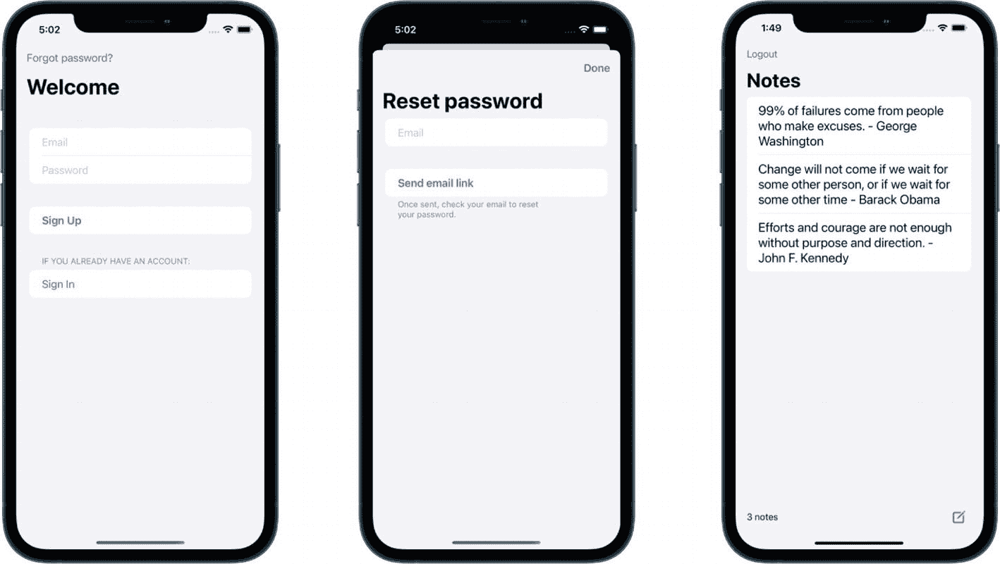

三张移动端界面的截图，分别展示了欢迎页面、重置密码页面和带有输入框与按钮的笔记页面。

**图 4-1** 我们将要创建的界面截图

最后，我们还会修改安全规则，仅允许已认证的用户访问我们的应用。

## 设置 Firebase 身份验证

首先，我们需要在控制台中设置 Firebase。我们将进入控制台启用身份验证功能。只需几个步骤即可完成。为此，选择“身份验证”部分，然后点击“开始使用”：

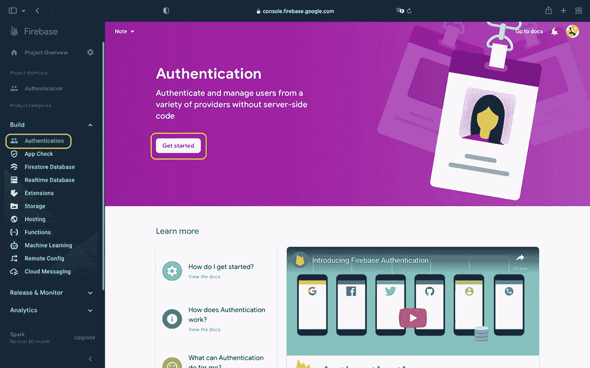

Firebase 身份验证窗口的截图，左侧面板的“构建”类别中，“身份验证”选项已被高亮。右侧面板中，“开始使用”按钮被高亮，下方还有“了解更多”等选项。

**图 4-2** Firebase 控制台的身份验证部分

如您所见，Firebase 提供了多种用户认证方式。它原生支持邮箱密码认证、手机号认证以及匿名认证，后者可以在不要求用户输入任何信息的情况下为其生成唯一标识符。

至于第三方登录，主要有 Facebook、Google、Apple、Microsoft、Twitter、GitHub、Yahoo 等大型科技提供商可供选择。我们将在后续章节中实现其中一种。

对于本应用，我们首先只使用邮箱和密码登录。在“原生提供商”下选择“邮箱/密码”：

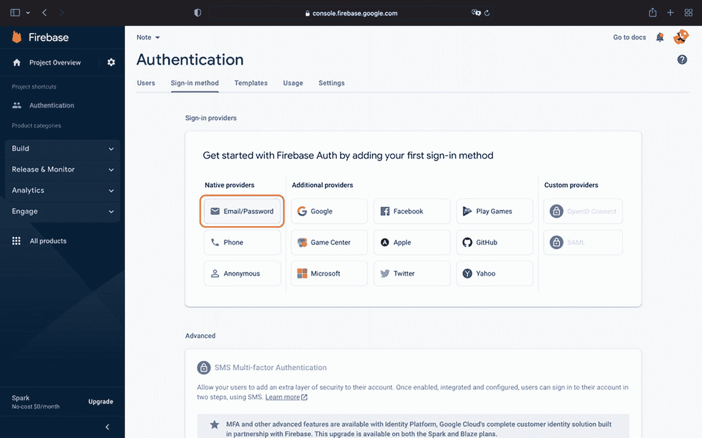

Firebase 窗口的截图，左侧为项目概览面板，右侧为身份验证面板。该面板已选中“登录方式”选项卡，并且在“原生提供商”下，“邮箱或密码”选项被高亮。

**图 4-3** 身份验证 – 选择邮箱/密码

然后，只需启用并保存更改即可：

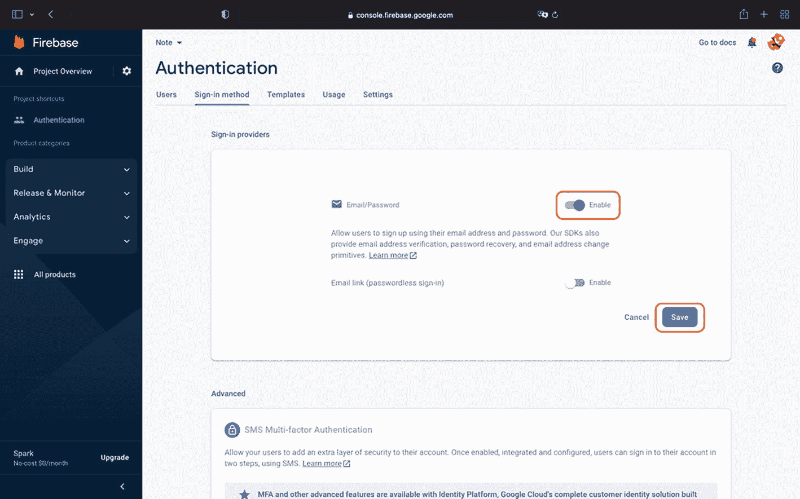

Firebase 窗口的截图，左侧为项目概览面板，右侧为身份验证面板。该面板已选中“登录方式”选项卡，在登录提供商下方，“邮箱或密码”的启用开关和保存按钮被高亮。

**图 4-4** 身份验证 – 启用提供商并保存

现在，我们可以发送用户信息来注册用户，并接收来自服务器的响应。是时候构建我们的代码结构并实现 Firebase API 了。开始编码吧！

## 管理用户会话

让我们构建调用 Firebase 来监听用户会话变化的代码。继续创建一个新文件，命名为 `AuthViewModel`；它将作为我们与 Firebase 身份验证通信的视图模型。

复制/粘贴如下代码：

```
import SwiftUI
import FirebaseAuth
final class AuthViewModel: ObservableObject {
@Published var user: User?
func listenToAuthState() {
Auth.auth().addStateDidChangeListener { [weak self] _, user in
guard let self = self else {
return
}
self.user = user
}
}
// 登录函数
// 创建账户函数
// 登出函数
// 重置密码函数
}
```

*请注意，这次我们不会使用模型。*

我们将直接使用 Firebase Auth SDK 提供的 `User` 对象，称为 `FIRUser`。它提供了一系列信息：`displayName`、头像 URL、`email`、电话号码以及提供商标识符。

由于我们使用邮箱/密码认证，因此只需要邮箱和标识符。这样我们就不必自己编写模型。我们仅通过以下代码行进行了引用：

```
@Published var user: User?
```

目前，我们添加了对用户模型的引用，以及一个从 Firebase 获取信息的函数 `listenToAuthState()`。这将有助于我们根据从 Firebase 获得的响应来决定是显示笔记列表视图还是注册视图。

首先要做的是创建两个 SwiftUI 视图来处理这两种情况。继续创建两个文件，并将它们命名为：

* `SignUpView`（在此输入凭据）
* `HolderView`（在此实现逻辑）

以下是我们将要实现的逻辑示意图：

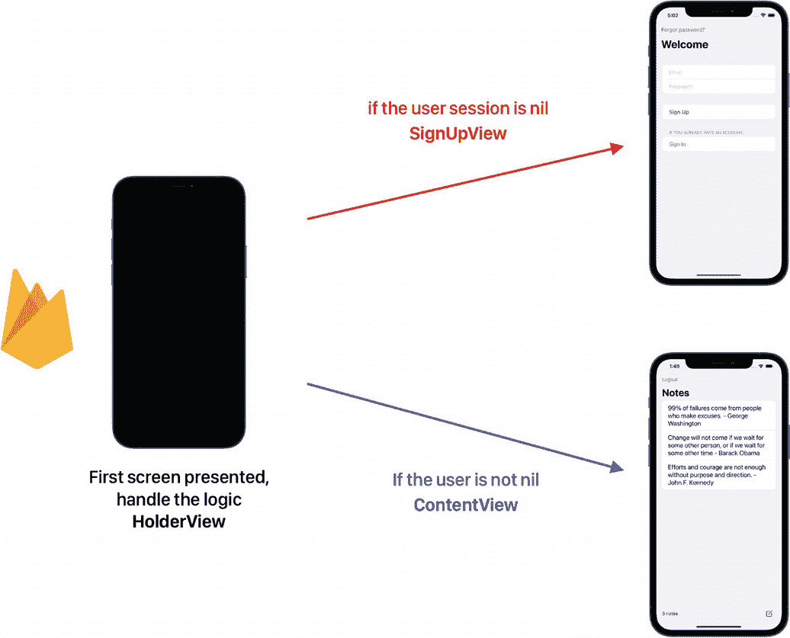

一张移动端界面截图，展示了使用 Firebase 处理逻辑的判断视图。它通向两个界面：如果用户会话为 nil，则显示注册视图；如果用户不为 nil，则显示内容视图。

**图 4-5** 使用 Firebase Auth 监听器实现的逻辑

为了执行此逻辑，我们需要在应用启动时（即 `NoteApp.swift` 文件中，也就是应用程序的入口点）将此视图模型作为环境对象添加到 `body` 变量中。

SwiftUI 中的 `@environmentObject` 属性允许我们在视图之间共享数据，并确保视图能够根据接收到的数据自动更新。

在这里，我们需要告知应用入口用户会话的状态，以便我们在合适的时机显示正确的界面。

前往 `NoteApp` 文件，将 `ContentView()` 替换为以下代码行：

```
HolderView().environmentObject(AuthViewModel())
```

这有什么作用？它允许我们在应用启动时（当用户首次打开应用、杀死应用后重新打开等情况下）通知应用，我们将数据绑定到了这个视图模型，因此我们能够使用在此实现的快照监听器，并根据用户会话显示正确的界面。

现在，我们将前往 `HolderView` 来整合逻辑。

首先，让我们在 `HolderView` 中观察视图模型。复制/粘贴以下的 `@EnvironmentObject` 变量：

```
@EnvironmentObject private var authModel: AuthViewModel
```

现在，让我们实现条件语句，以根据 Firebase 的响应呈现相应的视图。在 `body` 变量内部，将当前的

```
Text("Hello, World!")
```

替换为以下代码：

```
Group {
if authModel.user == nil {
SignUpView()
} else {
ContentView()
}
}
.onAppear {
authModel.listenToAuthState()
}
```

现在运行应用程序，您应该会看到以下结果：

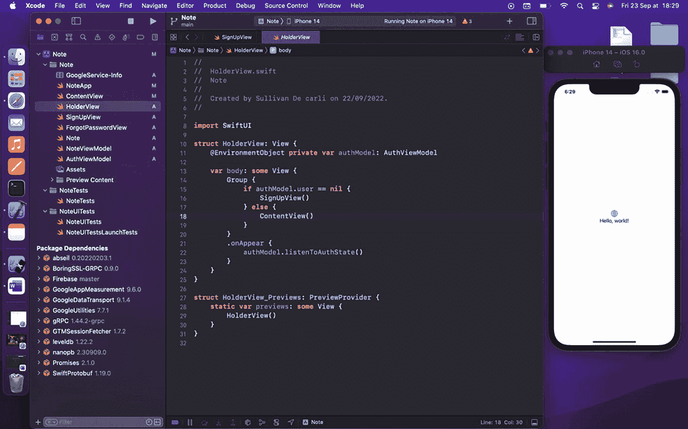

一个 Xcode 窗口的截图，左侧面板选中了判断视图。右侧是一个包含代码的窗格，最右侧则显示了一个 iPhone 14 的移动端界面，上面显示着“Hello World”信息。

**图 4-6** Xcode – 应用运行中，带有 Auth 监听器

很棒！如您所见，启动时显示了 `SignUpView`。这是合理的，因为当我们向 Firebase 请求用户信息时，由于尚未注册任何用户，它返回了 nil。

既然我们已经实现了逻辑，现在可以继续注册我们的用户了。让我们创建注册所需的用户界面并实现相应的函数。


## 使用邮箱和密码注册

首先，让我们构建用户界面。我们将添加两个输入字段——一个用于邮箱，一个用于密码——以及两个按钮：一个用于注册，一个用于登录。

为了实现这一点，我们将使用表单，因为它自带滚动功能，并且实现速度更快。

前往我们的 `AuthViewModel`，实现登录、注册和注销的 API 调用：

```
// 登录函数
func signIn(
emailAddress: String,
password: String
) {
Auth.auth().signIn(emailAddress: emailAddress, password: password) { result, error in
if let error = error {
print("发生错误：\(error.localizedDescription)")
return
}
}
}
// 创建账户函数
func signUp(
emailAddress: String,
password: String
) {
Auth.auth().createUser(withEmail: emailAddress, password: password) { result, error in
if let error = error {
print("发生错误：\(error.localizedDescription)")
return
}
}
}
// 注销函数
func signOut() {
do {
try Auth.auth().signOut()
} catch let signOutError as NSError {
print("注销时出错：%@", signOutError)
}
}
```

很好，我们刚刚实现了必要的函数；这里的 API 语法非常清晰。我们使用了登录和创建用户功能，并将邮箱和密码对象作为参数的一部分传递。

至于注销，我们使用了 `do try catch` 结构来捕捉任何错误，例如在网络连接不良的情况下。

前往 `SignUpView`，并实现以下代码：

```
@State private var emailAddress: String = ""
@State private var password: String = ""
```

这两个变量将允许我们监听用户的输入，并将其传递给 Firebase 后端。现在，让我们实现用户界面并替换当前内容：

```
NavigationStack {
Form {
Section {
TextField("邮箱", text: $emailAddress)
.textContentType(.emailAddress)
.keyboardType(.emailAddress)
SecureField("密码", text: $password)
}
Section {
Button(action: {
// 注册到 Firebase
}) {
Text("注册").bold()
}
}
Section(header: Text("如果您已有账户：")) {
Button(action: {
// 登录到 Firebase
}) {
Text("登录")
}
}
}.navigationTitle("欢迎")
.toolbar {
ToolbarItemGroup(placement: .cancellationAction) {
Button {
showingSheet.toggle()
} label: {
Text("忘记密码？")
}
.sheet(isPresented: $showingSheet) {
ForgotPasswordView()
}
}
}
}
```

很好，现在我们有了用户界面。是时候将邮箱和密码传递给 Firebase 了。让我们观察之前创建的视图模型：

```
@EnvironmentObject private var authModel: AuthViewModel
```

然后，在属于注册按钮的按钮动作内部实现注册函数：

```
authModel.signUp(emailAddress: emailAddress,
password: password)
```

接下来，对登录过程做同样的事情——在按钮动作内部添加函数：

```
authModel.signIn(emailAddress: emailAddress,
password: password)
```

现在，是时候注册我们的第一个用户了。继续，运行你的应用，输入邮箱和密码，然后查看 Firebase 控制台！

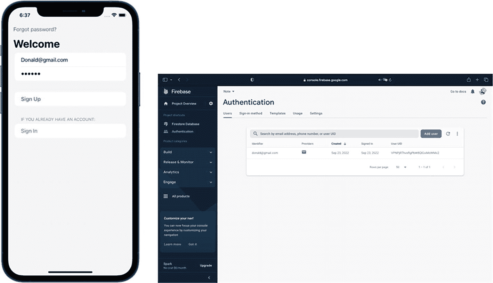

一个欢迎移动屏幕的截图，右侧有一个 Firebase 窗口。该窗口左侧是项目概览面板，右侧是身份验证面板。面板中用户选项卡被选中，并带有一个添加用户的按钮。

图 4-7

应用运行并将用户数据发布到 Firebase 验证服务

太好了！通过输入邮箱和密码，我们的应用会实时收到用户拥有活跃会话的通知。然后，它会自动将我们带到主屏幕，即 `ContentView`。

但是，如何注销用户呢？这一次，我们还需要更新用户界面，将用户带回注册屏幕。此外，提供注销功能将使我们能够再次在同一个设备上登录，并检查登录功能是否正常工作。

让我们添加这个注销按钮并执行注销函数。

在 `ContentView.swift` 文件顶部观察 `AuthViewModel`：

```
@ObservedObject private var authModel = AuthViewModel()
```

然后，就在第一个 `ToolbarItemGroup` 下方，位于 `.toolbar` 修饰符的图结构中，添加以下内容：

```
ToolbarItemGroup(placement: .cancellationAction) {
Button {
authModel.signOut()
} label: {
Text("注销")
}
}
```

非常简单。由于我们已经在视图模型中添加了所有函数，我们只需在用户界面中调用它们即可。

继续，点击注销按钮。你将被带回注册屏幕。现在是时候尝试登录功能了。输入你之前使用的邮箱和密码。

你可以多次执行此操作，并根据需要创建任意数量的账户，以测试代码的稳健性。就是这样。我们拥有了一个功能完整的登录流程！


### 忘记密码怎么办？

这种情况经常发生，尤其是在如今我们管理着众多账号的时代。幸运的是，Firebase 为我们提供了重置密码的 API，甚至还能代我们发送邮件！这很棒，对吧？

我们只需要从前端传入一个电子邮箱地址。

为此，我们将创建一个新界面来重置密码。

那么，继续创建一个新的 SwiftUI 视图，命名为`ResetPasswordView`；我们将从`SignUpView`中作为弹出视图来调用它。

在实现用户界面之前，我们先实现重置密码的函数，因此转到`AuthViewModel`并实现以下代码：

```
// 重置密码函数
func resetPassword(emailAddress: String) {
Auth.auth().sendPasswordReset(withEmail: emailAddress)
}
```

这个 Firebase Auth 的 API 将为我们发送重置密码的邮件，无需实现任何后端代码。我们只需要从前端传入邮箱地址即可！

现在，我们来为这个界面构建用户界面。转到`SignUpView`，让我们的重置密码界面可被访问。

首先，创建一个状态变量来控制弹出视图的展示：

```
@State private var showingSheet = false
```

然后，在屏幕左上角添加一个按钮，并在`.NavigationTile`上方放置以下修饰符：

```
.toolbar {
ToolbarItemGroup(placement: .cancellationAction) {
Button {
showingSheet.toggle()
} label: {
Text("忘记密码？")
}
.sheet(isPresented: $showingSheet) {
ResetPasswordView()
}
}
}
```

很好，现在我们可以访问这个界面了，让我们来实现功能与用户界面。首先，在`ResetPasswordView.swift`文件中添加以下几个`State`变量：

```
@State private var emailAddress: String = ""
@EnvironmentObject var authModel: AuthViewModel
@Environment(\.presentationMode) var presentationMode
```

这些变量将用于连接我们的视图模型，处理我们传入的邮箱地址，并最终以弹出视图的方式展示界面。

现在，让我们实现一个表单，让用户提供他们的邮箱：

```
NavigationStack {
Form {
Section {
TextField("邮箱", text: $emailAddress)
.textContentType(.emailAddress)
.textInputAutocapitalization(.never)
.keyboardType(.emailAddress)
}
Section(footer: Text("发送后，请检查您的邮箱以重置密码。")) {
Button(
action: {
authModel.resetPassword(emailAddress: emailAddress)
}) {
Text("发送邮件链接").bold()
}
}
}.navigationTitle("重置密码")
.toolbar {
ToolbarItemGroup(placement: .confirmationAction) {
Button("完成") {
presentationMode.wrappedValue.dismiss()
}
}
}
}
```

和往常一样，我们使用了简单且原生的 iOS API 来构建用户界面，这样用户会觉得熟悉。我们使用按钮来执行在视图模型中实现的函数，并使用`toolbar`中的另一个按钮来关闭表单。

现在，我邀请您继续操作，用真实的邮箱注册，然后退出登录，并测试重置密码功能。

输入您的邮箱，点击"发送邮件链接"，然后前往您的邮箱（垃圾邮件箱也请查看），如下图所示：

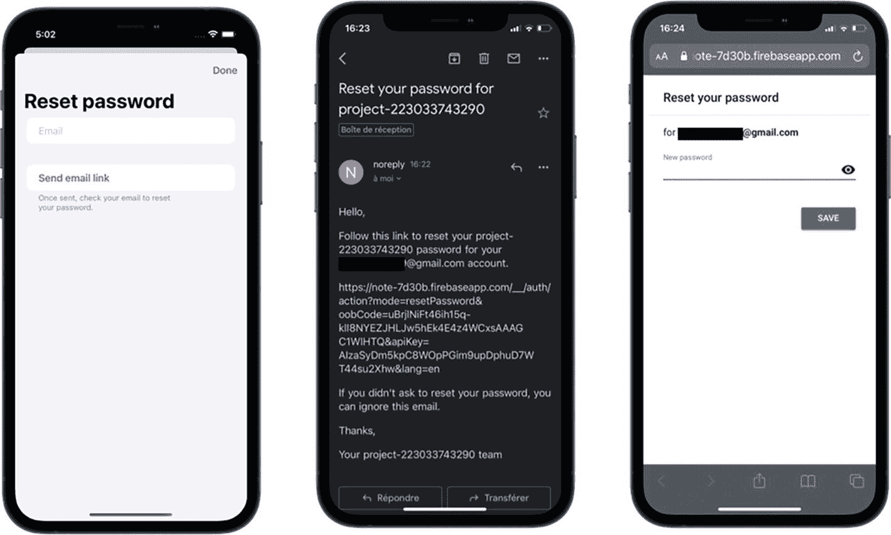

三张手机界面截图，分别显示：带发送邮件链接的重置密码页面、在 Gmail 应用中重置项目密码的页面、以及带有新密码输入框和保存按钮的重置密码页面。

**图 4-8** 重置密码的步骤

完成后，您就可以用新创建的密码再次登录了。一切由 Firebase 处理！

## 保护 Firestore 数据库

既然我们已经实现了完整的用户登录流程，您可能会想，如何让用户只能访问自己的笔记，而不是所有人都能访问的集合呢？这就是本节我们要做的事情。为此，我们需要重新组织数据库结构。

到目前为止，数据库由一个名为"Notes"的集合组成，其中包含一系列文档，每个文档包含两个字符串值：一个文本和一个标识符。

这次的迭代会稍微复杂一些，结构如下所示：

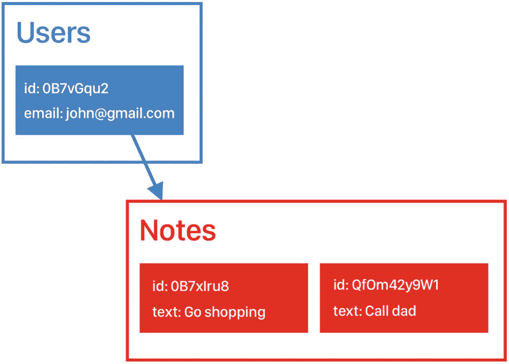

一个用户（含 ID 和邮箱）的方框图，指向包含两个 ID 和两个文本（"去购物"和"给爸爸打电话"）的笔记。

**图 4-9** 本次迭代的集合层级结构

我们将有一个用户集合，每个用户将有一个名为"Notes"的子集合，其中包含基于用户输入的一系列文档。使用子集合是合理的，因为用户在我们的应用中只会查询自己的笔记。

现在是注册用户并创建集合的时候了。为此，我们需要在注册时保存用户信息。我们将在`AuthViewModel`的注册函数中实现这一点。

首先，在顶部导入 Firestore 框架：

```
import FirebaseFirestore
```

现在，我们将用更完整的注册函数替换当前版本，该函数会将用户信息保存到 Firestore：

```
func signUp(emailAddress: String, password: String) {
Auth.auth().createUser(withEmail: emailAddress, password: password) { result,  error in
if let error = error {
print("DEBUG: 错误 \(error.localizedDescription)")
} else {
print("DEBUG: 成功创建用户，ID 为 \(self.user?.uid ?? "")")
guard let uid = Auth.auth().currentUser?.uid else { return }
Firestore.firestore().collection("Users").document(uid).setData(["email" : emailAddress, "uid": uid]) { err in
if let err = err {
print(err)
return
}
print("成功")
}
}
}
}
```

很好，现在如果注册过程中没有错误，我们就会将用户信息（邮箱和标识符）保存到"Users"集合下；我们还在控制台中打印调试信息，以检查标识符是否匹配。

还差一步，就是修改数据库的路径，这样当你写笔记时，它会被保存到你自己的用户集合下，而不再是顶层集合。

但首先，让我们清理一下 Firestore 数据库。继续操作，按如下方式删除集合：

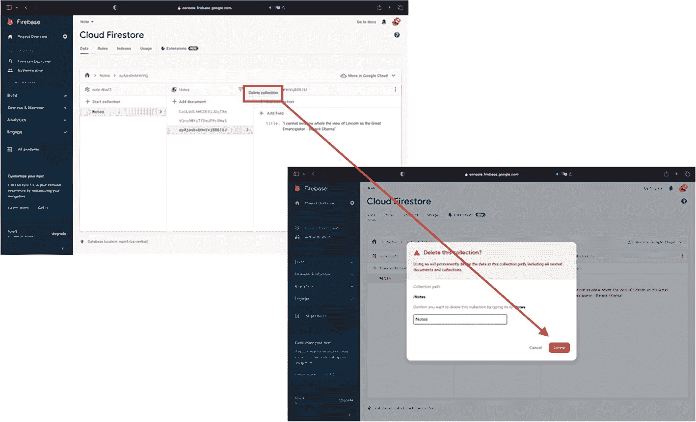

两张 Firebase Cloud Firestore 窗口截图。第一张截图中右侧的 Cloud Firestore 面板突出显示了"删除集合"按钮，另一张截图中的"删除此集合？"对话框上有一个箭头指向"删除"按钮。

**图 4-10** 删除 Firestore 集合

现在，我们可以将当前路径

```
private var databaseReference = Firestore.firestore().collection("Notes") // 引用我们的集合
```

改为：

```
private lazy var databaseReference: CollectionReference? = {
guard let user = Auth.auth().currentUser?.uid else {return nil}
let ref = Firestore.firestore().collection("Users").document(user).collection("Posts")
return ref
}()
```

我们还需要在`NoteViewModel.swift`文件顶部导入 Firebase Auth 框架，因为我们在继续操作之前要检查对应的用户标识符：

```
import FirebaseAuth
```

另外，在数据库引用后面添加一个`?`，因为我们为了安全而将其设为可选类型。

现在，您可以尽情创建一个全新的用户，并写几条笔记。然后您的数据库将呈现如下路径：

`Users`（集合） ➤ 文档 ➤ `Posts`（集合） ➤ 文档

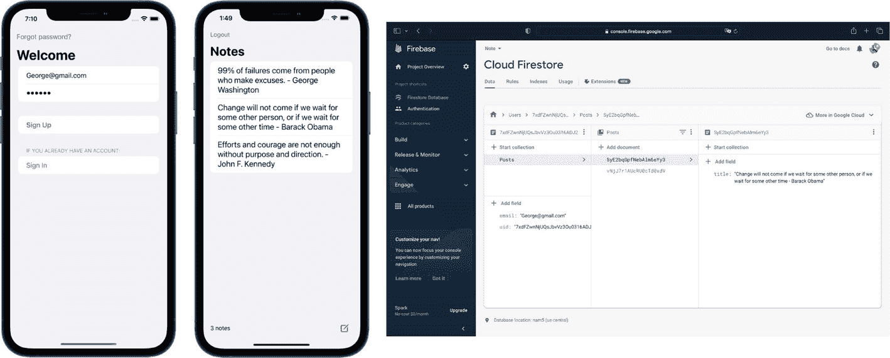

两张手机界面截图和一张 Firebase 控制台 Cloud Firestore 面板截图。界面包含欢迎和笔记部分。面板在"数据"选项卡下突出显示了包含 1 个文档的"Posts"集合。

**图 4-11** 与前端数据匹配的 Firestore 数据库截图


