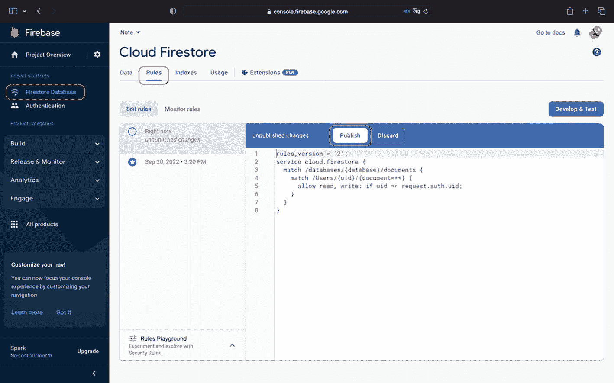

# 安全规则

最后一步必不可少：通过规则区域来保护我们的数据库。

到目前为止，我们处于开发模式，这意味着在数据库创建后的 30 天内，任何人都可以读写文档。

由于本笔记应用是私密的，我们希望能将读写数据的权限限制为仅限经过身份验证的用户，并且仅限其各自的用户集合。

进入 Firestore 数据库 ➤ 规则，并在控制台中输入以下规则：

```
rules_version = '2';
service cloud.firestore {
  match /databases/{database}/documents {
    match /Users/{uid}/{document=**} {
      allow read, write: if uid == request.auth.uid;
    }
  }
}
```

然后，点击 **发布**：



一张 Firebase 窗口的截图，左侧为项目概览面板，右侧为 Cloud Firestore 窗格。面板中高亮显示了 Firestore 数据库。窗格中则通过“编辑规则”按钮高亮显示了“规则”选项卡和“发布”按钮。

**图 4-12** 在 Firestore 数据库中编辑规则

我们实施的这段代码将告知数据库，仅允许经过身份验证的用户访问其数据，且这些用户的数据与他们注册时创建的标识符相匹配。

实际上，用户只能读取、发布和编辑自己的笔记。在将任何应用发布到生产环境之前，这是一个关键步骤，因为之前的规则会允许互联网上的任何人访问所有人的文档和用户信息。

## 总结

通过本章，我们实现了一个包含真实业务逻辑的完整身份验证流程。得益于 Firebase SDK，我们甚至无需创建自己的模型，因为 `FIRUser` 已经提供了必要信息。

我们能够将用户凭据发送到 Firebase，并将其与服务器的响应进行匹配，同时还只用一行代码就实现了密码恢复功能！

借助它们的监听器 API，我们还能判断用户会话是活跃还是已终止，并呈现相应的界面。

完成了这些，我们就有了一个功能完备的应用，随时可以发布到 App Store！现在是时候进入下一章，开始构建一个全新的应用了！

如果你在途中有所遗漏，可以在下方找到应用代码库的链接：

*   [`drive.google.com/drive/folders/1UWZ4IDw5J81SxIjpjKd5QiSa5jR4mVHC?usp=share_link`](https://drive.google.com/drive/folders/1UWZ4IDw5J81SxIjpjKd5QiSa5jR4mVHC%253Fusp%253Dshare_link)

