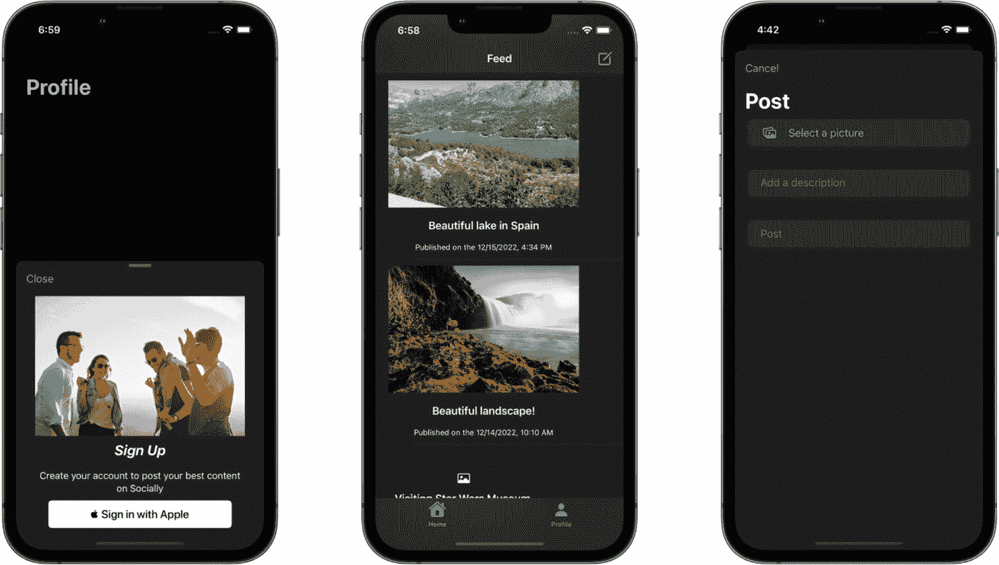
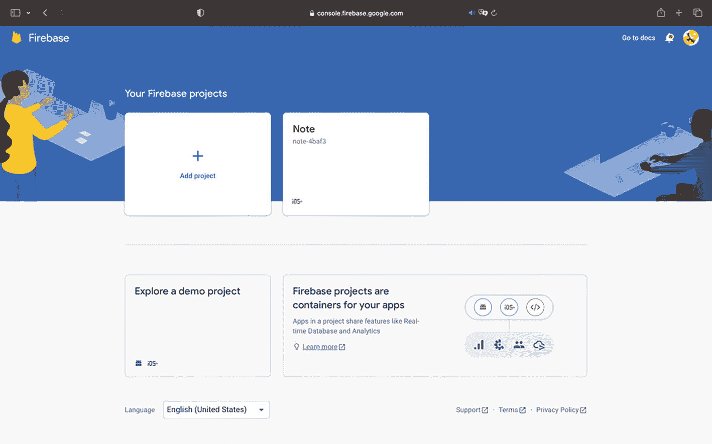
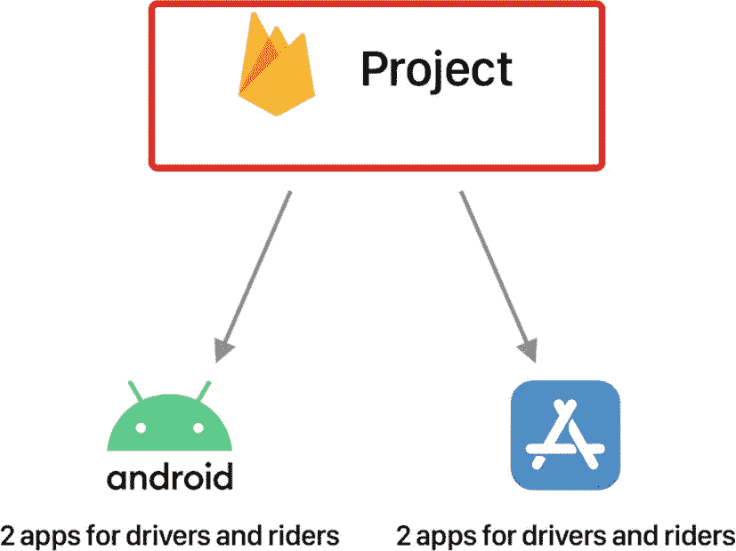
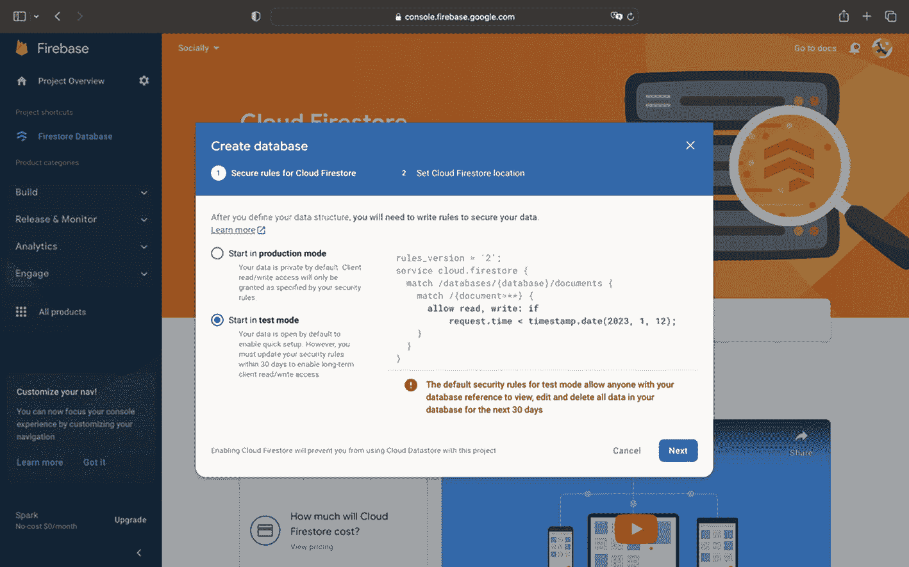
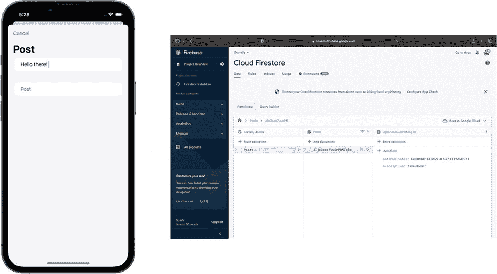
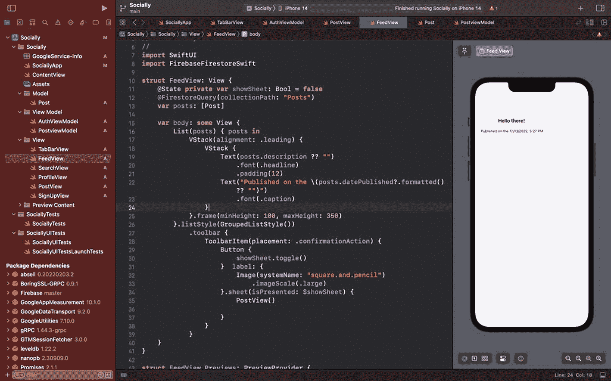

# 5. 高级 Firestore 使用

## 介绍我们的新项目

由于我们已经完成了一个笔记应用，现在对 SwiftUI 和 Firebase 控制台更加熟悉了。是时候创建一个新的应用了，这次会更复杂一些：它将包含一个类似 Instagram 等知名社交媒体平台的动态视图、一个搜索功能、一个可以查看你发布内容的个人资料区域，并且支持无缝使用你的 Apple 账户登录。

本章将重点介绍如何使用 Firestore 构建我们的数据库，我将向你介绍一个包含更多文档类型的大型模型。在本章结束时，你将能够发布和阅读动态视图，并显示图片、描述以及发布日期。

以下是我们的应用将呈现的样子：



三张移动端截屏，分别展示了个人资料、动态和发布页面，并带有各种选项。

**图 5-1** 应用的截屏

由于需要创建许多界面，我准备了一个入门文件，你可以通过以下链接下载：

*   [`drive.google.com/drive/folders/1fXNQwIOKj9AhIxHQxWlWxjorLpp1mKs5?usp=share_link`](https://drive.google.com/drive/folders/1fXNQwIOKj9AhIxHQxWlWxjorLpp1mKs5%253Fusp%253Dshare_link)

该文件已经安装了以下 Swift 包：

*   `FirebaseAuth`
*   `FirebaseFirestore`
*   `FirebaseFirestoreSwift`
*   `FirebaseStorage`

现在，我邀请你启动一个新的 Firebase 项目。点击 **添加项目**，并将其命名为 *Socially*：



一张标题为“您的 Firebase 项目”的 Firebase 窗口截图。其中有添加项目的选项，以及选择 Note 项目的选项，下方还有探索演示项目的选项。

**图 5-2** 在 Firebase 中启动新项目

### 我们为什么要创建一个新的 Firebase 项目？

区分应用和 Firebase 项目是很重要的。总的来说，你应该将具有共同业务逻辑的应用放在同一个 Firebase 项目中。假设你在构建优步（Uber）的竞品，一个打车应用。由于你想覆盖广阔的市场，你会在 iOS 和 Android 上发布；因此，你可能会构建四个应用，每个平台上分别对应司机端和乘客端各两个。由于在 Android 或 iOS 上预订在后台是相同的过程，你可以考虑将所有内容放在同一个 Firebase 项目下。那么，你的项目结构会像这样：



一个 Firebase 项目的框图，分别指向 Android 和 iOS 的司机端和乘客端应用。

**图 5-3** Firebase 项目与应用

由于在我们的新项目中，与笔记应用没有共享任何内容，我们会创建一个新的 Firebase 项目。

现在，按照 Firebase 控制台上的逐步设置指南操作，获取 `GoogleService-Info.plist` 文件并将其添加到入门项目中。一旦你添加了该文件并完成了 Firebase 控制台上的五个步骤，就可以成功运行你的项目并连接到 Firebase 后端。

项目设置完成后，让我们开始编码。像往常一样，我们将从模型开始，在 `Model` 文件夹中创建一个新的 Swift 文件，命名为 `Post`，然后复制/粘贴以下代码：

```
import SwiftUI
import FirebaseFirestoreSwift

struct Post: Identifiable, Decodable {
  @DocumentID var id: String?
  var description: String?
  var imageURL: String?
  @ServerTimestamp var datePublished: Date?
}
```

因此，用于我们动态区域的模型将由一个标识符、一段描述、一张图片和发布日期组成。`@ServerTimestamp` 来自 Firebase API，让我们能够获取服务器时间。而使用 `Date` 类型来记录日期是更推荐的做法。

> *请注意，图片将在下一章关于 Firebase Storage 的内容中处理。*

接下来进入视图模型。在 `View Model` 文件夹中创建一个新文件，命名为 `PostViewModel`，然后在文件顶部导入这两个框架：

```
import SwiftUI
import FirebaseFirestore
```

我们可以创建我们的类，其中包含对我们之前创建的模型以及对 Firestore 数据库的引用：

```
class PostViewModel: ObservableObject {
  @Published var posts = [Post]()
  private var databaseReference = Firestore.firestore().collection("Posts")
  // 用于发布数据的函数
}
```

最后，这是我们用于向服务器发布数据的函数：

```
// 发布数据的函数
func addData(description: String, datePublished: Date) async {
  do {
    _ = try await databaseReference.addDocument(data: [
      "description": description,
      "datePublished": datePublished
    ])
  } catch {
    print(error.localizedDescription)
  }
}
```

这个视图模型与我们之前在第 3 章中完成的类似，不同之处在于这次我们使用了 `async`/`await` 方法。你可能会好奇这些关键字的作用。


## 使用 Async/Await 调用后端

在我们的应用中，需要上传一些内容——一张图片和一段描述——同时保存日期和时间。问题是：数据上传到服务器可能需要时间，尤其是当图片较大时。

因此，如果采用传统调用方式，用户在图片上传到数据库的几秒钟内会停留在当前屏幕。这并不是良好的用户体验。这就是我们使用此方法的原因：通过异步调用，用户可以安全地导航并`等待`。当他们执行其他操作时，代码会在后台运行。

现在我们已经实现了发布函数，让我们来测试一下！前往`PostView`文件（已在入门项目中创建），并将其与我们的视图模型建立关联：

```
@ObservedObject private var viewModel = PostViewModel()
```

然后，在我留下注释的按钮内部直接调用它：

```
// MARK: 将数据发布到 Firestore
Task {
    await self.viewModel.addData(description: description, datePublished: Date())
}
```

如您所见，我们正在保存用户的文本输入。至于日期，我们传入`Date()`，它会获取当前的 iPhone 日期。目前，我们对图片不做任何处理，因为这将是下一章关于 Firebase Storage 的主题。

此外，我们将函数放在`Task`中，这是必要的，因为需要使用`await`关键字告知程序：这段代码需要在后台运行，因为上传可能需要时间。

现在，我们的前端已经准备好向后端发布数据，但我们尚未设置 Firestore 来接收数据。前往 Firebase 控制台的 Firestore Database 部分，点击**创建数据库**。与第 3 章一样，以测试模式启用数据库：



一个 Firebase 窗口的截图，中央是创建数据库对话框。对话框中有用于在生产模式和测试模式下启动的单选按钮，测试模式已被选中，右侧显示代码行。底部右侧有取消和下一步按钮。

**图 5-4** Firestore – 创建数据库

然后，我们可以运行应用并尝试发布一条评论。您应该在数据库中看到它：



手机屏幕和 Firebase 上 Cloud Firestore 面板的 2 张截图。手机屏幕显示一个帖子部分，包含文字“hello there”。该面板在数据选项卡下的面板视图中显示帖子选项和一个高亮显示的文档。

**图 5-5** Firebase Firestore 控制台与运行中的应用

很好，我们已经将带有文本和 iPhone 当前日期的数据发布到了 Firestore。现在是时候展示我们刚刚添加的这些数据了。

为此，我们将使用一个方便的 Firebase 包装器。首先，在`FeedView`中添加以下框架：

```
import FirebaseFirestoreSwift
```

然后，在`FeedView`的 body 变量上方添加以下代码：

```
@FirestoreQuery(collectionPath: "Posts")
var posts: [Post]
```

这样，我们甚至不需要在视图模型中实现函数。这是 Firebase API 的一个优秀特性。它允许我们仅通过一行代码，传入我们的模型以及 Firebase 集合的名称，就能获取数据。

用以下代码替换`FeedView`中的当前列表：

```
List(posts) { posts in
    VStack(alignment: .leading) {
        VStack {
            Text(posts.description ?? "")
                .font(.headline)
                .padding(12)
            Text("Published on the \(posts.datePublished?.formatted() ?? "")")
                .font(.caption)
        }
    }.frame(minHeight: 100, maxHeight: 350)
}
```

`formatted()` 修饰符允许我们将`Date`类型的数据转换为`String`。这样，我们就可以在应用中轻松显示日期。

现在您可以运行应用，它将以一个漂亮的列表展示您发布的帖子。



一个窗口的截图，左侧面板选中了 Feed 视图。右侧“socially”下方的窗格中有几行代码，最右侧是一个手机屏幕，显示“hello there”消息。

**图 5-6** 列表图示

## 总结

本章与第 3 章非常相似，涉及一个大型模型，并引入了 Firebase 的一个新属性包装器，这让我们的生活轻松了许多。

我们学习了如何处理`String`和`Date`类型的数据。但我们对 Firestore 的操作还未结束！

在下一章中，我们仍将使用它来检索上传到 Storage 后的图片。让我们一起来探索如何使用 Firebase 处理大型资源。

如果您在过程中遗漏了什么，可以查看以下链接中的项目：

*   [`drive.google.com/drive/folders/1_qrKo171QkgGHMuX4vDsbPzi36xoXci4?usp=share_link`](https://drive.google.com/drive/folders/1_qrKo171QkgGHMuX4vDsbPzi36xoXci4%253Fusp%253Dshare_link)

