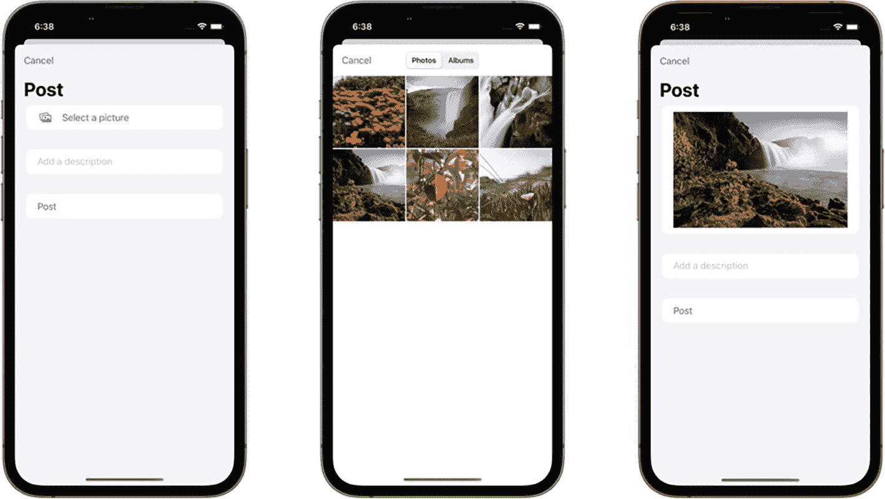
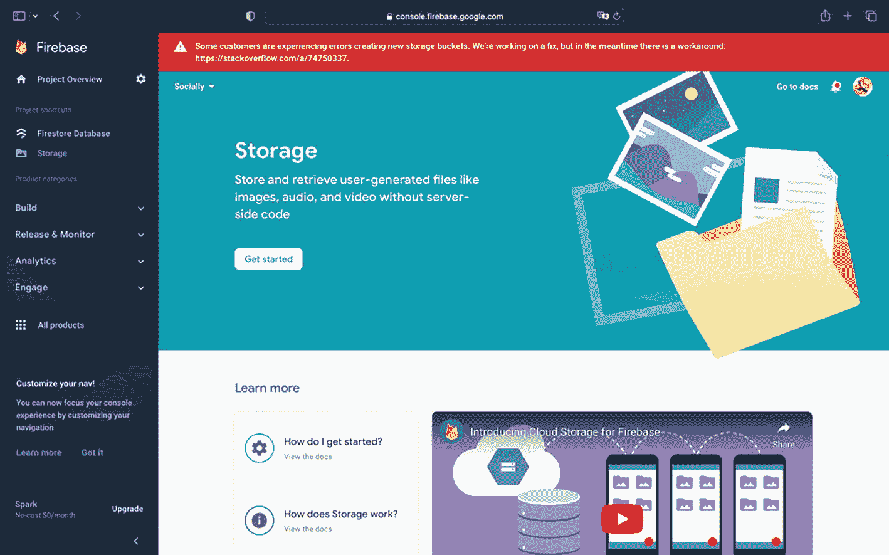
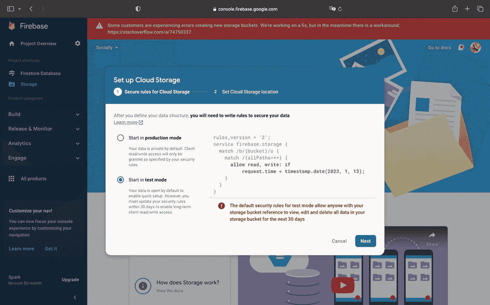
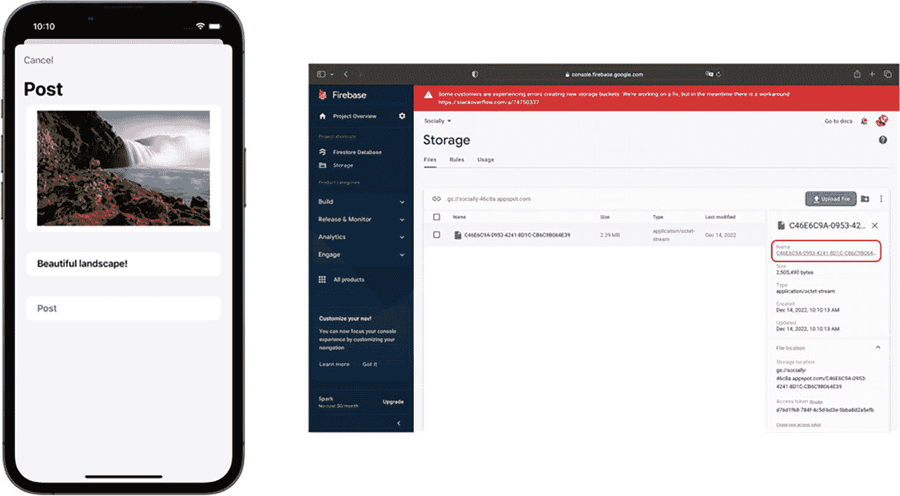
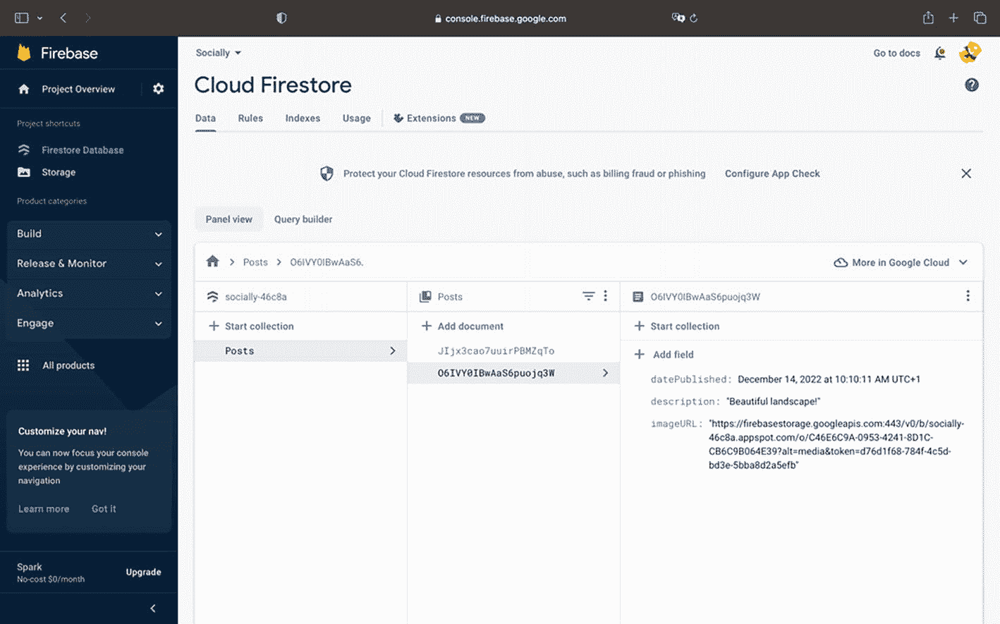
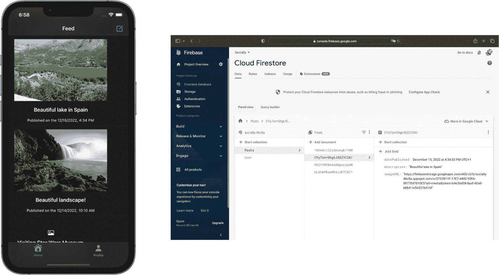
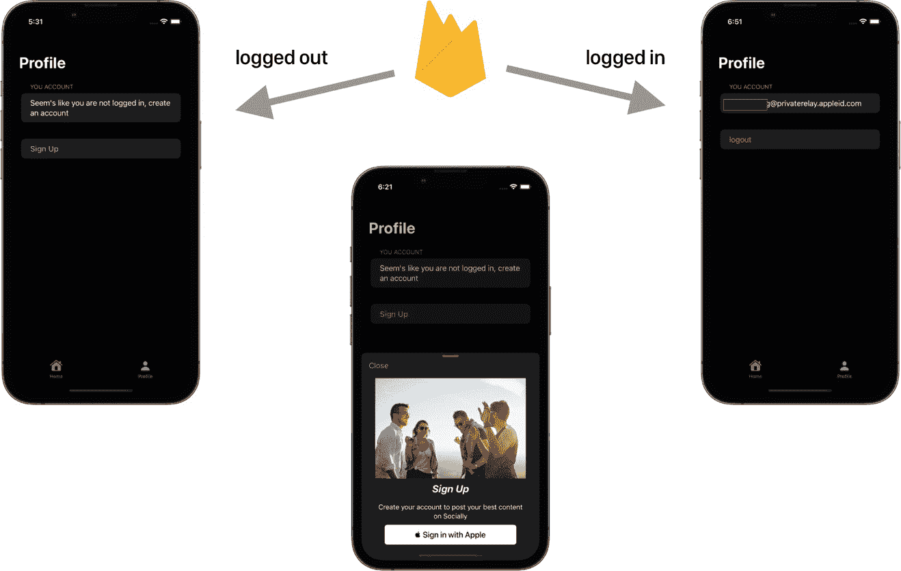

# 6. 使用 Firebase Storage 管理图片

我们希望在帖子中包含图片。问题在于：`Firestore`不支持如此大的文档。我们只能添加文本、数字、数组、布尔值、时间戳等类型的数据。

因此，Firebase 引入了 Storage。这是一个允许我们上传和下载大型数据（如视频、图像和音频文档）的软件包。在本章中，我们将学习如何将图片上传到 Firebase Storage，获取该图片的 URL，并将其添加到对应的 Firestore 文档中。

在本章中，我们将探索如何访问 iPhone 的相册库、将图片上传到 Storage，并从 Firestore 后端检索它。让我们开始吧！


## 访问 iPhone 相机与相册

在上传图片前，我们首先需要拍摄一张照片，或者至少让用户从应用中访问照片库。在 iOS 16 中，Apple 为 SwiftUI 引入了一个新框架：`PhotosUI`，只需几行代码即可让我们选择图片。

前往 `PostView` 文件，并导入该框架：

```
import PhotosUI
```

一旦我们拥有了该框架的访问权限，就可以使用 `PhotosPickerItem`。让我们在 body 变量上方添加以下两个变量：

```
@State var data: Data?
@State var selectedItem: [PhotosPickerItem] = []
```

第一个变量用于观察我们在选择图片时传递的数据。第二个变量将让我们观察用户正在选择哪个项目（哪张图片）。

现在该实现用户界面了。在 `PostView` 的 SwiftUI `Form` 中，紧接着已实现的其他两个 Section 上方，实现以下 Section：

```
Section {
PhotosPicker(selection: $selectedItem, maxSelectionCount: 1, selectionBehavior: .default, matching: .images, preferredItemEncoding: .automatic) {
if let data = data, let image = UIImage(data: data) {
Image(uiImage: image)
.resizable()
.scaledToFit()
.frame( maxHeight: 300)
} else {
Label("选择一张图片", systemImage: "photo.on.rectangle.angled")
}
}.onChange(of: selectedItem) { newValue in
guard let item = selectedItem.first else {
return
}
item.loadTransferable(type: Data.self) { result in
switch result {
case .success(let data):
if let data = data {
self.data = data
}
case .failure(let failure):
print("错误: \(failure.localizedDescription)")
}
}
}
}
```

这里我们做了几件事。我们添加了 `PhotosPicker`，用于访问用户的相册。我们传递了几个参数：

*   `selection` – 这是之前的 item 变量。
*   `maxSelectionCount` – 我们限制只能选择一张图片。
*   `matching` – 你可以传递一系列选项：仅视频、仅图片、仅截图等。这里我们只关注图片。
*   `preferredItemEncoding` – 这里我们保留为自动模式，因此系统会自行判断哪种分辨率更合适。

然后，如果没有选中图片，我们会创建一个标签；否则，显示选中的图片。

这就是访问照片库并显示所选图片的全部内容。新的 API 让我们轻松实现了这一功能。在 iOS 16 之前，我们需要请求授权，并在 Xcode 中实现一些代码和配置。而现在，Apple 处理了所有事情，对我们来说更加简单。你可以从 `PostView` 尝试此功能。



**图 6-1** 从相册上传图片

## 将图片上传至 Firebase Storage

现在我们已经能够访问图片，是时候将这些数据上传到 Firebase Storage 了。让我们前往 Firebase 控制台并选择 Storage。

和往常一样，我们需要进行一些设置。在以下界面中点击 *“开始使用”*：



**图 6-2** Firebase Storage 中的“开始使用”

接下来，你可以选择测试模式，因为我们将在开发阶段结束时再对数据库进行安全设置：



**图 6-3** 开发模式

太好了，我们现在已经准备好接收从应用到 Firebase 后端的较大资源。让我们回到代码！前往 `PostViewModel` 文件。

在文件顶部导入 Storage 框架：

```
import FirebaseStorage
```

和往常一样，我们需要一个数据库引用。添加以下代码行：

```
let storageReference = Storage.storage().reference().child("\(UUID().uuidString)")
```

我们需要实现这段代码来获得一个引用。我们使用了 Storage API，并传递了 Swift 的一个强大特性：`UUID`。它基本上在每次被调用时都会创建一个唯一标识符。这样一来，每次上传资源时，每个资源都会有不同的标识符。

现在我们有了引用，接下来需要实现上传资源的函数。首先，在上一章创建的以下函数中添加一个额外参数：

```
func addData(description: String, datePublished: Date)
```

用以下函数替换前面的函数：

```
func addData(description: String, datePublished: Date, data: Data)
```

很好，现在我们可以添加上传数据并下载该图片存储位置的 URL 的函数。

用以下代码替换当前的 `addData()` 函数：

```
func addData(description: String, datePublished: Date, data: Data) async {
do {
_ = try await
storageReference.putData(data, metadata: nil) { (metadata, error) in
guard let metadata = metadata else {
return
}
self.storageReference.downloadURL { (url, error) in
guard let downloadURL = url else {
// 哎呀，发生了错误！
return
}
self.databaseReference.addDocument(data: [ "description": description, "datePublished": datePublished, "imageURL": downloadURL.absoluteString])
}
}
} catch {
print(error.localizedDescription)
}
}
```

这里我们添加了两个重要函数：

*   `putData` – 该函数会将我们选择的资源上传到 Firebase 后端。
*   `downloadURL` – 该函数负责获取资源在 Firebase 后端存储位置的 URL。这样，我们在将数据传递到 Firestore 时，就可以使用 `downloadURL.absoluteString` 这个 URL 了。


### 使用 Firestore 集成大型文档

现在我们来调用这个函数，以便在我们的 `View` 中将文档上传到 Firebase Storage。请前往 `PostView` 文件。

你会看到一个警告，提示你缺少一个名为 `data` 的参数。让我们通过将调用替换为包含 `data` 参数的以下代码来修正这个问题：

```swift
await self.viewModel.addData(description: description, datePublished: Date(), data: data!)
```

通过这个感叹号，我们在程序中表示应该拥有这个数据。因此，我们需要在未选择图片时阻止用户点击按钮。请在按钮最后一个图形之后添加以下修饰符：

```swift
.disabled(data == nil)
```

太棒了，现在我们的函数包含了上传图片所需的一切。你可以继续编写另一篇帖子，添加描述并选择一张图片。之后，请检查 Storage 控制台。你应该看到以下内容：



两个移动屏幕和 Firebase 窗口的截图。屏幕上一个发布区域包含一张风景照片。窗口右侧显示 Storage 面板，文件面板下高亮显示了一个选项，上方是上传文件按钮。

**图 6-4** Firebase Storage – 新上传

我们的应用程序已成功将资源上传到 Firebase Storage 后端。你可以点击右侧的链接。它将打开一个新 URL，下载我们刚刚上传的图片。我们基本上是将这些数据放入一个存储桶中，该存储桶会生成一个唯一的 URL 来存储它。

此外，得益于 `UUID().uuidString` 功能，前端会生成一个唯一标识符，我们将其用作文档引用。

现在，请查看你刚刚上传的 Firebase Firestore 文档：



一个 Firebase 窗口的截图，左侧面板选择了 Firestore 数据库选项。右侧的 Cloud Firestore 面板选择了数据选项卡，面板视图中高亮显示了 `posts` 集合及其下的一个文档。

**图 6-5** Firebase Firestore – 已上传新文档

如你所见，`imageURL` 字段下保存了一个字符串形式的 URL。

如果你仔细观察，这个 URL 的结构如下：

*   `https://firebasestorage.googleapis.com / [我们的项目引用] / [我们生成的标识符]`

一旦上传到 Storage，这个 URL 会通过 `storageReference.downloadURL` 下载，并添加到我们的 Firestore 集合中。

太棒了！现在我们可以继续在我们的信息流中读取该图片 URL。为此，我们将使用 SwiftUI 的 `AsyncImage` 修饰符。

在 `FeedView` 文件中，将以下代码添加到位于 `List` 中的两段文本之上：

```swift
AsyncImage(url: URL(string: posts.imageURL ?? "")) { phase in
    switch phase {
    case .empty:
        EmptyView()
    case .success(let image):
        image
            .resizable()
            .frame(width: 300, height: 200)
    case .failure:
        Image(systemName: "photo")
    @unknown default:
        EmptyView()
    }
}
```

这段代码用于从 URL 获取图片。`AsyncImage` 已经处理了异步调用。如果服务器未返回图片，我们还会传递一个 `EmptyView`。

现在，我们已经创建了与 Firestore 中文档相匹配的信息流界面：



两个移动屏幕和 Firebase 窗口的截图。屏幕上是一个信息流区域，包含两张照片。窗口右侧显示 Cloud Firestore 面板，选择了数据选项卡，面板视图中高亮显示了 `posts` 集合及其下的一个文档。

**图 6-6** 我们的信息流界面显示来自 Firestore 的文档

## 总结

通过本章，我们仅用几行代码就实现了一个 SwiftUI 图片选择器。然后我们提取了用户选择的图片数据并进行了存储。接着，我们引入了 Firebase Storage 并将文件存储在一个带有唯一链接的存储桶中。最后，我们下载了存储数据的 URL，并将其添加到我们的 Firestore 文档中。

借助这个过程，我们可以用资源来丰富我们的应用程序。我们甚至可以使用视频，就像 TikTok 和 Instagram 这类成功的社交媒体网站一样。

请通过以下链接查找本章的源代码：

*   `https://drive.google.com/drive/folders/19cPyxU8AYdW_80bUZOhxryLBLPx8qtRQ?usp=share_link`

现在是时候进入下一章了：实现登录流程。这一次，我们将使用“通过 Apple 登录”。

## 通过 Apple 认证

在本章中，我们将回到 Firebase Auth，但这次我们将实现更好的用户体验。我们不再要求输入电子邮件和密码，而是提供“通过 Apple 登录”的选项。

此外，即使没有账户，我们也允许用户访问我们的应用程序。同时，在下一章中，我们将通过 Firestore 规则，限制只有注册用户才能发布内容。

这个逻辑如下图所示：



三张移动设备屏幕截图，显示个人资料页面。退出登录的屏幕上显示“创建账户”文本和“注册”按钮。已登录的屏幕上显示“你的账户”字段和“退出登录”按钮。

**图 7-1** 注册流程的逻辑


