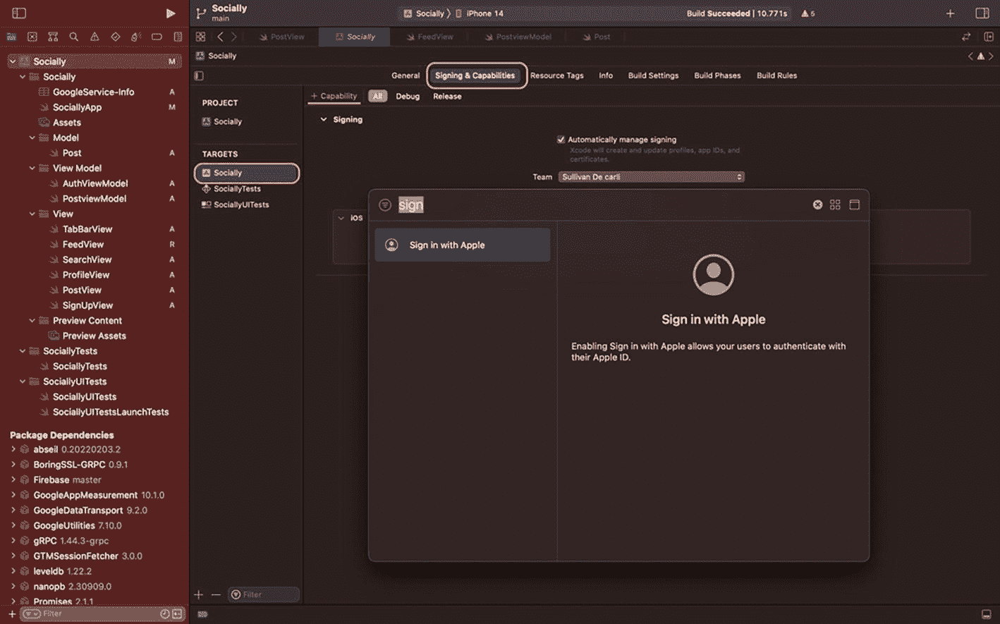
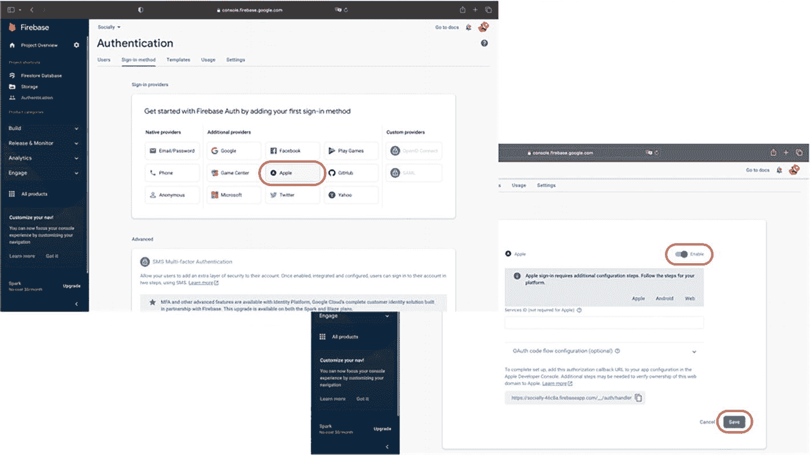

# 配置项目并集成「通过 Apple 登录」

「通过 Apple 登录」功能自 iOS 13 起引入，允许用户使用其 Apple ID（通常用于 iCloud 或 App Store 购买）来注册你的应用。强烈建议添加此功能，因为它更便于用户操作：无需记住密码、一键即可注册，并且用户可以通过 Apple 隐私中继服务隐藏电子邮件。如往常一样，这是 Apple 提供的出色隐私增强方案。

## 如何在 Firebase 中实现？

Firebase 提供了与 Apple 登录交互的 API，用于用户注册。它会调用 Apple 服务器验证身份，将回调响应提交给 Firebase，从而在数据库中注册用户，并向我们返回注册成功或失败（含错误信息）的响应。

与电子邮件/密码登录方式相同，我们仍可访问 Firebase 提供的 `User` 对象。因此我们可以继续在视图模型中实现函数，并在用户界面中集成原生的 Apple 登录按钮。

### 重要说明

要使用「通过 Apple 登录」功能，你需要一个 Apple 开发者账号，每年费用为 99 美元。如果你不想注册开发者账号，仍可学习本章内容——只需使用我在初始文件中以注释形式保留的电子邮件/密码注册登录代码即可。

## 在 Xcode 中的配置

首先，我们需要添加「通过 Apple 登录」的能力。进入主目标文件，在 **Signing & Capabilities** 选项下搜索 "*Sign in with Apple*"，然后按回车键，操作如下：

截图展示了包含“通过 Apple 登录”对话框的窗口。其中“社交与签名功能”选项用方框高亮标注。文字说明允许用户通过其 Apple ID 进行身份验证。

**图 7-2** — Xcode ➤ 签名与功能 – 通过 Apple 登录

如果在搜索中未出现该选项，可能是你的会员资格或证书已过期。请检查你的 Apple 开发者账号。

## 在 Firebase 控制台中的配置

完成 Xcode 中「通过 Apple 登录」的配置后，接下来在 Firebase 控制台中进行设置。进入控制台并点击**开始使用**。在登录方式中选择 **Apple**，启用并保存。

两张身份验证窗口截图：第一张在登录方式下用方框高亮标注了 Apple 选项；第二张用方框高亮标注了启用滑动开关和保存按钮。

**图 7-3** — Firebase 控制台 – 启用「通过 Apple 登录」

现在已完成「通过 Apple 登录」的所有配置工作，是时候编写代码了。让我们进入视图模型，实现必要的函数来支持「通过 Apple 登录」。

