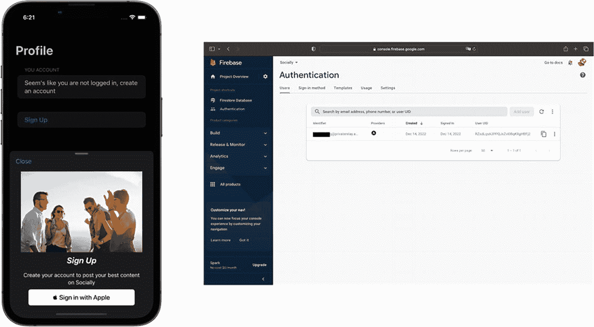

# 集成「通过 Apple 登录」

现在开始编码。首先进入 `AuthViewModel`，导入处理 Apple 身份验证所需的框架：

```swift
import AuthenticationServices
import CryptoKit
```

需要使用 `AuthenticationServices` 框架与 Apple 服务器通信，`CryptoKit` 则用于创建加密密钥，确保数据传输的安全性。

接下来，在 `AuthViewModel` 文件中添加这两个变量：

```swift
@Published var user: User?
var currentNonce: String?
```

这里再次使用 Firebase Auth 框架中的 `User` 对象，以及一个用于生成传递数据所需唯一密钥的 `String` 变量。

现在可以实现以下两个函数：

```swift
func randomNonceString(length: Int = 32) -> String {
    precondition(length > 0)
    let charset: [Character] =
        Array("0123456789ABCDEFGHIJKLMNOPQRSTUVXYZabcdefghijklmnopqrstuvwxyz-._")
    var result = ""
    var remainingLength = length
    while remainingLength > 0 {
        let randoms: [UInt8] = (0 ..< 16).map { _ in
            var random: UInt8 = 0
            let errorCode = SecRandomCopyBytes(kSecRandomDefault, 1, &random)
            if errorCode != errSecSuccess {
                fatalError(
                    "Unable to generate nonce. SecRandomCopyBytes failed with OSStatus \(errorCode)"
                )
            }
            return random
        }
        randoms.forEach { random in
            if remainingLength == 0 {
                return
            }
            if random < charset.count {
                result.append(charset[Int(random)])
                remainingLength -= 1
            }
        }
    }
    return result
}
```

很好！我们已完成第一部分代码。这段代码来自 Firebase 官方文档推荐，用于创建从前端到 Apple 服务器的数据传递节点。接下来添加以下函数：

```swift
func sha256(_ input: String) -> String {
    let inputData = Data(input.utf8)
    let hashedData = SHA256.hash(data: inputData)
    let hashString = hashedData.compactMap {
        String(format: "%02x", $0)
    }.joined()
    return hashString
}
```

此函数用于实现 SHA-256 协议，这是一种世界级的加密协议，例如也用于比特币区块链中。添加完该函数后，我们继续前往视图层：`SignUpView`。

在文件顶部导入以下框架，以访问 Apple 登录按钮和 Firebase 身份验证：

```swift
import AuthenticationServices
import FirebaseAuth
import FirebaseFirestore
```

然后，在 `body` 变量上方添加以下代码以观察视图模型：

```swift
@ObservedObject private var authModel = AuthViewModel()
```

现在，我们可以在 `SignUpView` 的 `VStack` 中实现以下代码：


```swift
SignInWithAppleButton(onRequest: { request in
    let nonce = authModel.randomNonceString()
    authModel.currentNonce = nonce
    request.requestedScopes = [.email]
    request.nonce = authModel.sha256(nonce)
},
onCompletion: { result in
    switch result {
    case .success(let authResults):
        switch authResults.credential {
        case let appleIDCredential as ASAuthorizationAppleIDCredential:
            guard let nonce = authModel.currentNonce else {
                fatalError("Invalid state: A login callback was received, but no login request was sent.")
            }
            guard let appleIDToken = appleIDCredential.identityToken else {
                fatalError("Invalid state: A login callback was received, but no login request was sent.")
            }
            guard let idTokenString = String(data: appleIDToken, encoding: .utf8) else {
                print("Unable to serialize token string from data: \(appleIDToken.debugDescription)")
                return
            }
            let credential = OAuthProvider.credential(withProviderID: "apple.com", idToken: idTokenString, rawNonce: nonce)
            Auth.auth().signIn(with: credential) { (authResult, error) in
                if (error != nil) {
                    print(error?.localizedDescription as Any)
                    return
                }
                print("signed in")
                guard let user = authResult?.user else { return }
                let userData = ["email": user.email, "uid": user.uid]
                Firestore.firestore().collection("User")
                    .document(user.uid)
                    .setData(userData) { _ in
                        print("DEBUG: Did upload user data.")
                    }
            }
            print("\(String(describing: Auth.auth().currentUser?.uid))")
        default:
            break
        }
    default:
        break
    }
})
.signInWithAppleButtonStyle(.black)
.frame(width: 290, height: 45, alignment: .center)
```

我们刚刚实现了原生的“通过 Apple 登录”按钮，通过它可以将用户处理的凭证传递给 Apple 服务。同时，我们使用`guard let`语句检查凭证是否被正确传递。

由于我们将从`ProfileView`呈现这个`SignUpView`，因此需要在那里处理呈现逻辑。我们需要加入一段逻辑：当没有用户时显示注册屏幕，当用户已注册时显示用户信息。为此，我们需要进入`AuthViewModel`并集成以下两个函数：

```swift
func listenToAuthState() {
    Auth.auth().addStateDidChangeListener { [weak self] _, user in
        guard let self = self else {
            return
        }
        self.user = user
    }
}
```

这将帮助我们监听 Firebase Auth 框架的状态变化。我们还需要实现退出登录函数：

```swift
func signOut() {
    do {
        try Auth.auth().signOut()
    } catch let signOutError as NSError {
        print("Error signing out: %@", signOutError)
    }
}
```

很好！现在我们可以构建`ProfileView`中的用户界面。让我们观察这个用于控制呈现的布尔值以及`SignUpView`的`ViewModel`：

```swift
@State private var showSignUp: Bool = false
@ObservedObject private var authModel = AuthViewModel()
```

并在`body`变量中添加以下代码：

```swift
VStack(alignment: .center) {
    if authModel.user != nil {
        Form {
            Section("你的账户") {
                Text(authModel.user?.email ?? "")
            }
            Button {
                authModel.signOut()
            } label: {
                Text("退出登录")
                    .foregroundColor(.red)
            }
        }
    } else {
        Form {
            Section("你的账户") {
                Text("看起来你尚未登录，请创建一个账户")
            }
            Button {
                showSignUp.toggle()
            } label: {
                Text("注册")
                    .foregroundColor(.blue)
                    .bold()
            }.sheet(isPresented: $showSignUp) {
                SignUpView().presentationDetents([.medium, .large])
            }
        }
    }
}.onAppear { authModel.listenToAuthState() }
```

现在我们的 UI 已就绪：登录时显示用户的电子邮件，当 Firebase 服务器检测到无会话时则显示一个按钮。我们将把所有必要信息传递给 Apple 服务器。

我们能从响应中得到什么？

- 一个唯一的转发性电子邮件或他们的原始电子邮件
- 他们的全名（可选——本项目中我们未请求此项）

之后，在完成时，我们将能够继续并将凭证注册到 Firebase。现在，我们可以检查 Firebase 控制台，看看用户是否正确注册。*(建议在真实设备上测试此功能。)*



两张截图：一张是手机屏幕，显示个人资料部分；另一张是认证窗口，窗口内有一个表格，在“认证”和“用户”选项卡下有 5 列。

**图 7-4** — 通过 Apple 登录与 Firebase Auth 协同工作

## 总结

我们利用 Firebase 认证 SDK 探索了一项更高级的功能：通过 Apple 登录。得益于它们的 API，我们能够对用户进行认证。然而，“通过 Apple 登录”需要更多的设置，因为我们需要同时与 Apple 服务器和 Firebase 服务器通信才能获得响应。

借助其出色的监听器，我们还能判断用户是否已登录，并根据这一响应呈现正确的界面。

既然我们已经知道如何使用“通过 Apple 登录”，我为你准备了一个挑战：将“通过 Apple 登录”集成到我们在第 3 章和第 4 章创建的笔记应用中。

如果你在本章的学习中遗漏了某些内容，可以查看以下源代码：

