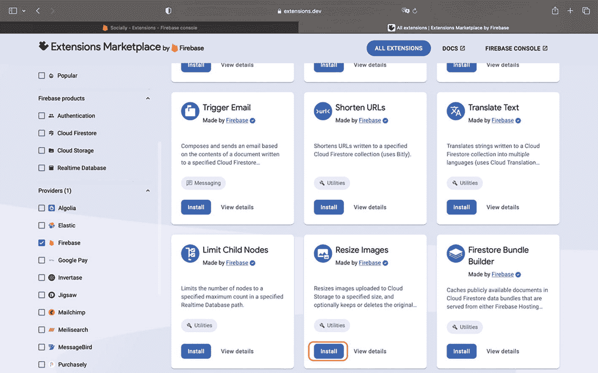
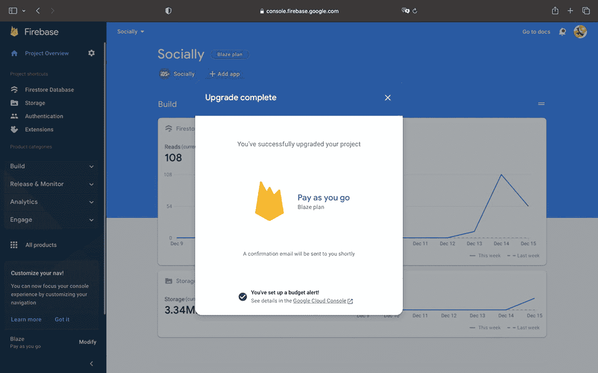
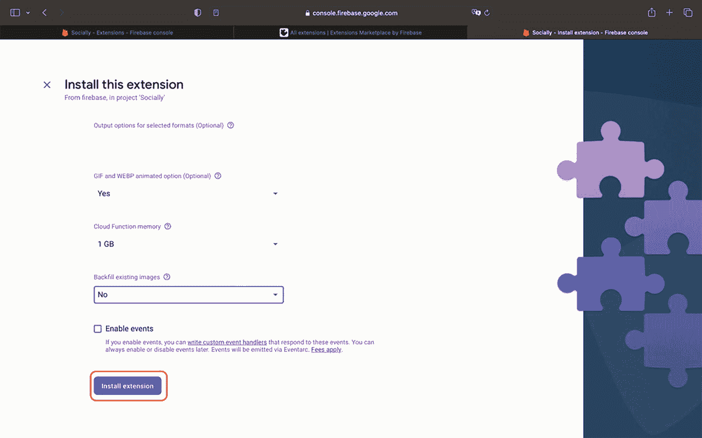
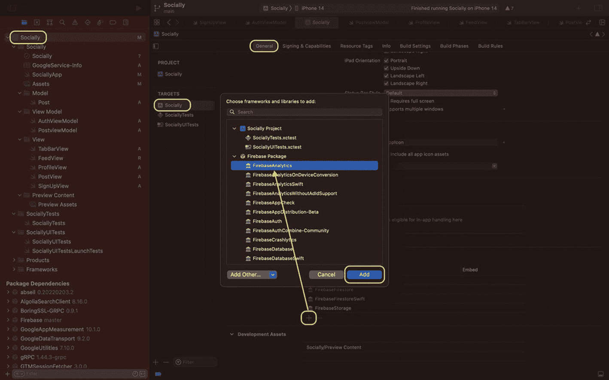
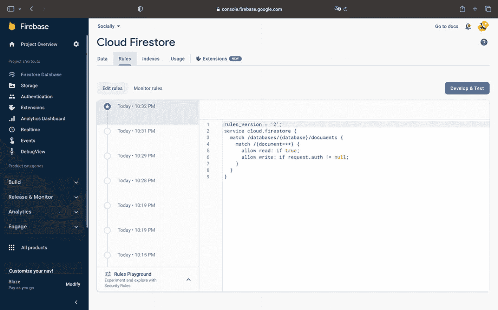

# 探索 Firebase Extension

Firebase Extension 是 Firebase 开发的一个框架，允许你在无需编写任何代码的情况下实现后端功能。其中一些由 Firebase 开发，例如触发图片、向 Google BigQuery 发送数据或调整图片大小。它还包含许多第三方提供商，如用于运行订阅服务的 Stripe、用于搜索 Firestore 文档的 Algolia、与 RevenueCat 集成应用内购买等等。

我们将从 Firebase 制作的 `Resize Images` 开始。

这个功能在我们的应用中会很有用，因为用户正在将图片上传到数据库，并在我们的信息流中检索它们。此功能会将图片调整为指定尺寸，从而减小图片大小。这将使我们的应用效率大大提高！

要安装此扩展，你需要将 Firebase 项目升级到 Blaze 计划。这意味着谷歌会向你收取使用你在后端实现的功能的费用。对于我们即将执行的测试，可能只需要几美分。

前往 Firebase 控制台 ➤ Build ➤ Extensions。然后查找 `Resize Images` 并点击 Install。



一张 Firebase 扩展市场窗口的截图。左侧选中了提供商 firebase。右侧是一个包含触发邮件、缩短 URL、限制子节点和调整图片大小等扩展的面板。调整图片大小下的 Install 被选中。

图 8-1

Firebase Extension 市场

如果你尚未订阅 Blaze 计划，控制台会邀请你升级。按照步骤操作并输入你的信用卡信息。如果正确遵循了指示，你将会看到如下弹出窗口：



一张 Firebase 窗口的截图，中央是升级完成对话框。它显示：你已成功升级你的项目（按使用量付费的 Blaze 计划），确认邮件将很快发送给你，并且你已经设置了预算提醒。

图 8-2

项目已更新至 Blaze 计划

现在，你可以开始安装扩展。按照 Firebase 提供的四个步骤，你可以编辑以下字段：

*   `Backfill existing images` – 否

*   `Sizes of resized images`：320 × 200

这样，Firebase 会自动将图片调整为 320 × 200 像素，使其在屏幕上看起来不错，并且文件总大小也会减小。你可以点击 `Install extension`；它需要几分钟才能生效：



一张“安装此扩展”窗口的截图。它有一个输出选项输入框，以及三个分别用于 GIF 和 WEBP 动画选项、云函数内存和反向填充现有图片的下拉菜单。底部的 Install extension 按钮用边框高亮显示。

图 8-3

安装 Firebase 扩展

现在，你可以通过发布带有图片的帖子来测试你的应用。由于图片已被后端压缩尺寸，因此检索速度会更快。因此，我们在几分钟内就改进了应用，而且没有编写任何代码。

## 使用 Analytics 跟踪应用使用情况

弄清楚用户如何使用我们的应用是很有用的，例如，确定注册转化率（有多少用户创建账户/有多少用户下载了应用）。借助 Firebase，我们可以轻松地使用 Google Analytics 实现这种跟踪器。

首先要做的是将 Firebase Analytics 包添加到我们的应用中。前往你的主 target。在 `General` 下向下滚动到 `Frameworks`、`Libraries` 和 `Embedded Content`，然后点击加号按钮。接着选择 `FirebaseAnalytics` 并点击 `Add`。



一张窗口截图，显示了“选择要添加的框架和库”对话框。从左到右依次高亮了 social、general 和 add 按钮。一个箭头从对话框中的 Firebase 包下指向 firebase analytics。

图 8-4

向项目添加包

现在我们可以使用 Firebase analytics API 了。我想检查的第一件事是有多少用户转化为已验证用户。为此，我需要在每次用户成功注册时添加一个事件。

让我们前往 `SignUpView` 并在顶部导入该框架：

``` swift
import FirebaseAnalytics
```

然后，在 `print(signed in)` 之后立即添加以下代码行——这样，我们就能确保身份验证已成功：

``` swift
Analytics.logEvent("user_sign_up", parameters: nil)
```

就这样。用一行代码，我们就向 Firebase 记录了一个事件，以查看注册到我们应用的每个用户。

你可以在接下来的 24 小时内，在 Firebase 控制台 ➤ Analytics ➤ Events 中查看。你将看到每次用户验证时记录的事件。

## 保护我们的数据库

在将我们的应用发布给公众之前，还剩下最后一步：保护我们的数据库。由于我们使用的是 Firestore，因此需要前往控制台的这一部分并编辑规则。

目前，任何人都可以在未经过身份验证的情况下在我们的数据库中发布帖子和读取用户信息。这关乎安全性和成本问题。

因此，我们需要限制只允许经过身份验证的用户写入数据，但可以允许任何人读取，因为个人资料是公开的，应用中的帖子也是公开的。

前往 Firebase 控制台 ➤ Firestore ➤ Rules，实施以下规则，然后点击 Publish：

``` sql
rules_version = '2';
service cloud.firestore {
match /databases/{database}/documents {
match /{document=**} {
allow read: if true;
allow write: if request.auth != null;
}
}
}
```



一张 Firebase 窗口的截图，左侧选中了 firestore database 的项目概览面板。右侧是选中了 rules 选项卡的 Cloud Firestore 面板。它有编辑规则按钮、5 个日期和时间以及 9 行代码。

图 8-5

Cloud Firestore 规则

现在，未注册的用户将无法写入任何内容。我们有效地限制了数据的访问权限！


## 总结

在最后一章中，我们探索了 `Firebase Extension`，这个无代码工具可以为我们的应用添加额外功能。随后，我们记录了事件，以了解用户如何使用我们的应用，这里记录的是每次有人在我们的应用上进行身份验证时的事件。

最后，我们保护了数据库安全，禁止未注册的用户在 Firestore 上发布任何文档。

本书到此结束。感谢您的阅读！您可以通过以下链接找到最终项目的源代码：

[`drive.google.com/drive/folders/1eF-OXxC1jn0Ob30BsfXOFH7LzV2w24pU?usp=share_link`](https://drive.google.com/drive/folders/1eF-OXxC1jn0Ob30BsfXOFH7LzV2w24pU%253Fusp%253Dshare_link)

## 索引

A  
`addData()` 函数  
`addDocument`  
API  
Algolia  
Apple 身份验证  
Apple ID  
Apple 服务器  
数组  
`AsyncImage`  
`AuthenticationServices` 框架  
`AuthViewModel`

B  
后端即服务 (BaaS)  
比特币  
区块链  
Blaze 计划  
布尔值

C  
`ContentView.swift` 文件  
创建-读取-更新-删除 (CRUD)  
`CryptoKit`

D  
`Data` 参数  
`downloadURL.absoluteString` 函数  
`downloadURL` 函数

E  
嵌入内容  
`EmptyView`

F  
动态消息屏幕  
`FeedView`  
Firebase  
添加 iOS 应用  
优势  
Apple 应用  
BaaS  
云服务，iOS 应用  
连接 iOS 应用  
`GoogleService-Info.plist`  
SDK  
Xcode  
另请参阅  
Xcode 仪表盘  
劣势  
Firestore 部分  
Google Analytics  
首页  
iOS 应用  
项目名称  
选择  
Google Analytics 账户  
Spark 计划标签  
Firebase Analytics 包  
Firebase 身份验证  
Firebase Auth 框架  
Firebase Auth SDK  
身份验证部分  
电子邮件/密码选择  
启用提供商并保存  
逻辑实现  
管理用户会话  
保护 Firestore 数据库  
集合层级结构  
删除 Firestore 集合  
导入安全规则  
注册函数  
使用电子邮件和密码注册  
运行应用/发布用户数据  
`AuthViewModel`  
重置密码  
登录过程  
`SignUpView` 用户界面  
视图模型  
Xcode  
Firebase 集合  
Firebase 控制台  
Firebase 文档  
Firebase 扩展  
探索  
安装  
市场  
无代码工具  
Firebase Firestore  
Firebase Firestore 控制台  
Firebase 项目  
异步/等待，后端创建  
Firebase 服务器  
Firebase 软件开发工具包 (SDK)  
Firebase Storage  
Firestore  
创建数据库  
数据库  
删除数据  
文档  
MVVM 设计模式  
基于 NoSQL 文档的数据库  
笔记应用  
传递数据，视图  
读取数据  
两步设置  
上传数据  
`FIRUser`  
`formatted()` 修饰符  
框架

G, H  
Google Analytics  
Google BigQuery  
`GoogleService-Info.plist`

I, J, K  
`imageURL` 字段  
`import FirebaseAnalytics`  
`import FirebaseStorage`  
`import PhotosUI`  
集成文档  
iOS 16  
iPhone  
iPhone 相机和相册访问  
iPhone 照片库

L  
`Libraries`  
`listenToAuthState()`

M  
匹配  
`maxSelectionCount`  
MVVM 设计模式

N, O  
`NavigationLink`  
`NavigationView`  
`NoteViewModel`  
数字

P, Q  
`PhotosPicker`  
`PhotosUI`  
图片上传，Firebase 存储  
`PostView` 文件  
`PostViewModel`  
`preferredItemEncoding`  
`ProfileView` 函数  
`putData()` 函数

R  
RevenueCat

S  
保护数据库  
`@ServerTimestamp`  
SF Symbols  
SHA-256 协议  
通过 Apple 登录  
高级功能  
集成  
笔记应用  
项目设置  
在 Xcode 中的视图模型  
`SignUpView` 函数  
社交媒体  
存储控制台  
`storageReference.downloadURL`  
字符串  
Swift 语言  
Swift 包  
2019 年 Apple 推出的 SwiftUI  
`AsyncImage` 修饰符  
代码  
可标识地图应用  
MapKit  
照片选取器  
UIKit  
Xcode

T  
出租车应用  
文本  
时间戳

U  
UIKit  
`UITableViewDataSource`  
用户界面  
UUID

V, W  
`viewDidLoad` 方法  
视图模型

X, Y, Z  
Xcode  
添加包  
Apple App Store  
拖放 `GoogleService-Info.plist` 文件  
标识符  
Mac App Store  
新项目  
`NoteApp.swift`  
运行并与 Firebase 通信  
选择应用模板  
设置，项目  
模拟器应用  
在模拟器中运行  
Swift 语言  
标签模板  
14.1 版本  
欢迎屏幕
