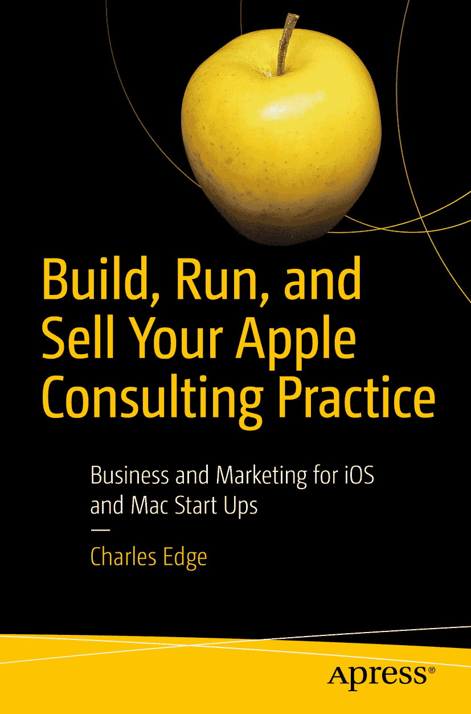

ISBN 978-1-4842-3834-9  
电子版 ISBN 978-1-4842-3835-6  
[`doi.org/10.1007/978-1-4842-3835-6`](https://doi.org/10.1007/978-1-4842-3835-6)  
美国国会图书馆控制号：2018953678  
© Charles Edge 2018

本作品受版权保护。出版商保留所有权利，无论涉及全部还是部分材料，具体包括翻译、重印、使用插图、朗诵、广播、微缩胶片复制或任何其他物理形式的复制权，以及通过电子改编、计算机软件或目前已知或未来开发的类似或不同方法进行传输、信息存储与检索的权利。本书中可能出现商标名称、标识和图像。对于每个商标名称、标识或图像，我们并非每次都使用商标符号，而是仅在编辑风格中使用这些名称、标识和图像，以维护商标所有者的权益，并无意侵犯商标。本书中使用的商品名称、商标、服务标志及类似术语，即使未被明确标识，也不应被视为对其是否受专有权利保护的立场表达。

尽管本书中的建议和信息在出版时被认为是真实准确的，但作者、编辑和出版商均不对可能存在的任何错误或遗漏承担法律责任。出版商对本书所含材料不作任何明示或暗示的担保。本书通过 Springer Science+Business Media New York 在全球图书贸易中发行，地址：233 Spring Street, 6th Floor, New York, NY 10013。电话：1-800-SPRINGER，传真：(201) 348-4505，电子邮件：`orders-ny@springer-sbm.com`，或访问：`www.springeronline.com`。Apress Media, LLC 是一家加利福尼亚有限责任公司，其唯一成员（所有者）是 Springer Science + Business Media Finance Inc (SSBM Finance Inc)。SSBM Finance Inc 是一家特拉华州公司。

## 引言

我成年后的大部分时间都在咨询行业工作。我曾就职于大型跨国咨询公司，创立过咨询公司，参与过公司出售，并在大小公司中帮助开发业务与服务项目。我按小时计费过，签过聘雇合同，甚至将按小时计费的客户转变为管理服务客户。在这一过程中，我学到了很多东西。后来，我找了一份朝九晚五的工作。在那段时间里，我暂时离开了咨询行业，之后又有机会与一些全球最大的咨询公司和管理服务提供商的苹果服务部门合作并提供支持。一路走来，我觉得自己什么都没学到……但无论如何，我还是忍不住要写一整本书来谈谈这事！

从一家小型按小时计费的咨询公司起步，到创办管理服务业务，再到在企业级环境中工作，这让我对传统咨询公司和管理服务提供商有了新的认识，也让我看到了业务融合的方式。而指导曾经的竞争对手，则让我看到了他们面临的挑战（这些挑战我未曾遇到），以及我遇到的挑战（他们也未曾经历）。我自然无法保证成功所需的每一步迭代；但我希望这本书能帮助你决定是否踏上这样一段旅程，并在路途中最终找到成功之道。

在本书中，我们将探讨一系列场景，为读者提供应对创办咨询公司过程中最常遇到的一些挑战的思路。其中一些方法具有普遍适用性，另一些则专门针对管理服务。

### 各章概览

本书结构分为三个主要部分：运营业务、发展业务，以及业务启动后的行动指南。各章内容如下：

**第 0 章：** *个体经营者的乐趣。* 在这短短的一章中，我们将介绍个体经营者的生活，以及你决定扩张时将面临的挑战。

**第 1 章：** *打造服务产品。* 本章我们将探讨如何定义你的产品到底是什么。你是要做固定费用的管理服务提供商，还是混合提供服务？我们将讨论按小时计费与不限量支持的问题、网络段的合理性检查，以及如何验证你的定价是否正确。

**第 2 章：** *超越服务。* 在本章中，我们将超越出售服务本身，涉及网站订阅销售、硬件销售、带宽销售以及其他可以增加收入来源、帮助你为初创公司提供资金的领域。

**第 3 章：** *招聘与人力资源。* 本章我们将探讨招聘、培训和留住工程师的问题。我们还会相当冷静且精算地看待何时不得不让你曾拥有的最优秀员工主动离开，以及哪些重大举措可能有助于留住他们。

**第 4 章：** *会计基础。* 在本章中，我们将探讨你组织中最激动人心的方面：记账。许多企业主讨厌做这件事。而我一直很喜欢。哦，还有税务。因为……税务……

**第 5 章：** *购买软件以实现业务自动化。* 第 5 章涵盖部署自动化软件的内容。这包括用于监控远程管理设备健康状况的软件，接着是用于执行工单和调度的软件，最终着眼于与业务的其他方面（包括电子邮件自动化、计费和合同管理）进行集成。

**第 6 章：** *广交朋友：发展合作伙伴关系。* 第 6 章是关于合作伙伴关系的。合作伙伴可能带来大量新客户，也可能浪费时间。在这里，我们将探讨如何找到合适的合作伙伴、建立良好关系，以及将这些合作伙伴关系转化为客户。

**第 7 章：** *开展免费与游击式营销。* 本章我们将探讨如何让你的营销资金获得最大回报。你将获得一些关于轻松最大化投资回报的技巧、一些想法，当然，还有一些用于进一步深入探索的资源。

**第 8 章：** *利用公共关系。* 在本章中，我们聚焦于公共关系。公关就是让你的组织出现在媒体面前，包括在新闻报道中被引用、提及你公司名称的客户案例以及其他资产，无论是否聘请公关公司。

**第 9 章：** *广告。* 在本章中，我们探讨付费广告。在第 7 章和第 8 章中，我们实际上并没有为广告付费，但现在我们有了一些资金，可以负担得起。当然，这将从付费搜索开始。

**第 10 章：** *销售的艺术。* 前几章讲的是建立销售漏斗。那是让你接触到客户的方法。在人们开始给我们钱之前，我们还有一步要走：销售过程。

**第 11 章：** *多元化你的投资组合。* 本章我们将探讨除了托管服务之外，你还能为客户做些什么。这包括软件开发、项目管理以及其他形式的服务。但这里最重要的方面是如何严谨地处理新的商业机会。

**第 12 章：** *何时停止增长。* 本章关乎和谐。放缓增长不一定是永久性的，但增长过快可能很危险——尤其是当你无法为你正在销售的合同筹措到足够的资金时。对许多人来说，这听起来基本上是他们梦寐以求的问题。而对另一些可能危及数十年心血的人来说，公司可能破产的想法则令人恐惧。

**第 13 章：** *出售公司。* 在本章中，我们将探讨出售公司的问题。但我们要再三强调，出售公司通常不应成为你创办公司的初衷。此外，我们还将探讨与其他组织合并的各种方式。

**第 14 章：** *兼职所有者。* 但如果你不想出售公司呢？在本章中，我们将探讨一些替代方案，例如成为兼职所有者，在经营自己公司的同时创办更多公司，以及利用利润来建立更多股权。

**第 15 章：** *收购公司。* 非有机增长是有风险的。为什么你要承担风险进行非有机增长，而不是仅仅比竞争对手提供更好的产品？通常，答案是时间。试想一下，如果你想要进入某个细分市场，并且该市场已有老牌公司，那么你花费时间打造竞争产品的同时，那家公司很可能在进行更进一步的创新，这会使你在获取市场控制权方面越来越落后。在第 15 章中，我们将探讨收购公司时需要考虑的事项，以及谈判破裂时该怎么做。

**第 16 章：** *在大型公司内部运营咨询业务。* 最后，咨询业务也存在于大型公司中——尤其是在软件公司。虽然许多特性和独立公司相似，但也存在许多不同之处，并且有很多很多经验教训值得学习，特别是对于那些从独立实践转向公司内部的人来说。

在每个章节的末尾，我们还会自由地增加一个“延伸阅读”部分。别担心，你不必阅读所有的书。如果你真读完了，大概应该直接给你一个 MBA 学位。我们大家都很忙。因此，虽然通常读书比听书更有价值，但请注意，其中不少书其实都可以在 Audible 上找到。

最终，这本书旨在成为我与你分享的经验教训，而不是一本规则手册。你经营着一家企业。也许你已经从商很久了。也许你管理一家企业已有一段时间。无论你的情况如何，你可能都比我聪明得多。考虑到你所秉持的价值观以及你希望如何经营企业，并非所有这些经验教训都对你适用。但也许我白纸黑字写下的东西，实际上能帮你赚到足够的钱，值得你花时间阅读这本书！

首先，让我劝你别这么做……

## 在你创办公司之前

创办公司的压力真的可以杀死你。创办公司可能会摧毁你生命中的每一段关系。创办公司会让你老得更快。你很可能会破产。你会雇用那些最终可能会恨你的人。你不会“掌控自己的命运”，因为你的客户将会掌控你的命运。简而言之，这将会很糟糕。

你工作的时间会比你想象的多得多。你会把大笔的钱付给律师和会计师。你会把时间花在远离现实世界、建立事业上，而不是培养与朋友和家人的关系。

是的，罗斯·佩罗特将托管服务提供商卖出了超过 100 亿美元。你不会。是的，你可以在为咨询师工作、将业务转给咨询师或雇用咨询师后，自己挂牌营业。但不要这样做。你以为自己能比那些因为各种原因让你失望过的咨询师做得更好吗？你不能。再说一次，这将会很糟糕。

如果你取得了成功，仍然可能因为糟糕的财务规划而破产。如果你取得了成功，你可能会被起诉。如果你创新，你将会被抄袭。如果你雇用员工，他们终将离开你。你会一直坚持下去，直到你出售公司或破产为止。

## 那么，换一种方式……

事情不一定要这样。你可以永远为别人工作。你可以领薪水。你可以获得安全的 401k 退休计划。或许你可以在业余时间做点咨询。你可以拥有美好而安稳的生活。你可以……活着……

那个业余做的事情。它被称为零工经济，我们将在本书中稍作讨论。也许你开 Uber，或者在 Apple Store 零售店工作。用更老旧的术语来说，这叫“小本经营”，它让你在需要时可以灵活转向。

好吧，好吧，就像卫生局局长无法用警告标签阻止吸烟者吸烟一样，如果你继续读下去，请帮我一个**天大的忙**。为了快乐，不惜一切代价，哪怕关闭你那视如珍宝的公司。做你热爱的事。善待你所爱的人。并且，在努力经营企业的同时，尽量让它持续下去！

## 第 0 章：个体经营者之乐

我在上一节中试图劝你不要创办公司。如果你还在读，说明你已经决定无论如何都要去做。或者你是在读完那段之后才去做的，又或者你在 30 年前就已经做了。下一个阶段是获得足够的客户，让你赚到想赚的钱。在接下来的几章中，我们将探讨如何有策略地做到这一点。

成为一名顾问并不难。这份工作可以与其他工作共存，提供灵活性，而且你不必担心他人。如果你想休息一天，只需重新安排你的预约。你可以限制工作时间，以便专注于家庭和其他追求。我认识很多做了几十年个体经营者的人，他们不仅热爱这份工作，还赚了足够的钱，过上了舒适的生活。

### 保持清醒

不过，我仍可以提供一些建议，帮助你保持理智。以下是一些作为个体经营者需要牢记的要点：

- 通常一切都关乎精品服务。市面上确实有很多极其廉价的选择，其中一些和你做得一样好。无意冒犯，对我也是如此。但你能提供某种水准的服务，让你物超所值。不要吝啬为客户提供那些只有精品店才能做到的小细节。

- 个体经营让你能够专注于与核心客户的关系。人生苦短，不值得与糟糕的人共事。如果你选择扩张，那就另当别论。但在目前的规模下，除非你计划发展壮大，并用他人取代自己在客户那里的角色，否则只与你愿意合作的人共事，而不是任何打电话来的人。

- 不要在价格上竞争。如果你创办了一家公司，对每个项目都趋之若鹜，并且试图比任何人都更便宜，那么你会被累垮。大多数根据价格选择供应商的客户，往往对如何对待这些供应商抱有某种期望。再说一次，人生苦短，不值得为此纠结。我并不是说不要探索每一个找上门的机会，但请思考一下：是收取`$200`每小时的费用工作 2 小时更好，还是收取`$50`每小时的费用工作 8 小时更好？

- 保持简单。我们在本书中涵盖的很多内容都是关于如何规模化运营——当你建立公司时需要考虑的事项。其中许多系统对个人从业者也非常适用。但要建立适合你规模的系统。你当然需要一些工具来轻松追踪事务。但举个例子，你不需要像`Marketo`这样的工具来给客户发消息。

- 实践 80/20 法则。百分之二十的客户可能为你带来百分之八十的业务。务必尽可能用满满的关怀来服务这些客户。同时，不要害怕放弃其中一些客户，即使他们来之不易。

- 尽可能外包或推荐出去。你越晚招聘会计、调度等岗位，你的生活就越轻松。在招聘这些职位之前，想想是否可以请一位兼职人员来做，或者直接购买一项服务。

- 照顾好自己。我记得当客户凌晨 4 点打电话时，我会从床上跳起来去帮助他们。三倍时薪虽然不错，但如果你发现自己经常这样做，可以提高那些非工作时间的费率，试着减少这类电话。

- 设定日程安排。如果你是刚为自己工作，很容易让个人生活挤占职业生活，或者让职业生活开始吞噬所有时间，导致没有时间留给个人生活。设定一个日程：在工作前去健身房，然后早上 9 点准时到第一个客户那里，或者按你自己的节奏来。并留出时间给家人和朋友。你知道的，这样他们才不会忘记你的存在。

- 迅速处理账单纠纷。如果客户逾期付款，他们要么是忘了，要么是遇到了财务困难，或者是对已完成的工作有异议。无论哪种情况，如果你让应收账款堆积起来，你的生意难以长久维持。尽快找到任何拖欠账款的根源，并且要知道，客户通常只是因为太忙而没有对发票提出异议。

- 尽可能坚持货到付款。这能让你的账目保持简洁。

- 立即寻求税务帮助。我见过许多个人从业者在第一年就倒闭了，因为他们没有规划好季度税款。

- 赞助社区。你知道那些印有当地高中国家家长教师协会广告的日历，或者教会简报里的广告条目吗？赞助你所在的社区，不仅是结识潜在客户的绝佳方式，也是让你的品牌被动地、轻松地出现在他人面前的一种途径。

- 除非你全心投入，否则不要将经营规模扩展到个体经营之外。你的业务可能足以支撑扩张，但如果你心不在此，那么辜负那些选择为你工作的人就不值得了。

最初的客户总是最难争取到的。他们通常来自你的朋友圈。因为你尚未完全了解自己的价值，你很可能会向他们收取较低的费用。随着你获得更多客户，你会提高收费标准，这可能会导致部分客户流失。这没关系，只要你赚到的钱仍然足够让这份工作变得值得。

### 有意识地经营

有意识地去经营永远不会太早。找到你的利基市场，并主动寻找能帮助你在该领域获胜的客户。多年来，我认识一些专门为 Mac 和 iOS 系统开发销售点（PoS）系统的顾问，我永远无法像他们那样擅长做他们做的事，所以我会把相关业务推荐给他们。会计系统、数字标牌和特定技术领域也是如此。这也有助于让你在潜在客户面前脱颖而出。如果你想在这些领域发展，那么你就更容易吸引到可以长期留住的客户。

在你建立初始客户基础的过程中，你很可能会接触到一些不属于你核心领域的客户。也许你是在边做边学，或者只是为了下周能吃上更多泡面而做某类特定工作。无论如何，最好对这些客户坦诚地说明你们之间的关系性质。生活中也是如此。

思考你想从这件事中获得什么。是为了灵活的自由？是为了拥有一份能让你更接近退休的兼职工作？还是为了掌控自己的命运？当顾问的一大好处是，很多时候你能获得即时的满足感。但代价是你要包揽所有工作，而且这些工作量时断时续。你越了解自己的意图，就越能适应环境，并恰当地利用那些业务清淡的时期。

### 一切皆关乎品格

善待你的客户。独立从业者通常与需要帮助的客户打交道。我曾见过一些顾问因为客户不敢离开而留住他们，也见过另一些顾问在代表客户做决策或提供指导时，只考虑自身最大利益。但如果你能为客户的最佳利益着想，你将会获得数倍的回报。

无论你是初次挂出顾问的招牌，还是已经从业多年，让我们从你希望为客户做些什么开始。在第 1 章中，我们将讨论你向客户提供的方案，也就是你提供的商品与服务包，以及你为这些商品与服务设定的价格。

## 致谢

从前我写致谢部分都是为了技术书籍，而这本书是关于如何做生意的。商业头脑始于你的父母：他们第一次帮你开设储蓄账户，告诉你该存下一点钱而不是全花在糖果上，以及他们教会你那些能帮助你更好地理解人性的细微之处。因此，感谢我的父母和家人，在我成长的岁月中一路指引我。

接下来是老师们。这包括那些教授你特定知识的人——这些知识很明显与商业头脑相关，比如如何计算 t 值和 p 值，或者如何正确管理总分类账。世界很复杂，如果没有学校教育中那些极其出色的指导，我们中没有人能走到今天。

然后是同事们。这包括商业伙伴、老板、同事和员工，也包括你在其他公司接触的人。我只希望，我在商业方面教给他们的东西，能像他们教给我的一样多。

最后，是其他所有人。在商业世界里，每一次与他人的互动——无论是在酒店酒吧与一个连名字都不知道的人交谈，还是遇到一个在合同谈判中把你逼到绝境的人——只要你愿意，都能成为一次学习经历。这延伸到我在每章“延伸阅读”部分提到的书籍作者，也包括普通的非商业类虚构与非虚构作品，因为所有这些都加深了我们对周遭世界的理解。

请注意，这里没有列出任何名字。因为要感谢的人实在太多了。感谢你们为我所做的一切。

### 关于作者

