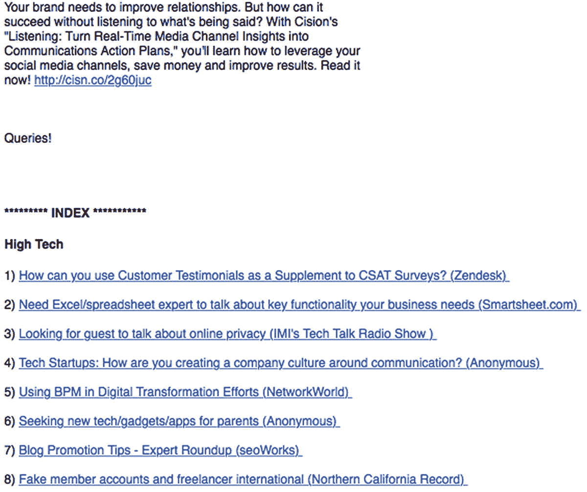

# 善用公共关系

公共关系（PR）是一个通过新闻媒体和第三方发布渠道（如刊物、博客和社交媒体）来接触受众的行业——你实际上无需为版面付费。其目标是通过谈论公众感兴趣的话题来获得免费报道。

PR 通常包括品牌建设、媒体关系、宣传、行业内部关系（例如苹果社区和苹果顾问网络）、活动管理以及特殊事件。

在某些组织中，PR 还涵盖员工关系、投资者关系、多元化项目、分析师关系，甚至营销传播。不过，这些内容将在其他章节中介绍。本章将首先介绍 PR 的一些基础知识，重点聚焦于媒体关系和宣传。

## PR 入门

小企业主在制定商业计划时，常常会包含广告和营销计划，却忽略了考虑公共关系（PR）的重要性。这情有可原，毕竟我们无时无刻不受到广告的轰炸——但我们却常常未能理解 PR 在我们日常阅读的广告和文章中扮演的角色。

PR 的成本远低于广告，但效果同样显著，能为产品和服务增加第三方可信度。根据组织的目标，在很多情况下，我更倾向于为 PR 而不是广告付费。

无论你选择聘请公关公司，还是尝试自行开展 PR 工作，都有许多方法可以最大化“媒体”对你组织的影响。以下是一些新创小企业在启动 PR 时应该做的事情：

### 收集你所有的社交资产

PR 的一项重要职能是在线声誉管理。作为小企业主，列出你的企业拥有的所有在线档案、平台和社交媒体网站至关重要。这样，你就能快速对照每个平台核查在线声誉，并制定 PR 计划来放大好评或纠正任何差评。

### 发布媒体资料包

一旦你将所有社交资产整理成一个简单的列表，就可以将它们发布到一个页面上。我通常喜欢将其放在一个名为“媒体”的页面，并确保从网站首页可以轻松找到。列表中应包括上述的社交资产、公司简介及重要事实、媒体报道链接、过往新闻稿，以及如何联系该公司（例如`press@companyname.com`）。媒体资料包还可以包含标识、照片、营销类宣传资料 PDF、标识使用指南等。

### 收集本地媒体联系人

无论你的企业位于何处，整合一份本地媒体联系人列表都至关重要，应涵盖你所在地理区域内的报纸、杂志、广播电台和电视台的所有相关人员。如果你的企业发生了令人振奋的事件，你将能够迅速致电或发邮件给他们以获取媒体报道。

### 收集行业特定媒体联系人

多数垂直行业也有特定的网站、博客、杂志、播客、频道（如 YouTube 播放列表）。同样将这些整理成一个列表，并寻找你可以联系的具体联系人，以便在遇到他们可能感兴趣的事情时进行沟通（只是不要太频繁打扰他们）。

### PR 模板

当媒体报道的机会出现时，你希望组织内部有人具备写作能力。声明、专栏文章、你自己的博客文章以及新闻稿是与媒体互动的有力方式。虽然你可以聘请专家来完善单篇文章的写作，但拥有一个能在组织内部完成初稿的人非常宝贵，尤其是在领域知识至关重要的行业。

启动 PR 计划是为你的小企业做的最好的事情之一。在制定广告和营销策略时，不要忽视并积极投入 PR 工作，因为它是这些计划中最为关键的环节之一。你还可以更进一步，将 PR 计划落实到日历上。发布消息时，应避免周一和周五，并尽量将其安排在网站日志显示访客最多的时段，这样你就能充分利用已有的流量！

## 确定最适合你的公关方式

你可以每月花费数万美元进行公关，也可以将公关支出限制在每天发送一封邮件，邮件中列出正在向社区征集引述的媒体渠道，并在有空时回复你感兴趣的。大多数企业在业务放缓时会投资于公关、广告和营销。如果我能给你一条最重要的建议，那就是：要三思而后行。

有策略地推进业务发展，能让你更善于抓住机遇。如果你了解自身定位、市场状况、业务发展方向，并据此规划如何运用资本（无论是用于吸引关注的政治资本、让他人转发内容的社交资本，还是用于其他所有事项的实际资金），你通常能在不得不花钱的地方找到一些真正划算的买卖。

为你的组织获取公关机会的一些方式可能包括：

- 在你擅长的主题相关文章中获得引用
- 在本地新闻节目中出镜
- 让你撰写的文章刊登在报纸或杂志上
- 以你的名义撰写博客文章（我是作家，所以我不喜欢别人代笔）

这些方式通常是免费的。真正不免费的是，让你的人持续跟进所有你认为与客户群体相关的媒体。但有很多低成本进行公关的方法。在讨论其中一些方法之前，我们先来谈谈如何避免变成令人厌烦的人，以及如何防止别人设置过滤器直接删除你所有的邮件。

### 本地公关

如果你在特定地理区域提供管理服务，那么服务该地区的出版物数量通常是有限的。这些通常包括大型报纸、本地杂志、覆盖特定街区的小型期刊、本地网站等。这些人是最好结交的对象。他们不仅通常很酷，而且当你与他们交谈时，他们不时会提供一些宝贵的见解。我发现，通过从新的角度理解事物，我学到的东西往往和他们一样多。哦，我想当他们需要引述时，我能出现在他们的通讯录里也是很酷的事。

与本地报纸的人交朋友。你通常只需阅读这些新闻媒体上的文章，就能轻松找到联系信息，无论是电子邮件、Twitter 还是信鸽。你可能已经猜到了，我喜欢和记者们混在一起。但他们在公关界也是极好的联系人。他们不仅是你发送信息的对象，而且在深入掌握某个主题以便撰写相关文章时，也经常会有问题需要解答。

进行公关时需要考虑的一些事项：

- **了解报道领域**：每位记者都有特定的报道领域，即他们负责报道的主题。如果你把一个技术类的故事创意发给报道时尚的记者，很可能会石沉大海；然而，如果你把故事创意发给真正报道科技的记者，那么后续跟进的想法可能会更顺利。
- **不要向媒体发送垃圾信息**：撰写文章的人会收到大量寻求媒体关注的邮件和电话。要意识到这一点，只发送及时且相关的信息，重点关注行业或本地趋势——并且要记住，大多数本地媒体关注的是家庭和小型企业，而非高度技术性或企业级趋势。
- **发送邮件时，尽量不要附带附件**：直接告诉收件人，如果他们需要照片或其他你本打算作为附件发送的内容，请回复索取，这样更容易。带有附件的邮件更有可能最终进入垃圾邮件文件夹，并塞满收件人的邮箱！
- **尝试获取指向你网站的反向链接**：这样做能提升你网站的页面排名，并增加人们可能就商品或服务联系你的可能性。
- **如果你接到关于某个话题的电话，当你认为自己并非该领域专家时，务必坦诚相告**。

### 提示

在从事慈善活动时，不要花太多时间对其进行公关。做这些事应该是出于你想为世界做点好事，而不是为了廉价的曝光。

一旦有了联系人，不要浪费这些关系。就像任何关系一样，要用心维护。要成为一个有用的资源，但在对外沟通时，要设身处地想想，如果你是对方，你希望如何被对待。除了本地联系人，还有一些方法可以建立全国性的联系。在下一节中，我们将介绍一种利用流行的 Haro 网站来实现这一目标的方法。

### Haro

Haro 是一个连接新闻撰稿人与希望登上新闻的人的网站。记者、博主和其他媒体从业者可以（也确实会）通过它为他们正在进行的项目寻找引述、案例和故事。全世界无数的公关机构使用 Haro 来监控这些请求，并将他们的客户与相关的作者和编辑联系起来。

如图 8-1 所示，每天都会发送大量咨询。我通常建议建立一个过滤器，这样你只看到那些可能与你的业务相关的请求。这意味着要关注消息的内容，寻找像“苹果”、你认为自己是专家的各种苹果产品相关词汇、“咨询”或你所在的本地地理区域等关键词。

图 8-1 – 发送给 Haro 的咨询

这场游戏的关键在于速度。你回复引述请求的速度越快，它被采用的可能性就越大。此外，由于一天的时间有限，请专注于那些你可以用来增强你在本地媒体和客户中信誉的事情，或者你认为可能产生客户线索的事情。仅仅为了被媒体引用而去做这件事，并不值得付出努力。

回应引述请求是一回事，而且由于做起来很容易，其价值往往在大量的回复中被稀释了。尝试让媒体机构报道你的故事则是另一回事。在下一节中，我们将探讨新闻稿，这是一种被动地向媒体发布消息的常见方式，希望有人觉得你的帖子足够有趣并撰写相关报道。在开始撰写新闻稿之前，请记住，你可能已经为某个新计划等做了大量准备工作，但这并不代表它就具有新闻价值。

## 新闻稿

新闻稿是一种告知媒体某事件的文件。一家软件公司可能会发布新闻稿，声称他们有了一个很酷的新功能。这通常是希望某家媒体机构能够发现它并进行报道。老实说，我并不怎么推荐主要守在一个地理区域的本地咨询公司使用新闻稿。在 Newswire 上发布新闻稿的成本根本不值当。

但是，如果你有一个媒体机构可能感兴趣的重大事件，那情况就不同了。像许多颠覆者一样，苹果在媒体中很受欢迎。所以，如果你发布了一项服务或收购了另一家公司，并且这预示了一种趋势，那么这可能会引起本地记者的兴趣。例如，假设你收购了一家家庭自动化公司，以便能够充分利用功能强大的新款 HomePod。这可能会引发人们对日益普及的家庭自动化的兴趣。但如果你只是雇佣了第二或第三名技术人员，那很可能就不具备新闻价值了。

现在我们对新闻稿有了基本了解，接下来可以介绍一些快速上手的技巧了。

### 新闻稿撰写技巧

新闻稿是一种经久不衰且与时俱进的公关途径，用于向媒体渠道传达有关您企业或组织的新闻、活动和最新动态。这些简洁、信息量大的写作形式经受住了时间的考验，每天都有数百万封新闻稿通过电子邮件发送到报社、电视台和广播电台。

媒体非常喜爱新闻稿。它们就像是一个个微缩版的新闻报道，直接呈现在记者面前。鉴于媒体循环不断需要内容，您应该抓住每一个可能的机会善用新闻稿。

在深入分析新闻稿示例之前，这里有一些快速提示供您参考。

-   **简洁：** 记者没有时间通读您那长达两页的商业公告。建议将新闻稿控制在 300 到 500 字之间，在有效传达信息的同时，避免让读者感到枯燥。
-   **吸引人的标题：** 为了吸引读者兴趣，您需要一个独一无二、具有新闻性但又不会过于夸张的标题。
-   **避免推销语言：** 新闻稿是为了传达新闻，而不是以明显的方式推广您的销售和服务。
-   **避免行话：** 这始终是个好主意，当对方可能不像您那样深入了解某种特定技术时，这一点尤其重要。
-   **坚持事实：** 行文中很容易不自觉地加入华丽辞藻，特别是如果您一直在撰写营销文档。但请避免这样做。坚持陈述事实。
-   **不要用力过猛：** 新闻稿不是向本地观点编辑提交的创意专栏文章。它是新闻公告。请如此对待。
-   **引语：** 引用企业主或发言人的话，是让新闻稿更人性化的好方法。务必抓住这个机会，在您的企业中找一位重要人物，甚至更好的是找一位客户，加上一两句引语。
-   **语法：** 以写作为职业的人非常欣赏良好的语法。

一旦您的新闻稿完成，有两种选择：您可以通过电子邮件发送或致电本地新闻媒体人员，也可以将其提交给诸如 `PRWeb.com` 和 `Newswire.com` 之类的联合发布平台。这两种方式并非互斥——为了获得广泛的报道面，可以考虑同时进行！同时建议读者将新闻稿发布在自己的网站、社交媒体或博客上，以便向甚至不属于“媒体”圈子的人进行推广。

在我们剖析新闻稿的构成时，将继续使用前面提到的 HomePod 示例。

### 新闻稿的构成要素

关于如何撰写一篇能吸引媒体关注的新闻稿，我无法给出单一的建议。但我可以告诉您大多数人是如何撰写新闻稿的，并为您提供一些关于其内容的最佳实践。让我们从每个部分的最佳实践开始，先从标题说起。

#### 标题

与您希望人们阅读的大多数内容一样，吸引注意力的方法就是使用一个出色的标题。在处理新闻稿时，标题被称为“大标题”。与大多数大标题一样，您需要一个能吸引眼球的标题。假设您位于洛杉矶，并希望以 HomePod 为切入点，进军新兴的家庭自动化行业。首先，您需要构建一套服务。然后，想出一个基本能概括要点的大标题。一些想法可能包括：

-   本地科技公司推出全面家庭自动化服务
-   本地商店推出新型家庭自动化服务
-   以苹果为中心的家庭自动化新时代
-   本地公司将家庭自动化带入商业领域

这些标题彼此大相径庭，但我们可以从中汲取一些经验。在这些示例中，大多数标题都保持简短且易于理解。您公司的名称可以轻松地（而且可能应该）替换标题中的“本地商店”或“本地科技公司”。标题中应包含一个引人注目或时髦的词，但不宜过多以至于让人难以接近，重要的是，标题通常应控制在八个词以内。

#### 页眉部分

接下来，我们谈谈页眉部分。它位于页面顶部，包含一些非常基本的信息。在左侧，您需要两行文字。第一行注明何时发布这些信息。之所以必要，是因为有些内容受到“禁发令”限制，这意味着您希望某人撰写相关文章，但稿件要等到禁发令解除后才能实际发布。

第二行应包含您发送新闻稿的日期。页眉部分的右侧是联系信息。这应包括姓名、电话号码和电子邮件地址，每项信息各占一行。

#### 电头与导语

新闻稿的第一段包含电头和导语。这是新闻稿最重要的部分之一，如果您无法保持读者的兴趣，他们很可能会立即停止阅读，所以不要在这里埋没导语。以您的城市名称开头，后跟一个破折号（称为电头），然后是一句能完美总结新闻稿的句子（称为导语）。开篇段落的一个示例如下：

-   洛杉矶 – Megaawesomeconsultancy 公司的查尔斯·埃奇宣布推出一套全新服务，利用苹果平台为小型企业带来尖端的家庭自动化技术。

#### 正文

在正文部分，我们将介绍通常被称为“倒金字塔”的结构。从新闻稿中最具新闻价值的方面开始：人物（Who）、事件（What）、时间（When）和地点（Where）。然后进入重要的细节，最后以概括性和背景信息收尾，我们将在下一部分进行介绍。

正文的示例可能包含两到三个段落，用于陈述必要的细节，例如以下示例：

-   埃奇誓言要将家庭自动化技术应用于小型企业的方方面面，其成本完全可以通过节省的能源费用得到补偿。乔治·特克尼科波利斯被任命为自动化业务部门负责人。
-   “我们正在为主流市场带来即开即用的解决方案，让企业能够控制暖通空调、灯光并监控能耗，”特克尼科波利斯说道。“这不仅能让公司节省能源开支，还能让每个人的生活更轻松。”
-   特克尼科波利斯将于 4 月 1 日出席大型科技会议。届时，各组织机构和媒体可以参观模型住宅，并通过标准语音控制操控一切。

请注意，在这段节选中，我们引用了一两句企业主或组织内部人员的话。额外的引语也可以来自分析师或研究统计数据。同时，文中也包含了一个行动号召，邀请大家参加一场展示会，届时可以获取更多引语，媒体人员也可以亲身体验到所提及的技术。

#### 基本信息

你不需要为新闻稿提供摘要，但可以加入一段可重复使用的背景信息段落，用于每一篇新闻稿中。这里不举例说明，而是列举一些在该段落中可考虑包含的要点：

-   公司成立至今的年限
-   公司的客户数量
-   公司任何具有新闻价值或能提升公信力的信息
-   来自行业分析师或行业意见领袖对公司的评价
-   对于较小的公司，可介绍公司负责人的信息

基本信息的一个示例如下：

-   Megaawesomeconsultancy 公司成立于 1602 年，致力于为中小企业带来现代技术。公司专注于苹果技术，并且从苹果公司成立前的几个世纪起就一直持有全球最大的苹果硬件库存。公司拥有 894 名员工，在加州威尼斯海滩设有办公室。
-   “我们将通过一次次的 HomePod 安装来拯救环境，”Charles Edge 表示。
-   如需了解更多关于 Megaawesomeconsultancy 的信息，请访问 [`http://www.krypted.com`](http://www.krypted.com)。

最后，值得重申的是：新闻稿不是一本书。请将新闻稿控制在一页以内，并在提交前务必校对，确保其符合美联社写作风格指南（本章末尾附有该指南最新版本的链接）。

新闻稿撰写完成后，可通过 `prweb.com`、`Newswire` 提交，或直接发送给你在媒体中的各种联系人。你可能会选择进行公关宣传的一个方向是季节性产品，因为记者们总是喜欢在节假日和其他有时效性的事件周围撰写引人注目的报道，我们将在下一节中探讨这一点。

## 季节性公关与营销

季节性公关与营销每年都会出现，有时一年还会出现多次。当南瓜灯开始出现在门廊前时，从美国童子军到社区健身房等各类企业，在很多情况下都已经开始准备，以吸引足够多的业务来维持一年的运营。根据全美零售商联合会的数据，2016 年节日季销售额占当年全美零售业总销售额的近 20%。

在大多数预测者看来，今年的节日销售前景良好，那些准备充分的企业有望表现出色。而那些准备不足的企业，则可能会在一月份反思究竟哪里出了问题。

我的第一份工作是管理零售端的销售点系统。在走访实体店的过程中，我多次观察到人们为节日购物潮所做的——或未做的——准备工作。其中许多经验同样适用于在线零售商。以下是十条关键建议：

-   **尽早启动：** 有些策略需要时间。你可能拥有所有正确的想法，但如果你不立即行动，就没有足够的时间在节日购物潮到来之前实施它们。考虑到超过一半的节日购物者会在 12 月 10 日之前完成采购，你只有几周时间来争取他们的业务——所以请在 11 月就开始瞄准他们（这意味着你需要在 10 月就启动公关工作）。
-   **紧跟最新趋势：** 当然，你了解自己的市场并知道如何吸引它，但不要过于自信。抬头看看哪些趋势正热，无论是地域性的还是行业内的。做好调研。你可能会遗漏一些东西。
-   **利用小企业星期六：** 今年是 11 月 25 日。作为一家小企业，你应该能在这方面大放异彩。美国运通及其他许多组织可以通过它们的“小企业星期六”活动来为你带来客源。
-   **接受任何支付方式：** 美国运通、Discover、礼品卡——现金当然也可以！处理信用卡支付的供应商比以往任何时候都多，例如 `Square`、`PayPal Here`、`QuickBooks GoPayment` 和 `Stripe`。添加本地支付或优惠券选项（例如我女儿学校每年都让我帮忙销售的优惠券册子）也能为你带来潜在客户和联合营销的机会。而礼品卡可以轻松地通过 `Gyft` 或 `Clover` 等服务来实现。全都喜欢！
-   **与 Groupon 合作：** `Groupon`、`Amazon Local` 以及其他类似网站与传统的优惠券册子一样，是推动业务发展的好方法。只是要准备好面对假日季*之后*可能涌现的大量新业务（毕竟，你需要赚取这部分收入才能确认它）。
-   **启动忠诚度计划：** 忠诚度计划可以是小规模且低技术含量的。也可以是像 `Belly` 忠诚度奖励计划这样的服务。你还可以使用老式的打孔卡和印章——那种“买十送一”之类的。不过，像 `Belly` 这样的计划的好处在于，你可以在线曝光，从而吸引业务。同时，也可以考虑包含多家不同企业的联合忠诚度计划。
-   **现在就加大公关力度：** 如果你在本地市场运营，这是个寻找创意方法通过社交媒体传播你故事的好时机。
-   **个性化客户体验：** 这可以简单到记住客户的名字和他们的喜好。事实上，消费者愿意为更好的体验支付更多。尽可能将体验追踪自动化，但不要做得令人反感（比如每周用大量邮件轰炸客户）。
-   **与非营利组织合作：** 做这件事不是为了赚钱，而是因为它是对的。这可以简单到将限定期限内的一部分利润捐给慈善组织。或者，你也可以亲自走出去做一些有意义的事情，比如组织一次募捐活动。
-   **促销要明智：** 这不仅仅意味着搞个八折促销。你可以举办与圣诞老人合影的活动，或者如果你的忠诚度计划允许，可以在限时内给予双倍积分。

当然，还有无数我未曾想到的点子，而你们比我更了解自己的客户。所以，请以这份清单为起点，在考虑寻求外部帮助之前，尽最大努力去提供免费的东西，无论是在旺季还是淡季。

## 聘请公关公司

本章包含了若干关于获取免费公共关系的建议。公关是构建真正可规模化销售团队的关键，因为通过公关获得的被动营销不仅是你销售漏斗的顶端，还能为所有在销售漏斗中前行的潜在客户提供全面的支持。

当免费的公关努力回报率越来越低，或者你所在领域或地区的可用公关资源已经饱和，以至于难以起步时，这意味着是时候停止单打独斗了。也许你没有时间持续“做公关”，也许你需要更好的帮助来发掘巨大潜力，也许你想触及比单靠自己更广泛的受众。这时，就是时候请人帮忙了。

请人帮忙并不意味着你必须向一家大公司支付数万美元。我几乎可以保证，你所在的地区会有公关俱乐部或组织。首要的起点是美国公共关系协会，网址是 `prsa.org`；然后，从那里开始，在网上搜索当地的公关公司。在这个“零工经济”时代，寻找你可以直接付费、帮助你进行公关工作的个人，也是初期控制成本的好方法。

重要的是，无论你聘请谁，都必须让你参与到事情中来。无论是撰写内容、回复邮件以安排采访预约、联系当地团体，还是为你的第一次电视采访买一件新衬衫！除此之外，要采纳他们的计划，然后想办法判断公关职能是否在为你服务，因为如果不是，你就需要另找一家公司，直到找到最合适的。

### 了解他们的工作方式

当心江湖骗子。公共关系很难量化，因为它通常不是基于绩效的。但实际上，大多数机构或个体经营者对于想为你的公司做什么，以及需要多少时间，心里都是有数的。他们通常根据对你期望结果所需时间的预估，来倒推出一个顾问费。有时他们运气好，做的会比预计多，有时则会少一些。但请允许自己去了解他们是如何得出这个顾问费金额的。如果你理解他们的假设和局限，你们的关系就会更融洽。

#### 注意

虽然按月收取顾问费是常态，但你也可以与公关公司进行基于项目的合作。这或许是一个无需长期承诺的好办法。

虽然量化与公关公司或机构的关系可能具有挑战性，但如果你想尝试，这里有几个小贴士。

-   **可衡量的产出**：量化可交付成果。例如，有多少篇文章、采访或发表的署名文章。多个产出是可接受的，并且至少每 6 个月进行一次评估。

-   **衡量质量而非仅仅是数量**：实施文章评级系统并设定一个目标。这样“你”就能衡量公关曝光的质量，而不仅仅是数量。如果你感兴趣，我有一个我使用的评级系统示例。

当你与某人合作时，他们应该理解你的业务、你希望人们如何看待你的公司、他们应该进行媒体推广的渠道、在进行任何媒体推广之前需要做什么，以及你与他们之间合作关系的范围。他们应该能够在售前阶段制定出一个有效的计划，或者至少是他们会代表你做什么的概要。在给任何人开支票之前，确保你看到了计划并同意它。否则，不要付钱。

### 如果效果不佳，就换公司

我建议至少给任何公关努力或公司 6 个月的时间。大多数公司无论如何都是按季度工作，所以这实际上只是将合同续签一个季度。6 个月后，你应该能知道某家公关公司对你的组织会产生什么影响。

第一个季度后，你应该能在市场上感受到一点热度。如果你获得了媒体关注，但业务尚未见到任何提升，那么你可能走在正确的轨道上。公关不会立竿见影，所以你需要有点耐心。重要的是，你知道你的代理方代表你进行了哪些努力，并且你同意这些努力。这些事情似乎总是比我们最初想象的要耗时更长。

在第二季度，你应该开始看到业务来自于公关。如果到了第二季度末你还没有看到任何提升，那么要么重新谈判你的合同，要么（更可能的是）找一家新公司。如果需要经历三个这样的周期才能找到合适的公司，那就顺其自然。合适的公关可以成为任何公司最大的变革推动力之一。

## 应避免的事项

获得媒体关注有时很有趣。但如果你说错话，很容易破坏关系。一点常识就能大有裨益；然而，当你被置于聚光灯下需要快速回应时，你可能会说出不该说的话。有时，你可以事先询问问题，但这并不能完全覆盖对话可能偏离的方向。

你可以在一定程度上引导对话的走向。所以要有个计划。而且，如果你不知道如何回答一个问题，可以询问记者是否可以在采访结束后通过电子邮件回复他们。有些事情你确实可能不应该公开谈论。

-   **财务信息**：坚持谈论已公开的信息。你的财务状况可能是一个大话题。当地方或商业媒体问及时，要知道在采访中你能说什么、不能说什么。如果你是公司所有者，确保你知道自己想说什么，因为你有权说任何你想说的话。

-   **政治**：你所说的任何话都可能让半个国家的人感到厌烦。我在现场时也会使用这条规则，但要小心讨论政治。即使你在某个受众群体中对 10 个问题中的 9 个都意见一致，那第 10 个问题也可能会与客户产生摩擦，而这完全没有必要。话虽如此，我完全支持坦诚做自己，并且经营企业并不意味着你不能有自己的身份认同，所以我不一定会将性取向、性别认同或宗教与政治混为一谈，尽管这很容易做到。尤其是在当今政治分歧如此严重的时期。

-   **客户**：除非你获得了某位客户（并且该客户有权公开讨论你们合作的工作）的书面明确许可，否则不要谈论。即使你获得了许可，也一定要弄清楚他们允许你与媒体讨论的界限在哪里。

-   **供应商**：与供应商合作可能会遇到几个问题。一是谈论具体的商业话题，比如利润率。你很可能受合同约束不能讨论这些，但还是值得一提。此外，确保不要说出任何可能被视为负面评价的话。

还有其他一些不应该讨论的事情。要明智地选择你的言辞——尤其是当你是“非正式发言”时，因为我曾多次经历这种情况：我说了一些据说是“非记录”的内容，结果却被印了出来！

## 结论

公共关系是宣传公司的一种更正规的方式。但很难追踪媒体关注能为你的组织带来的实际影响。话虽如此，只要付出一点努力，你就可以建立品牌，并将一些流量引回你的网站，希望这能比其它推广方式转化更高比例的电话咨询。

衡量公关的影响可能很困难，但衡量广告的影响通常并不难，我们将在下一章 9 中介绍广告。

## 延伸阅读

- 《美联社风格手册》，[`https://www.amazon.com/Associated-Press-Stylebook-2017-Briefing/dp/0465093043`](https://www.amazon.com/Associated-Press-Stylebook-2017-Briefing/dp/0465093043)
- 《牵引力：掌控你的业务》，吉诺·威克曼著，[`https://www.amazon.com/Traction-Get-Grip-Your-Business/dp/1936661837`](https://www.amazon.com/Traction-Get-Grip-Your-Business/dp/1936661837)
- 《相信我，我在说谎：媒体操纵者的自白》，瑞安·霍利迪著，[`https://www.amazon.com/Trust-Me-Lying-Confessions-Manipulator/dp/1591846285`](https://www.amazon.com/Trust-Me-Lying-Confessions-Manipulator/dp/1591846285)
- 《伊卡洛斯骗局：你能飞多高？》，赛斯·戈丁著，[`https://www.amazon.com/Icarus-Deception-How-High-Will/dp/1591846072`](https://www.amazon.com/Icarus-Deception-How-High-Will/dp/1591846072)
- 《自吹自擂的公关工具：低成本小企业公关策略与创意》，黛安·塞尔策著，[`https://www.amazon.com/Tools-Toot-Your-Own-Horn-ebook/dp/B00AFNWE74`](https://www.amazon.com/Tools-Toot-Your-Own-Horn-ebook/dp/B00AFNWE74)
- 《火花：小企业公关完全指南》，罗伯特·迪伊著，[`https://www.amazon.com/Spark-Complete-Public-Relations-Business/dp/1973721953`](https://www.amazon.com/Spark-Complete-Public-Relations-Business/dp/1973721953)
- 《推销：小企业公关简易 DIY 指南》，詹妮弗·福特尼著，[`https://www.amazon.com/Pitched-Simple-Public-Relations-Business-ebook/dp/B079Y6R3QQ`](https://www.amazon.com/Pitched-Simple-Public-Relations-Business-ebook/dp/B079Y6R3QQ)
- 《公关行之有效！：如何为你的小企业创建、实施并利用公关计划》，南希·马歇尔著，[`https://www.amazon.com/PR-Works-implement-leverage-relations-ebook/dp/B01468WYN2`](https://www.amazon.com/PR-Works-implement-leverage-relations-ebook/dp/B01468WYN2)
- 《提案的艺术：赢得业务的劝说与演讲技巧》，P·考特著，[`https://www.amazon.com/Art-Pitch-Persuasion-Presentation-Business/dp/0230120512`](https://www.amazon.com/Art-Pitch-Persuasion-Presentation-Business/dp/0230120512)

