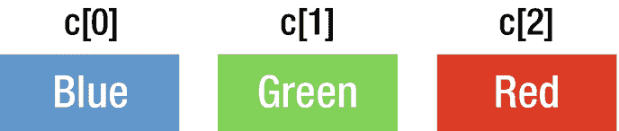
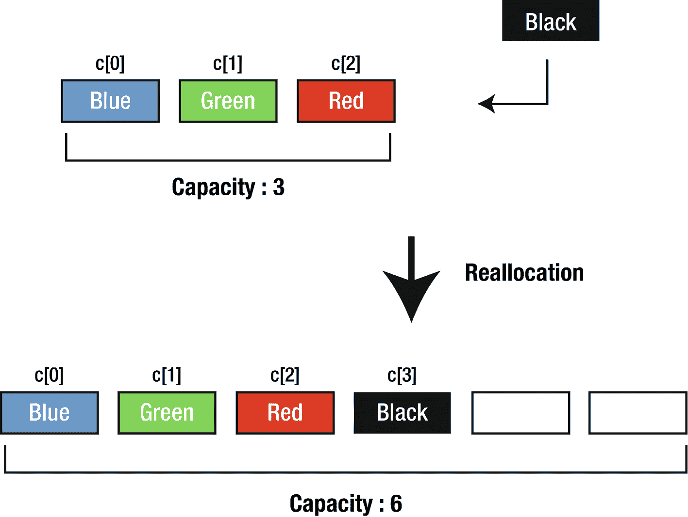

# 1. 数组

在本章中，你将学习数组、数组的内置属性以及如何从数组中检索、添加和删除元素。

## 引言

数组本质上是一个容器，它能以有序列表的形式容纳任意数据类型的多个数据值；这意味着你获取元素的顺序与你在数组中定义元素的顺序相同。你无需分别声明诸如 `number0`、`number1`……直到 `number99` 这样的单个变量，而是声明一个如 `numbers` 这样的数组变量，并使用 `numbers[0]`、`numbers[1]` 和 `numbers[99]` 来表示单个变量。

最简单的数组类型是线性数组，也称为一维数组。在 Swift 中，数组的索引从零开始。一维数组可以简单地写成如下形式，元素可以通过 `a[i]` 来访问，其中 `i` 是介于 `0` 和 `n` 之间的索引：

![$$ a=\left[\begin{array}{c}{a}_0\\ {}{a}_1\\ {}\vdots \\ {}{a}_n\end{array}\right] $$](images/490882_1_En_1_Chapter/490882_1_En_1_Chapter_TeX_Equa.png)

另一种数组形式是多维数组，它类似于一个典型的矩阵：

![$$ a=\left[\begin{array}{ccc}{a}_{00}&amp; {a}_{01}&amp; {a}_{02}\\ {}{a}_{10}&amp; {a}_{11}&amp; {a}_{12}\end{array}\right] $$](images/490882_1_En_1_Chapter/490882_1_En_1_Chapter_TeX_Equb.png)

## 数组的主要特性

每个元素都可以通过其索引来访问，如图 1-1 所示。



**图 1-1** 元素索引

数组会预留特定的内存容量来存储其内容，当容量用尽时，数组会分配更大的内存区域来容纳更多元素，并将现有元素复制到新存储区。这就是为什么向数组添加元素可能比较耗时。新的存储大小相较于旧的大小呈指数级增长，因此随着数组增长，重新分配内存的情况会越来越少。`capacity` 属性决定了数组在超出容量并不得不分配新内存之前所能容纳的元素总数。

如图 1-2 所示，我们正在向一个即将超出容量的数组添加 "Black" 元素。该元素不会立即被添加，而是会在其他地方创建新的内存空间，将所有已有元素复制过去，最后再将新元素添加到数组中。这个过程称为重新分配：在内存的另一区域分配新的存储空间。数组的大小会呈指数级增长。在 Swift 中，这被称为几何增长模式。



**图 1-2** 重新分配

当元素被添加到数组时，数组会在容量耗尽时自动调整大小。如果你事先知道数组将包含大量元素，那么在创建时就分配额外的预留容量会更高效。

```
var intArray = Array()
//显示数组容量
intArray.capacity
intArray.reserveCapacity(500)
intArray.capacity
```

当你复制一个数组时，在赋值操作期间并不会生成一个独立的物理副本。Swift 实现了一种称为“写时复制”的特性，这意味着只有在执行修改操作时，数组的元素才会被复制。

你可以使用以下语法来创建数组：

```
//使用完整的数组语法创建数组
var intArray = Array()
//使用简写语法创建数组
intArray = [Int]()
//使用数组字面量声明
var intLiteralArray: [Int] = [1, 2, 3]
//使用简写字面量声明
intLiteralArray = [1, 2, 3]
// 使用默认值创建数组
intLiteralArray = Int
```

## 从数组中检索元素

从数组中检索值有多种方法。我们可以通过索引来检索，也可以使用 `for`–`in` 语法进行循环遍历。

```
var myIntArray = [1,2,3,4,5]
var aNumber = myIntArray[2]
print(aNumber)
//输出

```

我们可以遍历数组中的元素。

```
for element in myIntArray {
print(element)
}
//输出

```

## 向数组添加元素

向数组添加元素有两种方法。`append` 函数可用于在数组末尾添加一个元素，`insert` 函数则用于在现有数组的指定索引位置插入一个元素。

```
myIntArray.append(11)
print(myIntArray)
//输出
[1, 2, 3, 4, 5, 11]
myIntArray.insert(12, at: 3)
print(myIntArray)
//输出
[1, 2, 3, 12, 4, 5, 11]
```

## 从数组中移除元素

类似地，有四种方法可以从数组中移除元素。使用 `removeLast()` 函数可以移除数组末尾的元素，`removeFirst()` 用于移除第一个元素，`remove(at:)` 用于移除指定索引位置的元素，`removeAll()` 用于移除所有元素。

```
myIntArray.removeLast()
myIntArray.removeFirst()
myIntArray.remove(at: 1)
myIntArray.removeAll()
```

## 内置函数和属性

在接下来的章节中，我们将讨论数组的一些内置函数和属性。

### isEmpty

该属性用于判断数组是否为空。如果数组不包含任何值则返回 `true`，否则返回 `false`。

```
let myIntArray = [1, 3, 5, 6]
print(myIntArray.isEmpty)
```

运行程序时，输出结果为：

```
false
```

### First 和 Last

这些属性用于访问数组的第一个和最后一个元素。

```
print(myIntArray.first)
print(myIntArray.last)
```

运行程序时，输出结果为：

```
Optional(1)
Optional(6)
```

如你所见，这些属性的输出结果是可选类型。这意味着如果数组为空，返回值将是 `nil`。


### 反转与反向

`Reversed` 函数会返回一个全新的集合，其中包含原数组元素的反向顺序。`Reverse` 函数则会反转集合本身。

```
let reversedArray = Array(myIntArray.reversed())
print(reversedArray)
```

当你运行程序时，输出将为

```
[6, 5, 3, 1]
```

### 计数

该属性返回数组中元素的总数。

```
print(myIntArray.count)
```

当你运行程序时，输出将为

```

```

#### 重要提示

在 Swift 中使用下标语法访问数组元素时，必须确保该值位于索引范围内；否则，程序会在运行时崩溃。我们来看下面的例子：

```
print(myIntArray[-1])
```

当你运行程序时，输出将为

```
fatal error: Index out of range
```

在上述程序中，索引 `-1` 处没有值。因此，当你尝试访问该索引处的值时，程序会在运行时崩溃。

要避免这种情况，首先找到你要移除元素的索引，然后按如下方式删除该索引处的元素：

```
var myIntArray = [1, 3, 5, 7]
if let index = myIntArray.firstIndex(of: 5) {
print("found index")
let val =  myIntArray.remove(at: index)
print(val)
}
```

当你运行程序时，输出将为

```
found index

```

## 结论

在本章中，你学习了数组的基本结构、如何在 Swift 中声明数组，以及如何选择、添加和移除元素。下一章，你将学习字典这种数据结构类型。

