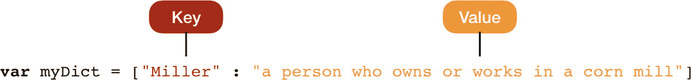

# 2. 字典

本章将讨论字典类型的数据结构。你将学习如何访问、添加、移除和修改字典中的元素。此外，还会涵盖字典的内置属性和函数。

## 引言

字典是 Swift 中另一种数据类型的集合。这种数据结构得名于现实世界中的字典，其中包含单词及其相关含义；在编程中，我们使用字典将键与其值相关联，因此只要知道键，就能识别出任何值。如果我们查看一本真实的字典，会发现其中包含单词，每个单词都有相应的解释和含义。

`Miller : a person who owns or works in a corn mill`（磨坊主：拥有或经营玉米磨坊的人）

在 Swift 中有一个类似的概念，我们可以用以下方式表达上述字典条目，其中键是真实字典中的单词，值是对应的解释。



它是一种无序集合，以键/值对的形式保存多条数据。每个值都与一个唯一的键相关联，该键作为字典中值的标识符。键用于在字典中存储和检索值。

```
var myDict = ["Miller" : "a person who owns or works in a corn mill", "Programmer" : "a person who writes computer programs"]
```

只要符合字典的声明规则，我们可以在字典中添加多个键。我们可以通过显式声明字典中数据的结构来创建字典。在本例中，键是 `String` 数据类型，值也是 `String` 数据类型。如果我们声明字典结构，其声明方式如下：

```
var myDict : [String : String] = ["Miller" : "a person who owns or works in a corn mill", "Programmer" : "a person who writes computer programs"]
```

假设你可能想查找某个国家的首都。在这种情况下，你会创建一个以国家为键、首都城市为值的字典。现在，你可以通过搜索键（国家）从集合中获取首都城市。如果我们想创建一个包含不同类型值的字典，则需要声明一个遵循 `Hashable` 协议的异构字典。这种类型的字典在转换 JSON 负载时非常有用。

```
var myDictionary = [AnyHashable: Any]()
```

字典有三种声明方式：

```
// 第一种
var myDictionary = Dictionary()
// 第二种
var myDictionary = [Int: String]()
// 第三种
var myDictionary:[Int: String] = [:]
```

也可以从两个数组创建字典：

```
let countryKeys = ["US", "UK", "AZ"]
let countryValues = ["United States", "United Kingdom", "Azerbaijan"]
let newDictionary = Dictionary(uniqueKeysWithValues: zip(countryKeys,countryValues))
print(newDictionary)
```

当你运行程序时，输出将为

```
["AZ": "Azerbaijan", "US": "United States", "UK": "United Kingdom"]
```

## 访问字典中的值

要访问字典中的任何值，你需要在字典名称后紧跟的方括号内包含你要访问的值的键。可以使用可选绑定和强制解包，或者通过判断值是否存在来检索键值对。如果你绝对确定键存在，只有在这种情况下才能使用强制解包。

使用可选绑定

```
//使用可选绑定
var myDictionary : [Int: String] = [1: "One", 2: "Two", 3: "Three"]
if let optValue = myDictionary[4] {
print(optValue)
} else {
print("Key not found")
}
```

输出将为

```
Key not found
```

使用强制解包

```
//使用强制解包
let forcedValue = myDictionary[3]!
print(forcedValue)
```

输出将为

```
Three
```

可以遍历字典并返回键值对，这些键值对可以分解为命名常量。

```
for (key, value) in myDictionary {
print("The value for \(key) is \(value)")
}
```

输出为键: 3

```
The value for 1 is One
The value for 2 is Two
The value for 3 is Three
```

也可以单独检索所有键或所有值。如前所述，字典是无序集合，因此遍历时不能保证按顺序列出。但在某些情况下，你可能希望按顺序进行迭代，此时可以使用 `sort(_:)` 方法。这将返回一个包含字典排序后元素的数组。在下面的代码中，`$0.0` 是第一个键值对，`$0.1` 是第二个键值对。这些键值对会被比较，并根据比较结果进行排序。然后，使用 `map` 方法来检索键或值的数据。

```
let sortedArray = myDictionary.sorted(by: {$0.0 < $1.0})
for (key) in sortedArray.map({$0.0}) {
print("The key: \(key)")
}
for (value) in sortedArray.map({$0.1}) {
print("The value: \(value)")
}
```

输出将为

```
The key: 1
The key: 2
The key: 3
The value: One
The value: Three
The value: Four
```

## 向字典添加/修改值

要向字典添加值，可以使用下标语法或 `updateValue(_:forKey)` 方法。下标语法也可用于修改任何现有值。

```
// 向字典添加新元素
myDictionary.updateValue("Four", forKey: 4)
// 使用下标语法添加新元素
myDictionary[5] = "Five"
```

## 从字典中移除值

要从字典中移除值，可以使用 `下标语法` 和 `removeValue(forKey:)` 方法。该方法会返回被移除的值。

```
// 使用方法从字典中移除值
let removedValue = myDictionary.removeValue(forKey: 1)
// 使用下标语法移除值
myDictionary[2] = nil
```

## 内置函数和属性

### isEmpty

如果字典不包含任何值，则返回 `true`，否则返回 `false`。

```
print(myDictionary.isEmpty)
```

输出将为

```
false
```


### First

该属性用于访问字典的第一个元素。

```
let myDictionary : [Int: String] = [1: "One", 2: "Two", 3: "Three"]
print(myDictionary.first)
```

输出结果为：

```
Optional((key: 2, value: "Two"))
```

### Count

返回字典中元素的总数。

```
print(myDictionary.count)
```

输出结果为：

```
3
```

### Keys

返回字典中的所有键。

```
let dictKeys  = Array(myDictionary.keys)
print(dictKeys)
```

输出结果为：

```
[1, 2, 3]
```

## 结论

在本章中，你已经学习了字典的结构以及如何访问、添加、删除和修改其中的元素。同时，也涵盖了 Swift 编程语言提供的内置属性和方法。

