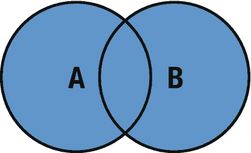
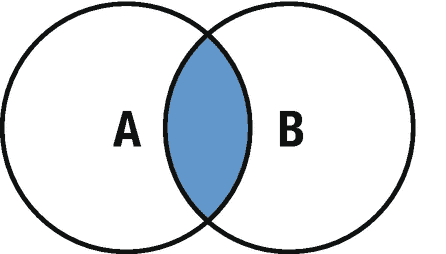
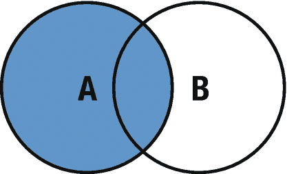
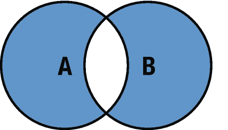

# 3. 集合

集合是一种无序集合（意味着你不会按照定义时的顺序获取元素），其中包含唯一的、非`nil`元素。它必须遵循`Hashable`协议，这意味着它必须提供一个`hashValue`属性。这一点很重要，因为集合是无序的，而`hashValue`用于访问集合中的元素。

集合的访问时间比数组更高效。在数组中查找一个元素时，最坏情况是`O(n)`，其中`n`是数组的大小；而在集合中，查找时间恒定为`O(1)`。与其他集合类型不同，声明集合时必须指定集合类型。

```
// 完整语法声明
var intSet = Set<Int>()
// 使用数组字面量初始化集合
var stringSet: Set = ["One", "Two", "Three"]
```

## 访问、添加和删除集合中的元素

### 访问元素

如前所述，集合是无序的且没有索引，因此无法像数组那样使用下标语法来访问集合中的元素。可以通过集合自身的方法和属性，或者使用`for`-`in`循环来访问元素。

```
// 访问元素
for num in stringSet {
    print(num)
}
```

输出结果为：

```
Two
One
Three
```

若要按顺序遍历，可以使用以下方法：

```
// 有序遍历
for num in stringSet.sorted() {
    print(num)
}
```

要检查集合中是否存在某个元素，可以使用`contains(_:)`方法。

```
// 检查元素是否存在
if stringSet.contains("One") {
    print("找到元素")
} else {
    print("未找到元素")
}
```

输出结果为：

```
找到元素
```

### 添加元素

使用`insert()`方法可以向集合中添加新元素。

```
// 插入新元素
stringSet.insert("Four")
print(stringSet)
```

输出结果为：

```
["Four", "One", "Two", "Three"]
```

### 删除元素

有以下几种方法可用于删除集合中的元素。

- `remove(_:)` – 当你知道要删除的元素实例时
- `remove(at:)` – 当你知道要删除的索引时
- `removeFirst()` – 删除第一个元素（起始索引）
- `removeAll()` 或 `removeAll(keepingCapacity:)` – 删除所有元素

```
// 删除元素
stringSet.remove("Four")
// 删除索引处的元素
if let idx = stringSet.firstIndex(of: "One") {
    stringSet.remove(at: idx)
}
// 删除第一个元素
stringSet.removeFirst()
// 删除所有元素
stringSet.removeAll()
```

## 集合运算

使用集合的主要优势之一是可以执行两类集合运算——比较运算以及成员关系和相等性运算。这些运算与数学中的集合运算类似。

### 比较运算

在 Swift 中，有四种方法可执行比较运算：`union`（并集）、`intersection`（交集）、`subtracting`（差集）和`symmetricDifference`（对称差集）。现在一起来了解一下它们。

#### 并集

两个集合的并集包含两个集合中的所有值（图 3-1）。



`union(_:)`和`formUnion(_:)`方法用于合并两个集合，创建一个包含两个集合所有值的新集合。第二个函数会删除第一个集合（A）中的所有元素，并插入 A 和 B 的并集，这意味着当使用`let`关键字将集合声明为常量时，不能使用此函数；要使用`formUnion(_:)`方法，第一个集合 A 必须使用`var`关键字声明。

```
// 并集
let A: Set = [1, 3, 5, 7]
let B: Set = [0, 2, 4, 6]
print(A.union(B))
```

输出结果为：

```
[3, 6, 2, 0, 7, 5, 1, 4]
```

#### 交集

两个集合的交集是仅包含两个集合共有元素的集合（图 3-2）。



`intersection(_:)`和`formIntersection(_:)`方法用于求两个集合的交集，创建一个包含两个集合共有元素的新集合。第二个函数会删除第一个集合（A）中的所有元素，并插入 A 和 B 的交集，这意味着当使用`let`关键字将集合声明为常量时，不能使用此函数；要使用`formIntersection(_:)`方法，第一个集合 A 必须使用`var`关键字声明为变量。

```
// 交集
let A: Set = [1, 2, 3, 4, 5]
let B: Set = [0, 2, 4, 6, 8]
print(A.intersection(B))
```

输出结果为：

```
[2, 4]
```

#### 差集

两个集合的差集包含第一个集合中所有不属于第二个集合的元素（图 3-3）。



`subtracting(_:)`和`subtract(_:)`方法用于两个集合的差集运算。`subtract(_:)`会删除第一个集合（A）中的所有元素，并插入 A 与 B 的差集，这意味着当使用`let`关键字将集合声明为常量时，不能使用此函数；要使用此方法，第一个集合 A 必须使用`var`关键字声明为变量。

```
// 差集
var A: Set = [1, 3, 5, 7, 9]
let B: Set = [0, 3, 7, 6, 8]
print(A.subtracting(B))
```

输出结果为：

```
[1, 5, 9]
```

#### 对称差集

两个集合的对称差集包含两个集合中所有不共有的元素（图 3-4）。



`symmetricDifference(_:)`和`formSymmetricDifference(_:)`方法用于求两个集合的对称差集。这里适用相同的原则：要使用第二个函数，第一个集合必须声明为变量，并且此方法（`formSymmetricDifference(_:)`）会删除第一个集合（A）中的所有元素，并插入两个集合的对称差集。

```
// 对称差集
var A: Set = [1, 2, 3, 4, 5]
var B: Set = [0, 2, 4, 6, 8]
print(A.symmetricDifference(B))
```

输出结果为：

```
[5, 1, 6, 3, 0, 8]
```

## 成员关系和相等性运算

### 集合相等

如果两个集合包含完全相同的值，则认为它们相等，值的顺序无关紧要。

```
// 集合相等
let A: Set = [2, 4, 6, 8, 10]
let B: Set = [0, 3, 7, 6, 8]
let C: Set = [10, 8, 4, 2, 6]

if A == B {
    print("A 和 B 相等")
} else {
    print("A 和 B 不相等")
}

if A == C {
    print("A 和 C 相等")
} else {
    print("A 和 C 不相等")
}
```

输出结果为：

```
A 和 B 不相等
A 和 C 相等
```


好的，作为高级文档工程师和翻译员，我将严格遵循您的注意事项和示例格式，将给定的英文文本翻译成中文。

---


### 集合成员关系

使用集合成员关系方法，可以识别两个集合之间的关系。

-   `isSubset(of:)` – 使用此方法来判断一个集合的所有值是否都包含在指定的集合中。
-   `isStrictSubset(of:)` – 使用此方法来判断一个集合是否为指定集合的子集，但不相等。
-   `isSuperset(of:)` – 使用此方法来判断一个集合是否包含指定集合的所有值。
-   `isStrictSuperset(of:)` – 使用此方法来判断一个集合是否为指定集合的超集，但不相等。
-   `isDisjoint(with:)` – 使用此方法来判断两个集合是否没有共同的值。

```
//Set membership
let A: Set = [2, 4, 6, 8, 10]
let B: Set = [0, 4, 2, 6, 7, 9, 10, 8]
print("isSubset:", A.isSubset(of: B))
print("isSuperset:", B.isSuperset(of: A))
print("isStrictSubset:", A.isStrictSubset(of: B))
print("isDisjointWith:", A.isDisjoint(with: B))
```

输出结果将是

```
isSubset: true
isSuperset: true
isStrictSubset: true
isDisjointWith: false
```

`isSubset` 返回 `true`，因为集合 B 包含了 A 中的所有元素。

`isSuperset` 返回 `true`，因为集合 B 包含了 A 的所有值。

`isStrictSubset` 返回 `true`，因为集合 B 包含了 A 中的所有元素，并且两个集合不相等。

`isDisjointWith` 返回 `false`，因为集合 A 和 B 有一些共同的值。

## 总结

在本章中，您学习了集合的一般结构、如何在 Swift 中声明它们，以及如何选择、添加和移除元素，以及诸如并集、交集、差集和对称差集等集合操作。在下一章中，您将学习栈的数据结构类型。

