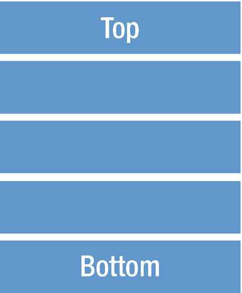
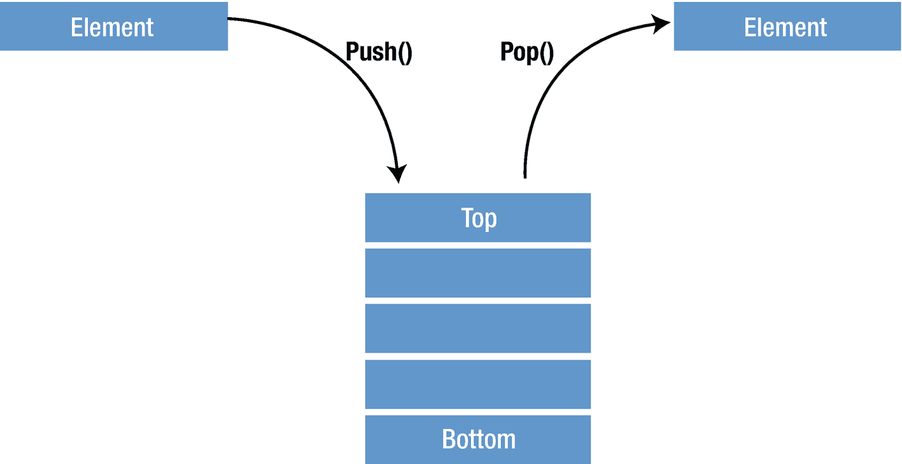

# 4. 栈

栈是一种后进先出 (LIFO) 的数据结构。栈的结构可以想象成一堆垂直堆叠的物体（图 4-1）。在提取这些物体时，最后添加到栈中的物体最先被移除。栈与数组类似，但控制能力有限。



图 4-1 栈结构

栈实现了三种方法。通过使用 `push()` 方法，可以在栈顶添加一个新元素；使用 `pop()` 方法从栈顶移除一个元素；使用 `peek()` 方法返回栈顶元素而不将其移除（图 4-2）。



图 4-2 栈的三种方法

## 在 Swift 中使用栈

有许多应用程序使用栈，例如 Excel 或 Word 中的撤销/重做栈、单词反转、浏览器中的后退/前进、回溯算法、括号检查等等。

让我们继续使用 Swift 来实现它。通过使用 Swift 泛型，我们为栈提供了灵活性，以便我们可以存储任何类型。首先，我们创建一个 `Stack` 结构体，并声明一个使用 Swift 泛型且初始化为空数组的私有数组类型。这个 `items` 数组将用于保存我们栈的值。

```
import Foundation
public struct Stack {
    private var items: [T] = []
}
```

然后我们将继续编写栈所需的三种方法。首先，我们将创建 `push()` 函数。

```
import Foundation
public struct Stack {
    private var items: [T] = []
    //Push 方法
    mutating func push(element: T) {
        items.append(element)
    }
}
```

基本上，我们在这里所做的是通过向数组顶部添加一个元素来追加 `items`。`mutating` 关键字用于允许该方法修改结构体中包含的数据。请注意，压栈操作将新元素放在数组的末尾，而不是开头。在数组的开头插入是一个昂贵的 `O(n)` 操作，因为它需要将所有现有的数组元素在内存中移动。在末尾添加是 `O(1)` 操作；无论数组大小如何，它总是花费相同的时间。

然后，我们将编写 `pop()` 方法，该方法负责从栈中提取数据。

```
import Foundation
public struct Stack {
    private var items: [T] = []
    //Push 方法
    mutating func push(element: T) {
        items.append(element)
    }
    //Pop 方法
    mutating func pop() -> T? {
        return items.popLast()
    }
}
```

数组提供了一个 `popLast()` 方法来移除数组中最顶部的元素，并且它返回一个可选值，这与 `removeLast()` 不同，这就是为什么我们将返回类型声明为可选的 `T?` 的原因。

剩下的唯一方法是 `peek()` 函数。它返回栈的顶部元素。

```
import Foundation
public struct Stack {
    private var items: [T] = []
    //Push 方法
    mutating func push(element: T) {
        items.append(element)
    }
    //Pop 方法
    mutating func pop() -> T? {
        return items.popLast()
    }
    //Peek 方法
    func peek() -> T? {
        return items.last
    }
}
```

## 栈结构

让我们看一个如何使用我们的栈结构的示例。

```
var customStack = Stack()
//使用 push 方法
customStack.push(element: 4)
print(customStack)
customStack.push(element: 8)
print(customStack)
customStack.push(element: 12)
print(customStack)
//使用 peek 方法
print(customStack.peek()!)
//使用 pop 方法
var x = customStack.pop()
print(x!)
x = customStack.pop()
print(x!)
```

输出结果将是

```
Stack(items: [4])
Stack(items: [4, 8])
Stack(items: [4, 8, 12])
```

基本上，我们使用整数类型的 `Stack` 结构体创建了 `customStack`，并使用 `push()` 方法在栈顶插入新元素。每次插入后，我们都会将栈打印到控制台，以查看插入到栈中的元素的顺序，很明显它是从顶部插入的。然后我们使用 `peek()` 方法并将值打印到控制台；可以很容易地看出，返回的是数组的最后一个元素，即顶部元素。最后，我们使用 `pop()` 方法移除顶部的值并返回它，很明显，当您第二次运行它时，由于顶部的元素已被移除，它将返回下一个元素。

## 栈扩展

我们可以为栈添加扩展以扩展其行为和功能。有许多扩展，例如 `CustomStringConvertible`、`ExpressibleByArrayLiteral`、`IteratorProtocol`、`Sequence` 协议等，可以添加到栈中以获得更多功能。通过添加 `CustomStringConvertible` 协议，我们可以根据需要更改打印输出。

```
extension Stack: CustomStringConvertible {
    public var description: String {
        return items.description
    }
}
```

## 总结

在本章中，您学习了栈的一般结构、如何在 Swift 中创建它们，以及如何使用 push、pop 和 peek 方法以及栈扩展。在下一章中，您将学习队列的数据结构类型。


