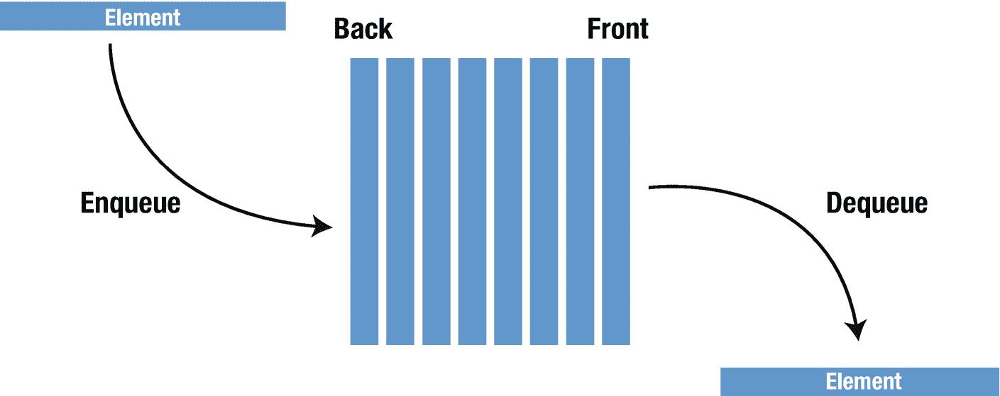
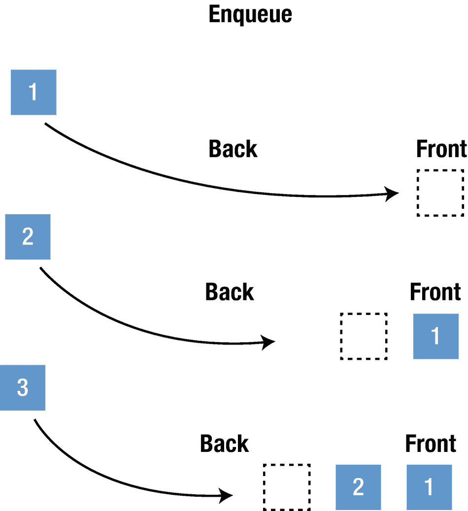

# 5. 队列

队列是一种先进先出（FIFO）的数据结构，意味着先到先服务。它也被称为“等待队列”，顾名思义，可以很容易地想象成一排人正在排队（如图 5-1 所示）。


图 5-1

典型的队列结构

当新人到来时，他会站在队伍的末尾，这正好对应了向队列中添加数据：数据被放置在末尾。使用术语 `enqueue` 来指代向队列中添加元素的操作。当从队列中提取数据时，队列中停留时间最长的数据会被最先移除——术语 `dequeue` 指代从队列中提取数据的操作（如图 5-2 所示）。



图 5-2

入队/出队示例

队列实现了以下几种方法。

*   `enqueue()` – 在队列末尾添加一个元素
*   `dequeue()` – 移除并返回队列中的第一个元素
*   `peek()` – 返回队列中的第一个元素，但不移除它
*   `count` – 返回队列中的元素数量
*   `clear()` – 将队列重置为空状态
*   `isEmpty()` – 如果队列为空则返回 true
*   `isFull()` – 如果队列已满则返回 true

顾名思义，队列用于需要按“先进先出”的顺序管理任何一组对象，同时其他对象等待其轮次的场景。就像下面的示例：

1.  餐厅的销售点系统。很明显，订单必须按照接收的顺序进行处理。当收到订单时，它被写入队列的尾部，而厨师通过设备从队列头部读取订单。这让厨师能够按照接收订单的顺序烹饪食物。
2.  在单个共享资源（如打印机、CPU 任务调度等）上处理请求。
3.  在现实场景中，呼叫中心电话系统使用队列来按顺序保存呼叫者，直到有服务代表空闲。
4.  实时系统中的中断处理。中断按照它们到达的相同顺序进行处理。
5.  MP3 播放器、便携式 CD 播放器和 iPod 播放列表上的缓冲区。自动点唱机播放列表——歌曲添加到末尾，并从列表开头播放。
6.  当编写一个可能被中断（例如，通过鼠标点击或无线连接）的实时系统时，必须在继续当前活动之前立即处理中断。如果中断应该按照它们到达的顺序处理，那么 FIFO 队列就是合适的数据结构。

### 实现

通过使用 Swift 泛型，我们为队列提供了灵活性，使其可以存储任何类型。首先，我们将创建一个队列结构体，并使用一个空的 `T` 类型数组声明一个私有的 Swift 泛型数组。

```
import Foundation
public struct Queue {
    private var data: [T] = []
}
```

然后，我们将添加 `enqueue()` 方法，该方法将新元素追加到队列的末尾。同样，这里的时间复杂度为 **O(1)**。

```
import Foundation
public struct Queue {
    private var data: [T] = []

    //入队方法
    public mutating func enqueue(element: T) {
        data.append(element)
    }
}
```

我们继续声明 `dequeue()` 方法，该方法移除并返回队列中的第一个元素，如果队列为空，则返回 `nil`。

```
import Foundation
public struct Queue {
    private var data: [T] = []

    //入队方法
    public mutating func enqueue(element: T) {
        data.append(element)
    }

    //出队方法
    public mutating func dequeue() -> T? {
        return data.removeFirst()
    }
}
```

另一个可以使用的函数是 `peek()`，它返回队列中的第一个元素而不移除它，同样，如果队列为空，则返回 `nil`。

```
public struct Queue {
    private var data: [T] = []

    //入队方法
    public mutating func enqueue(element: T) {
        data.append(element)
    }

    //出队方法
    public mutating func dequeue() -> T? {
        return data.removeFirst()
    }

    //查看方法
    public func peek() -> T? {
        return data.first
    }
}
```

我们甚至可以更进一步，声明前面提到的辅助函数。辅助函数的完整代码如下——`count`、`clear()`、`isEmpty()` 和 `isFull()`：

```
import Foundation
public struct Queue {
    private var data: [T] = []

    //入队方法
    public mutating func enqueue(element: T) {
        data.append(element)
    }

    //出队方法
    public mutating func dequeue() -> T? {
        return data.removeFirst()
    }

    //查看方法
    public func peek() -> T? {
        return data.first
    }

    // 清空
    public mutating func clear() {
        data.removeAll()
    }

    //计数
    public var count: Int {
        return data.count
    }

    //容量将用于 isFull() 方法
    public var capacity: Int {
        get {
            return data.capacity
        }
        set {
            data.reserveCapacity(newValue)
        }
    }

    //isFull 方法
    public func isFull() -> Bool {
        return count == data.capacity
    }

    //isEmpty() 方法
    public func isEmpty() -> Bool {
        return data.isEmpty
    }
}
```

以下代码和图 5-3 演示了一个使用队列方法的现实示例：



图 5-3

使用队列方法

```
var cusTomQueue = Queue()
cusTomQueue.enqueue(element: 1)
cusTomQueue.enqueue(element: 2)
cusTomQueue.enqueue(element: 3)
print(cusTomQueue)
```

输出将是

```
Queue(data: [1, 2, 3])
```

为了打印出合适的输出，需要添加 `CustomStringConvertible` 扩展。

```
extension Queue: CustomStringConvertible {
    public var description: String {
        return data.description
    }
}
```

在这种情况下，输出将是

```
[1, 2, 3]
```

使用 `dequeue()` 和 `peek()` 函数

```
print(cusTomQueue.dequeue())
print(cusTomQueue.peek())
```

输出将是

```
Optional(1)
Optional(2)
```

## 结论

在本章中，你了解了队列的通用结构，如何在 Swift 中创建它们，以及如何使用 `enqueue`、`dequeue` 和 `peek` 方法。在下一章中，你将学习链表这种数据结构类型。


