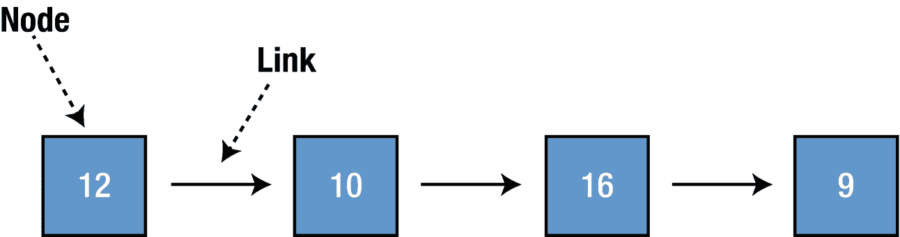
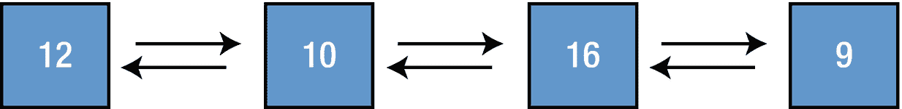
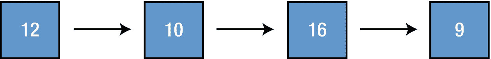
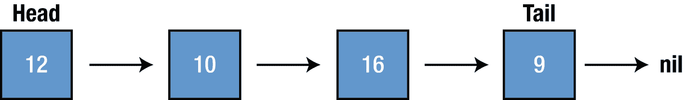

# 6. 链表

链表是一种数据结构，用于保存一组表示序列的数据项。其中每个数据项被称为一个节点。节点包含数据，并通过其链接与序列中的下一个节点相连。更复杂的链表形式会添加额外的链接。链表的主要优势在于快速的插入和删除操作。链表与数组一样是线性数据结构，但与数组不同，元素并非存储在连续的内存位置。与数组类似，链表也是一种线性数据结构（图 6-1）。



图 6-1

线性数据结构

链表主要有两种类型：*单向链表*（图 6-2），其中每个节点只包含指向下一个节点的引用；以及*双向链表*（图 6-3），其中每个节点包含指向前一个和下一个节点的引用。



图 6-3

双向链表



图 6-2

单向链表

链表的开头和结尾可以使用名为 `head` 和 `tail` 的指针进行追踪（图 6-4）。



图 6-4

追踪开头与结尾

### 实现

为了用 Swift 创建一个 `LinkedList` 数据结构，我们将创建 `Node` 和 `LinkedList` 类，以及几个用于链表操作的函数。由于 Swift 将结构体视为值类型，对值类型捕获 self 是一种危险的做法，应予以避免。当我们创建 `LinkedList` 时，我们使用类，因为它们在 Swift 中属于引用类型。因此，我建议你将 `Node` 创建为类，并利用 Swift 中的各种访问说明符来实现你所需的抽象。

### 节点

如前所述，链表由节点组成，因此，首先我们需要使用 Swift playground 创建一个节点类。这里我们将再次使用 Swift 泛型以增加灵活性。

```
public class Node {
public var value : nodeType
public var next : Node?
public init(value: nodeType) {
self.value = value
}
}
extension Node: CustomStringConvertible {
public var description: String {
guard let next = next else {
return "\(value)"
}
return "\(value) -> " + String(describing: next) + " " }
}
```

每个节点都关联一个值，并有一个指向下一个节点的指针；这就是我们之前声明两个变量的原因，并且此 `Node` 是用于 `SinglyLinkedList` 的。

## 单向链表

现在我们有了创建 `Node` 所需的一切。为了创建和修改我们的 `LinkedList`，并追踪列表的开头和结尾，我们将添加一个新的 `LinkedList` 类。首先，我们将创建 `SinglyLinkedList` 类，然后在本章后面继续创建 `DoublyLinkedList` 类。

```
public class SinglyLinkedList {
public var head: Node?
public var tail: Node?
public var isEmpty: Bool {
return head == nil
}
}
extension SinglyLinkedList: CustomStringConvertible {
public var description: String {
guard let head = head else {
return "Empty list"
}
return String(describing: head)
}
}
```

`isEmpty` 是一个属性，用于检查 `LinkedList` 是否为空。

## 向链表添加新值

可以通过两种方法向列表添加新值，这两种方法在性能上有所区别。

> `append` – 在列表末尾添加新值

> `insert(value:, index:)` – 在指定位置插入元素

### 追加

此函数向列表末尾添加一个新 `Node`。让我们将以下代码添加到 `SinglyLinkedList` 类中：

```
public func append(value: listType) {
let newNode = Node(value: value)
if var h = head {
while h.next != nil {
h = h.next!
}
h.next = newNode
} else {
head = newNode
}
}
```

我们在这里做的是创建一个头部的临时引用，并检查头部的下一个引用，当它为 nil 时，我们就到达了 `LinkedList` 的末尾；然后我们将最后一个 `Node` 的 next 设置为 `newNode`。

例如：如果我们创建一个新的 `LinkedList` 并向其追加新元素，我们会看到每次追加列表时，新元素都会被插入到列表的末尾。

```
var newList = SinglyLinkedList()
newList.append(value: 2)
newList.append(value: 4)
newList.append(value: 6)
newList.append(value: 8)
print(newList)
```

输出结果将是

```
2 -> 4 -> 6 -> 8
```

### 插入

此函数在指定的索引处插入一个元素。让我们将以下代码添加到 `SinglyLinkedList` 类中。

```
func insert(value : listType, index : Int) {
let newNode = Node(value: value)
if (index == 0) {
newNode.next = head
head = newNode
} else {
var prev = head
var cur = head
for _ in 0..<index {
prev = cur
cur = cur?.next
}
newNode.next = prev?.next
prev?.next = newNode
}
}
```

该函数首先检查索引是否为 0，如果是，则通过将 `newNode` 赋值给列表的头部，将其添加到列表的开头。然后，它会在循环内找到指定索引的前一个节点和当前节点，并将 `newNode` 赋值到指定位置。

例如：我们将使用之前创建并追加了元素的列表 (**2 -> 4 -> 6 -> 8**)，以升序插入奇数值。

```
print("newList: \(newList)")
newList.insert(value: 1, index: 0)
print("1 has been added to index 0: \(newList)")
newList.insert(value: 3, index: 2)
print("3 has been added to index 2: \(newList)")
newList.insert(value: 5, index: 4)
print("5 has been added to index 4: \(newList)")
```

输出结果将是

```
newList: 2 -> 4 -> 6 -> 8
1 has been added to index 0: 1 -> 2 -> 4 -> 6 -> 8
3 has been added to index 2: 1 -> 2 -> 3 -> 4 -> 6 -> 8
5 has been added to index 4: 1 -> 2 -> 3 -> 4 -> 5 -> 6 -> 8
```

## 从链表中移除值

从链表中移除节点主要有两种方法：

1.  `removeLast` – 移除列表末尾的值

2.  `remove(at:)` – 移除列表中的任意值

### removeLast

如前所述，它移除位于 `LinkedList` 末尾的元素，尽管我们可以访问尾节点，但如果没有对前一个节点的引用，就无法删除它。让我们将以下代码添加到我们的 `LinkedList` 类中：

```
public func removeLast() -> listType? {
if let h = head {
if h.next == nil {
defer {
head = nil
tail = nil
}
return h.value
}
var prev = h
var curr = h
while let next = curr.next {
prev = curr
curr = next
}
prev.next = nil
tail = prev
return curr.value
} else {
return nil
}
}
```

首先，我们检查 `head` 是否为 `nil`；如果是，我们**返回** `nil`——这就是第一个 **if** 语句的作用。然后，下一个 **if** 检查列表是否只包含一个节点；我们在 `defer` `{}` 中移除该节点。我们继续搜索下一个节点，直到 `curr.next` 为 `nil`，以找到列表中的最后一个节点；由于当前节点是最后一个节点，因此通过将 `prev.next` 设置为 nil，我们断开了最后一个节点与列表的连接。


