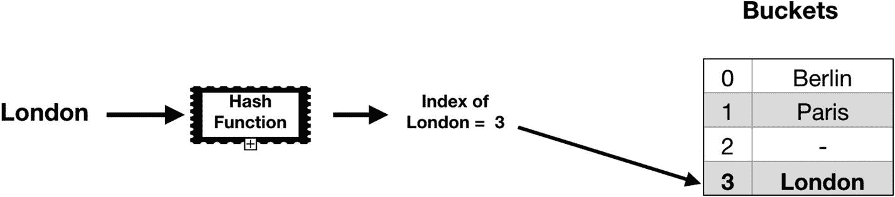

# 7. 哈希表

*哈希表*是一种"关联数组"类型的数据结构，它将值分组到索引中，并通过键/值映射来排序和检索数据。在某些场景下（如 Swift 字典），它实现了相同的功能。然而，哈希表的效率高于字典。其搜索、插入和删除的时间复杂度平均为 O(1)，这意味着无论输入规模如何，操作时间都保持恒定。这解决了线性搜索操作成本高且时间复杂度为 O(n) 的问题。通过计算哈希值，我们可以找到索引，将值存入该索引，并据此检索值。

哈希表由两部分组成：索引和值。索引是通过计算得到的一组数字或字符序列，这与字典不同。创建唯一哈希的过程称为哈希算法或哈希函数。

图 7-1 展示了伦敦（London）城市的输入始终产生哈希结果 3。这些值存储在桶中，它们的位置由哈希函数计算得出。哈希函数是一种可以将任意大小的数据集映射到固定大小数据集的函数，映射后的数据落入哈希表中。



图 7-1 哈希算法

由于排序和检索的时间复杂度均为 O(1)，哈希表非常适合处理数据集不断增长的数据库场景。

不推荐在需要遍历大量数据的情况下使用哈希表。

## 创建哈希表

首先，使用带有泛型参数 K（键）和 V（值）的类来创建哈希元素。由于键必须是可哈希的（Hashable），我们需要确保 K 符合 Hashable 协议。

```
class HashElement {
var key: K
var value: V?
init(key: K, value: V?) {
self.key = key
self.value = value
}
}
```

然后，我们将为哈希表定义一个桶结构。如前所述，桶是一组值的集合，由于元素将以非连续方式存储，我们必须为集合定义大小。我们使用类型别名（type aliases）为哈希元素提供新名称，这能使代码更具可读性且更清晰。在 Swift 中，实现如下：

```
class HashTable {
typealias Bucket = [HashElement]
var buckets: [Bucket]
init(capacity: Int) {
assert(capacity > 0)
buckets = Array(repeatElement([], count: capacity))
}
}
```

最后，我们需要创建一个用于计算索引的函数。通过使用 `unicodeScalars`，我们可以获得一个一致的值，并用哈希函数进行计算，然后根据桶数量对该值取模。

```
func index(for key: K) -> Int {
var divisor: Int = 0
for key in String(describing: key).unicodeScalars {
divisor += abs(Int(key.value.hashValue))
}
return abs(divisor) % buckets.count
}
```

### 从哈希表中检索数据

为了使用给定键检索值，我们将创建一个返回可选值的方法。这是因为如果该键没有对应的值，它将返回 nil。

```
func retrieveValue(for key: K) -> V? {
let index = self.index(for: key)
for element in buckets[index] {
if element.key == key {
return element.value
}
}
return nil
}
```

这里需要做的第一件事是，使用 `index` 函数根据给定键查找元素的索引。然后，我们遍历桶数组以找到对应元素的值并返回；否则返回 nil。


### 更新哈希表中的值

要更新哈希表中的值，我们需要创建一个可修改的函数，以便能够修改哈希表结构的属性。在 Swift 中，结构体是值类型，值类型的属性不能被修改；要修改它们，我们必须在实例方法中使用 `mutating` 关键字。然后我们计算索引，使用 `enumerated()` 方法遍历 buckets 数组，用新值替换旧值并返回 `oldValue`。在这种情况下使用 `enumerated()` 方法非常有用，因为它可以在遍历每个元素的同时，告诉我们元素在数组中的位置。如果元素在数组中不存在，我们就将其追加到数组末尾，并返回 `nil`。

```swift
mutating func updateValue(_ value: V, forKey key: K) -> V? {
    var itemIndex: Int
    itemIndex = self.index(for: key)
    for (i, element) in buckets[itemIndex].enumerated() {
        if element.key == key {
            let oldValue = element.value
            buckets[itemIndex][i].value = value
            return oldValue
        }
    }
    buckets[itemIndex].append(HashElement(key: key, value: value))
    return nil
}
```

### 从哈希表中删除值

这里我们再次创建了一个可修改的函数，根据计算出的索引，遍历 buckets 数组，使用 `if` 条件查找值，然后根据从 `enumerated()` 方法获得的索引将其删除。

```swift
mutating func removeValue(for key: K) -> V? {
    let index = self.index(for: key)
    for (i, element) in buckets[index].enumerated() {
        if element.key == key {
            buckets[index].remove(at: i)
            return element.value
        }
    }
    return nil
}
```

## 总结

在本章中，你学习了哈希表的一般结构、如何在 Swift 中创建哈希表，以及如何使用检索、更新和删除哈希表中的元素。在下一章中，你将学习树这种数据结构类型。

