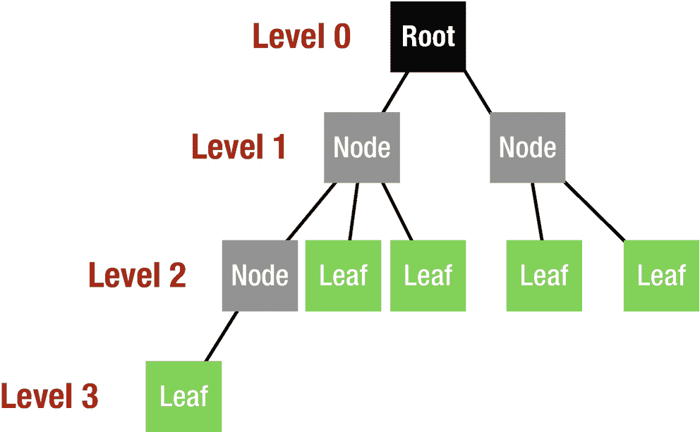
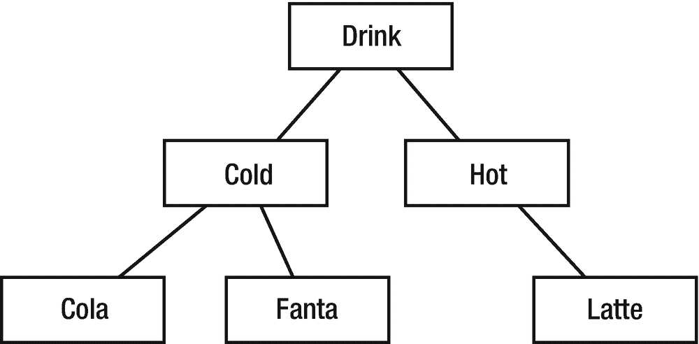

# 8. 树

树是一种非线性数据结构，其元素之间具有层次关系；它基本上与现实生活中的树是颠倒的。树有很多种类型，形状和大小各异。在本章中，你将学习使用和实现树的基础知识。树由节点组成，最顶层的节点称为根节点。每个节点都保存着数据以及对其子节点的引用，如果一个节点没有子节点，则称为叶子节点。图 8-1 展示了一个三层结构的树形图。根节点是第 0 层，随着你向树的深度移动，层级每次增加 1。



图 8-1 — 树的三层结构

一个节点拥有的子节点总数称为度。拥有相同父节点的节点称为兄弟节点，它们之间通过边相连。

树的主要应用包括：

- 处理层次化数据
- 使信息易于搜索
- 处理排序的数据列表
- 作为合成数字图像以产生视觉效果的工作流
- 路由算法
- 多阶段决策的形式

## 创建

如前所述，树由节点组成，每个节点都有一个与之关联的值。此外，每个节点需要一个子节点列表，并且每个节点也方便地拥有指向其父节点的链接。每个节点有一个父节点，但可以有多个子节点；因此子节点将声明为一个数组。

```swift
class Node {
    var data: T
    weak var parent: Node?
    var children: [Node] = []
    init(data: T) {
        self.data = data
    }
}
```

我们在这里所做的是在 `init()` 方法中设置节点的数据，并且由于一个节点可以有多个子节点，因此声明了由节点组成的 children 数组。我们将父节点的引用设置为 `weak var`，以防止导致内存泄漏的强循环。

最后，由于我们的树类型是泛型类型，我们需要一个打印树的方法。通过在 `Node` 类中添加以下代码，我们可以定义打印方法：

```swift
func printNodeData() -> [String] {
    return ["\(self.data)"] + self.children.flatMap{$0.printNodeData()}.map{"    "+$0}
}
func printTree() {
    let text = printNodeData().joined(separator: "\n")
    print(text)
}
```

我们通过将数据包含在 `"\()"` 中将其转换为字符串，并使用标准的 `flatMap` 和 `map` 方法来正确打印节点数据。

### 插入

我们将声明 `add(child:)` 方法来处理对树的插入操作。

```swift
func add(child: Node) {
    children.append(child)
    child.parent = self
}
```

我们将子节点追加到由节点组成的 children 数组中，并设置子节点的父节点。为了理解这个添加方法的工作原理，我们在 playground 中（类定义外部）编写以下代码：

```swift
let drinks = Node(data: "Drinks")
let type1 = Node(data: "Cold")
let type2 = Node(data: "Hot")
drinks.add(child: type1)
drinks.add(child: type2)
type2.add(child: Node(data: "Latte"))
type1.add(child: Node(data: "Cola"))
type1.add(child: Node(data: "Fanta"))
drinks.printTree()
```

输出结果将是：

```
Drink
Cold
Cola
Fanta
Hot
Latte
```

层次结构是树结构的天然候选，因此我们在这里定义了六个不同的节点，并将它们组织成一个逻辑层次。这种排列对应于图 8-2 所示的结构。



图 8-2 — 示例树

### 搜索数据

在 `Node` 类中添加以下方法，用于我们声明的树数据结构的搜索算法。此方法在树中搜索一个值，如果数据存在于树中，则返回与该值关联的节点；否则返回 `nil`。如果数据在当前节点中找到，我们返回 `self`，即当前节点。代码的下一行遍历 children 数组，每次调用每个子节点的搜索方法，该方法将递归地遍历所有子节点，如果任何节点匹配，它将返回该节点。最后，如果没有数据匹配，我们返回 `nil`。

```swift
func search(element: T) -> Node? {
    if element == self.data {
        return self
    }
    for child in children {
        if let result = child.search(element: element) {
            return result
        }
    }
    return nil
}
```

让我们在类定义外部的 playground 中尝试一下。

```swift
let latte = drinks.search(element: "Latte")
if let result = latte {
    result.printTree()
}
```

输出结果将是：

```
Latte
```

如前所述，当你在树中进行搜索时，会遍历子节点。这种遍历与普通的遍历不同，稍微有些复杂。

树数据结构有不同的类型，其中一些将在接下来的章节中讨论。

- 字典树
- 二叉树
- 红黑树
- R 树

## 结论

在本章中，你学习了树的一般结构、如何在 Swift 中实现它，以及如何为它声明、搜索和添加方法。在接下来的章节中，你将了解更多不同类型的树数据结构。

