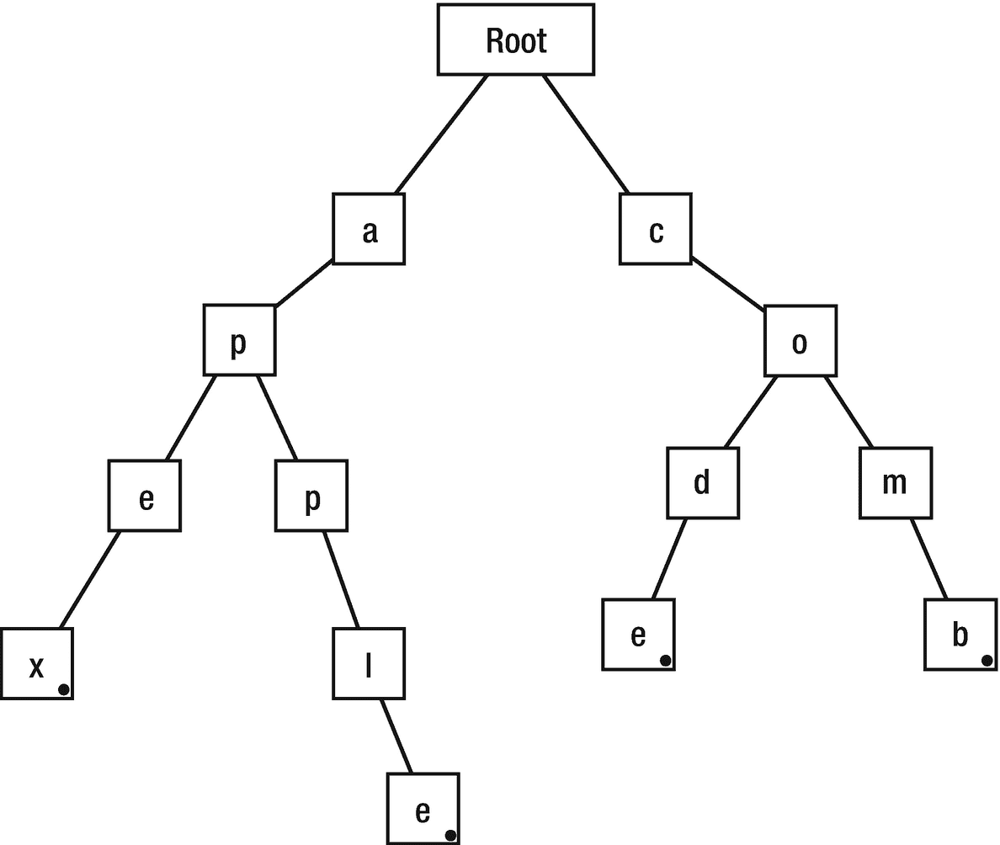
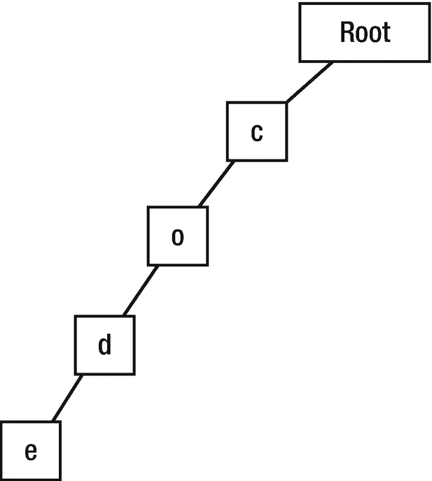
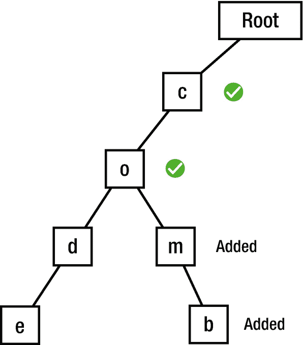

# 9. 字典树数据结构

在本章中，我们将回顾字典树（发音为 "try"）数据结构以及如何使用 Swift 实现它。字典树是一种基于树的数据结构，它以层次结构组织信息。虽然大多数其他结构被设计用于处理通用数据，但字典树通常用于字符串 —— 它用于以支持快速查找的方式存储单词。由于字典树在每个节点存储字符，因此它对于英语中的前缀匹配非常高效。


## 为什么需要 Trie？

`Trie`（字典树）在存储英语词汇时非常实用，它具有以下可能完美替代哈希表数据结构的优势：

- 更好的最坏情况时间复杂度
- 无键冲突
- 无需哈希算法
- 按字母顺序排列

此外，如果使用数组处理超过一千个单词，搜索特定单词的复杂度为 `O(k∗n)`，其中 `k` 代表最长字符串，`n` 代表需要检查的单词数量。字典树结构解决了这个问题：由于每个节点可以表示单个字符，它通过从根节点到目标节点追踪字符集合的方式来构建单词。

## 工作原理

如前所述，字典树按层级组织数据，每个字符串的最后一个节点被标记为 `finalNode`。让我们通过构建一个示例字典来了解字典树的工作方式。假设我们有四个单词：`apple`、`apex`、`code` 和 `comb`，那么对应的字典树结构如图 9-1 所示。



图 9-1：字典树结构示例

可以看到，多个单词可以共享相同的字母，字典树结构的组织方式提升了其性能。为了说明字典树的性能优势，请考虑以下示例：我们需要查找前缀为 `CO` 的单词。显然，首先需要进入包含 `C` 的节点，这排除了字典树的其他分支，使搜索速度更快。接着，找到下一个字母为 `O` 的单词并转移到该节点，再次排除其他分支。由于这是前缀的末尾，字典树将返回 `O` 节点的所有分支。在本例中，结果将是 `code` 和 `comb`。假设字典树中有数千个单词，那么被排除的分支数量非常可观，这减少了比较次数，从而实现了更快的搜索。

### 实现

首先需要创建一个 `TrieNode`，就像之前为其他数据结构所做的那样。打开 Xcode 并创建一个名为 `Trie.swift` 的新 playground 文件，然后插入以下代码：

```
public class TrieNode {
    var value: K?
    weak var parent: TrieNode?
    var children: [K: TrieNode] = [:]
    var isFinal = false
    init(value: K? = nil, parent: TrieNode? = nil) {
        self.value = value
        self.parent = parent
    }
}
```

首先创建一个 `value` 变量，其类型为 `K`，用于保存节点的数据。由于字典树的根节点没有键，我们将此变量声明为可选类型。然后，`parent` 节点使用 `weak` 引用声明为 `TrieNode` 类型；这是为了后续实现 `remove` 方法。第三行中，我们将 `children` 创建为字典类型，因为字典树中的节点可包含多个分支。`isFinal` 用于标识字符串的结尾。

接下来要创建 `Trie` 本身。按照以下代码所示创建一个新类：

```
public class Trie {
    private let rootNode: TrieNode
    init() {
        rootNode = TrieNode()
    }
}
```

这里我们使用 `Character` 类型为 `Trie` 声明了一个 `rootNode`，因为我们要为英语实现字典树。在 `init` 方法内部，初始化了一个空的 `TrieNode`。

### 插入

字典树在插入值方面非常高效，因为它总是重用现有节点。例如，`code` 和 `comb` 共享相同的 `C` 和 `O` 节点。要为 `Trie` 插入新节点，请在 `Trie` 类中创建以下 `insert` 方法：

```
func insert(word: String) {
    guard !word.isEmpty else { return }
    var curNode = rootNode
    let characters = Array(word.lowercased())
    var curIndex = 0
    while curIndex < characters.count {
        let character = characters[curIndex]
        if let child = curNode.children[character] {
            curNode = child
        } else {
            curNode.children[character] = TrieNode(value: character, parent: curNode)
            curNode = curNode.children[character]!
        }
        curIndex += 1
        if curIndex == characters.count {
            curNode.isFinal = true
        }
    }
}
```

这里，首先检查字符串是否为空，如果为空则无需插入。然后创建一个指向 `rootNode` 的引用，用于创建新节点。由于每个节点包含一个字母，我们将传入的字符串转换为字符数组。使用 `curIndex` 变量跟踪对 `characters` 数组的迭代过程。当它达到 `characters` 数组的长度时，迭代停止。在 `if` 条件中，我们检查要插入的字符是否已存在于 `children` 中；如果是，则将 `curNode` 引用移动到下一个节点，无需进行插入。否则，将 `character` 添加到当前 `children` 字典中，并将 `curNode` 引用移动到新节点。

显然还需要标记单词的结尾，节点的 `isFinal` 属性负责实现这一功能。

### 查询

此函数负责检查给定单词是否存在于 `Trie` 中，如果存在则返回 `true`，否则返回 `false`。它与**Insert**方法非常相似，但这里不再创建节点，而是仅检查节点的存在性，并且 `isFinal` 值必须为 `true` 才能返回 `true`。让我们将以下代码写入 `Trie` 类中，并观察其工作原理：

```
func query(word: String) -> Bool {
    let characters = Array(word.lowercased())
    var node : TrieNode? = rootNode
    for character in characters {
        node = node?.children[character]
        if node == nil {
            return false
        }
    }
    return node!.isFinal
}
```

这里同样从给定单词创建 `characters` 数组并进行遍历；如果 `node` 为 `nil`，则说明搜索的 `character` 不存在，返回 `false`；否则将到达字符串末尾，返回 `isFinal` 的值（即 `true`）。


#### 移除

此方法类似于查询方法，但我们将 `isFinal` 值改为 `false`，这会移除该单词的终止符，由于没有终止符，这个词就不能再被视为 Trie 中的一个单词。让我们在 `Trie` 类中编写此代码：

```
func remove(word: String) {
let characters = Array(word.lowercased())
var node : TrieNode? = rootNode
for character in characters {
node = node?.children[character]
if node == nil {
return
}
}
node!.isFinal = false
}
```

在图 9-2 中，你会注意到，尽管我们从 Trie 中删除了字符串代码，它仍然显示，但只是缺少了终止符。


图 9-2：删除一个元素后的 Trie

让我们通过一个示例来检验这三个方法。首先，使用 `Trie` 类创建一个 Trie，然后使用之前声明的方法，我们向其中插入、查询和移除值。

第一步是声明一个 Trie 数据结构，并使用 `insert` 方法插入节点。

```
var myTrie = Trie()
myTrie.insert(word: "code")
```

在这里，插入操作会检查 "code" 的字母是否存在于节点中；如果不存在，则分别为它们创建新节点（图 9-3）。



图 9-3：步骤 1

然后我们将 comb 这个词插入到 Trie 中；同样，每个字母都会被检查，缺失的字母将被插入（图 9-4）。

```
myTrie.insert(word: "comb")
```



图 9-4：添加 comb

然后，通过使用 `query` 方法，我们可以检查插入的单词是否存在于数据结构中。

```
print(myTrie.query(word: "code"))
myTrie.remove(word: "code")
print(myTrie.query(word: "code"))
```

输出结果将是：

```
true
false
```

这意味着，当我们第一次查询 "code" 时，它存在于 Trie 中，但第二次查询时，它不见了，因为我们使用了 `remove` 方法将其移除了。

## 结论

在本章中，你学习了 Trie 数据结构，它在前缀匹配方面表现出色。你还掌握了如何在 Trie 结构中执行插入、移除和查询操作。

