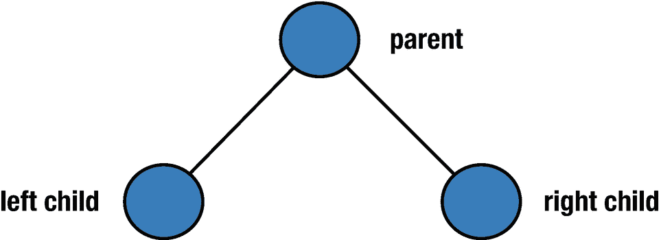
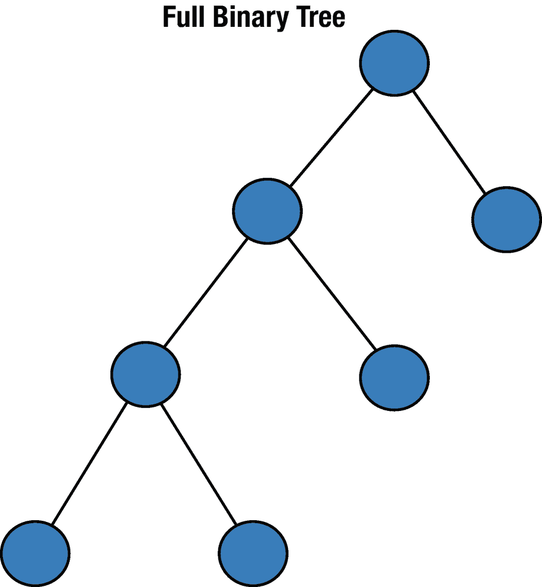
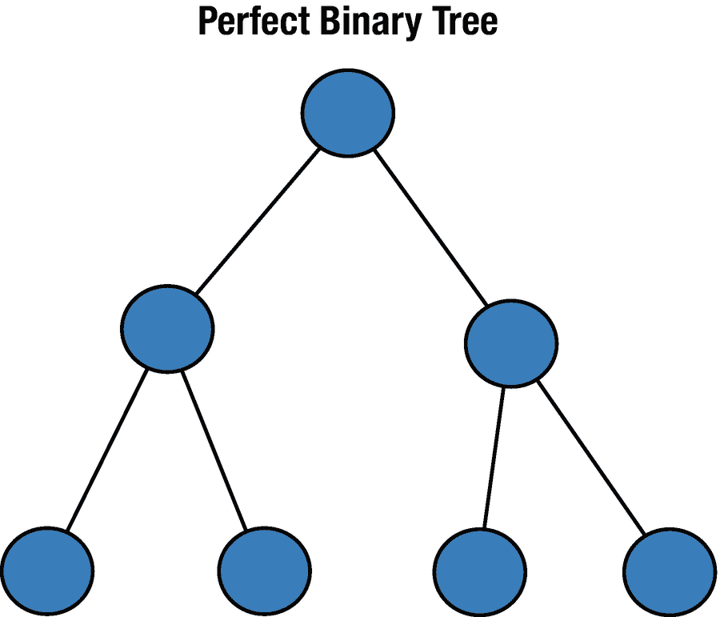
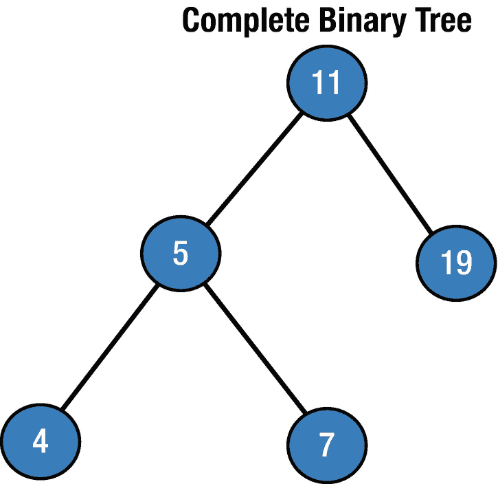
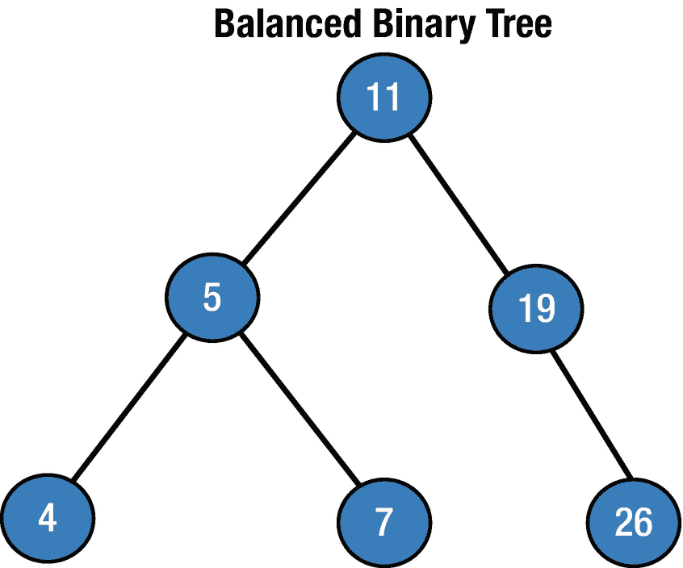
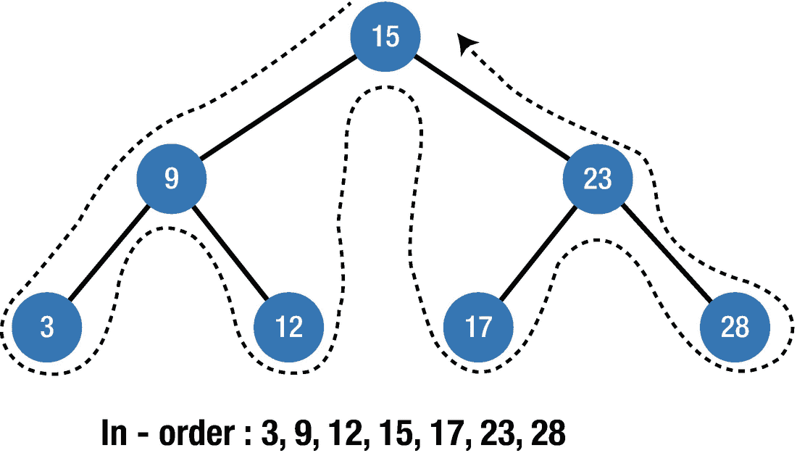
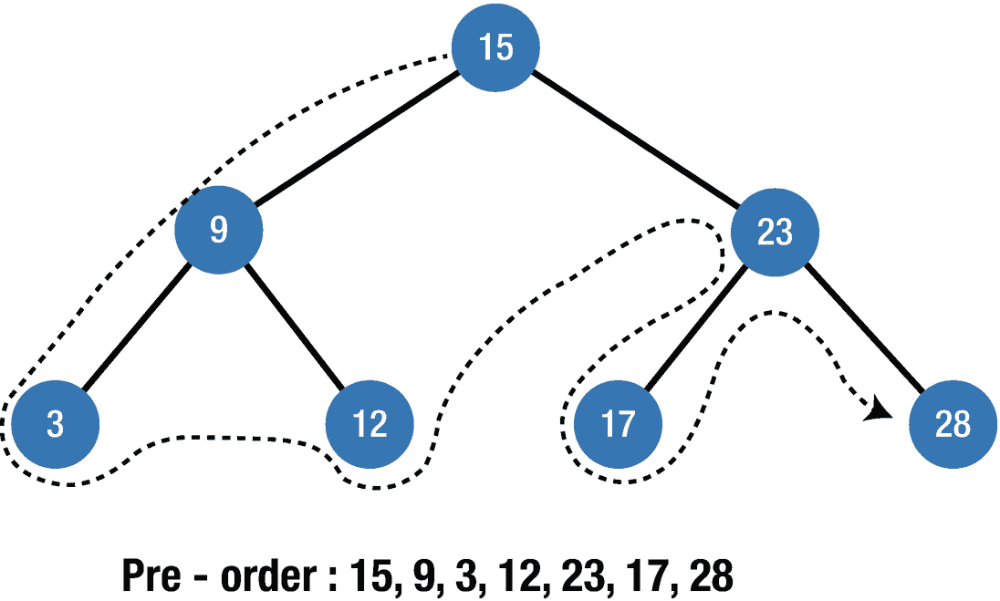
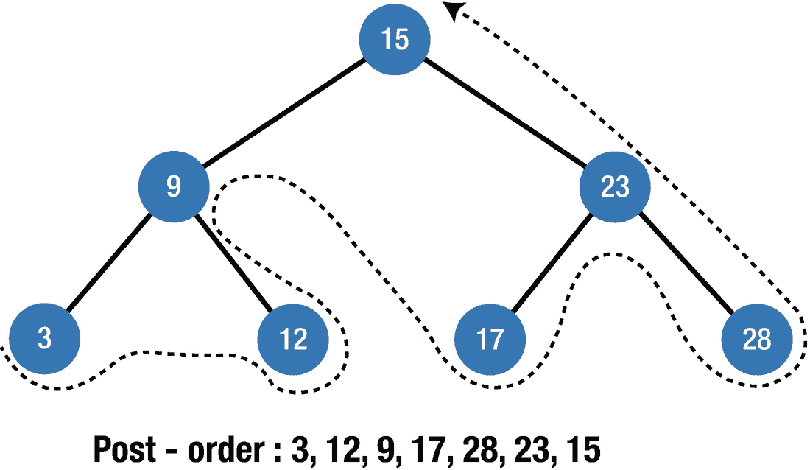

# 10. 二叉树

在上一章中，你学习了基本的树结构，其中每个节点可以有无限个子节点。二叉树是一种树数据结构，其中每个节点最多有两个子节点，通常称为左子节点和右子节点。在本章中，你将学习二叉树数据结构的主要属性以及如何实现它。

## 二叉树入门

二叉树的基本结构如图 10-1 所示。



图 10-1：基本二叉树

在继续介绍二叉树的属性和类型之前，让我们先定义一些与之相关的术语。

- **节点深度** – 从节点到根节点的边的数量。根节点的深度为 0。
- **节点高度** – 从节点到某个叶节点的最长路径上的边的数量。叶节点的高度为 0。
- **树高度** – 从根节点到最远叶节点的距离。

### 二叉树的属性

1.  二叉树第“i”层的最大节点数为 2^(i-1)。

    根节点所在的层级为 1 → 2^(1-1) = 1。由于每个节点最多有两个子节点，下一层的节点数是上一层的两倍，即 2 * 2^(i-1)。

2.  如果二叉树的高度为“h”，则最大节点数为 2^h - 1。树的高度是从根到叶路径上的最大节点数。

3.  在一个每个节点都有零个或两个子节点的二叉树中，叶节点的数量总是比拥有两个子节点的节点数量多一个。

### 二叉树的类型

二叉树是一个简单的概念：它们易于理解，易于实现，并且工作高效、快速。有几种不同类型的二叉树：

1.  **满二叉树**（图 10-2）– 每个节点有零个或两个子节点，但不会只有一个。



图 10-2：满二叉树

2.  **完美二叉树**（图 10-3）– 所有节点都有两个子节点且深度相同。



图 10-3：完美二叉树

3.  **完全二叉树**（图 10-4）– 除最后一层外，所有层都被完全填满，但最后一层的已有节点都位于树的左侧。



图 10-4：完全二叉树

4.  **平衡二叉树**（图 10-5）– 每个叶节点到根节点的距离与任何其他叶节点相比“不超过某个特定值”。



图 10-5：平衡二叉树

### 实现

为了实现二叉树数据结构，我们需要一个节点，该节点必须至少包含以下元素：

- 用于数据容器的键/值
- 对左子节点和右子节点的引用
- 对父节点的引用

因此，让我们定义一个名为 `BTNode` 的类，并在其中添加以下代码：

```
class BTNode {
var value: T
var leftChild: BTNode?
var rightChild: BTNode?
init(_ value: T,_ leftChild: BTNode?,_ rightChild: BTNode?) {
self.value = value
self.rightChild = rightChild
self.leftChild = leftChild
}
}
```

这里我们将类设为泛型，以允许 value 属性中包含任何类型的值。我们的二叉树节点有一个名为 `value` 的属性来存储键数据。此外，它还有两个变量来存储左子节点和右子节点，这是定义二叉树节点所需的最少属性。

## 树的遍历（又称树搜索）

树的遍历是指对树数据结构中的每个节点访问或更新一次的过程。它们根据节点的访问顺序进行分类。与只能按线性顺序遍历的线性数据结构不同，树数据结构可以以多种方式遍历。有几种常见的遍历方式：

- 中序遍历
- 前序遍历
- 后序遍历


### 中序遍历

中序遍历（图[10-6]）首先访问左子节点的值，然后访问当前节点的值，最后访问右子节点的值。如果我们的二叉树是有序的，中序遍历将按升序访问节点。



**图 10-6** – 中序遍历

可以清晰地看到，它会按升序打印节点。

以下函数展示了如何在 Swift 中实现中序遍历，请将以下代码复制到 `BTNode` 类中：

```
func inorderTraversal(_ btNode: BTNode?) {
    guard let _ = btNode else { return }
    self.inorderTraversal(btNode?.leftChild)
    print("\(btNode!.value)", terminator: "  ")
    self.inorderTraversal(btNode?.rightChild)
}
```

首先，我们检查当前节点是否为空，然后通过递归调用中序遍历函数来遍历子树并显示数据。当左子树遍历完成后，我们通过递归调用中序遍历函数来遍历右子树。

让我们看看在前面的例子中它是如何工作的。首先，按之前所示创建树节点，并基于根节点参数调用 `inorderTraversal` 函数。

```
let node3 = BTNode(3,nil,nil)
let node12 = BTNode(12,nil,nil)
let node17 = BTNode(17,nil,nil)
let node28 = BTNode(28,nil,nil)
let node9 = BTNode(9,node3,node12)
let node23 = BTNode(23,node17,node28)
let root = BTNode(15,node9,node23)
let t = BTNode(0,nil,nil)
t.inorderTraversal(root)
```

输出结果将是：

```
3  9  12  15  17  23  28
```

### 前序遍历

前序遍历（图[10-7]）总是从当前节点开始，然后继续访问左子节点和右子节点。



**图 10-7** – 前序遍历

让我们创建前序遍历函数。在 `inorderTraversal` 函数之后，将以下代码复制到 `BTNode` 类中。首先，遍历访问当前节点，然后递归访问左子节点和右子节点。

```
func preorderTraversal(_ btNode: BTNode?) {
    guard let _ = btNode else { return }
    print("\(btNode!.value)", terminator: "  ")
    self.preorderTraversal(btNode?.leftChild)
    self.preorderTraversal(btNode?.rightChild)
}
```

让我们对之前创建的树运行此函数。

```
let t = BTNode(0,nil,nil)
t.preorderTraversal(root)
```

输出结果将是：

```
15  9  3  12  23  17  28
```

### 后序遍历

后序遍历（图[10-8]）首先访问最左侧的节点，然后访问右侧节点，再访问其父节点。之后，它按照相同的规则访问上一个父节点。



**图 10-8** – 后序遍历

让我们在 `BTNode` 类内部创建后序遍历函数。将以下代码复制到该类中，我们将对我们创建的同一个树结构运行它：

```
func postorderTraversal(_ btNode: BTNode?) {
    guard let _ = btNode else { return }
    self.postorderTraversal(btNode?.leftChild)
    self.postorderTraversal(btNode?.rightChild)
    print("\(btNode!.value)", terminator: "  ")
}
```

让我们运行它：

```
let t = BTNode(0,nil,nil)
t.postorderTraversal(root)
```

输出结果将是：

```
3  12  9  17  28  23  15
```

## 总结

在本章中，您学习了二叉树数据结构及其不同类型。您还掌握了可以在二叉树上执行的不同类型的遍历算法。在下一章中，您将学习一种特殊的二叉树——二叉搜索树。

