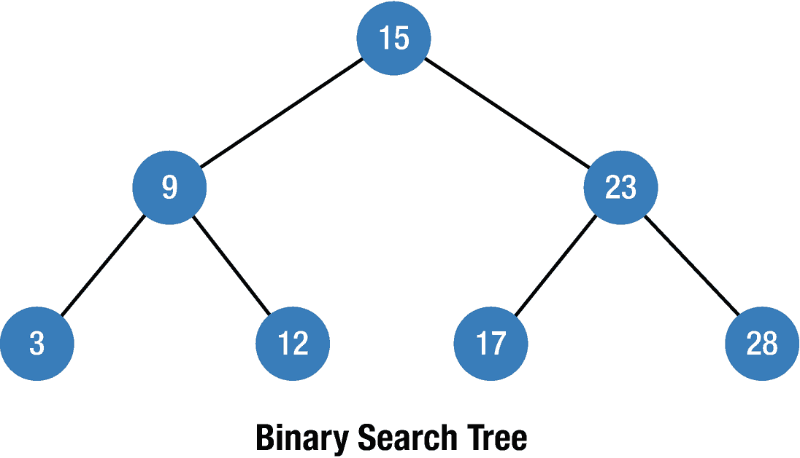
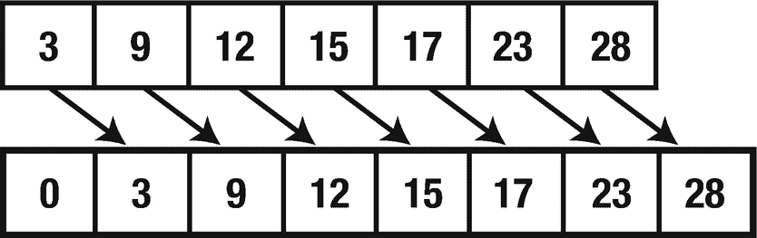
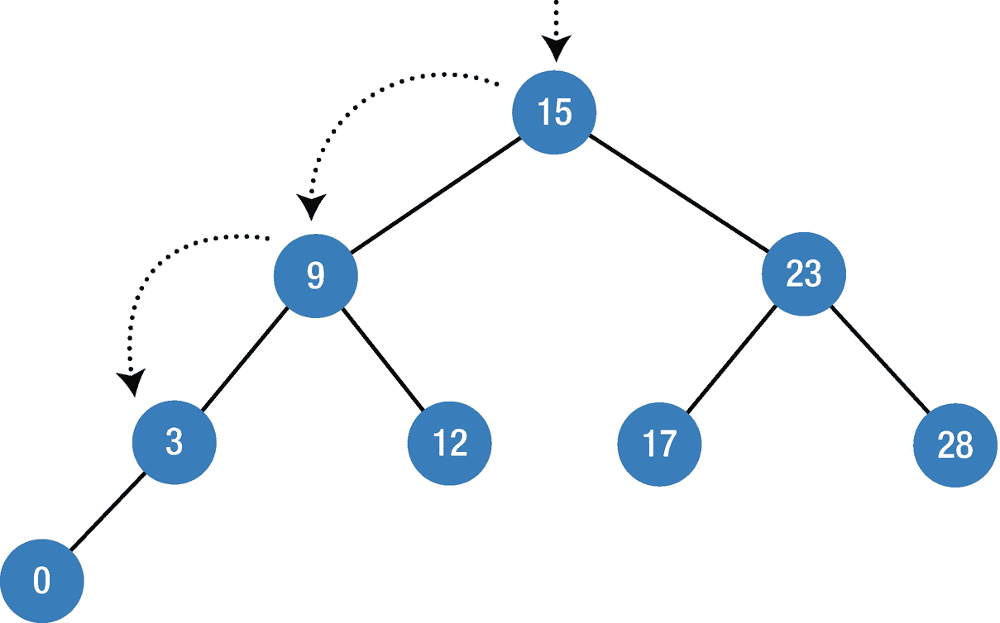
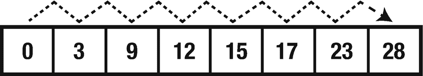
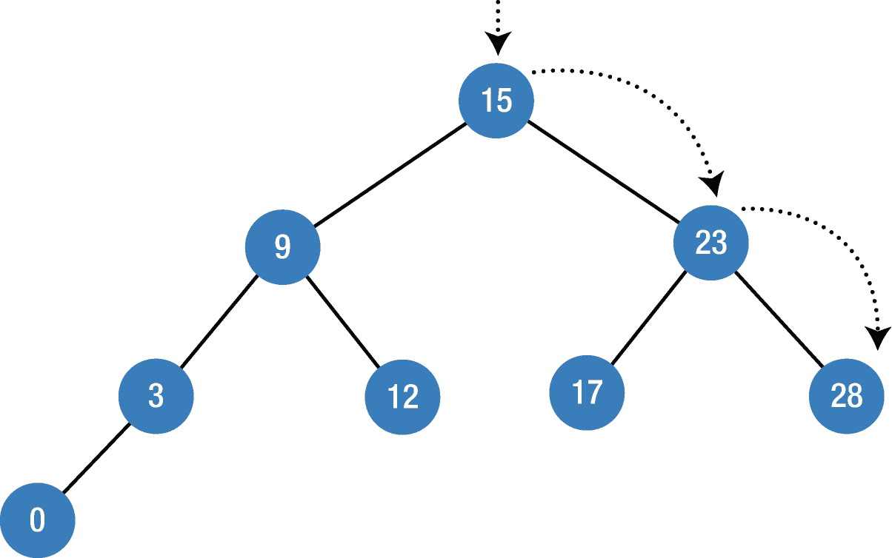
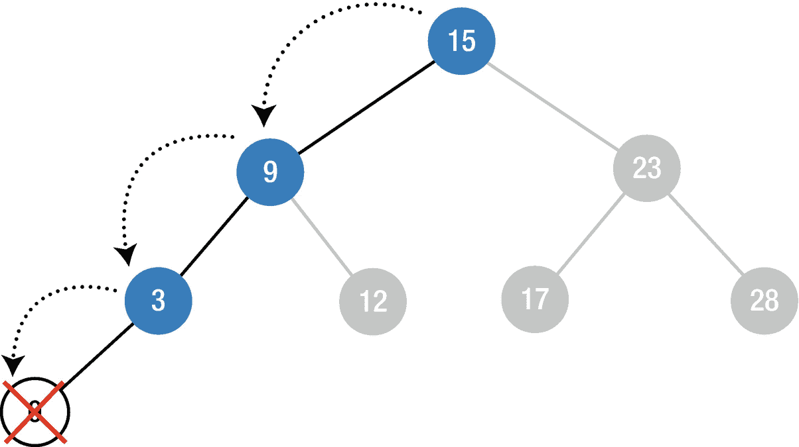
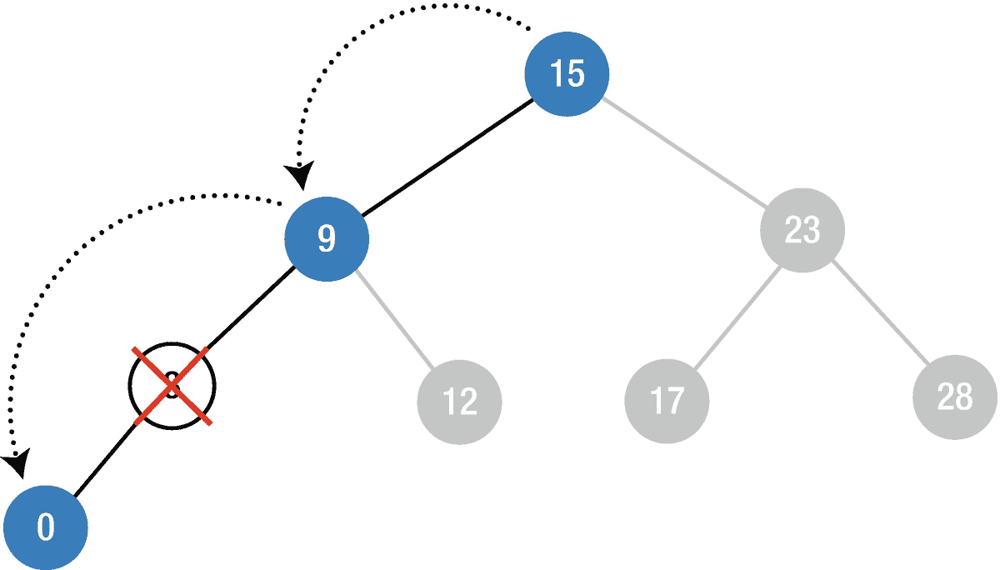
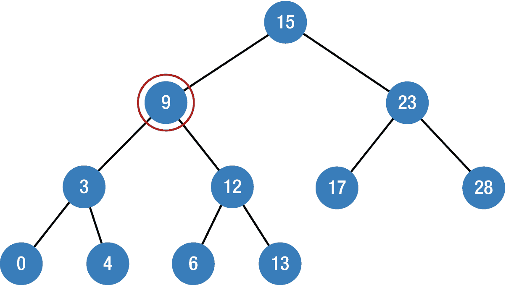
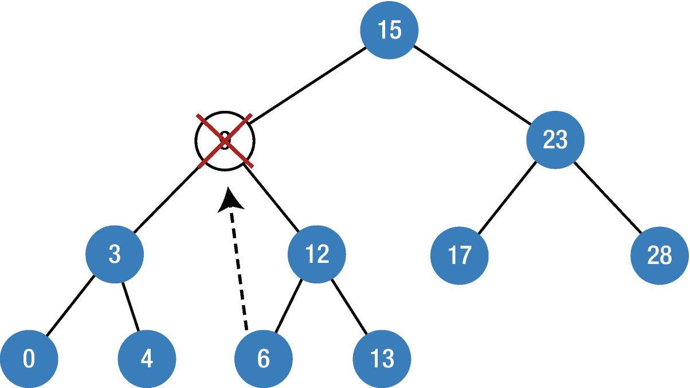

# 11. 二叉搜索树

二叉搜索树（BST）是一种每个节点最多有两个子节点的二叉树，它便于快速执行搜索、插入和删除操作。每个操作的时间复杂度为 `O(log n)`，远快于线性搜索。二叉搜索树的两个主要特征如下：

- 左子节点的值必须小于其父节点的值。
- 右子节点的值必须大于或等于其父节点的值。

图[11-1]展示了二叉搜索树的基本结构。



**图 11-1** – 二叉搜索树的基本结构

二叉搜索树的结构使其在搜索操作中更高效，因为在搜索过程的每一步，算法都基于两个假设：

1. 如果搜索值小于当前节点，则继续搜索左子树。
2. 如果搜索值大于当前节点，则继续搜索右子树。

这两个假设消除了不必要的搜索，并在每一步将搜索路径减少一半，这使其非常高效。

### 实现

首先，我们需要创建 **Node** 和 **Binary Tree Search** 类，这里我们将使用上一章为二叉树创建的 `BTNode` 类。

```
class BTNode {
    var value: T
    var leftChild: BTNode?
    var rightChild: BTNode?
    init(value: T, leftChild: BTNode? = nil, rightChild: BTNode? = nil) {
        self.value = value
        self.leftChild = leftChild
        self.rightChild = rightChild
    }
}
```

基于声明的树节点，我们将创建一个二叉搜索树类。

```
class BinarySearchTree {
    private var rootNode: BTNode?
}
```

该类遵循 **Comparable** 协议以确保类型将使用比较运算符，并使用 **CustomStringConvertible** 协议来描述不同的数据类型。让我们继续为此类添加插入函数。


### 插入

向二叉搜索树（BST）中插入元素遵循前述的两条假设；我们只需找到插入的位置，这是一个`O(log n)`的操作。为了说明二叉搜索树的强大之处，让我们比较一下数组与二叉搜索树的插入性能。假设我们要向一个数组中插入`0`。要在数组中插入一个新元素，首先我们在数组末尾开辟一个额外空间，然后数据逐元素移位，最后才能插入该元素（图 11-2）。



图 11-2

数组插入

在这个例子中，元素零被插入到数组的前端，所有元素都移动了一个位置，这意味着向数组插入的时间复杂度是`O(n)`。

与数组相反，向二叉搜索树插入则更快。基于前述假设，我们只需要三步就能找到元素零的插入位置，如图 11-3 所示，这个过程的时间复杂度是`O(log n)`。



图 11-3

BST 插入示例

```
func insert(insertedValue : T) {
    let inNode = BTNode(value: insertedValue)
    if let rootNode = self.rootNode {
        self.insertNode(rootNode: rootNode, inNode: inNode)
    } else {
        self.rootNode = inNode
    }
}
private func insertNode(rootNode: BTNode, inNode: BTNode) {
    if rootNode.value > inNode.value {
        if let leftChild = rootNode.leftChild {
            self.insertNode(rootNode: leftChild, inNode: inNode)
        } else {
            rootNode.leftChild = inNode
        }
    } else {
        if let rightChild = rootNode.rightChild {
            self.insertNode(rootNode: rightChild, inNode: inNode)
        } else {
            rootNode.rightChild = inNode
        }
    }
}
```

为了让代码更易读，我创建了两个独立的函数，并在`insert`函数内部调用了`insertNode`函数；这就是`insertNode`方法被设为私有的原因。在`insertNode`函数内部，我们首先比较`rootNode`的值与将要插入节点的值。如果`rootNode`的值更大，我们将新节点添加到`leftChild`节点；否则，将其添加到`rightChild`节点。在`insert`函数内部，我们首先检查`rootNode`是否存在，如果存在，则调用`insertNode`方法；否则，将新节点添加为`rootNode`。

### 搜索

搜索的过程与插入类似，符合前述两条假设。唯一的区别是，当节点数据与输入数据匹配时，它返回成功；否则返回无效信息。为了说清楚，让我们比较在数组与 BST 中搜索的差异。要在数组中查找元素`28`，我们需要逐一比较数组中的元素直到找到它，这是`O(n)`的时间复杂度（图 11-4）。



图 11-4

数组搜索

另一方面，BST 的情况则不同。BST 的两条主要假设使我们能够加快搜索过程，如图 11-5 所示。



图 11-5

BST 搜索示例

在 BST 的每一步中，搜索算法都基于两个假设——如果值小于当前节点，则继续向左子树查找；否则，继续向右子树查找。这有助于避免不必要的检查，并使时间复杂度为`O(log n)`。

```
func searchValue(sValue: T) {
    self.searchNode(rootNode: self.rootNode, searchValue: sValue)
}
private func searchNode(rootNode: BTNode?, searchValue: T) {
    guard let rootNode = rootNode else {
        print("The node of \(searchValue) does not exist")
        return
    }
    print("Root Node \(rootNode.value)")
    if searchValue > rootNode.value {
        self.searchNode(rootNode: rootNode.rightChild, searchValue: searchValue)
    } else if searchValue < rootNode.value {
        self.searchNode(rootNode: rootNode.leftChild, searchValue: searchValue)
    } else {
        print("Node found: \(rootNode.value)")
    }
}
```

## 示例

让我们在实际例子中使用`insert`和`search`函数，看看它们如何工作。我们将在循环中调用`insert`函数来插入从`0`到`5`的值，然后使用`search`函数搜索数字`4`。

```
var binaryST = BinarySearchTree()
for i in 0..<5 {
    binaryST.insert(insertedValue: i)
}
binaryST.searchValue(sValue: 4)
```

输出将是：

```
Root Node 0
Root Node 1
Root Node 2
Root Node 3
Root Node 4
Node found: 4
```

### 删除

从二叉搜索树中删除元素时，需要考虑几种情况。

#### 删除叶子节点

删除二叉搜索树中的叶子节点不需要额外的操作；我们只需从树中移除该叶子节点即可（图 11-6）。



图 11-6

BST 删除叶子节点

#### 删除只有一个子节点的节点

要删除只有一个子节点的节点，首先删除该节点，然后需要将子节点重新连接到树的其余部分（图 11-7）。



图 11-7

BST 删除带有一个子节点的节点


#### 删除拥有两个子节点的节点

删除一个拥有两个子节点的节点并非易事。假设我们要删除图 11-8 中树结构的节点 9。



*图 11-8 – 二叉搜索树删除拥有两个子节点的节点*

当我们删除节点 9 时，需要重新连接它的两个子节点（3 和 12），但在其父节点（节点 15）中，我们只有一个子节点的位置。为了解决这个问题，我们会从右子树中取出最小的节点（在本例中是节点 6），用它替换被删除的节点，然后将两个子树重新连接到它上面（图 11-9）。



*图 11-9 – 二叉搜索树删除示例*

在创建删除函数之前，我们需要在二叉树节点（`BTNode`）中声明一个 `min` 变量，以便在删除拥有两个子节点的节点时，能够找到其最小值。请在二叉搜索树类中添加以下代码：

```
extension BTNode {
    var min: BTNode {
        return leftChild?.min ?? self
    }
}

func removeValue(sValue: T) {
    rootNode = removeNode(rNode: rootNode, value: sValue)
}

private func removeNode(rNode: BTNode?, value: T) -> BTNode? {
    guard let node = rNode else {
        return nil
    }
    if value == node.value {
        if node.leftChild == nil && node.rightChild == nil {
            return nil
        }
        if node.leftChild == nil {
            return node.rightChild
        }
        if node.rightChild == nil {
            return node.leftChild
        }
        node.value = node.rightChild!.min.value
        node.rightChild = removeNode(rNode: node.rightChild, value: node.value)
    } else if value < node.value {
        node.leftChild = removeNode(rNode: node.leftChild, value: value)
    } else {
        node.rightChild = removeNode(rNode: node.rightChild, value: value)
    }
    return node
}
```

在 `removeNode` 方法内部，我们首先检查待删除的节点是否存在，然后继续检查前面的各种情况。首先，`if` 条件检查该节点是否没有子节点，如果是则返回 `nil`，这意味着删除当前节点。`if node.leftChild == nil` 和 `if node.rightChild == nil` 条件用于检查左子节点或右子节点是否存在，如果存在则将它们重新连接到树上，这正是我们提到的第二种情况。接着，我们找到最小值并将其重新连接到树上。

让我们看看它是如何工作的。

```
var binaryST = BinarySearchTree()
for i in 0..<5 {
    binaryST.insert(insertedValue: i)
}
binaryST.searchValue(sValue: 4)
binaryST.removeValue(sValue: 4)
binaryST.searchValue(sValue: 4)
```

输出结果将是：

```
Root Node 0
Root Node 1
Root Node 2
Root Node 3
Root Node 4
Node found: 4
Root Node 0
Root Node 1
Root Node 2
Root Node 3
The node of 4 does not exist
```

如你所见，在对节点 4 调用删除函数后，它在树中已不复存在。

## 本章小结

在本章中，你学习了二叉搜索树，以及如何实现诸如搜索、插入和删除等多种方法。在处理有序数据时，二叉搜索树是一种性能非常强大的数据结构。在下一章中，你将学习另一种类型的树——红黑树。

