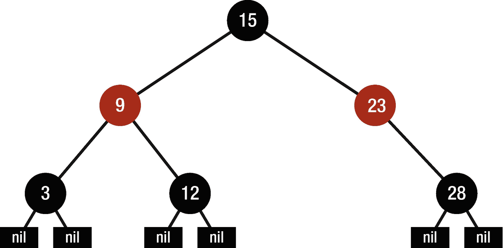
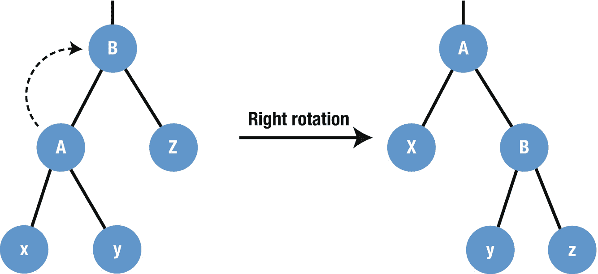
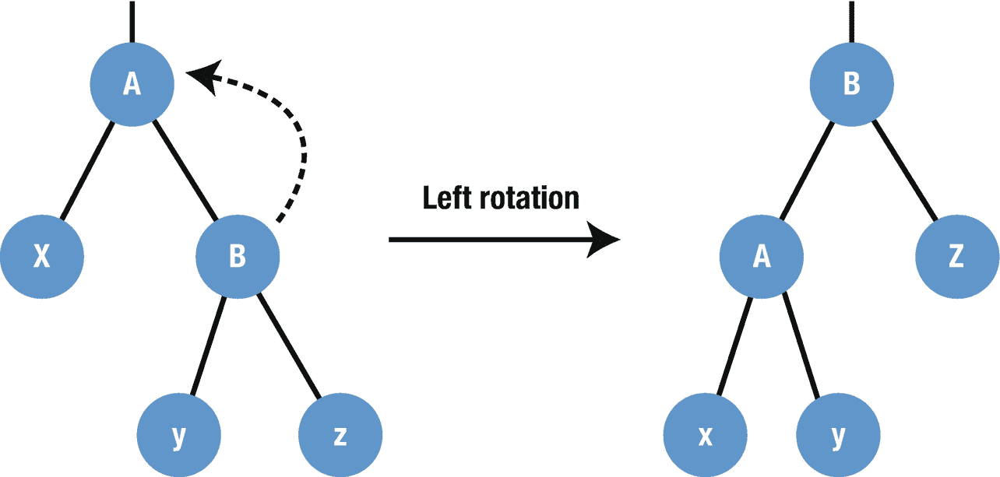
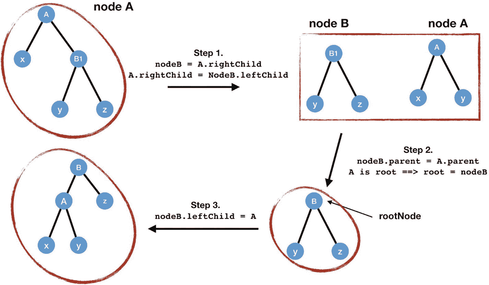
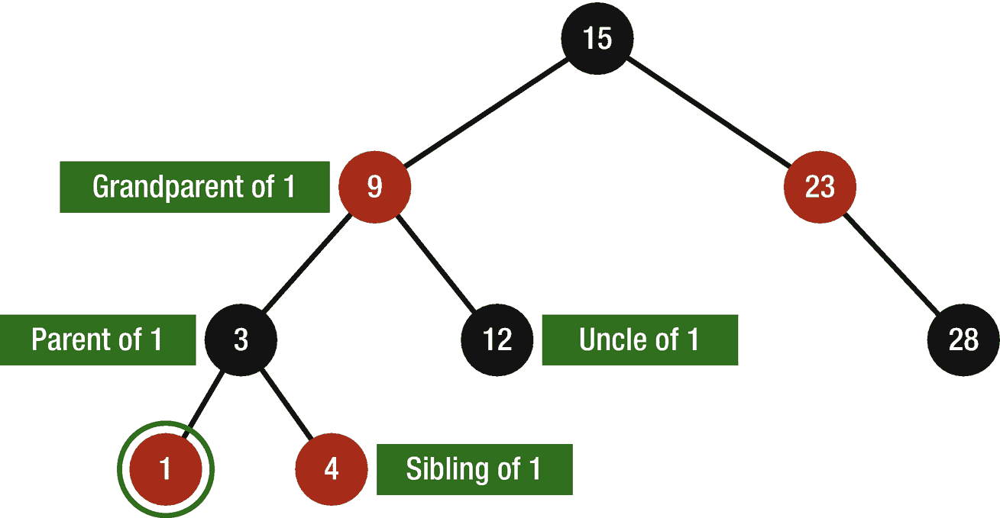
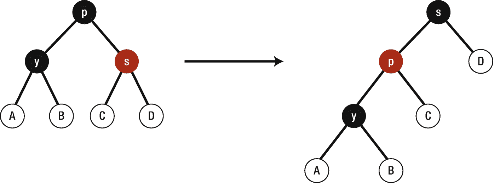
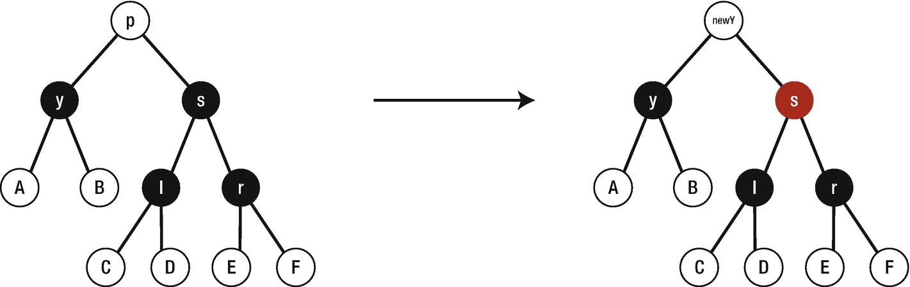
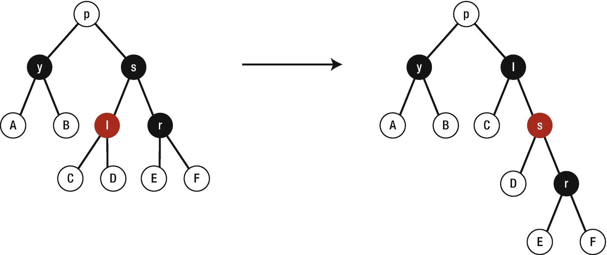
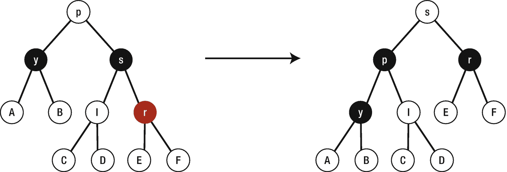

# 12. 红黑树

红黑树（RBT）是一种二叉搜索树，它为每个节点引入了新的参数——颜色（图 12-1）。我们知道，经过一些插入和删除操作后，二叉搜索树会变得不平衡，从而形成链表。红黑树通过平衡元素解决了这个问题。每个节点都有一个颜色，可以是黑色或红色。因此，在声明红黑树的节点时，它必须包含一个键/值、一个颜色、指向父节点的引用以及指向子节点的引用。红黑树在处理搜索、插入和删除操作的最坏情况时非常有用。

### 红黑树的属性



*图 12-1 – 红黑树示例*

- 每个节点必须有一种颜色：红色或黑色。
- 根节点始终为黑色。
- 空叶子节点始终为黑色。
- 如果一个节点是红色的，那么它的子节点必须是黑色的。
- 对于每个节点，从该节点到其所有后代叶子节点的简单路径上，黑色节点的数量相同。

图 12-1 展示了红黑树的基本结构。

红黑树是一种自平衡树——对节点颜色的限制确保了任何从根节点到叶子节点的简单路径的长度，都不会超过任何其他此类路径的两倍。这有助于维护红黑树的自平衡属性。

### 实现

要实现红黑树这种数据结构，我们需要一个至少包含以下元素的节点：

- 数据容器的键/值
- 指向左子节点和右子节点的引用
- 指向父节点的引用
- 颜色变量

那么，让我们定义一个名为 `RBNode` 的类，并将以下代码添加进去。我们知道颜色只能是红色或黑色；因此在定义类之前，我们先为颜色变量创建一个枚举，它包含两种颜色：黑色和红色。

```
private enum RBNodeColor {
    case red
    case black
}
```

而 `RBNode` 类将如下所示：

```
public class RBNode: Equatable {
    var color: RBNodeColor = .black
    var key: T?
    var leftChild: RBNode?
    var rightChild: RBNode?
    weak var parent: RBNode?

    public init(key: T?, leftChild: RBNode?, rightChild: RBNode?, parent: RBNode?) {
        self.key = key
        self.leftChild = leftChild
        self.rightChild = rightChild
        self.parent = parent
        self.leftChild?.parent = self
        self.rightChild?.parent = self
    }
}

//Equatable 协议
extension RBNode {
    static public func == (lhs: RBNode, rhs: RBNode) -> Bool {
        return lhs.key == rhs.key
    }
}
```

我们创建了所需的变量并在 `init` 方法中进行了初始化，我们的类必须遵循 `Comparable` 和 `Equatable` 协议。末尾的扩展用于遵循 `Equatable` 协议。

接下来我们要做的是创建红黑树本身。那么，让我们按如下所示创建一个新类，但在创建之前，我们需要在 `RBNode` 类中添加一个 `convenience` 初始化方法，以便能够用 `nil` 值对其进行初始化。因此，请在 `RBNode` 类的 public `init` 方法之后添加以下方法：

```
public convenience init(key: T?) {
    self.init(key: key, leftChild: RBNode(), rightChild: RBNode(), parent: RBNode())
}

// 用于初始化空叶子节点
public convenience init() {
    self.init(key: nil, leftChild: nil, rightChild: nil, parent: nil)
    self.color = .black
}
```

然后，我们的 `RedBlackTree` 类将如下所示：

```
public class RedBlackTree {
    public typealias RBTreeNode = RBNode
    private var root: RBTreeNode
    private var size = 0
    let nullLeaf = RBTreeNode()

    public init() {
        root = nullLeaf
    }
}
```

这里我们创建了一个 `typealias` 以使代码更易读，并为树声明了 `root` 和 `nullLeaf`。

可以对红黑树执行各种操作。可能存在这样的情况：插入和删除等操作违反了上述红黑树属性；在这种情况下，会采用旋转操作来维护这些属性。


### 旋转

在旋转操作中，一个子树会向根节点靠近一层，另一个子树则会远离根节点。

旋转有两种类型：



图 12-3 – 右旋转操作示意



图 12-2 – 左旋转操作示意

- **左旋转** – 如图 12-2 所示
- **右旋转** – 如图 12-3 所示

下面的代码展示了如何为红黑树实现旋转方法。首先，我们需要一个用于旋转方向的枚举，方向可以是右或左。

```
private enum RotationDirection {
case left
case right
}
```

接着，在 `RBNode` 类内部，我们需要一些变量来标识节点的状态，例如该节点是`leafNode`、`leftNode`、`rightNode`还是`rootNode`。因此，我们先在 `RBNode` 类中声明这些变量。

```
var isRootNode: Bool {
return parent == nil
}
var isLeafNode: Bool {
return rightChild == nil && leftChild == nil
}
var isNullLeaf: Bool {
return key == nil && isLeafNode && color == .black
}
var isLeftNode: Bool {
return parent?.leftChild === self
}
var isRightNode: Bool {
return parent?.rightChild === self
}
```

`rootNode` 是一个没有父节点的节点，所以当 `parent` 为 nil 时，`isRootNode` 返回 true。

`leafNode` 是一个没有任何子节点（左右子节点）的节点。这里当两个子节点都为 nil 时，`isLeafNode` 返回 true。

`nullLeaf` 是一个键值为 nil 且颜色始终为黑色的节点。这里当键值为 null、且该节点是叶节点且颜色为黑色时，`isNullLeaf` 返回 true。

`isLeftNode` 在当前节点与父节点的左子节点完全相同时返回 true。注意，这里不是判断相等，而是使用恒等运算符（`===`）。这意味着它们指向内存中的同一个位置。`isRightNode` 也遵循同样的原则。

在 `RBNode` 类中声明了这些变量之后，我们继续在 `RedBlackTree` 类中创建旋转方法。

```
private func rotate(node A: RBTreeNode, direction: RotationDirection) {
var nodeB: RBTreeNode? = RBNode()
//步骤 1
switch direction {
case .left:
nodeB = A.rightChild
A.rightChild = nodeB?.leftChild
A.rightChild?.parent = A
case .right:
nodeB = A.leftChild
A.leftChild = nodeB?.rightChild
A.leftChild?.parent = A
}
//步骤 2
nodeB?.parent = A.parent
if A.isRootNode {
if let node = nodeB {
root = node
}
} else if A.isLeftNode {
A.parent?.leftChild = nodeB
} else if A.isRightNode {
A.parent?.rightChild = nodeB
}
//步骤 3
switch direction {
case .left:
nodeB?.leftChild = A
case .right:
nodeB?.rightChild = A
}
A.parent = nodeB
}
```

为了解释这段代码，我们以左旋转为例，逐步进行可视化。

我们假设方向为 `.left`。

图 12-4 展示了旋转方法中的各个步骤。



图 12-4 – 左旋转步骤

### 插入

红黑树的插入操作与二叉搜索树的标准插入方式相同。但问题在于，插入后树可能不再是一棵合法的红黑树。为了解决这个问题，我们创建了一个 `fixInsert` 方法。在声明这个方法之前，我们先在 `RBNode` 类中添加三个变量：`siblingNode`、`grandparentNode` 和 `uncleNode`。图 12-5 直观地展示了这些变量。



图 12-5 – 一个节点的亲属关系

如图所示，节点 1 的兄弟节点是节点 4，节点 1 的父节点是节点 3，节点 1 的叔父节点是节点 12，节点 1 的祖父节点是节点 9。

请将以下变量复制到 `RBNode` 类中：

```
var grandparentNode: RBNode? {
return parent?.parent
}
var siblingNode: RBNode? {
if isLeftNode {
return parent?.rightChild
} else {
return parent?.leftChild
}
}
var uncleNode: RBNode? {
return parent?.siblingNode
}
```

在 `RBNode` 类中声明这些变量后，将以下代码复制到 `RedBlackTree` 类中：

```
private func fixInsert(node z: RBTreeNode) {
if !z.isNullLeaf {
guard let parentZ = z.parent else {
return
}
//如果 Z 和它的父节点都是红色 – 违反了红黑树性质，因此需要修复。
if parentZ.color == .red {
guard let uncle = z.uncleNode else {
return
}
//情况 1：叔节点为红色 – 重新着色并移动 z。
if uncle.color == .red {
parentZ.color = .black
uncle.color = .black
if let grandParentZ = parentZ.parent {
grandParentZ.color = .red
//将 z 上移到祖父节点并再次检查。
fixInsert(node: grandParentZ)
}
}
} else {
// 情况 2：叔节点为黑色
var zNew = z
//情况 2.1：z 为右节点 – 旋转
if parentZ.isLeftNode && z.isRightNode {
zNew = parentZ
rotate(node: zNew, direction: .left)
} else if parentZ.isRightNode && z.isLeftNode {
zNew = parentZ
rotate(node: zNew, direction: .right)
}
//情况 2.2：z 为左子节点 – 重新着色 + 旋转
zNew.parent?.color = .black
if let grandparentZnew = zNew.grandparentNode {
grandparentZnew.color = .red
if z.isLeftNode {
rotate(node: grandparentZnew, direction: .right)
} else {
rotate(node: grandparentZnew, direction: .left)
}
}
}
}
root.color = .black
}
```

可以看出，这里有两大情况，其中第二种情况又包含两种类型。

**情况 1：** `z` 的叔节点为红色。
1. 将父节点和叔节点的颜色改为黑色。
2. 将祖父节点的颜色改为红色。
3. 对 `z` 的祖父节点调用 `fixInsert` 方法。

**情况 2：** `z` 的叔节点为黑色 – 这里包含两种情况。
- **情况 2.1：** `z` 为右节点 – 这里，我们将 `z` 上移，因此 `z` 的父节点成为 `newZ`，然后围绕这个 `newZ` 进行旋转。
- **情况 2.2：** `z` 为左子节点。在这种情况下，我们将 `z.parent` 重新着色为黑色，将 `z.grandparent` 重新着色为红色。然后围绕 `z` 的祖父节点进行旋转。

如前所述，`fixInsert` 函数是一个用于修复将新节点插入树后红黑树违规问题的方法。因此，我们需要声明插入方法，该方法与二叉搜索树中的插入操作相同（更多信息请查阅第 11 章“二叉搜索树”）。

这里我们将声明三个方法：主 `insert` 方法、`addAsLeftNode` 方法和 `addAsRightNode` 方法。

```
private func addAsLeftNode(child: RBTreeNode, parent: RBTreeNode) {
parent.leftChild = child
child.parent = parent
child.color = .red
fixInsert(node: child)
}
private func addAsRightNode(child: RBTreeNode, parent: RBTreeNode) {
parent.rightChild = child
child.parent = parent
child.color = .red
fixInsert(node: child)
}
```

`addAsLeftNode` – 将子节点添加为左节点，将颜色设置为红色，并修复违规。

`addAsRightNode` – 将子节点添加为右节点，将颜色设置为红色，并修复违规。

然后我们创建主插入方法，该方法将使用前面声明的方法。


### 红黑树插入

```swift
private func insert(input: RBTreeNode, node: RBTreeNode) {
guard let inputKey = input.key, let nodeKey = node.key else {
return
}
if inputKey < nodeKey {
guard let child = node.leftChild else {
addAsLeftNode(child: input, parent: node)
return
}
if child.isNullLeaf {
addAsLeftNode(child: input, parent: node)
} else {
insert(input: input, node: child)
}
} else {
guard let child = node.rightChild else {
addAsRightNode(child: input, parent: node)
return
}
if child.isNullLeaf {
addAsRightNode(child: input, parent: node)
} else {
insert(input: input, node: child)
}
}
}
```

插入操作与 BST 中的插入操作相同；主要区别在于空指针被替换为`nullLeaf`，并且在每次插入后，我们调用`fixInsert`方法来修复违规。

### 删除

删除也类似于 BST 中的标准删除方法，但这里我们需要一个辅助函数来修复删除后的违规。可能存在被删除节点的父节点和子节点都是红色的情况，导致出现两个相邻的红色节点，或者如果删除根节点，根节点可能是红色的，或者其他属性可能被违反。因此，为了修复这些违规，我们创建了包含四种情况的`fixDelete`方法。

```swift
private func fixDelete(node y: RBTreeNode) {
var yTemp = y
if y.isRootNode && y.color == .black {
guard var siblingNode = y.siblingNode else {
return
}
// 情况 1: y 的兄弟节点是红色。
if siblingNode.color == .red {
//更改颜色
siblingNode.color = .black
if let yParent = y.parent {
yParent.color = .red
// 旋转
if y.isRightNode {
rotate(node: yParent, direction: .right)
} else {
rotate(node: yParent, direction: .left)
}
// 更新兄弟节点
if let sibling = y.siblingNode {
siblingNode = sibling
}
}
}
// 情况 2: y 的兄弟节点是黑色，且有两个黑色子节点。
if siblingNode.leftChild?.color == .black && siblingNode.rightChild?.color == .black {
//更改颜色
siblingNode.color = .red
//向上移动黑色单元
if let yParent = y.parent {
fixDelete(node: yParent)
}
} else {
// 情况 3.1: 兄弟节点是黑色，且左侧有一个黑色子节点。
if y.isLeftNode && siblingNode.rightChild?.color == .black {
//更改颜色
siblingNode.leftChild?.color = .black
siblingNode.color = .red
//向右旋转
rotate(node: siblingNode, direction: .right)
//更新 y 的兄弟节点
if let sibling = y.siblingNode {
siblingNode = sibling
}
} //情况 3.2: 左侧有一个黑色子节点
else if y.isRightNode && siblingNode.leftChild?.color == .black {
//更改颜色
siblingNode.rightChild?.color = .black
siblingNode.color = .red
//向左旋转
rotate(node: siblingNode, direction: .left)
//更新 y 的兄弟节点
if let sibling = y.siblingNode {
siblingNode = sibling
}
}
}
// 情况 4: 兄弟节点是黑色，且有一个红色右子节点。
if let yParent = y.parent {
siblingNode.color = yParent.color
yParent.color = .black
// 情况 a: y 是左子节点，兄弟节点带有红色右子节点
if y.isLeftNode {
siblingNode.rightChild?.color = .black
rotate(node: yParent, direction: .left)
}
// 情况 b: y 是右子节点，兄弟节点带有红色左子节点
else {
siblingNode.leftChild?.color = .black
rotate(node: yParent, direction: .right)
}
yTemp = root
}
}
}
}
yTemp.color = .black
}
```

在这个函数内部，我们实现了四种情况。

**情况 1**：`y`的兄弟节点是红色的，并且我们知道该兄弟节点是`y`父节点的另一个子节点。在这种情况下，`y`父节点和`y`兄弟节点的颜色将被改变，然后我们围绕`y`的父节点左旋（图 [12-6]）。



图 12-6

情况 1：`y`的兄弟节点是红色

**情况 2**：`y`的兄弟节点是黑色的，并且它有两个黑色的子节点。在这种情况下，我们将`y`兄弟节点的颜色改为红色，并将`y`向上移动至`y`的父节点，然后再次检查这个新`y`（图 [12-7]）。



图 12-7

情况 2：`y`的兄弟节点是黑色

**情况 3**：`y`的兄弟节点是黑色的，并且它有一个黑色的右子节点。这里，我们将兄弟节点的颜色改为红色，兄弟节点的左子节点改为黑色，并围绕该兄弟节点旋转（图 [12-8]）。



图 12-8

情况 3：`y`的兄弟节点是黑色，带有黑色的右子节点

**情况 4**：`y`的兄弟节点是黑色的，并且有一个红色的右子节点。在这种情况下，我们将兄弟节点的颜色改为`y`父节点的颜色，并将`y`父节点和兄弟节点的右子节点改为黑色，然后围绕`y`的父节点旋转（图 [12-9]）。



图 12-9

情况 4：`y`的兄弟节点是黑色，带有红色的右子节点

## 结论

在本章中，您学习了红黑树及其主要属性。此外，您还掌握了如何实现旋转、插入和移除等各种方法。红黑树在处理搜索、插入和删除操作的最坏情况时非常强大。

