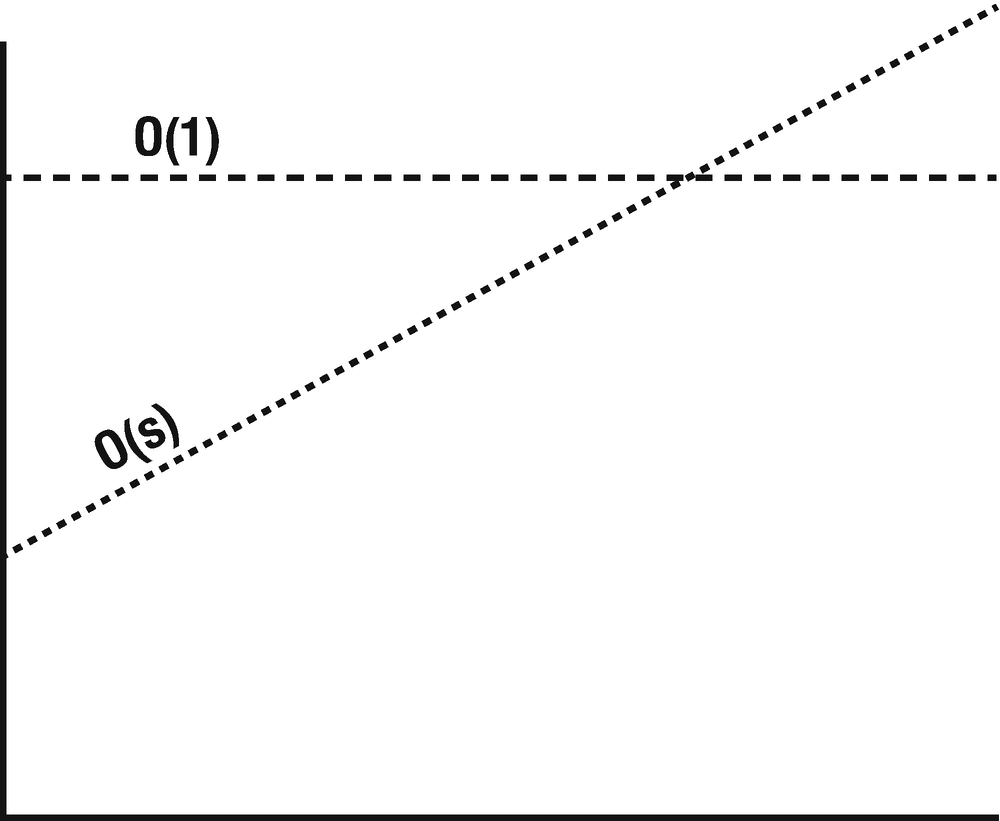
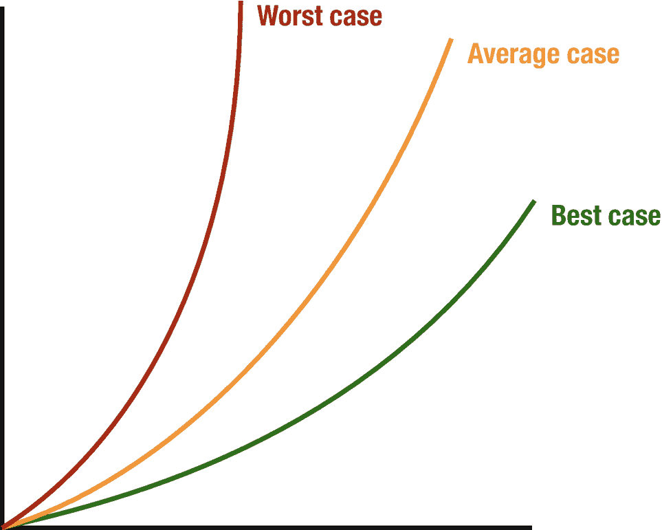
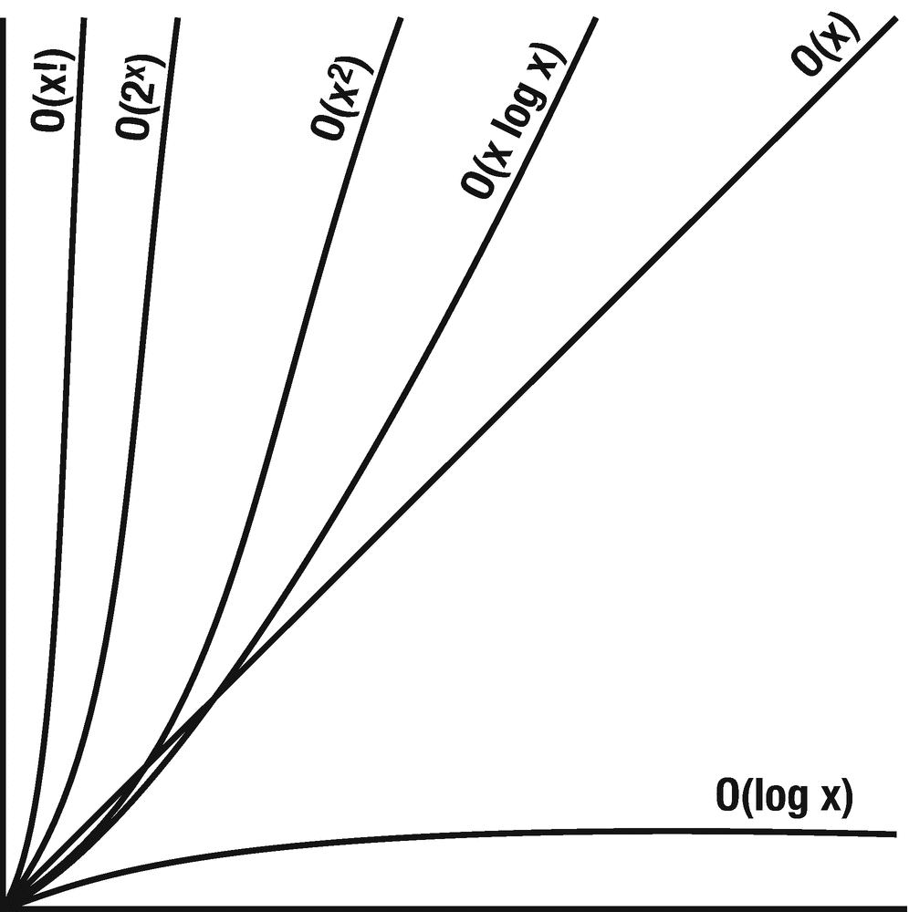
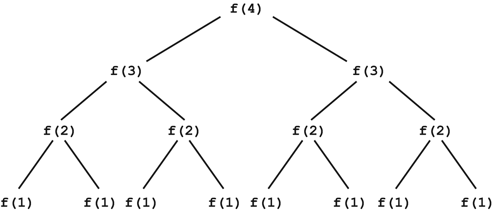

# 13. 大 O 表示法

为了描述算法的效率，使用了 Big O 时间语言和度量标准。为了更清晰，让我们看看以下场景。假设我们想尽快将一个文件发送给朋友，我们应该如何发送？

有两种选择：

*   电子传输
*   物理递送

### 时间复杂度

渐近运行时间或 Big O 的概念指的是时间复杂度。这意味着我们可以如下描述数据传输算法的运行时间（图 [13-1]）：



图 13-1

时间复杂度

*   电子传输：`O(s)`，其中`s`是文件的大小。这意味着传输文件的时间随文件大小线性增长。
*   物理递送：`O(1)`——随着文件大小的增加，所需时间不会增加。

运行时有多种类型，例如`O(N)`、`O(N²)`和`O(2^N)`。例如，要涂刷一个宽`w`米、高`h`米的区域，运行时可以描述为`O(wh)`。有些算法在输入较小时更快；然而，当输入变大时，它们会变慢。我们的程序运行速度快至关重要，因为它们不是在超级计算机上执行的，所以如果移动应用用户遇到应用性能缓慢，他们往往会退出并删除应用。因此，必须为我们的开发选择合适的算法。

任何算法的运行时都可以用三种不同的方式进行描述。例如，让我们检查一下快速排序算法。它选取一个随机元素作为枢轴（`pivot`），并在数组中交换值，使得大于枢轴的元素出现在一侧（图 [13-2]）。



图 13-2

Big O 场景

*   最佳情况：所有元素都相等，并且数组只遍历一次，`O(N)`。
*   最坏情况：如果运气不好，枢轴反复是数组中最大的元素，`O(N²)`。
*   期望情况：有时枢轴会非常高或非常低，但这不会反复发生，`O(N log N)`。

为了表示这些情况，有对应的大 O 符号：

*   大 Θ（`Big-Θ`）：一种复杂度，它处于最坏情况和最佳情况的界限之内。
*   大 O（`Big O`）：一种复杂度，它小于或等于最坏情况。
*   大 Ω（`Big-Ω`）：一种复杂度，它至少比最佳情况要大。


### 空间复杂度

在讨论算法效率时，时间并非唯一需要考虑的因素，所需的内存量同样重要。这是与时间复杂度并行的一个概念。如果我们需要创建一个大小为 `n` 的数组，则需要 `O(n)` 的空间。递归调用中的栈空间也会被计入。例如，以下代码将具有 `O(n)` 时间复杂度和 `O(n)` 空间复杂度；每次调用都会占用实际内存：

```
func sum(n: Int) -> Int {
if n <= 0 {
return 0
}
return n + sum(n: n-1)
}
```

每次调用都会向调用栈添加一层，并占用实际内存：

```
1   sum(3)
2     → sum(2)
3         → sum(1)
4             → sum(0)
```

另一方面，在某些情况下，`n` 次调用并不会占用 `O(n)` 空间：

```
func pairSumSequence(n: Int) -> Int {
var sum = 0
for i in 0...n {
sum += pairSum(a: i, b: i+1)
}
return sum
}
func pairSum(a: Int, b: Int) -> Int {
return a + b
}
```

由于 `n` 次对 `pairSum` 函数的调用并**没有同时**存在于调用栈中，我们只需要 `O(1)` 的空间。

## 忽略常数项与非主导项

对于特定输入，`O(N)` 代码有可能比 `O(1)` 代码运行得更快。大 O 表示法仅仅描述了增长速率。因此，我们通常会忽略常数，这意味着 `O(2N)` 实际上就是 `O(N)`。

*   `O(2N)` → `O(N)`

既然可以忽略常数，那么同样也可以忽略非主导项。

*   `O(N²+N)` → `O(N²)`

*   `O(N+logN)` → `O(N)`

*   `O(2∗2^N + 1000N¹⁰⁰)` → `O(2^N)`

某些情况下，运行时间中可能存在求和项，例如 `O(B²+A)` 就不能在未明确 `A` 或 `B` 的情况下被简化。

下图展示了一些常见大 O 时间复杂度的增长速率（图 13-3）。



图 13-3

常见大 O 时间复杂度的增长速率

如图所示，`O(x²)` 远比 `O(x)` 糟糕。还有许多运行时间比 `O(x!)` 更差，例如 `O(x^x)` 或 `O(2^x ∗ x!)`。

## 如何计算复杂度？

很明显，由于算法中使用的代码结构不同，其复杂度也不同。让我们看一些代码示例及其复杂度。

*   **If**`–`**else**：在这种类型的代码块中，通常有两段代码 —— `if` 条件下的代码和 `else` 条件下的代码。这里我们考虑最坏情况。因此，如果 `if` 块是 `O(n)` 而 `else` 块是 `O(1)`，那么整个块的复杂度将是 `O(n)`。

    ```
    var myArray = [1,2,3,4,5]
    if myArray.count > 0 {
    for i in myArray {
    print(i)
    }
    } else {
    print("The array is empty")
    }
    ```

    从这个代码块可以很容易地看出，**if** 语句的复杂度是 `O(n)`，**else** 语句的复杂度是 `O(1)`。然而，整个代码的复杂度是 `O(n)`，因为我们总是考虑最坏情况。

*   **循环**：在 `循环` 内部，语句会重复执行 `n` 次。如果我们的代码执行一次需要 `O(m)` 复杂度，那么在重复 `n` 次的循环内部，其复杂度将是 `n∗O(m)` 或 `O(n∗m)`。

    ```
    for i in myArray {
    print(i)
    }
    ```

    循环次数将是 5 次，并且循环内部代码的执行复杂度是 `O(1)`，因此合并执行的复杂度是 `O(5)`。

*   **嵌套** `循环`：如果一个循环内部包含另一个循环，复杂度将呈指数级增长，这意味着如果简单循环的复杂度是 `O(n)`，那么在这个循环内部再添加一个循环将使复杂度变为 `O(n²)`。

    ```
    for i in myArray {
    print(i)
    for a in myArray {
    print(i+a)
    }
    }
    ```

    这里第一个循环的复杂度是 `O(5)`，因为数组计数是 5，所以嵌套循环也以相同的复杂度执行了 5 次，这意味着两者的复杂度都是 `O(5²)`。

## 加法 vs. 乘法

主要的困惑之一是确定何时对运行时间进行加法，何时进行乘法。

*   运行时间相加 —— 如果一个算法的形式是“先做这个，做完之后，再做那个”
*   运行时间相乘 —— 如果一个算法的形式是“每做一次那个，就做一次这个”

在左侧，运行时间是 `O(A+B)`；这是因为每个运行时间都是分别执行的：先运行 `A`，然后运行 `B`。因此我们将它们相加。

在右侧，对于 `A` 的每一个元素，我们都运行一次 `B`，这意味着我们需要将运行时间相乘。

| 运行时间相加：`O(A+B)` | 运行时间相乘：`O(A*B)` |
| --- | --- |
| **for** `a` **in** `arrayA {`   `print(a)``}`**for** `b` **in** `arrayB {`   `print(b)``}` | **for** `a` **in** `arrayA {`   **for** `b` **in** `arrayB {`      `print("\(a) + \(b)")``}``}` |

## 平摊时间

使用 `ArrayList` 或动态调整大小的数组时，你不会遇到空间不足的问题，因为其容量会随着添加元素而增长。当数组达到容量上限时，`ArrayList` 会创建一个容量翻倍的新数组，并将所有元素复制到新数组中。因此，如果数组包含 `N` 个元素，添加元素的运行时间将是 `O(N)`。我们知道这种情况不会经常发生，大多数情况下添加操作是 `O(1)`，而平摊时间将两种情况都考虑在内。

随着我们添加元素，当数组的大小是 2 的幂时，我们会将容量翻倍。容量变为 1，2，4，8，16 …… `X`。如果我们从右向左看这些容量的总和，它从 `X` 开始，每次减半，直到变为 1。

`X+X/2+X/4+X/8+…+1` 这个和大约是 `2X`，如果我们移除常数，它就变成了 `O(X)`。因此，`X` 次添加操作需要 `O(X)` 时间，而每次添加操作的平摊时间是 `O(1)`。

### 对数时间运行时间

以二分查找为例，我们在一个包含 `N` 个元素的有序数组中查找 `x`。首先，我们将 `x` 与中间值进行比较 —— 如果相等，则返回；如果 `x < middle`，则在左侧搜索；如果 `x > middle`，则在右侧搜索。

```
search 9 within [1,5,8,9,11,13,15,19,21]
compare 9 to 11 → smaller
search 9 within [1,5,8,9]
compare 9 to 8 → bigger
search 9 within [9]
compare 9 to 9
return
```

我们从包含 `N` 个元素的数组开始搜索；经过一步后，问题规模降为 `N/2`个元素；再经过一步，降为 `N/2` 个元素。所以总时间取决于我们需要多少步才能将 `N` 降到 1。

```
N = 16
N = 8 /* 除以 2 */
N = 4 /* 除以 2 */
N = 2 /* 除以 2 */
N = 1 /* 除以 2 */
```

那么，我们需要将 1 乘以 2 多少次才能得到 `N`？`2^k = N` → `log[2]N = k`

因此，当问题空间中的元素数量每次减半时，其运行时间很可能是 `O(log N)`。

### 递归运行时间

这段代码的运行时间是多少？

```
func f (n : Int) -> Int {
if n <= 1 {
return 1
}
return f(n: n-1) + f(n: n-1)
}
```

不要依赖猜测，让我们来审视这段代码。假设我们有 `f(4)`，它会调用 `f(3)` 两次，而每次 `f(3)` 的调用又会调用 `f(2)`，直到我们降到 `f(1)`（图 13-4）。



图 13-4

递归运行时间

递归树的深度为 `N`，并且每个节点有两个子节点。因此，每一层的调用次数将是图中所示的两倍。更一般地，可以表示为 `2⁰+2¹+2²+2³+…+2^(N-1)`。因此，当一个递归函数进行多次调用时，运行时间通常看起来像 `O(分支数^(深度))`，但在我们的例子中，它是 `O(2^N)`。

## 结论

在本章中，你学习了算法效率以及如何衡量它。我们识别了不同代码的复杂度。我们解释了时间和空间复杂度，并展示了不同类型的复杂度。在下一章中，我们将讨论排序算法。


