# 14. 排序算法

到目前为止，我们已经学习了各种不同的数据结构及其性能表现。在本章中，我们将开始学习算法，这些算法是处理数据的核心方式。算法的主要功能是将数据作为输入，对其进行处理，然后将其作为输出返回。

本章我们将重点学习用于数据排序的排序算法。排序的目标是从无序走向有序。排序算法由一系列指令组成，这些指令以列表为输入，对其执行操作，并输出一个已排序的列表。排序算法有多种类型，但这里我们将讨论以下几种：

-   冒泡排序
-   选择排序
-   插入排序
-   归并排序
-   快速排序

### 冒泡排序

冒泡排序是一种用于对数字序列进行排序的算法。其使用方法是从序列的开头开始，比较前两个元素。只有当第一个元素的值大于第二个元素时，这两个元素才会被交换。这种比较相邻元素的过程会一直持续到数组末尾，然后从第 0 个索引开始再次迭代，直到整个数组排序完成。它是一种基于比较的算法，会比较数组中的每一对元素，如果它们顺序不对则进行交换，直到整个数组有序。请参考图 14-1。要使用冒泡排序算法对这组元素进行排序，首先，我们在序列左端比较 5 和 9。在这种情况下，5 小于 9，这意味着这两个数字不会被交换。

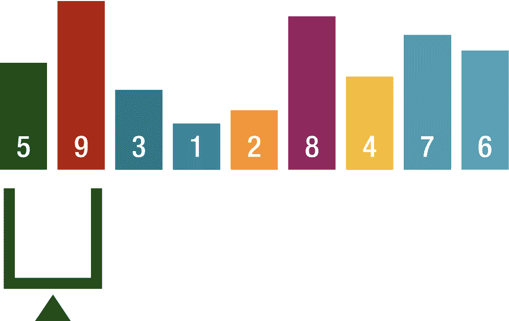

图 14-1 – 冒泡排序比较 1

比较结束后，标尺向右移动一个位置，再次比较这两个数字。这次 9 大于 3，因此这两个数字会被交换，然后标尺再向右移动一个位置（图 14-2）。

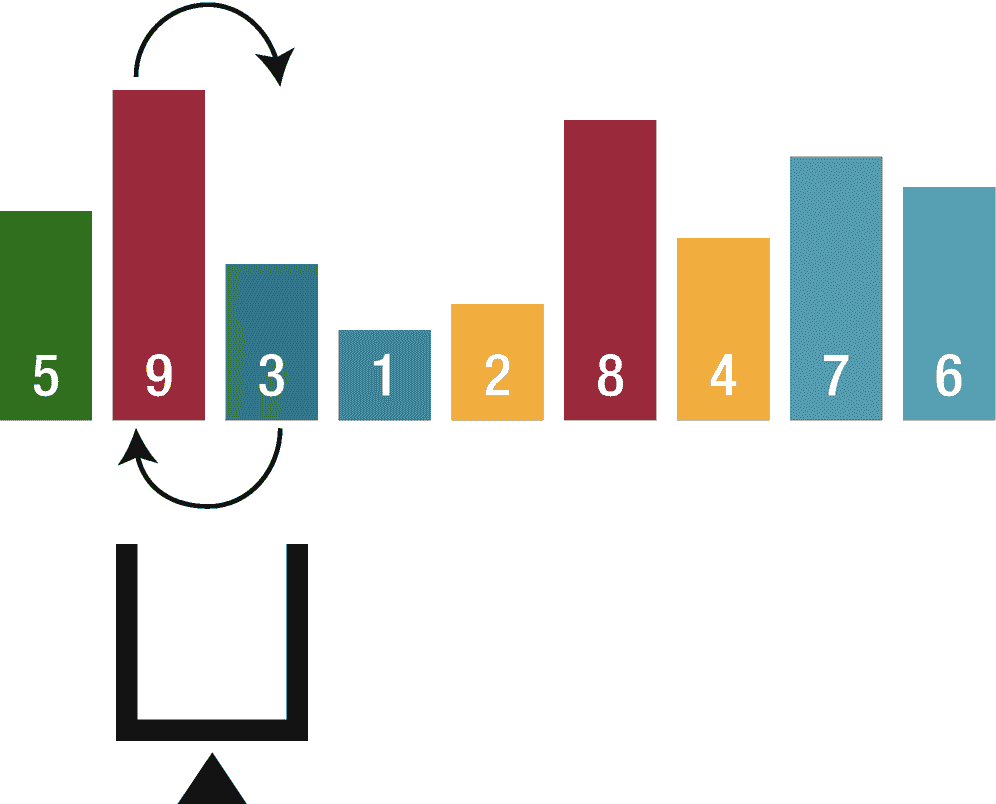

图 14-2 – 冒泡排序比较 2

此操作重复进行，直到标尺到达序列的左端。当标尺到达序列左端时，经过一轮操作，序列中的最小值已移动到左边缘，并且左边缘的这个数字被认为已完全排序。然后标尺移回右边缘，重复同样的操作，直到所有数字都完全排序。

当数据接近有序时，冒泡排序非常有用。例如，如果只有两个元素位置错乱，那么冒泡排序只需一轮即可完成排序，第二轮会发现所有元素都已排序并退出，这意味着只需要遍历数组两轮。

冒泡排序的主要优点是它很流行且易于实现。此外，在冒泡排序中，元素在原地进行交换，无需使用额外的临时存储空间，因此空间需求最小。

冒泡排序的主要缺点是它不太擅长处理包含大量元素的列表。这是因为对于每`n`个需要排序的元素，冒泡排序需要 n 平方步的处理步骤。因此，冒泡排序主要适用于学术教学，而不适用于实际应用。

### 实现

打开 Xcode 并创建一个新的 playground 文件开始本章的学习。在其中创建以下函数：

```
public func bubbleSort(_ inputArray: inout [inputType]) {
    for endofArray in (1..<inputArray.count).reversed() {
        var swapped = false
        for currentIndex in 0..<endofArray {
            if inputArray[currentIndex] > inputArray[currentIndex + 1] {
                inputArray.swapAt(currentIndex, currentIndex+1)
                swapped = true
            }
        }
        if !swapped {
            return
        }
    }
}
```

在单轮遍历的内部第一个循环中，最大值会移动到集合的末尾，然后每一轮需要比较的元素都比上一轮少一个，因此每次数组都会缩短一个。第二个循环比较相邻的值，如果当前值大于下一个值，则使用`swapAt`函数交换它们。

让我们看看下面的数组：

```
var testArray = [9, 2, 6, 4, 5]
print("Initial array: \(testArray)")
bubbleSort(&testArray)
print("Sorted array: \(testArray)")
```

输出将是：

```
Initial array: [9, 2, 6, 4, 5]
Sorted array: [2, 4, 5, 6, 9]
```

### 选择排序

选择排序是另一种用于对数字序列进行排序的算法。通过线性搜索，找到序列中的最小值，然后将该值与最左边的数字交换，并认为其已完全排序。如果最小值恰好已经在最左边的位置，则不执行任何操作。然后重复相同的操作，直到所有数字都完全排序。

假设我们有以下数字列表（图 14-3）。

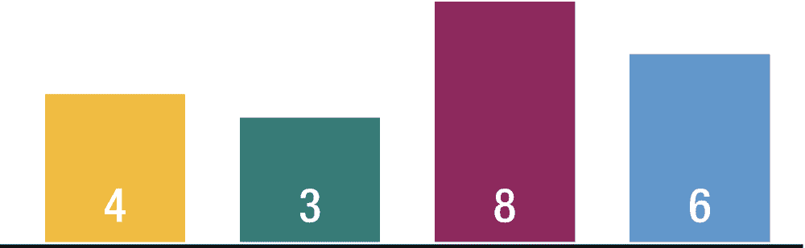

图 14-3 – 用于选择排序的未排序列表

选择排序通过重复遍历列表中的元素来工作，每次选择最低的未排序值并将其放置在序列中的正确位置，如图 14-4 所示。

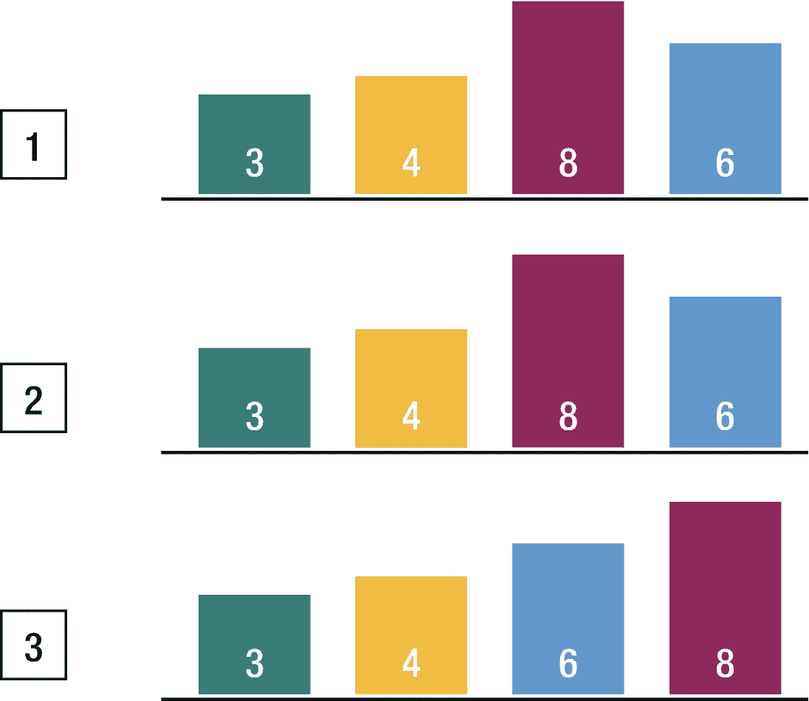

图 14-4 – 执行选择排序的示例

1.  在这种情况下，最低值是 3。它与 4 交换，并且 3 被认为是已排序的。
2.  下一个最低值是 4，我们发现它已经在正确的位置。
3.  最后一个最低值是 6，它与 8 交换。

选择排序的主要优点是它在处理小列表时表现良好。此外，由于它是一种原地排序算法，除了保存原始列表所需的空间外，不需要额外的临时存储空间。

选择排序的主要缺点是在处理包含大量元素的列表时效率低下。与冒泡排序类似，选择排序对`n`个元素进行排序需要 n 平方步。此外，其性能很容易受到排序前元素初始顺序的影响。因此，选择排序仅适用于元素数量少且随机排列的列表。

### 实现

让我们创建一个如以下代码所示的`selectionSort`函数：

```
public func selectionSort(_ inputArray: inout [inputType]) {
    for currentIndex in 0..<(inputArray.count - 1) {
        var lowestValueIndex = currentIndex
        for nextIndex in (currentIndex + 1)..<inputArray.count {
            if inputArray[lowestValueIndex] > inputArray[nextIndex] {
                lowestValueIndex = nextIndex
            }
        }
        if lowestValueIndex != currentIndex {
            inputArray.swapAt(lowestValueIndex, currentIndex)
        }
    }
}
```

在`selectionSort`函数内部，我们遍历集合中除最后一个元素之外的所有元素。如果所有元素都已排序，则无需对最后一个元素进行排序。在下一个循环中，我们找到列表中的最小值，如果该元素不是当前元素，则交换它们。

让我们看看下面的数组：

```
var testArray = [9, 2, 6, 4, 5, 10, 8]
print("Initial array: \(testArray)")
selectionSort(&testArray)
print("Sorted array: \(testArray)")
```

输出将是：

```
Initial array: [9, 2, 6, 4, 5, 10, 8]
Sorted array: [2, 4, 5, 6, 8, 9, 10]
```

很容易看出，选择排序的性能优于冒泡排序。


### 插入排序

插入排序是最常用且最简单的排序算法之一。插入排序的平均时间复杂度为 `O(n²)`，这意味着对较大数据集进行排序时效率很低。当数据近乎有序或数据集较小时，可以使用插入排序。在上述条件下，时间复杂度可达到 `O(n log(n))`。

在插入排序开始时，最左侧的数字被视为已完全排序。然后从剩余数字中取出最左侧的数字，与其左侧已排序的数字进行比较，如果已排序的数字更大，则两个数字交换位置。重复此操作，直到遇到更小的数字或该数字到达左边界。

假设我们有以下数字列表（图 14-5）。

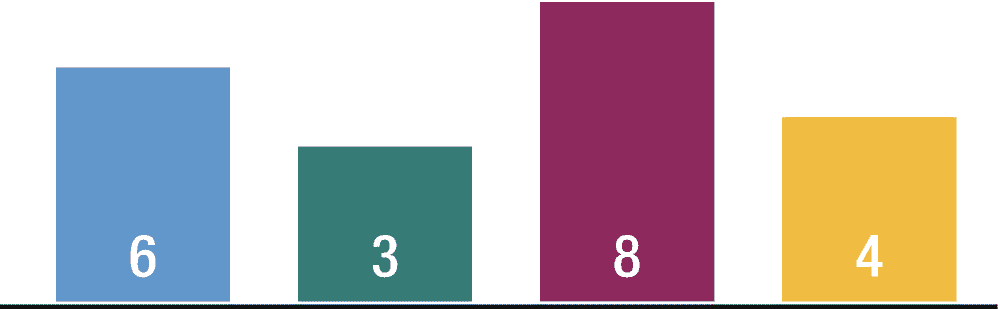

图 14-5
待插入排序的未排序列表

如图 14-6 所示，在此例中，6 大于 3，因此这两个数字交换位置。该数字到达左边界，因此停在那里并被视为已完全排序，在此例中 3 已完全排序。然后再次取出剩余数字中最左侧的数字，与其左侧的数字进行比较。接下来，6 小于 8，因此数字不会交换，6 被视为已完全排序。然后取出 8 并与 4 比较，发现 8 更大，这意味着数字将交换位置，然后将 4 与 6 比较，发现 6 大于 4，因此数字再次交换位置。当它遇到更小的数字时，就停在那里并被视为已完全排序。最后，由于所有数字都已完全排序，排序完成。

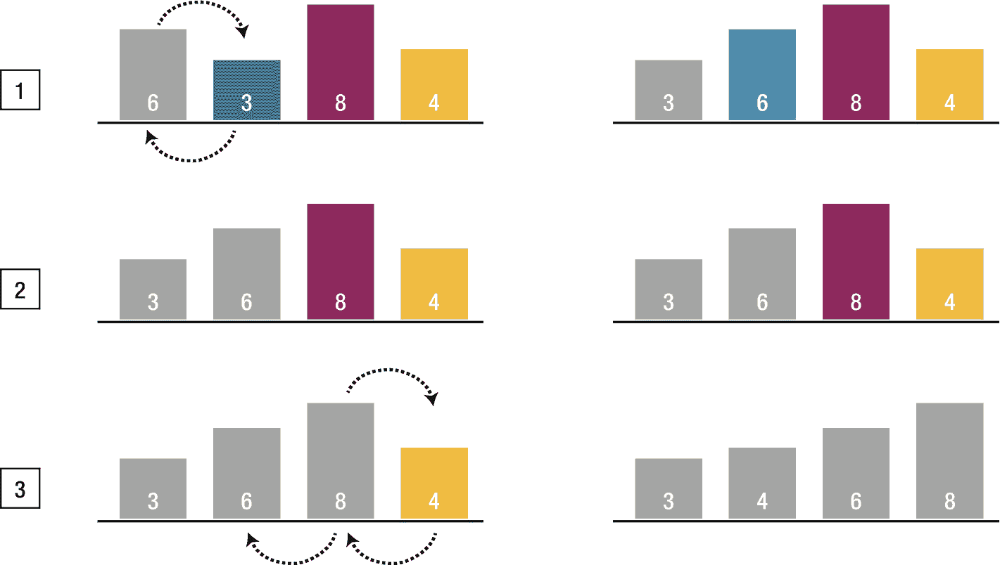

图 14-6
插入排序步骤

插入排序的主要优点是简单。处理小型列表时也具有良好的性能。插入排序是一种原地排序算法，因此空间需求极小。

插入排序的缺点是性能不如其他更好的排序算法。对于需排序的每 n 个元素需要 n 平方步，因此插入排序处理大型列表时效果不佳。因此，插入排序在对少量元素进行排序时特别有用。

### 实现

让我们创建一个插入排序函数，如下代码所示：

```
public func insertionSort(_ inputArray: inout [inputType]) {
    for currentIndex in 1..<inputArray.count {
        for swap in (1...currentIndex).reversed() {
            if inputArray[swap] < inputArray[swap - 1] {
                inputArray.swapAt(swap, swap-1)
            } else {
                break
            }
        }
    }
}
```

我们知道插入排序需要从左到右遍历集合一次，第一个循环正是如此。然后在下一个循环中，我们根据需要交换元素。当元素到达其位置时，内层循环中断并继续处理下一个元素。

让我们看看以下数组：

```
var testArray = [9, 2, 6, 4, 5, 10, 8, 12, 16, 11]
print("初始数组: \(testArray)")
insertionSort(&testArray)
print("排序后数组: \(testArray)")
```

输出将为

```
初始数组: [9, 2, 6, 4, 5, 10, 8, 12, 16, 11]
排序后数组: [2, 4, 5, 6, 8, 9, 10, 11, 12, 16]
```

当你拥有一个基本有序的列表时，插入排序非常有用。纸牌游戏就是一个很好的例子。当玩家收到一张新牌时，它会被添加到现有手牌中，插入排序可以高效地重新排序卡牌列表。

### 归并排序

归并排序是另一种排序算法，其运行时间阶数低于插入排序。它是一种分治算法。归并排序将序列不断地分成两半，当分割完成后，下一步是将分组后的组重新合并。在合并分组组时，每个组中的数字会被重新排列，使其从小到大有序。当合并包含多个数字的组时，会先比较第一个数字。

假设我们有以下数字列表（图 14-7）。

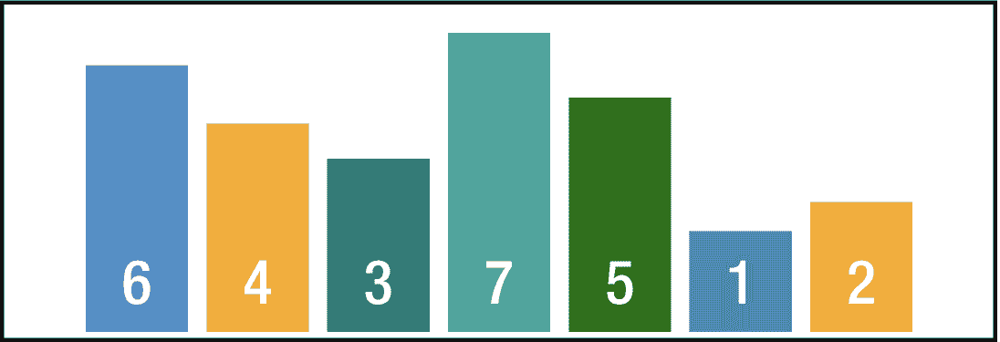

图 14-7
待归并排序的未排序列表

分割过程将如图 14-8 所示。

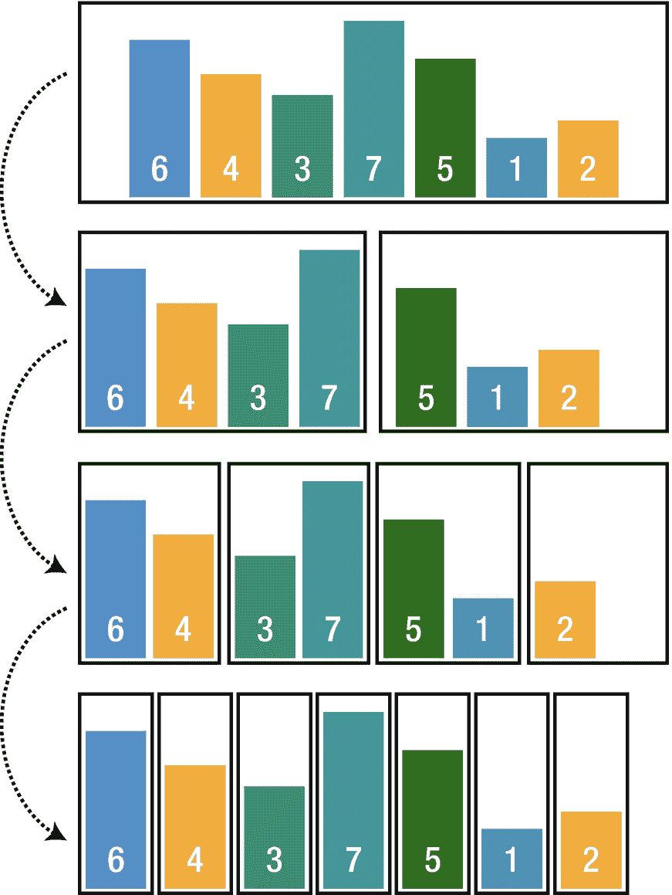

图 14-8
归并排序分割

可以很容易地看出，在每一步中，归并排序都将序列分成两半。分割完成后，合并过程开始，在合并时，会对分组后的元素进行比较以按顺序排列（图 14-9）。

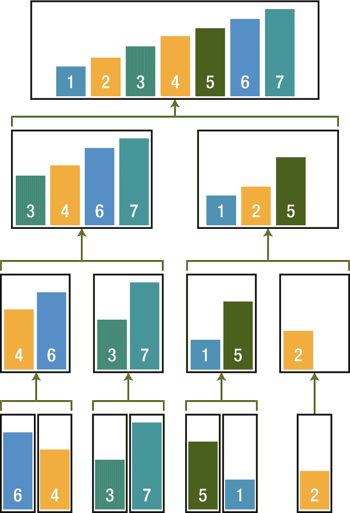

图 14-9
归并排序合并

### 优点

*   对于较大的列表更快，因为与插入排序和冒泡排序不同，它不需要循环遍历列表。
*   运行时间稳定。

### 缺点

*   对于较小的列表，比其他排序算法慢。
*   即使列表已排序，它也会执行所有步骤。
*   使用更多内存来存储子元素。

### 实现

我们需要另一个函数来合并拆分后的元素。

```
public func mergeSort(_ inputArray: [inputType]) -> [inputType] {
    if inputArray.count < 2 {
        return inputArray
    }
    let center = (inputArray.count) / 2
    return merge(mergeSort(inputType), rightList:
    mergeSort(inputType))
}
```

同样，`mergeSort` 函数中使用的类型必须符合 `Comparable` 协议，因为我们需要比较数组的元素。首先检查数组的长度；如果小于 2，则视为已排序并返回数组本身。然后我们将列表分成两部分并递归调用 `mergeSort` 函数。

合并函数：

```
private func merge(_ leftList: [inputType], rightList: [inputType]) -> [inputType] {
    var leftIndex = 0
    var rightIndex = 0
    var tmpList = [inputType]()
    tmpList.reserveCapacity(leftList.count + rightList.count)
    
    while (leftIndex < leftList.count && rightIndex < rightList.count) {
        if leftList[leftIndex] < rightList[rightIndex] {
            tmpList.append(leftList[leftIndex])
            leftIndex += 1
        } else if leftList[leftIndex] > rightList[rightIndex] {
            tmpList.append(rightList[rightIndex])
            rightIndex += 1
        } else {
            tmpList.append(leftList[leftIndex])
            tmpList.append(rightList[rightIndex])
            leftIndex += 1
            rightIndex += 1
        }
    }
    
    tmpList += inputType
    tmpList += inputType
    return tmpList
}
```

合并函数同样符合 `Comparable` 协议，它接受两个列表作为参数。首先创建一个临时数组并为其预留容量。然后使用 `while` 循环遍历列表，直到左索引或右索引等于各自序列的计数。然后开始比较左右序列中的值；如果 `leftList` 元素小于 `rightList` 元素，则将其添加到临时数组并递增 `leftIndex`。如果 `leftList` 元素大于 `rightList` 元素，则将 `rightList` 元素添加到临时数组并递增 `rightIndex`；否则，这些元素相等，我们添加左和右元素，并同时递增两个索引。

让我们看看以下数组：

```
var testArray = [9, 2, 6, 4, 5, 10, 8, 12, 16, 11]
print("初始数组: \(testArray)")
print(mergeSort(testArray))
```

输出将为

```
初始数组: [9, 2, 6, 4, 5, 10, 8, 12, 16, 11]
结果数组: [2, 4, 5, 6, 8, 9, 10, 11, 12, 16]
```


### 快速排序

快速排序也是一种使用分治策略对序列进行排序的算法。快速排序的主要特点之一是，与其他算法相比，它涉及的比较和交换次数更少，因此在许多情况下能够快速完成排序。该算法通过基于一个基准元素将初始数组划分为子列表来工作。第一个子列表中的所有元素都排列成小于基准值，而第二个子列表中的所有元素都排列成大于基准值。然后对生成的子列表重复执行相同的划分和排列过程，直到整个列表排序完成。由于其紧凑的内循环，平均运行时间为 `O(n log n)`。在最坏情况下，其运行时间为 `O(n²)`。

假设我们有如下数字列表（图 14-10）。

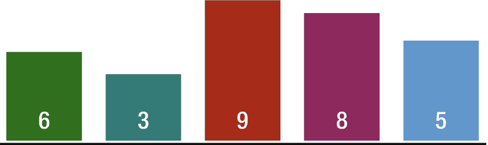

图 14-10 用于快速排序的未排序列表

在这个未排序列表中的第一个操作针对的是整个数字序列，会随机选择一个数字作为排序的参考，这个数字被称为基准。为了方便起见，这次我们选择最右边的数字作为基准，即 5。接下来我们要做的是在最左边的数字上放置一个左标记，在最右边的数字上放置一个右标记。快速排序利用这些标记递归地重复执行多轮操作。左标记向右移动，每一步都将当前数字与基准数字进行比较，当遇到大于或等于基准数字的数字时停止。在我们的例子中，它在 6 处停止，因为 6 大于 5。然后右标记开始向左移动，这次当它遇到一个小于基准数字的数字时（在我们的例子中，它在 3 处停止，因为 3 小于 5），左右标记都停止后，交换标记处的数字；这里我们将 3 与 6 交换。

这样，左标记负责寻找大于或等于基准的数字，右标记负责寻找小于基准的数字，通过交换这些数字，我们可以将小于基准的数字聚集在序列的左侧，将大于等于基准的数字聚集在序列的右侧。

像之前一样，左标记移动直到遇到一个大于或等于基准的数字，在我们的例子中是 6。然后右标记再次向左移动，当右标记与左标记相遇时停止移动。当左右标记停在相同位置时，该位置的数字与基准数字交换。这样，左右标记共同占据的这个数字就被视为完全排序好了。至此，第一轮操作完成。

通过一轮操作，我们成功地将小于基准的数字放到了基准的左侧，将大于基准的数字放到了基准的右侧。下一轮操作将在分割后产生的两个序列上递归执行，如图 14-11 所示。

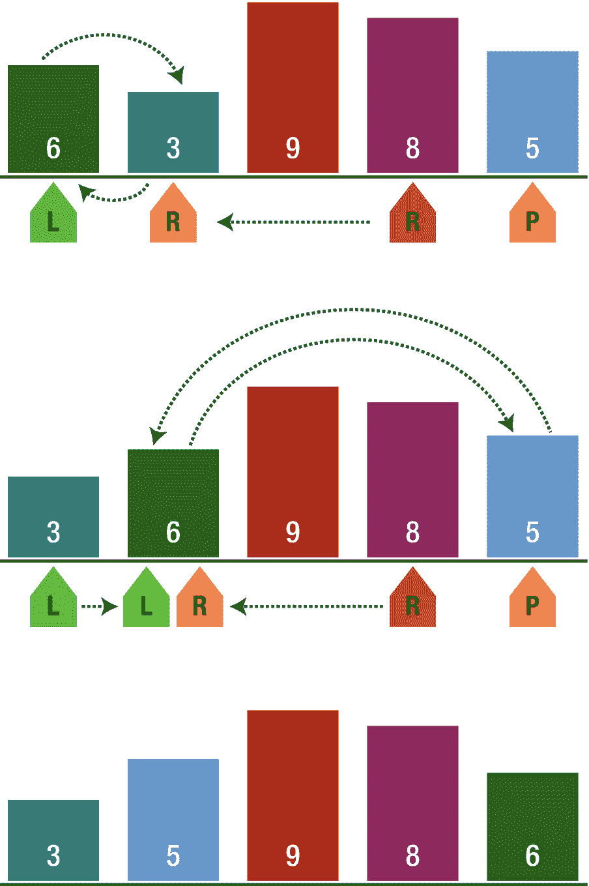

图 14-11 执行快速排序的示例

快速排序被认为是最好的排序算法。这是因为它在效率方面具有显著优势，能够很好地处理大量数据项。此外，由于它属于原地排序，因此也不需要额外的存储空间。

快速排序的一个小缺点是，它的最坏情况性能与冒泡排序、插入排序或选择排序的平均性能相当。

总的来说，快速排序是排序任意规模的数据列表时最有效且最广泛应用的方法。

### 实现

这里我们同样需要一个辅助函数来处理基准数字。

```
func partition(_ inputArray: inout [inputType], lowIndex: Int, hiIndex: Int) -> Int {
let pivot = inputArray[hiIndex]
var i = lowIndex
for j in lowIndex..<hiIndex {
if inputArray[j] <= pivot {
inputArray.swapAt(i, j)
i += 1
}
}
inputArray.swapAt(i, hiIndex)
return i
}
```

`partition` 函数的目的是选择基准数字并对子列表进行排序。首先，我们选择最右边的数字作为基准数字，创建一个新变量并赋值为 `lowIndex`。然后我们遍历数组，将每个元素与基准数字进行比较。如果当前元素小于基准值，我们将其与 `i` 当前位置的元素交换（`i` 从 `lowIndex` 开始），每次发生交换时 `i` 递增。通过重复此操作，我们将较大的元素推到右侧，将较小的元素推到左侧。最后，在迭代完成后，我们交换 `i` 和 `hi` 位置的元素，将基准元素移回原位，并返回 `i` 值作为基准数字。

快速排序函数：它调用 `partition` 函数，并递归地对数组的子序列进行排序。

```
func quickSort(_ inputArray: inout [inputType], lowIndex: Int, hiIndex: Int) {
if lowIndex < hiIndex {
let pivot = partition(&inputArray, lowIndex: lowIndex, hiIndex: hiIndex)
quickSort(&inputArray, lowIndex: lowIndex, hiIndex: pivot - 1)
quickSort(&inputArray, lowIndex: pivot + 1, hiIndex: hiIndex)
}
}
```

### 基准选择

像我们这里这样选择最右边的数字作为基准，可能会对性能产生负面影响。如果数组已经有序，就会产生最坏情况 `O(n²)`，而随机选择值也不能保证选出最佳值。那么选择基准数字的最佳方法是什么？

最佳方法是三数取中策略。这里我们取最低位、中间位和最高位数字的中位数。为实现此策略，我们需要另一个辅助函数来获取三个值的中位数。

```
private func getMedian(_ inputArray: inout [inputType], lowIndex: Int, hiIndex: Int) -> inputType {
let center = lowIndex + (hiIndex - lowIndex) / 2
if inputArray[lowIndex] > inputArray[center] {
inputArray.swapAt(lowIndex, center)
}
if inputArray[lowIndex] > inputArray[hiIndex] {
inputArray.swapAt(lowIndex, hiIndex)
}
if inputArray[center] > inputArray[hiIndex] {
inputArray.swapAt(lowIndex, hiIndex)
}
inputArray.swapAt(center, hiIndex)
return inputArray[hiIndex]
}
```

我们可以在 `partition` 函数内部使用此函数来传递中位数值。

## 总结

在本章中，你学习了一些排序算法及其背后的策略。你掌握了冒泡排序、选择排序、插入排序、归并排序和快速排序，以及它们的优缺点。现在你应该对这些算法的实现方式以及如何根据需求进行选择有了很好的理解。在下一章中，我们将学习搜索算法，例如线性搜索和二分搜索。

